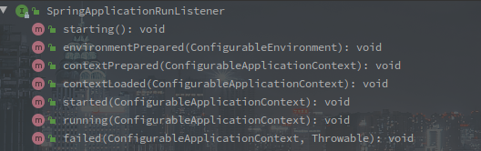
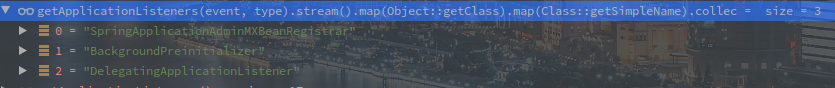

# SpringBoot的启动流程概述

> 尽量不会有太多的代码，以理清楚流程为主，复杂的代码会单独一个文件。
>
> 以SpringBoot Servlet Web应用为基础分析.
>
> SpringBoot版本为2.2.6.RELEASE

---

<!-- more -->

[TOC]


## 外层调用链

```java
@SpringBootApplication
public class MvcApplication {
        public static void main(String[] args) {
            	SpringApplication.run(MvcApplication.class, args);
        }
}
```

以上是最基础的 SpringBoot 应用启动代码，调用 SpringApplication 的 run 静态方法启动 SpringBoot 的整个容器。


## SpringApplication 构造函数

```java
// SpringApplication
// 入参中的的PrimarySources是配置主类,也就是MvcApplication.class.
public SpringApplication(ResourceLoader resourceLoader, Class<?>... primarySources) {
            // 资源加载器,此处为null
            this.resourceLoader = resourceLoader;
            Assert.notNull(primarySources, "PrimarySources must not be null");
             // 主要数据源集合
            this.primarySources = new LinkedHashSet<>(Arrays.asList(primarySources));
             // Web应用类型
            this.webApplicationType = WebApplicationType.deduceFromClasspath();
             // 设置初始化器,具体有哪些看下文
             setInitializers(
                (Collection)getSpringFactoriesInstances(ApplicationContextInitializer.class));
              // 设置监听者
            setListeners((Collection) getSpringFactoriesInstances(ApplicationListener.class));
              // 推断应用主类，此处代码我感觉还是很新奇的
            this.mainApplicationClass = deduceMainApplicationClass();
}
```


### 应用初始化器

通过 spring.factories 文件的 SPI 机制获取到所有 ApplicationContextinitializer 的实现类。

ApplicationContextInitializer 作为应用初始化器，在 prepareContext 阶段中调用，用来完成部分初始化流程。

 

initialize(C applicationContext) 方法就初始化方法，参数为正在创建的 ApplicationContext。

> 对于 SpringCloud，此时还会有 PropertySourceBootstrapConfiguration 类，该类用于获取配置中心的数据。


### 监听器

通过 spring.factories 文件的 SPI 机制获取到所有 ApplicationListener 的实现类。

ApplicationListener 用于监听某个事件，这里采用的是观察者模式，所以被观察者需要持有所有观察者的引用。

 

ApplicationListener 继承与 JDK 的EventListener类，监听某个 ApplicationEvent。

> 在容器初始化的各个阶段都会发布不同类型的事件，借助监听器可以在特定的事件执行自定义操作。

#### 使用实例

**ConfigFileApplicationListener** 会响应 ApplicationEnvironmentPreparedEvent 和 ApplicationPreparedEvent 事件,加载各类配置文件。

**BootstrapApplicationListener** 也会响应 ApplicationEnvironmentPreparedEvent，创建 Bootstrap 的 应用上下文。


### 推断主类

mainApplicationClass的推断过程很有意思，直接构造一个RuntimeException然后遍历异常的堆栈信息查找main方法，获取当前主类。

```java
...
    try {
        StackTraceElement[] stackTrace = new RuntimeException().getStackTrace();
        for (StackTraceElement stackTraceElement : stackTrace) {
            if ("main".equals(stackTraceElement.getMethodName())) {
                return Class.forName(stackTraceElement.getClassName());
            }
        }
 ...
```


---

## Run()方法

- run方法是启动的核心方法，包含了环境准备，监听事件的发布，上下文的刷新及后续处理等等。
- 执行方法的结果就是返回一个可使用的 ConfigurationApplicationContext ，也可以理解为就是应用上下文的装配过程.

```java
	public ConfigurableApplicationContext run(String... args) {
        // 用于记录时间，可以当做是秒表
		StopWatch stopWatch = new StopWatch();
		stopWatch.start();
        // 这个就是最终要返回的上下文对象 
        ConfigurableApplicationContext context = null;
        // 异常报告集合
		Collection<SpringBootExceptionReporter> exceptionReporters = new ArrayList<>();
        // Headless相关配置
		configureHeadlessProperty();
        // 工厂加载机制获取SpringApplicationRunListener，并封装为一个对象
        // SpringApplicationRunListener是应用启动前期的广播器.
		SpringApplicationRunListeners listeners = getRunListeners(args)；
         // 触发ApplicationStartingEvent
		listeners.starting();
		try {
                // 对main方法的入参进行包装
                ApplicationArguments applicationArguments = new DefaultApplicationArguments(args);
                // 准备容器环境
                // 会触发ApplicationEnvironmentPreparedEvent，读取配置文件中的内容
                // 会将环境与当前的SpringApplication绑定
                ConfigurableEnvironment environment = prepareEnvironment(listeners, applicationArguments);
                // 配置忽略的Bean信息,`spring.beaninfo.ignore`配置项
                configureIgnoreBeanInfo(environment);
                // 输出Banner
                Banner printedBanner = printBanner(environment);
                // 创建对应的应用上下文
                // 当前环境的上下文主类是AnnotationConfigServletWebServerApplicationContext
                context = createApplicationContext();
                // 还是工厂加载模式，获取异常的报告之类的
                exceptionReporters = getSpringFactoriesInstances(SpringBootExceptionReporter.class,
                        new Class[] { ConfigurableApplicationContext.class }, context);
                // 准备上下文 
            	//  该阶段会调用构造函数中获取的ApplicationContextInitializer
            	// 也会将sources中的BeanDefinition加载进BeanFactory
                prepareContext(context, environment, listeners, applicationArguments, printedBanner);
                // 刷新上下文
                refreshContext(context);
                // 刷新上下文之后的操作
                // Servlet Web环境下并没有实现该方法
                afterRefresh(context, applicationArguments);
                // 计时结束
                stopWatch.stop();
                if (this.logStartupInfo) {
                        new StartupInfoLogger(this.mainApplicationClass).logStarted(getApplicationLog(), stopWatch);
                }
                // 广播ApplicationStartedEvent
                listeners.started(context);
                callRunners(context, applicationArguments);
		} catch (Throwable ex) {
                handleRunFailure(context, ex, exceptionReporters, listeners);
                throw new IllegalStateException(ex);
		}

		try {
				listeners.running(context);
		} catch (Throwable ex) {
                handleRunFailure(context, ex, exceptionReporters, null);
                throw new IllegalStateException(ex);
		}
		return context;
	}
```


### 1.启动计时器

```java
// SpringApplication
StopWatch stopWatch = new StopWatch();
stopWatch.start();

// StopWatch
public void start() throws IllegalStateException {
    	start("");
}

public void start(String taskName) throws IllegalStateException {
        if (this.currentTaskName != null) {
            	throw new IllegalStateException("Can't start StopWatch: it's already running");
        }
        this.currentTaskName = taskName;
        this.startTimeNanos = System.nanoTime();
}
```

上钟，计时开始。

会记录当前的技师名字 currentTaskName，和开始时间 startTimeNanos。


### 2. 配置Headless

```java
private static final String SYSTEM_PROPERTY_JAVA_AWT_HEADLESS = "java.awt.headless";

private void configureHeadlessProperty() {
    	// System的相关配置 
		System.setProperty(SYSTEM_PROPERTY_JAVA_AWT_HEADLESS,
				System.getProperty(SYSTEM_PROPERTY_JAVA_AWT_HEADLESS, Boolean.toString(this.headless)));
}
```

Headless模式是应用的一种配置模式。

在服务器可能缺少显示设备、键盘、鼠标等外设的情况下可以使用这种模式。


### 3. 获取并启动监听器

```java
// SpringApplication
SpringApplicationRunListeners listeners = getRunListeners(args)；
      
private SpringApplicationRunListeners getRunListeners(String[] args) {
    Class<?>[] types = new Class<?>[] { SpringApplication.class, String[].class };
    return new SpringApplicationRunListeners(logger,
                                             getSpringFactoriesInstances(SpringApplicationRunListener.class, types, this, args));
}
```

这里获取的监听器和之前构造函数中的不同，这里获取的是 SpringApplicationRunListener 的实现类，并包装为 SpringApplicationRunListeners。

> **Spring中的事件发布一般是通过 ApplicationContext 实现，但是此时并没有准备好应用上下文，所以会以SpringApplicationRunListeners 这个工具类的形式发布事件**

SpringApplicationRunListener 是对应用运行期内事件监听，从下图可知，应用上下文创建期会发布的各类**基础事件**。

 

SpringApplicationRunListener 其默认的实现只有 EventPublishingRunListener。

以下为EventPublishingRunListener的构造函数：

```java
// EventPublishingRunListener的构造函数
public EventPublishingRunListener(SpringApplication application, String[] args) {
        this.application = application;
        this.args = args;
        this.initialMulticaster = new SimpleApplicationEventMulticaster();
        for (ApplicationListener<?> listener : application.getListeners()) {
            	this.initialMulticaster.addApplicationListener(listener);
        }
}
```

EventPublishingRunListener 是对应用运行期的监听者，但是响应事件的方式是包装被广播相对应的事件，如下图


> 另外值得注意的是，在 contextLoaded 事件之后事件的发布又是使用 ApplicationContext 来完成的。

详细的可以看[Spring的事件模型](../SpringBoot功能特性/SpringBoot的事件模型 .md)


### 3. 发布ApplicationStartingEvent

NOOP。


### 4. 创建并准备环境容器

创建环境容器,并加载.

```java
ConfigurableEnvironment environment = prepareEnvironment(listeners, applicationArguments);
```

[SpringBoot启动过程中的环境准备](./SpringBoot启动过程中的环境准备.md)

**该方法中主要配置了Property以及Profile属性**

**涉及到ApplicationEnvironmentPreparedEvent事件的发布，响应的ConfigFileApplicationListener中回去读取配置文件的内容。**

**并在该时间的响应中通过`ConfigFileApplicationListener`读取了配置文件的所有配置。**


### 5. 配置忽略的Bean信息

```java
public static final String IGNORE_BEANINFO_PROPERTY_NAME = "spring.beaninfo.ignore";

// SpringApplication
private void configureIgnoreBeanInfo(ConfigurableEnvironment environment) {
        if (System.getProperty(CachedIntrospectionResults.IGNORE_BEANINFO_PROPERTY_NAME) == null) {
                Boolean ignore = environment.getProperty("spring.beaninfo.ignore", Boolean.class, Boolean.TRUE);
                System.setProperty(CachedIntrospectionResults.IGNORE_BEANINFO_PROPERTY_NAME, ignore.toString());
        }
}
```

方法逻辑很简单，就是在系统配置中没有`spring.beaninfo.ignore`时，将当前环境容器中的对应属性塞进去。

`spring.beaninfo.ignore`的作用待补充。


### 6. 输出Banner

```java
Banner printedBanner = printBanner(environment);
```

一家人就应该整整齐齐所以我把代码放这里，但Banner相关的事情我觉得可以先忽略。


### 7.  创建应用上下文

逻辑很简单，**根据不同的Web应用类型创建对应的上下文类**，具体对应关系如下：

- Default - `AnnotationConfigApplicationContext`
- Servlet - `AnnotationConfigServletWebServerApplicationContext`
- Reactive - `AnnotationConfigReactiveWebServerApplicationContext`

推断应用类型也是在SpringApplication的构造函数中实现的。

以下是`AnnotationConfigServletWebServerApplicationContext`的构造函数：

```java
public AnnotationConfigServletWebServerApplicationContext() {
        this.reader = new AnnotatedBeanDefinitionReader(this);
        this.scanner = new ClassPathBeanDefinitionScanner(this);
}
```

可以看到初始化的时候顺带初始化了BeanDefinitionReader和BeanDefinitionScanner


### 8. 获取异常的报告方法

```java
exceptionReporters = getSpringFactoriesInstances(SpringBootExceptionReporter.class,
                                                 new Class[] { ConfigurableApplicationContext.class }, context);
```

getSpringFactoriesInstances应该熟得不能再熟了，就是通过工厂加载机制获取实现类的方法。

获取的exceptionReporters会在catch的逻辑里使用，来报告出现的异常情况。


### 9. 准备上下文

```java
prepareContext(context, environment, listeners, applicationArguments, printedBanner);
```

该方法主要作用如下：

1. **执行所有的ApplicationContextInitializer类**
2. **发布ApplicationContextInitializedEvent**
3. **加载sources中的BeanDefinition**
4. **发布ApplicationPreparedEvent**

中间还会穿插一些对应用上下文的配置

具体可以看下面的文章：

[SpringBoot启动过程中的上下文准备](./SpringBoot启动过程中的上下文准备.md)


###  10.刷新应用上下文

```
refreshContext(context);
```

这个流程简直不要太重要！！！

该方法的主要流程：

1. 进一步配置BeanFactory，可能会伴随着BeanFactory的刷新
2. 调用所有的BeanFactoryPostProcessor，其中会有ConfigurationClassPostProcessor的调用，加载所有的BeanDefinition
3. 注册所有BeanPostProcessor
4. 初始国际化消息
5. 初始化广播器，并注册监听器，从此之后事件由应用上下文发布
6. 初始化所有BeanDefinition
7. **发布ContextRefreshedEvent**

具体可以看下面的文章：

[SpringBoot启动过程中的上下文刷新](./SpringBoot启动过程中的上下文刷新.md)


### 11. 计时结束

```java
// SpringApplication
stopWatch.stop();
	
// StopWatch
public void stop() throws IllegalStateException {
        if (this.currentTaskName == null) {
            	throw new IllegalStateException("Can't stop StopWatch: it's not running");
        }
    	// 记录单词的SpringApplication启动时间
        long lastTime = System.nanoTime() - this.startTimeNanos;
    	// 总时间
        this.totalTimeNanos += lastTime;
    	// 当前任务的信息
        this.lastTaskInfo = new TaskInfo(this.currentTaskName, lastTime);
    	// 是否保存任务列表
        if (this.keepTaskList) {
            	this.taskList.add(this.lastTaskInfo);
        }
    	// task计数+1
        ++this.taskCount;
        this.currentTaskName = null;
}
```

因为StopWatch是通过new关键字在run方法中创建的，也并没有什么明显的逃逸代码。

不是很懂。

所以这个时间指的是run方法开始到准备ApplicationContext完成的这段时间。


### 12. 发布ApplicationStartedEvent

```java
// SpringApplication
listeners.started(context);

// 	EventPublishingRunListener
@Override
public void started(ConfigurableApplicationContext context) {
    	context.publishEvent(new ApplicationStartedEvent(this.application, this.args, context));
}
```

可以看到，在刷新过程中准备好上下文中的事件发布器之后，事件发布开始由ApplicationContext发布。

响应的监听器如下：

 


### 13. 调用相关Runner

```java
// SpringApplication#run
callRunners(context, applicationArguments);

// SpringApplication
private void callRunners(ApplicationContext context, ApplicationArguments args) {
        List<Object> runners = new ArrayList<>();
    	// 从上下文中获取ApplicationRunner和CommandLineRunner的Bean对象
        runners.addAll(context.getBeansOfType(ApplicationRunner.class).values());
        runners.addAll(context.getBeansOfType(CommandLineRunner.class).values());
    	// 排序
        AnnotationAwareOrderComparator.sort(runners);
    	// 遍历调用run方法
        for (Object runner : new LinkedHashSet<>(runners)) {
            if (runner instanceof ApplicationRunner) {
                	callRunner((ApplicationRunner) runner, args);
            }
            if (runner instanceof CommandLineRunner) {
                	callRunner((CommandLineRunner) runner, args);
            }
        }
}
```

方法逻辑很简单，从当前上下文中获取ApplicationRunner和CommandLineRunner类型的Bean对象。

然后排序并遍历调用run方法。

这个排序需要注意的是只有Ordered接口或者@Order。


### 14. 发布ApplicationReadyEvent事件

事件发布的逻辑和发布ApplicationStartedEvent一致。

响应的监听器有如下几个：

 