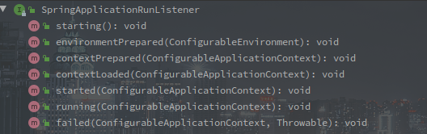

# SpringBoot的启动流程概述

> 尽量不会有太多的代码，以理清楚流程为主，复杂的代码会单独一个文件。
>
> 以 SpringBoot Servlet Web 应用为基础分析.
>
> SpringBoot 版本为 2.2.6.RELEASE

---

<!-- more -->

[TOC]

---

## 上层调用

```java
@SpringBootApplication
public class MvcApplication {
        public static void main(String[] args) {
            	SpringApplication.run(MvcApplication.class, args);
        }
}
```

以上是最基础的 SpringBoot 应用启动代码，调用 SpringApplication 的 run 静态方法启动 SpringBoot 的整个容器。

<br>

## SpringApplication 构造函数

```java
// SpringApplication
// 入参中的的PrimarySources是配置主类,也就是MvcApplication.class.
public SpringApplication(ResourceLoader resourceLoader, Class<?>... primarySources) {
            // 资源加载器,此处为null
            this.resourceLoader = resourceLoader;
            Assert.notNull(primarySources, "PrimarySources must not be null");
             // 主要数据源集合
            this.primarySources = new LinkedHashSet<>(Arrays.asList(primarySources));
             // Web应用类型
            this.webApplicationType = WebApplicationType.deduceFromClasspath();
             // 设置初始化器,具体有哪些看下文
             setInitializers(
                (Collection)getSpringFactoriesInstances(ApplicationContextInitializer.class));
              // 设置监听者
            setListeners((Collection) getSpringFactoriesInstances(ApplicationListener.class));
              // 推断应用主类，此处代码我感觉还是很新奇的
            this.mainApplicationClass = deduceMainApplicationClass();
}
```

### ApplicationContextInitializer - 初始化器

**通过 spring.factories 文件的 SPI 机制获取到所有 ApplicationContextinitializer 的实现类。**

**ApplicationContextInitializer 作为应用初始化器，在 prepareContext 阶段中调用，用来在容器启动过程中对应用的上下文进行自定义配置。**


initialize(C applicationContext) 方法就初始化方法，参数为正在创建的 ApplicationContext。

> 对于 SpringCloud，此时还会有 **PropertySourceBootstrapConfiguration** 类，该类用于获取配置中心的数据。

<br>

### ApplicationListener - 监听器

通过 spring.factories 文件的 SPI 机制获取到所有 ApplicationListener 的实现类。

这里采用的是观察者模式，所以**被观察者 ApplicationCopntext** 需要持有所有**观察者 ApplicationListener** 的引用。


ApplicationListener 继承与 JDK 的 EventListener 类，监听某个 ApplicationEvent。

> **在容器初始化的各个阶段都会发布不同类型的事件，借助监听器可以在特定的事件执行自定义操作。**


### 推断主类

mainApplicationClass 的推断过程很有意思，直接构造一个 RuntimeException 然后遍历异常的堆栈信息查找 main 方法，获取当前主类。

```java
...
    try {
        StackTraceElement[] stackTrace = new RuntimeException().getStackTrace();
        for (StackTraceElement stackTraceElement : stackTrace) {
            if ("main".equals(stackTraceElement.getMethodName())) {
                return Class.forName(stackTraceElement.getClassName());
            }
        }
 ...
```


---

## Run()方法

run 方法是启动的核心方法，包含了环境准备，监听事件的发布，上下文的刷新及后续处理等等。

执行方法的结果就是返回一个可使用的 ConfigurationApplicationContext ，也可以理解为就是**应用上下文的装配过程。**

```java
	public ConfigurableApplicationContext run(String... args) {
        // 用于记录时间，可以当做是秒表
		StopWatch stopWatch = new StopWatch();
		stopWatch.start();
        // 这个就是最终要返回的上下文对象 
        ConfigurableApplicationContext context = null;
        // 异常报告集合
		Collection<SpringBootExceptionReporter> exceptionReporters = new ArrayList<>();
        // Headless相关配置
		configureHeadlessProperty();
        // 工厂加载机制获取SpringApplicationRunListener，并封装为一个对象
        // SpringApplicationRunListener是应用启动前期的广播器.
		SpringApplicationRunListeners listeners = getRunListeners(args)；
         // 触发ApplicationStartingEvent
		listeners.starting();
		try {
                // 对main方法的入参进行包装
                ApplicationArguments applicationArguments = new DefaultApplicationArguments(args);
                // 准备容器环境
                // 会触发ApplicationEnvironmentPreparedEvent，读取配置文件中的内容
                // 会将环境与当前的SpringApplication绑定
                ConfigurableEnvironment environment = prepareEnvironment(listeners, applicationArguments);
                // 配置忽略的Bean信息,`spring.beaninfo.ignore`配置项
                configureIgnoreBeanInfo(environment);
                // 输出Banner
                Banner printedBanner = printBanner(environment);
                // 创建对应的应用上下文
                // 当前环境的上下文主类是AnnotationConfigServletWebServerApplicationContext
                context = createApplicationContext();
                // 还是工厂加载模式，获取异常的报告之类的
                exceptionReporters = getSpringFactoriesInstances(SpringBootExceptionReporter.class,
                        new Class[] { ConfigurableApplicationContext.class }, context);
                // 准备上下文 
            	//  该阶段会调用构造函数中获取的ApplicationContextInitializer
            	// 也会将sources中的BeanDefinition加载进BeanFactory
                prepareContext(context, environment, listeners, applicationArguments, printedBanner);
                // 刷新上下文
                refreshContext(context);
                // 刷新上下文之后的操作
                // Servlet Web环境下并没有实现该方法
                afterRefresh(context, applicationArguments);
                // 计时结束
                stopWatch.stop();
                if (this.logStartupInfo) {
                        new StartupInfoLogger(this.mainApplicationClass).logStarted(getApplicationLog(), stopWatch);
                }
                // 广播ApplicationStartedEvent
                listeners.started(context);
                callRunners(context, applicationArguments);
		} catch (Throwable ex) {
                handleRunFailure(context, ex, exceptionReporters, listeners);
                throw new IllegalStateException(ex);
		}

		try {
				listeners.running(context);
		} catch (Throwable ex) {
                handleRunFailure(context, ex, exceptionReporters, null);
                throw new IllegalStateException(ex);
		}
		return context;
	}
```


### 1.启动计时器

```java
// SpringApplication
StopWatch stopWatch = new StopWatch();
stopWatch.start();

// StopWatch
public void start() throws IllegalStateException {
    	start("");
}

public void start(String taskName) throws IllegalStateException {
        if (this.currentTaskName != null) {
            	throw new IllegalStateException("Can't start StopWatch: it's already running");
        }
        this.currentTaskName = taskName;
    	// 采用本地系统时钟
        this.startTimeNanos = System.nanoTime();
}
```

上钟，计时开始。


### 2. 配置 Headless

```java
private static final String SYSTEM_PROPERTY_JAVA_AWT_HEADLESS = "java.awt.headless";

private void configureHeadlessProperty() {
    	// System的相关配置 
		System.setProperty(SYSTEM_PROPERTY_JAVA_AWT_HEADLESS,
				System.getProperty(SYSTEM_PROPERTY_JAVA_AWT_HEADLESS, Boolean.toString(this.headless)));
}
```

Headless 模式是应用的一种配置模式。

在服务器可能缺少显示设备、键盘、鼠标等外设的情况下可以使用这种模式。


### 3. 获取并启动监听器

```java
// SpringApplication
SpringApplicationRunListeners listeners = getRunListeners(args)；
      
private SpringApplicationRunListeners getRunListeners(String[] args) {
    Class<?>[] types = new Class<?>[] { SpringApplication.class, String[].class };
    return new SpringApplicationRunListeners(logger,
                                             getSpringFactoriesInstances(SpringApplicationRunListener.class, types, this, args));
}
```

这里获取的监听器和之前构造函数中的不同，这里获取的是 **SpringApplicationRunListener** 的实现类，并包装为 SpringApplicationRunListeners。

> SpringApplicationRunListener 是专门的对容器启动时各个阶段的监听，从接口上就定义了启动的各个阶段。



**SpringApplicationRunListener 其默认的实现只有 EventPublishingRunListener**，以下为 EventPublishingRunListener 的构造函数：

```java
// EventPublishingRunListener的构造函数
public EventPublishingRunListener(SpringApplication application, String[] args) {
        this.application = application;
        this.args = args;
        this.initialMulticaster = new SimpleApplicationEventMulticaster();
    	// 获取 SpringApplication 中的所有监听器，并添加到内部的 Multicaster 中
        for (ApplicationListener<?> listener : application.getListeners()) {
            	this.initialMulticaster.addApplicationListener(listener);
        }
}
```

EventPublishingRunListener 是对应用运行期的监听者，但处理事件的方式是包装被广播相对应的事件并进一步广播，如下图


> 另外值得注意的是，在 contextLoaded 事件之后事件的发布又是使用 ApplicationContext 来完成的，因为 ApplicationContext 的基本初始化已经完成了。


#### 小结

SpringBoot 的启动阶段，各类监听器起了非常关键的角色，包括配置文件的加载都是通过监听器完成的。

ApplicationContext 本身就是一个事件广播器，但是在 SpringBoot 的启动阶段，ApplicationContext 还没有初始化好的时候就需要广播部分事件。

所以出现了 SpringApplicationRunListener，它定义了启动流程的各个阶段，也作为初期的事件广播器。

> SpringApplicationRunListener 和 ApplicationContext 广播事件也都是通过 SimpleApplicationEventMulticaster 实现的。

在 contextLoaded 中，SpringApplicationRunListener 将它持有的所有监听者全部添加到了 ApplicationContext 中，所以后续的事件广播又是通过 ApplicationContext 自己来了。

<br>

### 3. 发布 ApplicationStartingEvent

NOOP。


### 4. 创建并准备环境容器

```java
// SpringApplication#prepareEnvironment 
private ConfigurableEnvironment prepareEnvironment(SpringApplicationRunListeners listeners,
                                                   ApplicationArguments applicationArguments) {
    // 创建或者获取一个 ConfigurationEnvironment 对象	
    ConfigurableEnvironment environment = getOrCreateEnvironment();
    // 配置 Profiles 和 PropertySource
    configureEnvironment(environment, applicationArguments.getSourceArgs());
    ConfigurationPropertySources.attach(environment);
    // 发布环境准备就绪的事件，进一步加载配置
    listeners.environmentPrepared(environment);
    bindToSpringApplication(environment);
    if (!this.isCustomEnvironment) {
        environment = new EnvironmentConverter(getClassLoader()).convertEnvironmentIfNecessary(environment, deduceEnvironmentClass());
    }
    ConfigurationPropertySources.attach(environment);
    return environment;
}
```

该方法中首先创建了 Environment，并且进一步配置了部分 PropertySources 以及 Profile 属性。

> profile 属性就只活跃的环境，例如项目中往往存在 application-dev.yml 以及 application-test.yml 两种环境的配置文件。

PropertySource 主要是对项目启动参数的包装，以及在初始化的时候带有的一些系统级的 PropertySource

> PropertySource 简单来说就是一个 K/V 的配置属性。

简单配置之后发布了 ApplicationEnvironmentPreparedEvent 。

> **ConfigFileApplicationListener 会监听该事件并读取配置文件，Consul 等远程配置中心的配置并不会在这是读取。**
>
> **BootstrapApplicationListener 会监听该事件，插队创建 SpringCloud 的 bootstrap 应用上下文。**

**并在该时间的响应中通过`ConfigFileApplicationListener`读取了配置文件的所有配置。**


### 5. 配置忽略的Bean信息

```java
public static final String IGNORE_BEANINFO_PROPERTY_NAME = "spring.beaninfo.ignore";

// SpringApplication
private void configureIgnoreBeanInfo(ConfigurableEnvironment environment) {
        if (System.getProperty(CachedIntrospectionResults.IGNORE_BEANINFO_PROPERTY_NAME) == null) {
    Boolean ignore = environment.getProperty("spring.beaninfo.ignore", Boolean.class, Boolean.TRUE);
    System.setProperty(CachedIntrospectionResults.IGNORE_BEANINFO_PROPERTY_NAME, ignore.toString());
        }
}
```

方法逻辑很简单，就是在系统配置中没有 spring.beaninfo.ignore 时，将当前环境容器中的对应属性塞进去。


### 6. 输出Banner

```java
Banner printedBanner = printBanner(environment);
```

一家人就应该整整齐齐所以我把代码放这里，但Banner相关的事情我觉得可以先忽略。


### 7.  创建应用上下文

逻辑很简单，**根据不同的Web应用类型创建对应的上下文类**，具体对应关系如下：

| 环境类型 |                      上下文类                       |
| :------: | :-------------------------------------------------: |
| Default  |         AnnotationConfigApplicationContext          |
| Servlet  | AnnotationConfigServletWebServerApplicationContext  |
| Reactive | AnnotationConfigReactiveWebServerApplicationContext |


应用类型是在 SpringApplication 的构造函数中推断出来的。


### 8. 获取异常的报告方法

```java
exceptionReporters = getSpringFactoriesInstances(SpringBootExceptionReporter.class,
                                                 new Class[] { ConfigurableApplicationContext.class }, context);
```

getSpringFactoriesInstances 应该熟得不能再熟了，就是通过工厂加载机制获取实现类的方法。

获取的 exceptionReporters 会在 catch 的逻辑里使用，来报告出现的异常情况。


### 9. 准备上下文

```java
// SpringApplication@prepareContext
private void prepareContext(ConfigurableApplicationContext context, ConfigurableEnvironment environment,SpringApplicationRunListeners listeners, ApplicationArguments applicationArguments, Banner printedBanner) {
    // 配置 Environment 到应用上下文
    context.setEnvironment(environment);
    // 配置一些必要的Bean
    postProcessApplicationContext(context);
    // 应用所有初始化器
    applyInitializers(context);
    // 发布上下文准备就绪事件
    listeners.contextPrepared(context);
    if (this.logStartupInfo) {
        logStartupInfo(context.getParent() == null);
        logStartupProfileInfo(context);
    }
    // 注册相关Bean，这些为什么不一起扔到 postProcessApplicationContext 方法呢？
    ConfigurableListableBeanFactory beanFactory = context.getBeanFactory();
    beanFactory.registerSingleton("springApplicationArguments", applicationArguments);
    if (printedBanner != null) {
        beanFactory.registerSingleton("springBootBanner", printedBanner);
    }
    if (beanFactory instanceof DefaultListableBeanFactory) {
        ((DefaultListableBeanFactory) beanFactory)
        .setAllowBeanDefinitionOverriding(this.allowBeanDefinitionOverriding);
    }
    if (this.lazyInitialization) {
        context.addBeanFactoryPostProcessor(new LazyInitializationBeanFactoryPostProcessor());
    }
    // Load the sources
    Set<Object> sources = getAllSources();
    Assert.notEmpty(sources, "Sources must not be empty");
    // 加载所有的 BeanDefinition
    load(context, sources.toArray(new Object[0]));
    // 发布上下文已加载完毕事件
    listeners.contextLoaded(context);
}
```

该方法首先配置了环境，而后最主要的就是应用了所有的 ApplicationContextInitializer 类。

> BootstrapApplicationListener#AncestorInitializer 作用就是将 SpringCloud 的 bootstrap 上下文设置为当前的父上下文。
>
> PropertySourceBootstrapConfiguration 作用是加载远程的配置文件。

之后是调用 load 加载 BeanDefinition，如下图所示：


所有的 BeanDefinition 都是通过 BeanDefinitionLoader 获取的。

> 这里的 BeanDefinition 并不会对 Import 等做扩展，可能仅仅注册了 Bootstrap 类。


###  10.刷新应用上下文


该方法层层往上最终会调用到 AbstractApplicationContext#refresh 方法，如下图：

```java
@Override
public void refresh() throws BeansException, IllegalStateException {
    synchronized (this.startupShutdownMonitor) {
        // Prepare this context for refreshing.
        prepareRefresh();

        // Tell the subclass to refresh the internal bean factory.
        ConfigurableListableBeanFactory beanFactory = obtainFreshBeanFactory();

        // Prepare the bean factory for use in this context.
        prepareBeanFactory(beanFactory);

        try {
            // Allows post-processing of the bean factory in context subclasses.
            postProcessBeanFactory(beanFactory);

            // Invoke factory processors registered as beans in the context.
            // 应用所有的 BeanFactoryPostProcessor
            invokeBeanFactoryPostProcessors(beanFactory);

            // Register bean processors that intercept bean creation.
            // 注册所有的 BeanPostProcessor
            registerBeanPostProcessors(beanFactory);

            // Initialize message source for this context.
            initMessageSource();

            // Initialize event multicaster for this context.
            initApplicationEventMulticaster();

            // Initialize other special beans in specific context subclasses.
            onRefresh();

            // Check for listener beans and register them.
            registerListeners();

            // Instantiate all remaining (non-lazy-init) singletons.
            finishBeanFactoryInitialization(beanFactory);

            // Last step: publish corresponding event.
            finishRefresh();
        }

        catch (BeansException ex) {
            if (logger.isWarnEnabled()) {
                logger.warn("Exception encountered during context initialization - " +
                            "cancelling refresh attempt: " + ex);
            }

            // Destroy already created singletons to avoid dangling resources.
            destroyBeans();

            // Reset 'active' flag.
            cancelRefresh(ex);

            // Propagate exception to caller.
            throw ex;
        }

        finally {
            // Reset common introspection caches in Spring's core, since we
            // might not ever need metadata for singleton beans anymore...
            resetCommonCaches();
        }
    }

```


该方法的主要流程：

1. 调用所有的 BeanFactoryPostProcessor

> ConfigurationClassPostProcessor 该类用来加载所有的配置类
>
> RefreshSchpe 
>
> PropertySourcesPlaceholderConfigurer 

2. 注册 BeanPostProcessor

> ConfigurationPropertiesBindingPostProcessor
>
> CommonAnnotationBeanPostProcessor
>
> AutowiredAnnotationBeanPostProcessor
>
> AnnotationAwareAspectJAutoProxyCreator
>
> MethodValidationPostProcessor
>
> PersistenceExceptionTranslationPostProcessor
>
> WebServerFactoryCustomizerBeanPostProcessor
>
> ConfigurationPropertiesBeans

3. 加载所有必要的 Bean 对象，在 finishRefresh 中


> 如果是 SpringMVC 的应用，在 onRefresh 方法中会创建内置的 Tomcat 服务。

以下是 ServletWebServerApplicationContext#onRefresh() 的源码实现:


### 11. 计时结束

```java
// SpringApplication
stopWatch.stop();
	
// StopWatch
public void stop() throws IllegalStateException {
        if (this.currentTaskName == null) {
            	throw new IllegalStateException("Can't stop StopWatch: it's not running");
        }
    	// 记录单词的SpringApplication启动时间
        long lastTime = System.nanoTime() - this.startTimeNanos;
    	// 总时间
        this.totalTimeNanos += lastTime;
    	// 当前任务的信息
        this.lastTaskInfo = new TaskInfo(this.currentTaskName, lastTime);
    	// 是否保存任务列表
        if (this.keepTaskList) {
            	this.taskList.add(this.lastTaskInfo);
        }
    	// task计数+1
        ++this.taskCount;
        this.currentTaskName = null;
}
```

因为StopWatch是通过new关键字在run方法中创建的，也并没有什么明显的逃逸代码。

不是很懂。

所以这个时间指的是run方法开始到准备ApplicationContext完成的这段时间。


### 12. 发布ApplicationStartedEvent

```java
// SpringApplication
listeners.started(context);

// 	EventPublishingRunListener
@Override
public void started(ConfigurableApplicationContext context) {
    	context.publishEvent(new ApplicationStartedEvent(this.application, this.args, context));
}
```

可以看到，在刷新过程中准备好上下文中的事件发布器之后，事件发布开始由ApplicationContext发布。


### 13. 调用相关Runner

```java
// SpringApplication#run
callRunners(context, applicationArguments);

// SpringApplication
private void callRunners(ApplicationContext context, ApplicationArguments args) {
        List<Object> runners = new ArrayList<>();
    	// 从上下文中获取ApplicationRunner和CommandLineRunner的Bean对象
        runners.addAll(context.getBeansOfType(ApplicationRunner.class).values());
        runners.addAll(context.getBeansOfType(CommandLineRunner.class).values());
    	// 排序
        AnnotationAwareOrderComparator.sort(runners);
    	// 遍历调用run方法
        for (Object runner : new LinkedHashSet<>(runners)) {
            if (runner instanceof ApplicationRunner) {
                	callRunner((ApplicationRunner) runner, args);
            }
            if (runner instanceof CommandLineRunner) {
                	callRunner((CommandLineRunner) runner, args);
            }
        }
}
```

方法逻辑很简单，从当前上下文中获取ApplicationRunner和CommandLineRunner类型的Bean对象。

然后排序并遍历调用run方法。

这个排序需要注意的是只有Ordered接口或者@Order。


### 14. 发布ApplicationReadyEvent事件

事件发布的逻辑和发布ApplicationStartedEvent一致。

响应的监听器有如下几个：

 


