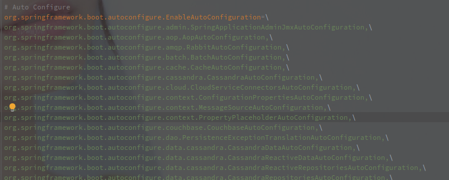

# SpringBoot 的自动化配置

[TOC]

## 概述

自动化配置的意义在于，在 SpringBoot 的应用中，可以通过引入单个启动包（spring-boot-starter-data-redis）就可以完成对 Redis 的基础配置，只需要额外在配置文件中添加必要的配置项。

## ImportSelector

以上是 spring-boot-autoconfiguration 包下面的 META-INF/spring.factories 实现。

[SpringBoot 的工厂加载模式](./SpringBoot的工厂加载模式.md)

## ConditionalOnXX 实现

ConditionalOn 用来实现 Bean 的筛选，在自动化配置流程中获取到的 Bean 定义中，只有满足了 ConditionalOn 的才会被真实加载到 BeanFactory 中。

ConditionalOn 的注解依赖于 SpringBoot 提供的元注解 @Conditional。

Conditional 注解中只有指定 Condition 接口实现的数组，用于判断是否可以校验。

Condition 只有 match 方法用于判断当前 Bean 是否应该被加载。

## 总结

SpringBoot 的自动化配置的源头是 @SpringBootApplication 注解，注解中包含了 @EnableAutoConfiguration 注解，该注解包含了一个 @Import，指定了 AutoConfigurationImportSelector 类作为引导类。

> @Import 注解会在 ConfigurationClassPostProcessor 类中被解析，该类继承于 BeanFactoryPostProcessor，会在 BeanFactory#refresh 方法前期就被调用。

AutoConfigurationImportSelector 中会通过 SpringFactoriesLoader（SpringBoot 的工厂加载模式）来获取 classpath 所有 MEAT-INF 目录下的 spring.factories 类中 EnableAutoConfiguration 注解对应的实现类。

