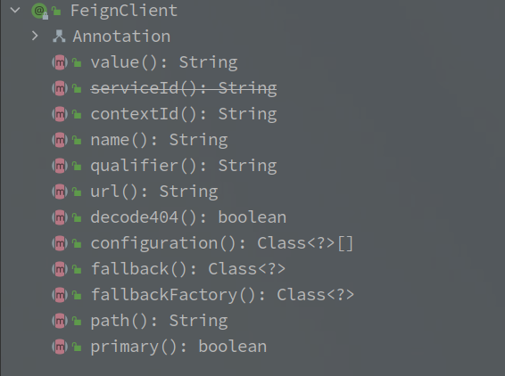

# Feign

> 基于 spring-cloud-openfeign-core-2.2	.4.RELEASE

---

[TOC]

---

## 整体架构图

[图片来源博客 - Feign原理 （图解）](https://www.cnblogs.com/crazymakercircle/p/11965726.html)

## 一、FeignClient 注解

> 该注解就是用来声明一个远程服务的，基于该注解代理整个接口为一个服务调用类。

| 属性名          | 属性含义                                                     |
| --------------- | ------------------------------------------------------------ |
| value           | 服务名称，如果采用 ribbon 会使用该服务名称从注册中心拉取地址 |
| name            | 等同于 value                                                 |
| contextId       | 上下文 Id，默认为服务名称                                    |
| qualifier       | 服务别名                                                     |
| url             | 请求的绝对URL，例如微信的接口，url 就可以定义为：https://api.weixin.qq.com/ |
| decode404       | 对于404异常是否需要解码                                      |
| fallback        | 降级策略，继承定义的接口方法实现就是服务降级的逻辑，实现类需要注册为Bean |
| fallbackFactory | 降级策略工厂，继承定义的接口方法实现就是服务降级的逻辑       |
| path            | 请求地址的统一前缀                                           |
| primary         | 等同于 @Primary 是不是主要的 Bean 对象，默认为 true          |

 

 

## 二、Bean 注册流程

> 注册流程就是解析 FeignClient 并且创建 Bean 对象的过程。
>
> 简单可以分为如下步骤:
>
> 1. 定位 FeignClient 接口
> 2. 解析 FeignClient 注解
> 3. **注册 BeanDefinition**

 

## 三、代理创建流程

> 在 Bean 的注册流程可以发现，最终注册的 Bean 对象为 FeignClientFactoryBean 类型。
>
> FactoryBean 接口就是 Spring 对**工厂方法模式的实现**，所有的创建流程包含在 getObject() 方法中。
>
> **特别需要关注的就是 InvocationHandler 的具体实现（FeignClient 是通过 JDK 动态代理实现的代理模式）。**

 

## 四、默认服务调用流程

> 通过 JDK 动态代理创建了真实的代理对象之后，具体的服务调用过程。
>
> 基本的 Http 调用以及 **LoadBalance 调用（和 Ribbon 的整合）**，以及**和 Hystrix 的整合过程**。
>
> 有一个需要关注的点就是，Feign 如何映射真实接口方法和具体的功能实现。

 

## 文章引用

[Feign 终级解析](https://mp.weixin.qq.com/s?__biz=MzUwOTk1MTE5NQ==&mid=2247483724&idx=1&sn=03b5193f49920c1d286b56daff8b1a09&chksm=f90b2cf8ce7ca5ee6b56fb5e0ffa3176126ca3a68ba60fd8b9a3afd2fd1a2f8a201a2b765803&token=302932053&lang=zh_CN&scene=21#wechat_redirect)

[Feign原理 （图解）](https://www.cnblogs.com/crazymakercircle/p/11965726.html)

