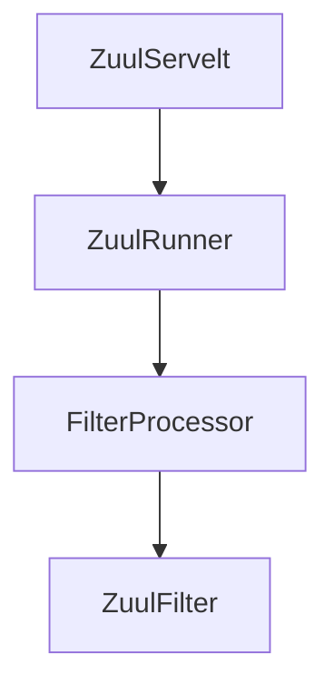

# Zuul

## 整体架构

Zuul 的入口就是一个 ZuulServlet。

> 除了 ZuulServlet 之外，Zuul 还可以切换为 ZuulServletFilter 拦截，本质上就是 Servlet 和 Filter 的区别，从容器角度来看，Filter 是优先于 Servlet 的。
>
> 相关配置：**zuul.use-filter = true**

整个的执行流程如上图所示，从外到里分别是：

**RequestContext** 是和请求上下文绑定的，使用的 ThreadLocal 实现。

**ZuulRunner** 是 Zuul 的执行器，但是主要逻辑还是调用 FilterProcessor 实现的。

**FilterProcessor** 是 ZuulFilter 的执行器，ZuulRunner 就

**FilterFileManager** 会启动一个后台线程，定时轮询指定的文件，并在发生更新的时候尝试更新 Filter 的缓存。

**FilterRegistry** 就是一个全局的 Filter 缓存，内部使用 ConcurrentHashMap 来保存已经加载的 Filter。 

**FilterLoader** 是 Filter 总的管理类，负责从缓存中获取数据，并且还负责编译源代码文件。

**ZuulFilter** 继承 **IZuulFilter** 接口，是 Zuul 中最核心的组件，负责对请求的各周期处理（和 Servlet 体系中的 Filter 不同）

一个正常的 ZuulFilter 需要完整的实现以下四个方法：

| 方法名         | 作用                                                         |
| -------------- | ------------------------------------------------------------ |
| filterType()   | ZuulFilter 的执行点分为如下几种 : **pre，route，post，error** |
| filterOrder()  | 过滤器的优先级                                               |
| shouldFilter() | 前置判断是否需要过滤                                         |
| run()          | 真实的过滤器执行逻辑                                         |

> 无任何异常的情况下：pre -> route -> post 
>
> 出现异常的情况下： pre -> error -> post，pre -> route -> error -> post，pre -> route -> post -> error

## 内置过滤器

| 过滤器名称              | 过滤器执行点 | 作用                                                     |
| ----------------------- | ------------ | -------------------------------------------------------- |
| ServletDetectionFilter  | pre          |                                                          |
| FormBodyWrapperFilter   | pre          |                                                          |
| DebugFilter             | pre          |                                                          |
| PreDecorationFilter     | pre          | 使用 RouteLocator 判断请求的转发路径，为后续的转发打标记 |
| TracePreZuulFilter      | pre          |                                                          |
| SendForwardFilter       | route        |                                                          |
| RibbonRoutingFilter     | route        |                                                          |
| SimpleHostRoutingFilter | route        |                                                          |
| SendResponseFilter      | post         |                                                          |
| SendErrorFilter         |              |                                                          |

## 过滤器的执行流程

过滤器会拦截

## 

## 参考

[Zuul 官方文档](https://github.com/Netflix/zuul/wiki)

[SpringCloud整合Zuul源码分析](https://juejin.cn/post/6856753605249564679#heading-8)