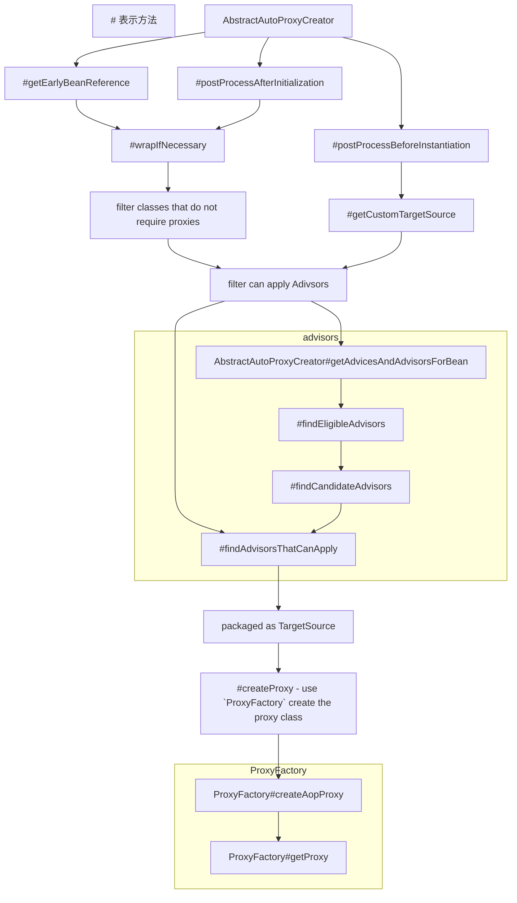

# Spring AOP

如果依靠声明 Advisor（包含 Advise 和 Pointcut）来实现 AOP 的话，那么起点就是 AnnotationAwareAspectJAutoProxyCreator。

该类继承了 SmartInstantiationAwareBeanPostProcessor （BeanPostProcessor 的子类），可以在 IOC 容器创建具体 Bean 的时候插入自身的逻辑。

该类往上还有 AbstractAutoProxyCreator，该类里面定义了 AOP 的主要逻辑框架，依靠模板方法模式实现不同的功能。

其中 getEarlyBeanReference 和 postProcessAfterInitialization 用于基于 Advisor 的代理对象的创建，而 postProcessBeforeInstantiation 则是对 AOP 的自定义，在实例化之前可以定义自身的 TargetSource，并创建最终的代理对象。

> Spring AOP 代理的不是真实的对象而是 TargetSource（TargetSource 中持有真实的对象。
>
> 以此来实现多个真实对象共享一个代理对象的逻辑，但默认是 SingletonTargetSource，也就是只持有单个真实对象。

 

 

 

 

