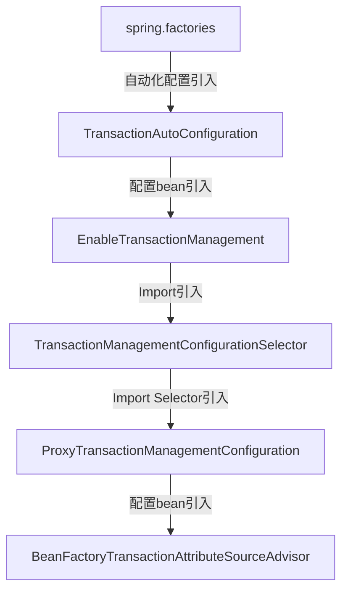

# Spring TX


## Spring事务的自动化配置

> 简略描述。




以上流程就是Spring中事务的自动化配置原理，最终就是引入了`ProxyTransactionManagementConfiguration`。

以下为`ProxyTransactinManagementConfiguration`的全部源码:


作为一个Java Config类，不仅声明了`BeanFactoryTransactionAttributeSourceAdvisor`，另外的还有`TransactionInterceptor`以及`TransactionAttributeSource`。


> `TransactionAttributeSource`的构造函数中就声明了事务仅仅在public方法中生效。


## Spring事务的代理创建流程

> 代理的创建主要还是在`AbstractAutoProxyCreator`中，`BeanFactoryTransactionAttributeSourceAdvisor`提供了代理创建的Pointcut和Advice。

以下为`BeanFactoryTransactionAttributeSourceAdvisor`的全部源码:


该Advisor中直接使用`TransactionAttributeSourcePointcut`作为Pointcut，并实现了抽象方法。

`TransactionAttributeSourcePointcut`继承了`StaticMethodMatcherPointcut`，默认以`ClassFilter.TRUE`作为ClassFilter，也就是说匹配所有的类。

而在MethodMatcher就是自身，对比方法是否匹配的逻辑如下:


`getTransactionAttributeSource`就是在Advisor中实现的抽象方法，因此判断方法是否需要事务代理的逻辑又来到了`TransactionAttrbuteSource`中。


`TransactionAttrbuteSource`就是在`ProxyTransactinManagementConfiguration`中声明的`AnnotationTransactionAttributeSource`。


### 方法调用

```java
@Nullable
protected Object invokeWithinTransaction(Method method, @Nullable Class<?> targetClass,
      final InvocationCallback invocation) throws Throwable {

   // If the transaction attribute is null, the method is non-transactional.
   TransactionAttributeSource tas = getTransactionAttributeSource();
    // 获取@Transaction的事务属性
   final TransactionAttribute txAttr = (tas != null ? tas.getTransactionAttribute(method, targetClass) : null);
    // 获取事务管理器,@Transaction中的value会被存为Qualifier,表示事务管理器的名称
   final TransactionManager tm = determineTransactionManager(txAttr);
	// reactive模式的事务执行
   if (this.reactiveAdapterRegistry != null && tm instanceof ReactiveTransactionManager) {
      ReactiveTransactionSupport txSupport = this.transactionSupportCache.computeIfAbsent(method, key -> {
         if (KotlinDetector.isKotlinType(method.getDeclaringClass()) && KotlinDelegate.isSuspend(method)) {
            throw new TransactionUsageException(
                  "Unsupported annotated transaction on suspending function detected: " + method +
                  ". Use TransactionalOperator.transactional extensions instead.");
         }
         ReactiveAdapter adapter = this.reactiveAdapterRegistry.getAdapter(method.getReturnType());
         if (adapter == null) {
            throw new IllegalStateException("Cannot apply reactive transaction to non-reactive return type: " +
                  method.getReturnType());
         }
         return new ReactiveTransactionSupport(adapter);
      });
      return txSupport.invokeWithinTransaction(
            method, targetClass, invocation, txAttr, (ReactiveTransactionManager) tm);
   }

   // 包装事务管理器
   PlatformTransactionManager ptm = asPlatformTransactionManager(tm);
    // 切入的方法名称
   final String joinpointIdentification = methodIdentification(method, targetClass, txAttr);

   // 获取不到事务
   if (txAttr == null || !(ptm instanceof CallbackPreferringPlatformTransactionManager)) {
      // Standard transaction demarcation with getTransaction and commit/rollback calls.
      TransactionInfo txInfo = createTransactionIfNecessary(ptm, txAttr, joinpointIdentification);

      Object retVal;
      try {
         // This is an around advice: Invoke the next interceptor in the chain.
         // This will normally result in a target object being invoked.
         retVal = invocation.proceedWithInvocation();
      }
      catch (Throwable ex) {
         // target invocation exception
         completeTransactionAfterThrowing(txInfo, ex);
         throw ex;
      }
      finally {
         cleanupTransactionInfo(txInfo);
      }

      if (retVal != null && vavrPresent && VavrDelegate.isVavrTry(retVal)) {
         // Set rollback-only in case of Vavr failure matching our rollback rules...
         TransactionStatus status = txInfo.getTransactionStatus();
         if (status != null && txAttr != null) {
            retVal = VavrDelegate.evaluateTryFailure(retVal, txAttr, status);
         }
      }

      commitTransactionAfterReturning(txInfo);
      return retVal;
   }

   else {
      Object result;
      final ThrowableHolder throwableHolder = new ThrowableHolder();

      // It's a CallbackPreferringPlatformTransactionManager: pass a TransactionCallback in.
      try {
         result = ((CallbackPreferringPlatformTransactionManager) ptm).execute(txAttr, status -> {
            TransactionInfo txInfo = prepareTransactionInfo(ptm, txAttr, joinpointIdentification, status);
            try {
               Object retVal = invocation.proceedWithInvocation();
               if (retVal != null && vavrPresent && VavrDelegate.isVavrTry(retVal)) {
                  // Set rollback-only in case of Vavr failure matching our rollback rules...
                  retVal = VavrDelegate.evaluateTryFailure(retVal, txAttr, status);
               }
               return retVal;
            }
            catch (Throwable ex) {
               if (txAttr.rollbackOn(ex)) {
                  // A RuntimeException: will lead to a rollback.
                  if (ex instanceof RuntimeException) {
                     throw (RuntimeException) ex;
                  }
                  else {
                     throw new ThrowableHolderException(ex);
                  }
               }
               else {
                  // A normal return value: will lead to a commit.
                  throwableHolder.throwable = ex;
                  return null;
               }
            }
            finally {
               cleanupTransactionInfo(txInfo);
            }
         });
      }
      catch (ThrowableHolderException ex) {
         throw ex.getCause();
      }
      catch (TransactionSystemException ex2) {
         if (throwableHolder.throwable != null) {
            logger.error("Application exception overridden by commit exception", throwableHolder.throwable);
            ex2.initApplicationException(throwableHolder.throwable);
         }
         throw ex2;
      }
      catch (Throwable ex2) {
         if (throwableHolder.throwable != null) {
            logger.error("Application exception overridden by commit exception", throwableHolder.throwable);
         }
         throw ex2;
      }

      // Check result state: It might indicate a Throwable to rethrow.
      if (throwableHolder.throwable != null) {
         throw throwableHolder.throwable;
      }
      return result;
   }
}
```


```java
// 必要情况下创建事务	
protected TransactionInfo createTransactionIfNecessary(@Nullable PlatformTransactionManager tm,
			@Nullable TransactionAttribute txAttr, final String joinpointIdentification) {

    // If no name specified, apply method identification as transaction name.
    // 事务如果没有名称，就以方法名作为事务的名称
    if (txAttr != null && txAttr.getName() == null) {
        txAttr = new DelegatingTransactionAttribute(txAttr) {
            @Override
            public String getName() {
                return joinpointIdentification;
            }
        };
    }
    TransactionStatus status = null;
    if (txAttr != null) {
        if (tm != null) {
            // 从事务管理器中开启事务
            status = tm.getTransaction(txAttr);
        }else {
            if (logger.isDebugEnabled()) {
                logger.debug("Skipping transactional joinpoint [" + joinpointIdentification +
                             "] because no transaction manager has been configured");
            }
        }
    }
    return prepareTransactionInfo(tm, txAttr, joinpointIdentification, status);
}
```


```java
@Override
public final TransactionStatus getTransaction(@Nullable TransactionDefinition definition)
    throws TransactionException {
	// 确定事务相关属性，如果属性为空则全部使用默认
    TransactionDefinition def = (definition != null ? definition : TransactionDefinition.withDefaults());
	// 获取事务
    Object transaction = doGetTransaction();
    boolean debugEnabled = logger.isDebugEnabled();

    if (isExistingTransaction(transaction)) {
        // Existing transaction found -> check propagation behavior to find out how to behave.
        return handleExistingTransaction(def, transaction, debugEnabled);
    }

    // Check definition settings for new transaction.
    if (def.getTimeout() < TransactionDefinition.TIMEOUT_DEFAULT) {
        throw new InvalidTimeoutException("Invalid transaction timeout", def.getTimeout());
    }

    // No existing transaction found -> check propagation behavior to find out how to proceed.
    // MANDATORY表示当前必须要存在事务，不存在则抛出异常
    if (def.getPropagationBehavior() == TransactionDefinition.PROPAGATION_MANDATORY) {
        throw new IllegalTransactionStateException(
            "No existing transaction found for transaction marked with propagation 'mandatory'");
    }
    else if (def.getPropagationBehavior() == TransactionDefinition.PROPAGATION_REQUIRED ||
             def.getPropagationBehavior() == TransactionDefinition.PROPAGATION_REQUIRES_NEW ||
             def.getPropagationBehavior() == TransactionDefinition.PROPAGATION_NESTED) {
        // 挂起TransactionSynchronizationManager的执行
        SuspendedResourcesHolder suspendedResources = suspend(null);
        if (debugEnabled) {
            logger.debug("Creating new transaction with name [" + def.getName() + "]: " + def);
        }
        try {
            // 开始新的事务
            return startTransaction(def, transaction, debugEnabled, suspendedResources);
        }
        catch (RuntimeException | Error ex) {
            resume(null, suspendedResources);
            throw ex;
        }
    }
    else {
        // Create "empty" transaction: no actual transaction, but potentially synchronization.
        if (def.getIsolationLevel() != TransactionDefinition.ISOLATION_DEFAULT && logger.isWarnEnabled()) {
            logger.warn("Custom isolation level specified but no actual transaction initiated; " +
                        "isolation level will effectively be ignored: " + def);
        }
        boolean newSynchronization = (getTransactionSynchronization() == SYNCHRONIZATION_ALWAYS);
        return prepareTransactionStatus(def, null, true, newSynchronization, debugEnabled, null);
    }
}
```


### 开启新事务

```java
private TransactionStatus startTransaction(TransactionDefinition definition, Object transaction,
                                           boolean debugEnabled, @Nullable SuspendedResourcesHolder suspendedResources) {

    boolean newSynchronization = (getTransactionSynchronization() != SYNCHRONIZATION_NEVER);
    DefaultTransactionStatus status = newTransactionStatus(
        definition, transaction, true, newSynchronization, debugEnabled, suspendedResources);
    doBegin(transaction, definition);
    prepareSynchronization(status, definition);
    return status;
}
```

