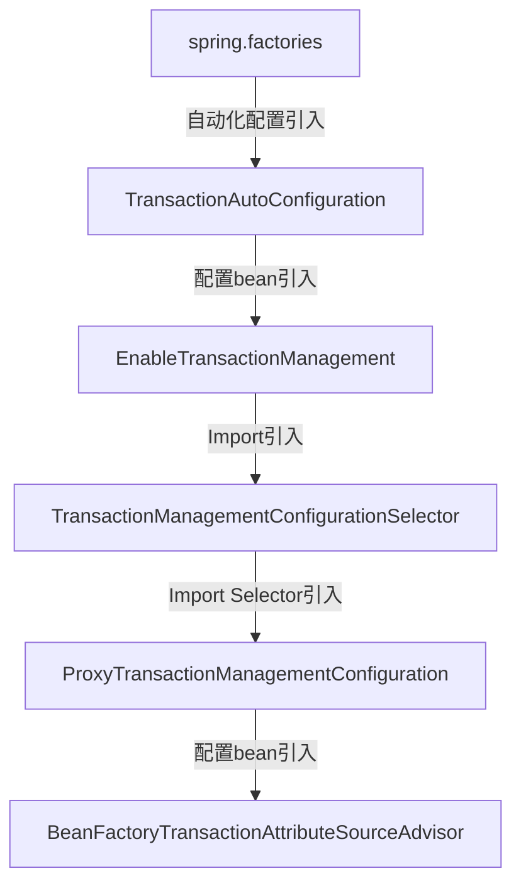

# Spring TX

## Spring事务的自动化配置

> 简略描述。

以上流程就是Spring中事务的自动化配置原理，最终就是引入了`ProxyTransactionManagementConfiguration`。

以下为`ProxyTransactinManagementConfiguration`的全部源码:

作为一个Java Config类，不仅声明了`BeanFactoryTransactionAttributeSourceAdvisor`，另外的还有`TransactionInterceptor`以及`TransactionAttributeSource`。

> `TransactionAttributeSource`的构造函数中就声明了事务仅仅在public方法中生效。

## Spring事务的代理创建流程

> 代理的创建主要还是在`AbstractAutoProxyCreator`中，`BeanFactoryTransactionAttributeSourceAdvisor`提供了代理创建的Pointcut和Advice。

以下为`BeanFactoryTransactionAttributeSourceAdvisor`的全部源码:

该Advisor中直接使用`TransactionAttributeSourcePointcut`作为Pointcut，并实现了抽象方法。

`TransactionAttributeSourcePointcut`继承了`StaticMethodMatcherPointcut`，默认以`ClassFilter.TRUE`作为ClassFilter，也就是说匹配所有的类。

而在MethodMatcher就是自身，对比方法是否匹配的逻辑如下:

`getTransactionAttributeSource`就是在Advisor中实现的抽象方法，因此判断方法是否需要事务代理的逻辑又来到了`TransactionAttrbuteSource`中。

`TransactionAttrbuteSource`就是在`ProxyTransactinManagementConfiguration`中声明的`AnnotationTransactionAttributeSource`。

