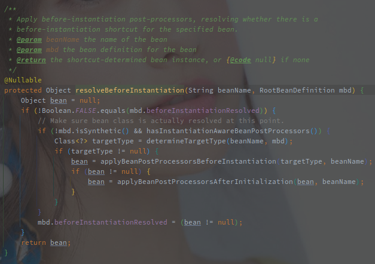
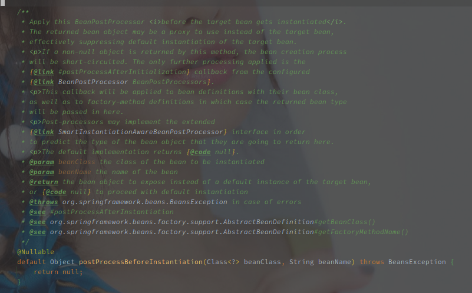
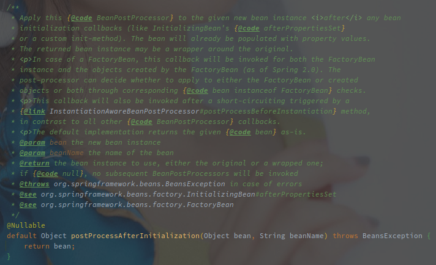

# Spring 中 Bean 对象的创建流程

---

[TOC]

---


## 概述

Spring 将 Bean 对象的创建分为了两大块内容:

1. 实例化 - 根据 BeanDefinition 创建具体的实例对象
2. 初始化 - 对创建的实例对象进行一系列的配置

在以上两个步骤中再穿插着各类 BeanPostProcessor 的调用，就组成了 Bean 对象基本的创建流程。


> 在 AbstractBeanFactory#getBean 的源码实现中，AbstractBeanFactory#createBean 被包装为 ObjectFactory ，作为核心的创建 Bean 实例的逻辑传入。

## 源码实现

```java
// AbstractBeanFactory#createBean
protected Object createBean(String beanName, RootBeanDefinition mbd, @Nullable Object[] args)
      throws BeanCreationException {
   RootBeanDefinition mbdToUse = mbd;
   // 解析出 Class 对象
   Class<?> resolvedClass = resolveBeanClass(mbd, beanName);
   // 塞回到 BeanDefinition 
   if (resolvedClass != null && !mbd.hasBeanClass() && mbd.getBeanClassName() != null) {
      mbdToUse = new RootBeanDefinition(mbd);
      mbdToUse.setBeanClass(resolvedClass);
   }

   // Prepare method overrides.
   // 处理方法覆写（应该也没啥使用场景了
   try {
      mbdToUse.prepareMethodOverrides();
   }  catch (BeanDefinitionValidationException ex) {}

   try {
       // 调用 InstantiationAwareBeanPostProcessor#postProcessBeforeInstantiation 尝试自定义实例化
       // 如果实例化成功，则跳过后续的流程，直接执行 BeanPostProcessor#postProcessAfterInitialization
      Object bean = resolveBeforeInstantiation(beanName, mbdToUse);
       // 创建成功则直接返回
      if (bean != null) {
         return bean;
      }
   } catch (Throwable ex) {}

   try {
       // 采用框架的实例化方法创建实例
      Object beanInstance = doCreateBean(beanName, mbdToUse, args);
      return beanInstance;
   } catch (BeanCreationException | ImplicitlyAppearedSingletonException ex) {}
      catch (Throwable ex) {}
}
```

以上是创建 Bean 实例的最上层代码。

### 解析 Class 对象

> 方法的覆写已经没什么使用场景了，忽略吧。

### 执行前置实例化方法



方法的逻辑如下：

1. 执行  **InstantiationAwareBeanPostProcessor#postProcessBeforeInstantiation** 创建失败则直接返回
2. 创建成功继续执行 **BeanPostProcessor#postProcessAfterInitialization**

<br>

标题的前置实例化方法就是指 **InstantiationAwareBeanPostProcessor#postProcessBeforeInstantiation**，该方法用于自定义类的实例化过程。



该方法在对象实例化之前被调用，返回的结果可能是代理用来代替原始的 Bean，如果返回不为 NULL 的对象则可以跳过默认的实例化方式。

（可以和 SmartInstantiationAwareBeanPostProcessor 联合使用推断返回的类型。

> **AbstractAutoProxyCreator 实现了该方法，用于对有自定义 TargetSource 的类进行代理对象的创建。**

<br>

而 **BeanPostProcesspr#postProcessAfterInitialization** 则是在初始化完毕之后调用的钩子方法。



在 Bean 初始化完毕之后调用（初始化例如 InitializingBean#afterPropertiesSet 以及自定义的 init-method），Bean 实例已经填充（populated）完毕，返回的 Bean 实例可能是包装了原始的 Bean。

在 FactoryBean 对象创建以及 FactoryBean 内部对象的创建都会被调用。

通过 InstantiationAwareBeanPostProcessor#postProcessBeforeInstantiation 也会被调用。


> **AbstractAutoProxyCreator 同样实现了该方法，用于代理对象的创建。**
>
> 另外 ApplicationListenerDetector 实现了该方法，用于将 ApplicationListener 的 Bean 添加到 ApplicationContext。


之后就是框架提供了创建逻辑。

### doCreateBean - Spring 的 Bean 创建逻辑

