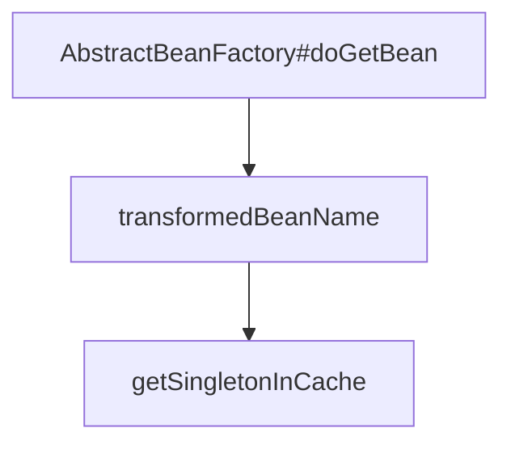

# Bean 对象的获取和创建

## Bean（单例）的获取流程

1. AbstractBeanFactory#doGetBean

2. 解析 Bean 名称（去除$等）

3. 从缓存中获取目标 Bean

   - singletonObjects

   - earlySingletonObjects

   - singletonFactories

4. 获取成功，解析 Bean，如果是 FactoryBean 则调用 getObject 方法，不是则直接返回

5. 尝试从 parentBeanFactory 获取 Bean 对象

6. 获取 BeanDefinition，处理 Override 方法

7. 处理 DependsOn 

8. 前后标记正在创建，然后开始创建流程

## Bean（单例）的创建流程

1. AbstractAutowiredCapableBeanFactory#createBean
2. 获取 Class 对象
3. 处理 Ovriride 方法
4. InstantiationAwareBeanPostProcessor#postProcessBeforeInstantiation(Class<?> beanClass, String beanName) 可以自定义实现对象的实例化
   - 如果 Before 中已经创建，继续执行 BeanPostProcessor#applyBeanPostProcessorsAfterInitialization
5. AbstractAutowiredCapableBeanFactory#doCreateBean 
6. 实例化具体对象，返回 BeanWrapper
   - InstanceSupplier
   - FactoryMethod
   - Constructor（包含无参）
7. MergedBeanDefinitionPostProcessor#postProcessMergedBeanDefinition 可以在初始化前修改 BeanDefinition
   - 之后可能需要提前暴露早期引用，通过 SmartInstantiationAwareBeanPostProcessor#getEarlyBeanReference
8. 填充属性值
9. 填充 XXXXAware 类，例如 BeanFatcoryAware 会在此时填充 BeanFatory 对象
10. 执行 BeanPostProcessor#postProcessBeforeInitialization 初始化之前对 Bean 的自定义改动
11. 初始化 Bean 对象
    - 如果 Bean 实现了InitializingBean 会调用 InitializingBean#afterPropertiesSet
    - 调用 InitMethod 
12. 执行 BeanPostProcessor#postProcessAfterInitialization 初始化之后对 Bean 的自定义改动
13. 注册 DisposableBean

[BeanPostProcessor相关类](beanpostprocessor/BeanPostProcessor类族概述.md)