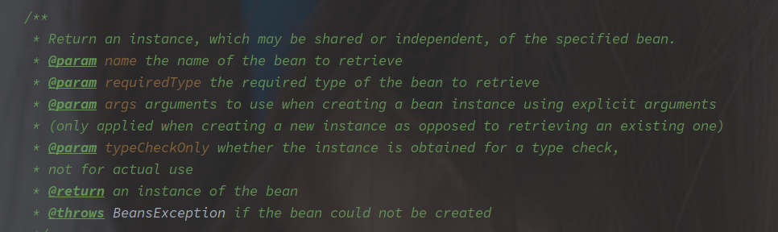
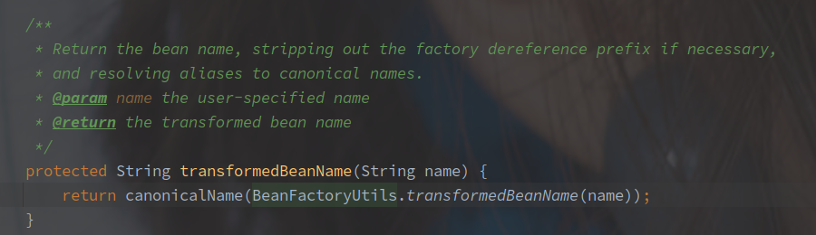
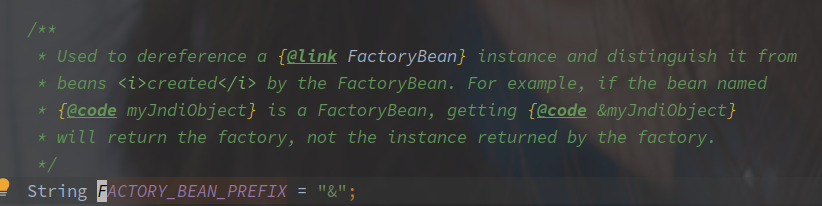
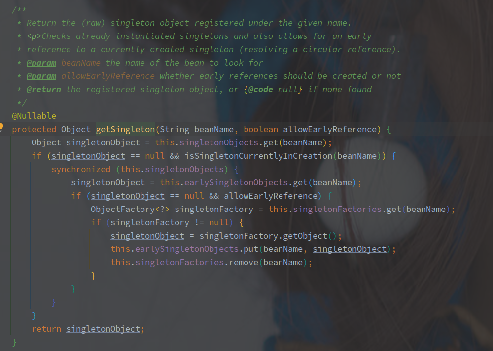

# Spring 中 Bean 对象的获取流程

---

[TOC]

---


## 概述

Spring 提供的 IOC 模块，可以简单的理解为一个 Map，里面包含了 BeanName / BeanType -> Bean 的映射。


## doGetBean - 获取 Bean 

（源码长成一匹马了，淦

```java
// AbstractBeanFactory#doGetBean
protected <T> T doGetBean(String name, @Nullable Class<T> requiredType, @Nullable Object[] args, boolean typeCheckOnly)
    throws BeansException {
    // 名字转换，去除 & 并且转换别名到真实的 Bean 名称
    String beanName = transformedBeanName(name);
    Object bean;
   // 从缓存中获取，此中的缓存包括三层
    Object sharedInstance = getSingleton(beanName);
    if (sharedInstance != null && args == null) {
        // ...
        // 转换获取的实例，如果是 ObjectFactory 或者 FactoryBean 则需要进一步完成创建
        bean = getObjectForBeanInstance(sharedInstance, name, beanName, null);
    }else {
        // Fail if we're already creating this bean instance:
        // We're assumably within a circular reference.
        // 如果是 Property 类型的 Bean 对象，并且处于创建流程
        if (isPrototypeCurrentlyInCreation(beanName)) {
            throw new BeanCurrentlyInCreationException(beanName);
        }
        // Check if bean definition exists in this factory.
        // 获取父 BeanFactory
        BeanFactory parentBeanFactory = getParentBeanFactory();
       // 父类不为空并且当前的 BeanFactory 不包含 beanName 对应的 Bean 对象
        if (parentBeanFactory != null && !containsBeanDefinition(beanName)) {
            // Not found -> check parent.
            // 去除 Bean 名称带的 & 前缀
            String nameToLookup = originalBeanName(name);
            // 尝试从父容器获取对象，创建的流程也在父容器完成
            
            // 下面是四种父 BeanFactory 的调用方式
            if (parentBeanFactory instanceof AbstractBeanFactory) {
                return ((AbstractBeanFactory) parentBeanFactory).doGetBean(
                    nameToLookup, requiredType, args, typeCheckOnly);
            }  else if (args != null) {
                // Delegation to parent with explicit args.
                return (T) parentBeanFactory.getBean(nameToLookup, args);
            }  else if (requiredType != null) {
                // No args -> delegate to standard getBean method.
                return parentBeanFactory.getBean(nameToLookup, requiredType);
            } else {
                return (T) parentBeanFactory.getBean(nameToLookup);
            }
        }
	
        // 是否需要检查类型
        if (!typeCheckOnly) {
            markBeanAsCreated(beanName);
        }

        try {
            // 获取 BeanDefinition，已经经过合成
            RootBeanDefinition mbd = getMergedLocalBeanDefinition(beanName);
            // 检查 BeanDefinition
            checkMergedBeanDefinition(mbd, beanName, args);
	   // 解决 Bean 对象的显式依赖问题，显示依赖是无法解决循环依赖的
            // Guarantee initialization of beans that the current bean depends on.
            String[] dependsOn = mbd.getDependsOn();
            if (dependsOn != null) {
                for (String dep : dependsOn) {
                    if (isDependent(beanName, dep)) {
                        throw new BeanCreationException(mbd.getResourceDescription(), beanName,
                                                        "Circular depends-on relationship between '" + beanName + "' and '" + dep + "'");
                    }
                    registerDependentBean(dep, beanName);
                    try {
                        getBean(dep);
                    }  catch (NoSuchBeanDefinitionException ex) {
                        throw new BeanCreationException(mbd.getResourceDescription(), beanName,
                                                        "'" + beanName + "' depends on missing bean '" + dep + "'", ex);
                    }
                }
            }

            // Create bean instance.
            // 单例 Bean 的创建
            if (mbd.isSingleton()) {
                sharedInstance = getSingleton(beanName, () -> {
                    try {
                        // Bean 的创建流程
                        return createBean(beanName, mbd, args);
                    }
                    catch (BeansException ex) {
                        // Explicitly remove instance from singleton cache: It might have been put there
                        // eagerly by the creation process, to allow for circular reference resolution.
                        // Also remove any beans that received a temporary reference to the bean.
                        destroySingleton(beanName);
                        throw ex;
                    }
                });
                // 进一步完成 Bean 的创建
                bean = getObjectForBeanInstance(sharedInstance, name, beanName, mbd);
            }else if (mbd.isPrototype()) {
                // Propertype 类型的 Bean 的创建
                // It's a prototype -> create a new instance.
                Object prototypeInstance = null;
                try {
                    beforePrototypeCreation(beanName);
                    prototypeInstance = createBean(beanName, mbd, args);
                }  finally {
                    afterPrototypeCreation(beanName);
                }
                bean = getObjectForBeanInstance(prototypeInstance, name, beanName, mbd);
            } else {
                // 其他声明周期的 Bean 的创建
                String scopeName = mbd.getScope();
                if (!StringUtils.hasLength(scopeName)) {
                    throw new IllegalStateException("No scope name defined for bean ´" + beanName + "'");
                }
                // Scope 是否有注册
                Scope scope = this.scopes.get(scopeName);
                if (scope == null) {
                    throw new IllegalStateException("No Scope registered for scope name '" + scopeName + "'");
                }
                try {
                    // 通过声明周期去初始化 Bean 对象
                    Object scopedInstance = scope.get(beanName, () -> {
                        beforePrototypeCreation(beanName);
                        try {
                            return createBean(beanName, mbd, args);
                        }
                        finally {
                            afterPrototypeCreation(beanName);
                        }
                    });
                    bean = getObjectForBeanInstance(scopedInstance, name, beanName, mbd);
                }   catch (IllegalStateException ex) {
                }
            }
        }  catch (BeansException ex) {
            cleanupAfterBeanCreationFailure(beanName);
            throw ex;
        }
    }

    // Check if required type matches the type of the actual bean instance.
    // 进行 Bean 的类型转换，如果无法转化抛出异常。
    if (requiredType != null && !requiredType.isInstance(bean)) {
        try {
            T convertedBean = getTypeConverter().convertIfNecessary(bean, requiredType);
            if (convertedBean == null) {
                throw new BeanNotOfRequiredTypeException(name, requiredType, bean.getClass());
            }
            return convertedBean;
        } catch (TypeMismatchException ex) {
        }
    }
    return (T) bean;
}
```

### doGetBean 相关参数



简单翻译如下：

| 参数名称      | 参数类型 | 参数含义                                                   |
| ------------- | -------- | ---------------------------------------------------------- |
| name          | String   | Bean 名称，前缀为 & 直接获取 FactoryBean，可以使用别名     |
| requiredType  | Class    | Bean 的类型，不为空时方法会帮忙进行类型转换                |
| args          | Object[] | 创建的参数集合，用于创建的时候实例化  Bean                 |
| typeCheckOnly | Boolean  | 是否仅仅用于类型检查，如果仅用于检查则不需要标记为正在创建 |


###  转换 BeanName



转换实际包含了两个步骤：

1. 去除 & 前缀 - BeanFactoryUtil#transformedBeanName
2. 别名转换 - SimpleAliasRegistry#canonicalName

去除 & 前缀的逻辑非常简单，也加了缓存避免多次处理字符串，其中 & 的含义是：



**灭有 & 前缀表示获取真实的对象，即使是 FactoryBean 也会进一步调用 FactoryBean#getObejct，而带有 & 的 beanName 表示直接获取 FactoryBean。**

别名转换的逻辑也不难，就是拿 aliasMap 反复转换到获取不到就好。


### BeanFactory 的三级缓存



该方法中涉及的三级缓存如下：

| 缓存名称              | 缓存作用                                                     |
| --------------------- | ------------------------------------------------------------ |
| singletonObjects      | 存放完全创建完毕的对象                                       |
| earlySingletonObjects | 存放早期的引用对象                                           |
| singletonFactories    | 存放 ObjectFactory 对象，对于单例对象一般默认在创建的时候会先添加到该类。 |

> 添加到 singletonFactory 的 ObjectFactory 是借由 Lambda 表示的 AbstractAutowireCapableBeanFactory#getEarlyBeanReference 方法的调用