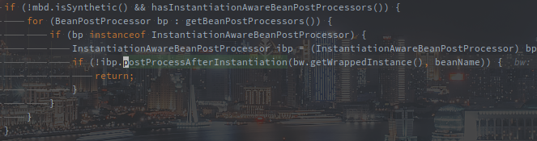
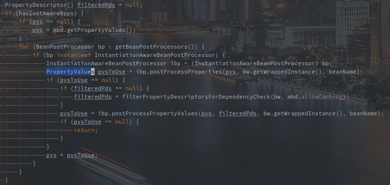
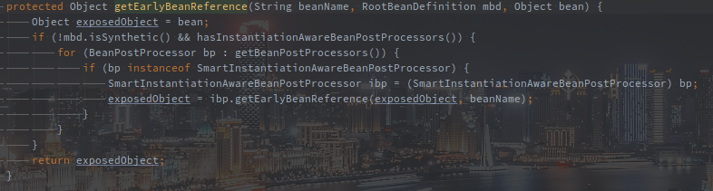
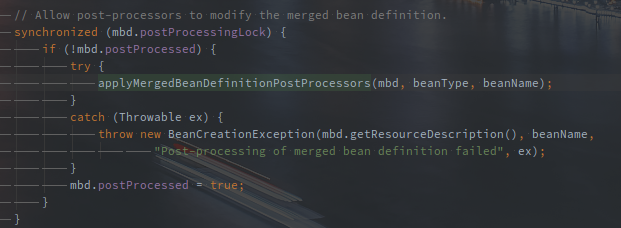
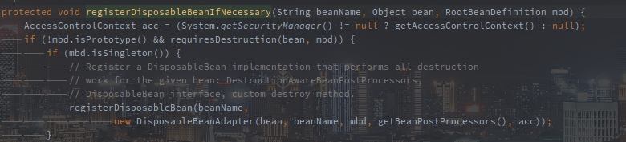

# BeanPostProcessor类族

> BeanPostProcessor是Spring中的核心钩子方法，它的许多子类分别提供了不同时间不同形式的回调，总计10个扩展点。
>
> 本文只作简单的介绍，着重在相关钩子方法的调用时机。

<!-- more -->

---

[TOC]

## BeanPostProcessors

Spring中最基础的扩展类，**提供了初始化前后的钩子方法。**

 

postProcessBeforeInitialization是在初始化前调用的钩子方法，而postProcessAfterInitialization则是初始化之后调用。

下图是doCreateBean -> initializeBean方法片段：

 

如图所示，在调用init-method方法的前后分别会调用before和after两个钩子方法。

另外的postProcessAfterInitialization方法还会在完成自定义实例化之后调用。

 

上图的片段在createBean方法的中间部分，解析出Class对象，处理完覆写方法，就会调用该方法尝试自定义实例化。

如果自定义实例化成功，也会遍历调用postProcessAfterInitialization方法。

在调用postProcessAfterInitialization方法之上的applyBeanPostProcessorsBeforeInstantiation方法就是自定义的实例化方法的调用，是对InstantiationAwareBeanPostProcessor的前置钩子方法的处理。

## InstantiationAwareBeanPostProcessor

该接口在继承BeanPostProcessor的基础上**扩展了在实例化前后的钩子方法。**

 

调用postProcessBeforeInstantiation方法可以在Spring默认的实例化方法之前，定义自己的实例化方法。

例如生成代理并替换之类的，返回的Object若不为空则可以在执行完BeanPostProcessor的后置方法之后，直接跳过实例化方法doCreateBean。

在上文resolveBeforeInstantiation方法的截图中也可以看到该方法的执行点。

postProcessAfterInstantiation方法则是在实例化之后但在属性填充之前的钩子方法，若返回false则跳过属性填充方法。

下图是doCreateBean -> populateBean方法的片段:

 

可以看到postProcessAfterInstantiation后置方法的执行逻辑以及要求，首先就需要BeanDefinition不是合成的。

postProcessProperties也是在属性被填充之前被调用，返回一个自定义的PropertyValues对象，传入当前的属性集合，实例对象以及bean名称，可以在该方法中修改属性集合。

该属性集合最终会被填充到Bean中。

下图也是doCreateBean -> populateBean方法的片段:

 

除了postProcessProperties方法，在其未生效时，postProcessPropertyValues方法也会被尝试调用。

但其实postProcessPropertyValues方法在接口中已经被声明为不推荐使用的。

 

## SmartInstantiationAwareBeanPostProcessor

该接口扩展了InstantiationAwareBeanPostProcessor，**主要是实例化过程中获取Class对象等一些逻辑的扩展。**

 

predictBeanType方法用于预测Bean的类型，明显实在实例化之前的。

这个在createBean的流程中具体的调用点未找到，不过应该是常规手段不能得到Class对象后的一种补充。

determineCandidateConstructors用于推断可用的构造函数。

以下是createBean -> doCreateBean -> createBeanInstance方法的片段：

 

在createBeanInstance中定义了好几种实例化方法，从上到下每一步都会尝试去实例化对象，如果实例化成功就退出了。

该方法在使用autowireConstructor之前推断出合适的构造方法。

以下就是推断，也就是调用方法的逻辑：

 

遍历调用SmartInstantiationAwareBeanPostProcessor#determineCandidateConstructors方法的时候，只要有一个成功返回，就直接返回了。

所以在BeanFactory中如果有多个SmartInstantiationAwareBeanPostProcessor作用于相同Bean的推断，就需要注意执行的顺序。

getEarlyBeanReference用于获取早期引用，处理循环依赖的情况。

实例化完成之后，还未填充属性，为了解决循环依赖问题，此时就要通过该方法暴露早期的引用。

下图实在createBean -> doCreateBean的片段：

 

在经过是否需要暴露早期引用的判断之后，会将持有该方法的ObjectFactory作为value注册到缓存中。

具体流程表如下：

 

 不难发现在singletonFactories缓存中注册的就是getEarlyBeanReference方法。

而getEarlyBeanReference的具体逻辑如下：

 

最终是循环调用了所有的SmartInstantiationAwareBeanPostProcessor#getEarlyBeanReference方法。

## MergedBeanDefinitionPostProcessor

该类扩展了**对MergedBeanDefinition在实例化之后的扩展**。

 

postProcessMergedBeanDefinition在Bean实例化完成之后被调用。

下图是createBean -> doCreateBean的片段：

 

调用该方法之前，Bean已经通过createBeanInstance方法使用Spring提供的方法进行实例化。

## DestructionAwareBeanPostProcessor

 

改接口扩展了在销毁时对Bean对应的资源的自定义回收。

在postProcessBeforeDestruction方法中可以定义对资源的自定义回收逻辑。

requiresDestruction则是判断是否需要注册上述方法。

以下是Spring Boot中Bean在创建时，doCreateBean方法的最后一步。

 

 

在判断为非原型模式且需要销毁时，会包装一个DiposableBeanAdapter注册到BeanFactory中。

注册的形式就是disposableBeans的缓存。

以下是DisposableBeanAdapter的构造方法中的最后一行，方法以及对应的实现。

 

可以看到在初始化的时候通过getBeanPostProcessors()方法获取的BeanPostProcessor集合经过筛选后被赋值给DisposableBeanAdapter中的beanPostProcessors成员变量。

