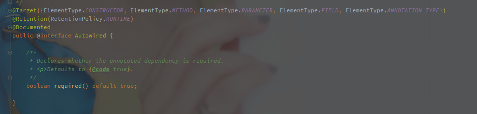
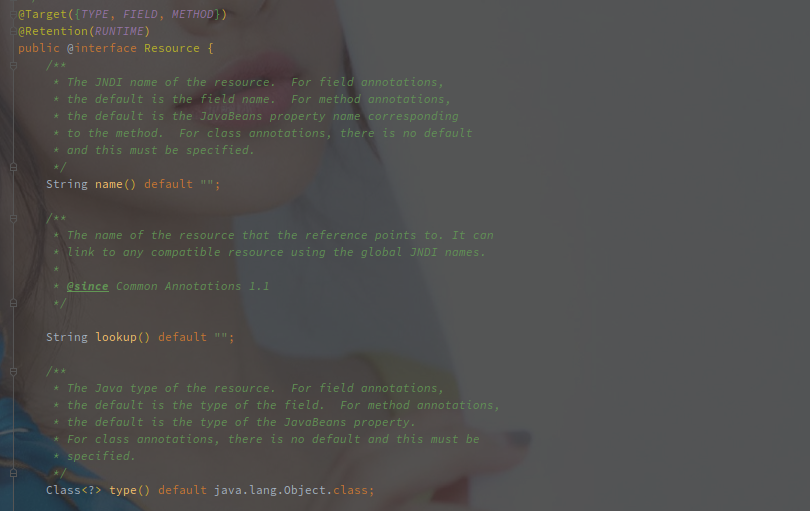

# Spring 相关知识点

## Resource 和 Autowired 的区别

### Autowired

Autowired 是 Spring 官方提供的注入形式，默认使用 byType 模式注入，可以和以下注解配合：

- **@Qualifier - 改为 byName 的注入形式**
- **@Primary - 多个符合条件的 Bean，可以优先挑选 Primary 的**

另外 Autowired 可以作用于以下情况：

- 构造器
- 方法（Setter 方法）
- 参数
- 成员变量
- 注解（没用过）

> Autowired 使用 AutowiredAnnotationBeanPostProcessor 实现。 
>
> 该类同时实现的还有以下注解：
>
> 1. @Value
> 2. @Autowired
> 3. @Inject（非 Spring 官方提供）

### Resource

Resource 并不是官方提供的注解，属于 javax.annation 包。

指定 name 就按照 name 注入，指定了 type 就按照 type 注入，如果两个一起指定则注入 name 和 type 都符合的。

如果没有指定任何参数，则先按照 name 再按照 type 注入。

Resource 可以标注在以下地方：

- 方法（Setter 方法）
- 成员变量

> Resource 使用 CommonAnnotationBeanPostProcessor 实现。zhi该类同时实现的还有以下注解：
>
> 1. @Resource（非 Spring 官方提供）
>2. @PostConstruct（非 Spring 官方提供）
> 3. @PreDestory（非 Spring 官方提供）

