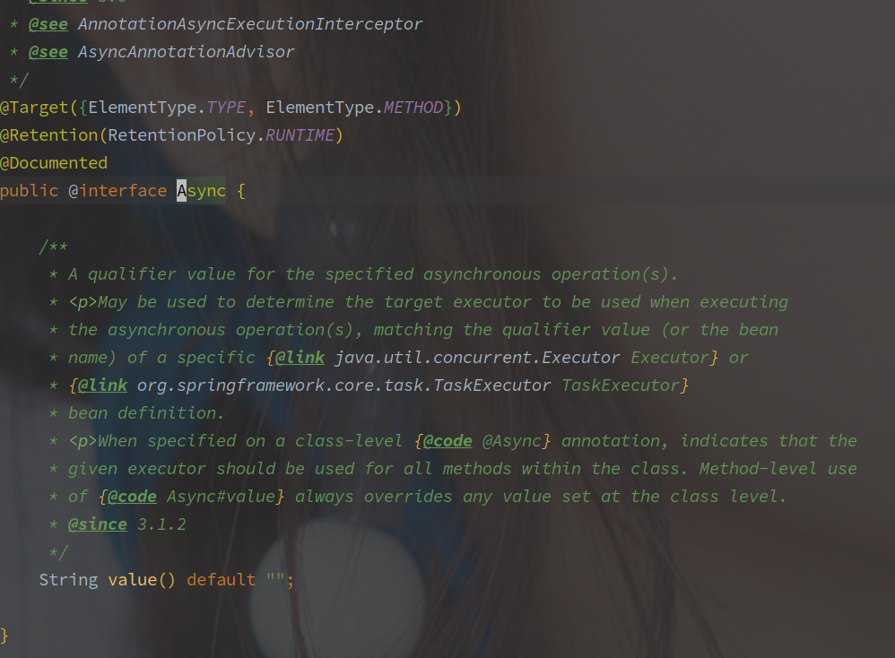
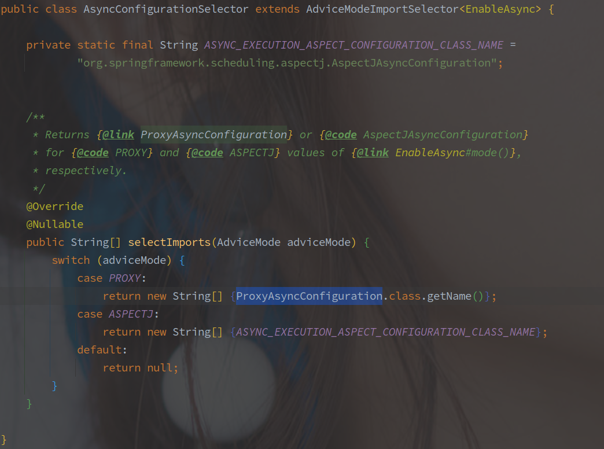
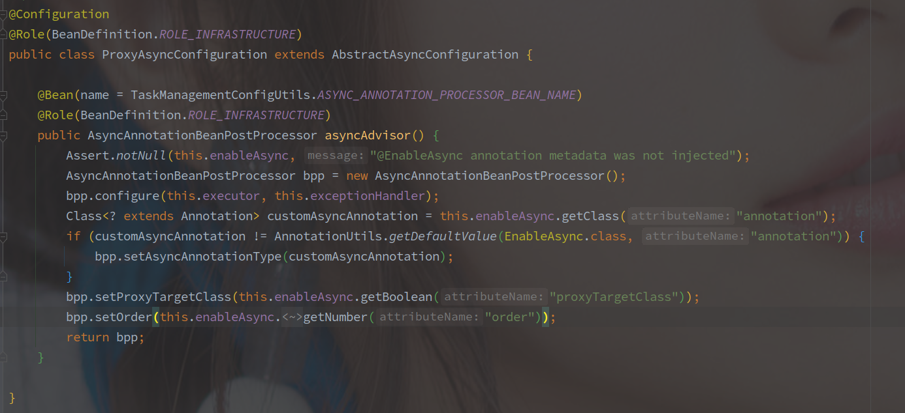
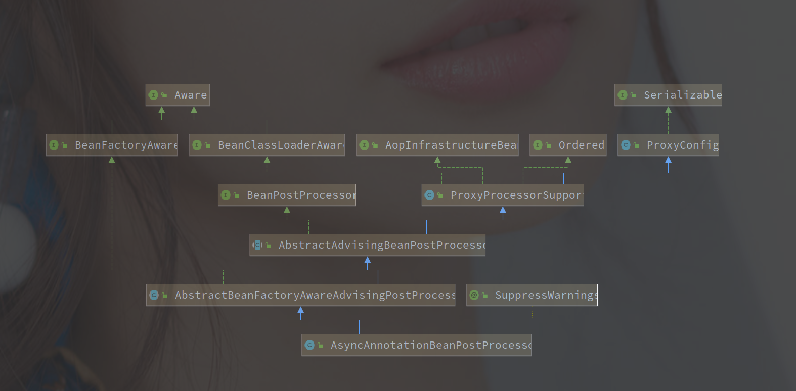
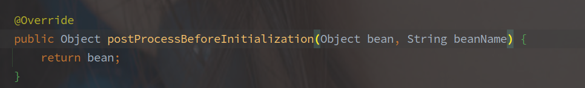
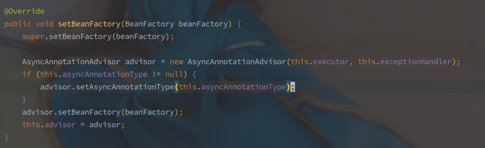
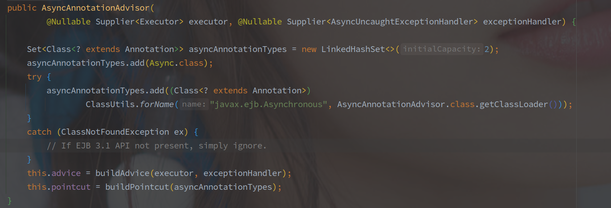
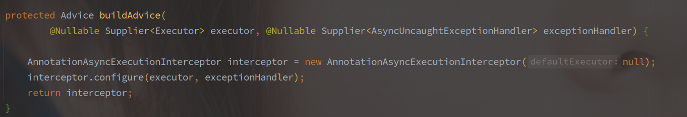
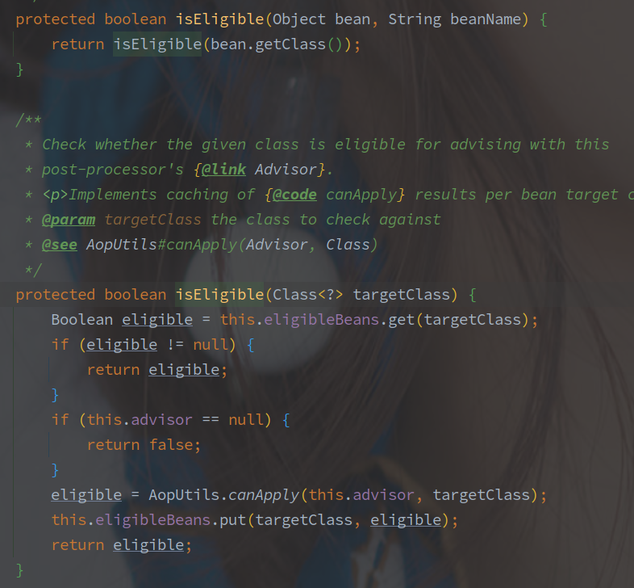
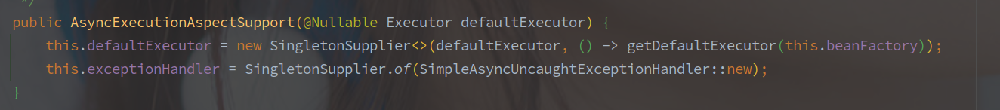

# Async

---

[TOC]

---

## 概述

Async 是 Spring 中的异步注解，标注该注解就可以将方法以异步任务的形式执行。

> Async 使用的还是动态代理的机制，所以同方法内以 this 调用会失效。

Async 的使用很简单，在你想要异步的方法上标注 @Async 就好。




## Async 的注解原理

> Async 自定义了一个 BeanPostProcessor，拦截初始化过程，返回自定义的类。

### Async 的自动装配

@EnableAsync 中通过 Import 引入了 AsyncConfigurationSelector。

AsyncConfigurationSelector 源码如下：

> Import 会在 ConfigurationClassPostProcessor 中处理，ConfigurationClassPostProcessor 是 BeanFactoryPostProcessor 的实现类，所以会在刷新容器的前期引入该配置类。



**根据代理模式的不同会引入不同的配置类**，默认是 **PROXY**，引入的就是 ProxyAsyncConfiguration 类。

以下为 ProxyAsyncConfiguration 源码：



配置类中引入了一个 **AsyncAnnotationBeanPostProcessor**。

> Async 和 Feign 的实现不一样，并不是直接扫描包获得相关的类。
>
> 可能是因为 Async 是标记方法的，而扫描整个包的方法效果明显会差很多，而 FeignClient 是标注在类上的。


### 代理类的创建流程

以下是 AsyncAnnotationBeanPostProcessor 的类图:



**AsyncAnnotationBeanPostProcessor 实现了 BeanPostProcessor。**

> BeanPostProcessor 的两个方法 Before 和 After 会分别在初始化方法的前后调用。

AbstractAdvisingBeanPostProcessor 就是包含 Advisor 对象的 BeanPostProcessor，而 AbstractBeanFactoryAwareAdvisingPostProcessor 又多注入了 BeanFactory。


忽略其他，先看作为 BeanPostProcessor 的两个方法，先是 Before：



**AsyncAnnotationBeanPostProcessor 直接忽略了前置钩子**，再是 After：

```java
@Override
public Object postProcessAfterInitialization(Object bean, String beanName) {
    // advisor不为空，并且忽略基础类
    if (this.advisor == null || bean instanceof AopInfrastructureBean) {
        // Ignore AOP infrastructure such as scoped proxies.
        return bean;
    }
	
    // 将自身的 Advisor 添加到拦截到的 Bean 中。
    if (bean instanceof Advised) {
        Advised advised = (Advised) bean;
        // Advised 是否对存在 Async 方法的类生效
        if (!advised.isFrozen() && isEligible(AopUtils.getTargetClass(bean))) {
            // Add our local Advisor to the existing proxy's Advisor chain...
            if (this.beforeExistingAdvisors) {
                advised.addAdvisor(0, this.advisor);
            }
            else {
                advised.addAdvisor(this.advisor);
            }
            return bean;
        }
    }
	
    // 判断是否需要
    if (isEligible(bean, beanName)) {
        // 使用的ProxyFactory生成代理类
        ProxyFactory proxyFactory = prepareProxyFactory(bean, beanName);
        if (!proxyFactory.isProxyTargetClass()) {
            evaluateProxyInterfaces(bean.getClass(), proxyFactory);
        }
        // 增加 
        proxyFactory.addAdvisor(this.advisor);
        customizeProxyFactory(proxyFactory);
        return proxyFactory.getProxy(getProxyClassLoader());
    }

    // No proxy needed.
    return bean;
}

```

在后置的钩子方法中判断 bean 是否需要走代理，需要的话就用 ProxyFactory 创建代理对象。

另外的如果有 Adviced 对存在 Async 方法的类生效，也把 Advisor 暴露出去。

> Async 使用的 ProxyFactory 创建 JDK 的动态代理类。


### Advisor 的生成

Advisor 对象是在 setBeanFactory 方法被调用的时候实现。

> AbstractBeanFactoryAwareAdvisingPostProcessor 集成了 BeanFactoryAware 接口，所以在初始化 Bean 的最初阶段就会调用 setBeanFactory 方法注入 BeanFactory 对象。



AsyncAnnotationBeanPostProcessor 中的方法实现入上图，也就是在初始化 Bean 对象的初期就会创建 AsyncAnnotationAdvisor，带上执行器，异常处理等配置。

以下为 AsyncAnnotationAdvisor 的构造方法：



设置了默认支持的注解 Async，就是说 @EnableAsync 中就算指定了别的注解，Async 也是有效的。

另外创建了 Advice 和 Pointcut。

> Advice 就是就是增强类，最终增强的方法调用会进入到该类。
>
> Pointcut 就是切点，最终哪些节点需要增强就是看这个类。

以下为 buildPointcut 的源码:


就是将列表的 asyncAnnotationTypes 都添加到筛选的方法中。

以下为 buildAdvice 的方法源码：



创建的 Advice 就是 AnnotationAsyncExecutionIntercepter。


> AnnotationAsyncExecutionIntercepter 就是代理类最终需要走到逻辑。


### 判断是否需要创建代理



从上图可知是否需要代理直接是通过 AopUtils#canApply 方法判断的，主要还是 Advisor 的逻辑，


### 归纳

@EnableAsync 提供过 Import 引入了配置类，配置类中注册了特殊的 BeanPostProcessor - **AsyncAnnotationBeanPostProcessor**。

AsyncAnnotationBeanPostProcessor 拦截 Bean 的创建流程，在 Bean 初始化之后拦截并生成代理对象。

Async 所需要的 Advisor - **AsyncAnnotationAdvisor** 也是在 AsyncAnnotationBeanPostProcessor 中创建，并没有暴露在容器中。


> 这也是一种自定义的 AOP 方式，实现自己的 BeanPostProcessor，定义自己的 Advisor，实现拦截并返回自己想给出的实现类。

> 使用 JDK 形式生成代理一般有，ProxyFactory 以及 ProxyFactoryBean，在 Async 的实现中采用 ProxyFactory 的形式生成。


## 异步原理

> 之前流程就已经创建了，以 AnnotationAsyncExecutionInterceptor 为最终 Interceptor 的代理类。

以下为 AnnotationAsyncExecutionInterceptor 的类图：


以下为执行的实际方法：

```java
// AsyncExecutionInterceptor#invoke
@Override
@Nullable
public Object invoke(final MethodInvocation invocation) throws Throwable {
    // 获取类和方法
    Class<?> targetClass = (invocation.getThis() != null ? AopUtils.getTargetClass(invocation.getThis()) : null);
    Method specificMethod = ClassUtils.getMostSpecificMethod(invocation.getMethod(), targetClass);
    final Method userDeclaredMethod = BridgeMethodResolver.findBridgedMethod(specificMethod);

    // 获取执行的执行器
    AsyncTaskExecutor executor = determineAsyncExecutor(userDeclaredMethod);
    if (executor == null) {
        throw new IllegalStateException(
            "No executor specified and no default executor set on AsyncExecutionInterceptor either");
    }

    // 包装执行方法
    Callable<Object> task = () -> {
        try {
            Object result = invocation.proceed();
            if (result instanceof Future) {
                return ((Future<?>) result).get();
            }
        }
        catch (ExecutionException ex) {
            handleError(ex.getCause(), userDeclaredMethod, invocation.getArguments());
        }
        catch (Throwable ex) {
            handleError(ex, userDeclaredMethod, invocation.getArguments());
        }
        return null;
    };
	// 提交任务，这里还传递了返回类型
    return doSubmit(task, executor, invocation.getMethod().getReturnType());
}
```


### 确定执行器

```java
// AsyncExecutionAspectSupport#determineAsyncExecutor
@Nullable
protected AsyncTaskExecutor determineAsyncExecutor(Method method) {
    // 尝试从缓存获取
    AsyncTaskExecutor executor = this.executors.get(method);
    if (executor == null) {
        Executor targetExecutor;
        // 获取指定的执行器的名称，也就是 Async 的 value 属性。
        String qualifier = getExecutorQualifier(method);
        if (StringUtils.hasLength(qualifier)) {
            // 最后还是从容器中获取
            targetExecutor = findQualifiedExecutor(this.beanFactory, qualifier);
        }
        else {
            // 使用默认的执行其
            targetExecutor = this.defaultExecutor.get();
        }
        if (targetExecutor == null) {
            return null;
        }
        // 适配
        executor = (targetExecutor instanceof AsyncListenableTaskExecutor ?
                    (AsyncListenableTaskExecutor) targetExecutor : new TaskExecutorAdapter(targetExecutor));
        // 添加缓存
        this.executors.put(method, executor);
    }
    return executor;
}
```

> executor 是一个 ConcurrentHashMap，以 Method 为 key，以 AsyncTaskExecutor 为 value，是本地的缓存，下次就不用走后续的判断逻辑。

#### 执行器的选择逻辑

> 首先获取的是 Async 注解中的 value 值，在容器中对应的执行器。
>
> 为空则继续获取默认的执行器，默认的执行器就是容器中的 TaskExecutor 类型 Bean 对象。
>
> 都没有则返回 null，会在上层方法抛异常。


### 默认的执行器

默认的执行器是在 AsyncExecutionAspectSupport 初始化的时候创建的。



中间逻辑很简单就是获取 BeanFactory 中的 TaskExecutor 类型的 Bean 对象，源码如下：


这里就很清楚了，为什么不用 ScheduleExecutorService 作为执行器的底层类型在 BeanFactory 中搜索，因为定义不够清晰，而 TaskExecutor 基本上就是专门为了 Async 声明的接口。


>  Async 中的 value 在这里就是执行器的 BeanName，如果没有指定则使用默认的 BeanFactory 中 TaskExecutor 类型的 Bean 对象。


### 任务的提交和执行

以下是 AsyncExecutionAspectSupport#doSubmit 的方法源码，也就是任务提交的方法：


异步的任务有四种执行方式，根据返回值类型的不同:

1. CompletableFuture
2. ListenableFuture
3. Future
4. 无返回值

> ！！异步的任务无法返回一个正常的返回值对象。


CompletableFuture 暂时不了解。

**ListenableFuture 是 Spring 扩展的原 Future 接口，新增了回调函数的添加方法，常见的实现比如 AsyncResult。**

> 这里的回调函数包含 SuccessCallback 和 FailureCallback。


## 总结


> Q: 什么是 Async？

Async 提供了简单的异步实现模式，只要在方法上标注 @Async 就可以异步执行该方法。


> Q: Async 采用什么执行器执行任务？

默认使用容器中的 TaskExecutor 对象，也可以在 @Async 中指定，若两者都没有则抛异常。


> Q: Async 的实现方式？

Async 模块自己实现了一个 AsyncAnnotationBeanPostProcessor ，在 Bean 创建过程中后置拦截并创建代理对象。

AsyncAnnotationBeanPostProcessor 中创建了 Advice 和 Pointcut 对象，对拦截的 Bean 进行拦截，并以 Advice + ProxyFactory。

具体的实现逻辑还是在 AnnotationAsyncExecutionInterceptor 中。


