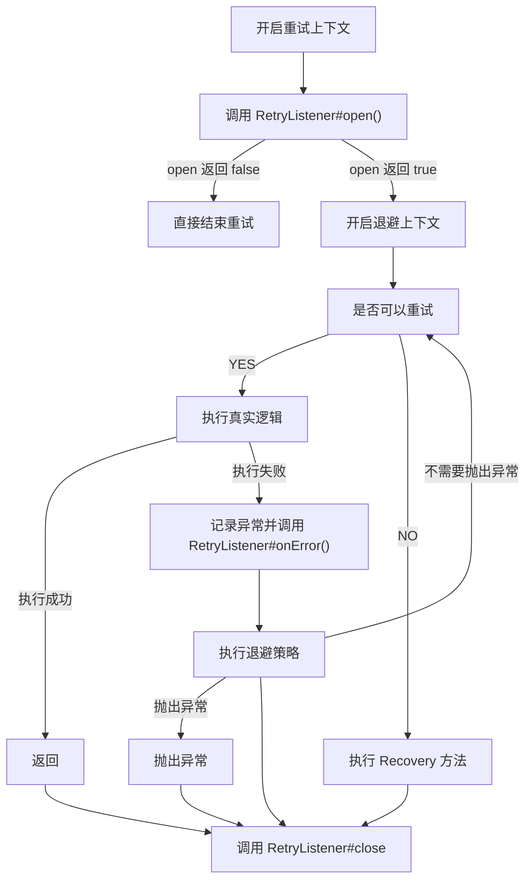

# Retry 

---

[TOC]

---

## 概述

Retry 属于 Spring Batch 项目的一个模块，提供了方法级别的重试功能。

### 示例

```java
public class Main {
    public static void main(String[] args) {
        // 创建 RetryTemplate 对象
        final RetryTemplate retryTemplate = new RetryTemplate();
        // 简单重试策略,连续重试三次
        final SimpleRetryPolicy simpleRetryPolicy = new SimpleRetryPolicy(3);
        retryTemplate.setRetryPolicy(simpleRetryPolicy);
        // 退避策略,固定等待1s
        final FixedBackOffPolicy backOffPolicy = new FixedBackOffPolicy();
        backOffPolicy.setBackOffPeriod(1000L);
        retryTemplate.setBackOffPolicy(backOffPolicy);
		// 设置监听器
        retryTemplate.setListeners(new RetryListener[]{
                new RetryListenerSupport() {
                    @Override
                    public <T, E extends Throwable> boolean open(RetryContext context, RetryCallback<T, E> callback) {
                        System.out.println("重试 open()");
                        return true;
                    }
                    @Override
                    public <T, E extends Throwable> void close(RetryContext context, RetryCallback<T, E> callback, Throwable throwable) {
                        System.out.println("重试 close()");
                    }
                    @Override
                    public <T, E extends Throwable> void onError(RetryContext context, RetryCallback<T, E> callback, Throwable throwable) {
                        System.out.println("重试 onError()");

                    }
                }
        });
        try {
            // 执行具体逻辑
            retryTemplate.execute(new RetryCallback<Object, Throwable>() {
                @Override
                public Object doWithRetry(RetryContext context) throws Throwable {
                    System.out.println("// ================= 重试次数:" + context.getRetryCount());
                    throw new RuntimeException("");
                }
            }, new RecoveryCallback<Object>() {
			     // 在所有重试都失败之后的恢复反复方法
                @Override
                public Object recover(RetryContext context) throws Exception {
                    System.out.println("// =============== recover");
                    return null;
                }
            });
        } catch (Throwable e) {
            // NOOP
        }
    }
}

// 输入如下
// 重试 open()
// // ================= 重试次数:0
// 重试 onError()
// // ================= 重试次数:1
// 重试 onError()
// // ================= 重试次数:2
// 重试 onError()
// // =============== recover
// 重试 close()
```

### 相关类和接口

| 接口             | 作用                                                         |
| ---------------- | ------------------------------------------------------------ |
| RecoveryCallback | 恢复函数回调，在所有重试都失败之后的回调函数。               |
| RetryContext     | 重试上下文，用于保存一次重试任务的相关参数，例如当前重试次数以及抛出的异常等。 |
| RetryPolicy      | 重试策略，表示重试的方式。                                   |
| BackOffPolicy    | 退避策略，表示每次失败之后的操作。                           |


#### RetryPolicy 实现

RetryPolicy 的实现如下:


> RetryPolicy 默认实现如下

| 实现类                         | 类作用                                                       |
| ------------------------------ | ------------------------------------------------------------ |
| NeverRetryPolicy               | 不允许重试                                                   |
| AlwaysRetryPolicy              | 允许无限重试，直到成功，此方式逻辑不当会导致死循环           |
| SimpleRetryPolicy              | 固定次数重试策略，默认重试最大次数为3次（RetryTemplate 默认使用的策略） |
| TimeoutRetryPolicy             | 超时时间重试策略，默认超时时间为1秒，在指定的超时时间内允许重试 |
| ExceptionClassifierRetryPolicy | 根据不同异常的设置不同的重试策略                             |
| CircuitBreakerRetryPolicy      | 带**熔断功能**的重试策略                                     |
| CompositeRetryPolicy           | 组合重试策略，有两种组合方式，乐观组合重试策略是指只要有一个策略允许重试即可以，悲观组合重试策略是指只要有一个策略不允许重试即可以 |

------------------------------------------------


## 源码实现

> 以下是 RetryTemplate 的重试实现源码。

```java
// RetryTemplate#doExecute
// 方法的入参:
protected <T, E extends Throwable> T doExecute(RetryCallback<T, E> retryCallback,
			RecoveryCallback<T> recoveryCallback, RetryState state)
			throws E, ExhaustedRetryException {
    	// 获取当前 RetryTemplate 的 RetryPolicy 以及 BackOffPolicy
		RetryPolicy retryPolicy = this.retryPolicy;
		BackOffPolicy backOffPolicy = this.backOffPolicy;
    	// 开启重试，并返回重试上下文
    	// 这里的重试上下文是由 RetryPolicy 创建的
		RetryContext context = open(retryPolicy, state);
		if (this.logger.isTraceEnabled()) {
			this.logger.trace("RetryContext retrieved: " + context);
		}

		// Make sure the context is available globally for clients who need
		// it...
		RetrySynchronizationManager.register(context);
		Throwable lastException = null;
		boolean exhausted = false;
		try {
			// 遍历调用所有 RetryListener 的 open 方法
            boolean running = doOpenInterceptors(retryCallback, context);
			// 如果 open 方法返回失败，直接抛出异常
			if (!running) {
				throw new TerminatedRetryException(
						"Retry terminated abnormally by interceptor before first attempt");
			}
			// 获取退避策略
			BackOffContext backOffContext = null;
			Object resource = context.getAttribute("backOffContext");
			if (resource instanceof BackOffContext) {
				backOffContext = (BackOffContext) resource;
			}
            // 退避策略也会开启一个退避的上下文
			if (backOffContext == null) {
				backOffContext = backOffPolicy.start(context);
				if (backOffContext != null) {
					context.setAttribute("backOffContext", backOffContext);
				}
			}
            // 由一个大的循环套住整个 RetryCallback 的调用
			while (canRetry(retryPolicy, context) && !context.isExhaustedOnly()) {

				try {
					if (this.logger.isDebugEnabled()) {
						this.logger.debug("Retry: count=" + context.getRetryCount());
					}
					// Reset the last exception, so if we are successful
					// the close interceptors will not think we failed...
					lastException = null;
                    // 调用真实逻辑
					return retryCallback.doWithRetry(context);
				}catch (Throwable e) {
                    // 异常处理
					lastException = e;
					try {
                        // 记录异常
						registerThrowable(retryPolicy, state, context, e);
					} catch (Exception ex) {
							// 只处理一级异常
                        	throw new TerminatedRetryException("Could not register throwable",
								ex);
					}	finally {
                        // 遍历调用 RetryListener#onError 方法
						doOnErrorInterceptors(retryCallback, context, e);
					}
                    // 如果后续还可以执行，就执行退避策略
					if (canRetry(retryPolicy, context) && !context.isExhaustedOnly()) {
						try {
                            // 执行退避策略
							backOffPolicy.backOff(backOffContext);
						}catch (BackOffInterruptedException ex) {
							lastException = e;
							// back off was prevented by another thread - fail the retry
							if (this.logger.isDebugEnabled()) {
								this.logger
										.debug("Abort retry because interrupted: count="
												+ context.getRetryCount());
							}
							throw ex;
						}
					}
					if (this.logger.isDebugEnabled()) {
						this.logger.debug(
								"Checking for rethrow: count=" + context.getRetryCount());
					}
					// 判断是否需要重新抛出异常
					if (shouldRethrow(retryPolicy, context, state)) {
						if (this.logger.isDebugEnabled()) {
							this.logger.debug("Rethrow in retry for policy: count="
									+ context.getRetryCount());
						}
                        // 包装并抛出异常
						throw RetryTemplate.<E>wrapIfNecessary(e);
					}

				}
				if (state != null && context.hasAttribute(GLOBAL_STATE)) {
					break;
				}
			}
			if (state == null && this.logger.isDebugEnabled()) {
				this.logger.debug(
						"Retry failed last attempt: count=" + context.getRetryCount());
			}
            // 无法重试的处理
			exhausted = true;
			return handleRetryExhausted(recoveryCallback, context, state);

		} catch (Throwable e) {
			throw RetryTemplate.<E>wrapIfNecessary(e);
		} finally {
            // 清除之前的重试配置
			close(retryPolicy, context, state, lastException == null || exhausted);
            // 遍历调用 RetryListener#close 方法 
			doCloseInterceptors(retryCallback, context, lastException);
			RetrySynchronizationManager.clear();
		}
	}
```

整个的处理逻辑如下:




## 参考

[Spring 官方文档](https://docs.spring.io/spring-batch/docs/current/reference/html/retry.html)