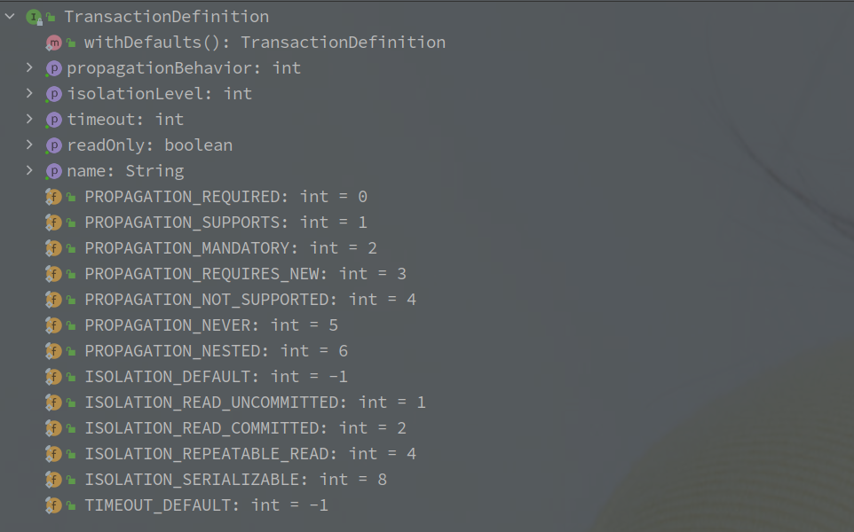
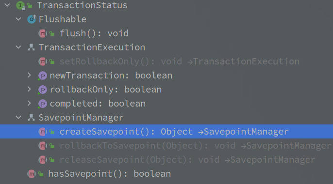

# Transaction

---

[TOC]

---

## 概述

Spring 的事务本质上是对底层数据库的重封装，涉及到事务的开启和关闭以及回滚操作。

不同于数据库中的单事务，程序在方法调用期间可能会涉及到多个事务的情况，因此 Spring 的实现增加了**隔离级别**的概念。

 

 

## 相关组件

### PlatformTransactionManager - 事务管理器

**该接口为标记接口，其直接子接口有 PlatformTransactionManager 和 ReactiveTransactionManager，是事务执行的基本逻辑模板，包含了开启和关闭以及回滚的实现。**

以 PlatformTransactionManager 为例子:

实现的方法如下：

|                          方法名称                          |   方法作用   |
| :--------------------------------------------------------: | :----------: |
| getTransaction(@Nullable TransactionDefinition definition) | 获取当前事务 |
|              commit(TransactionStatus status)              |   提交事务   |
|             rollback(TransactionStatus status)             |   回滚事务   |

每种不同的数据访问实现，都可以定义自己的事务管理器，例如使用 Hibernate 访问数据库，则新建的是 HibernateTransactionManager，也就有了自己的一套创建，提交和回滚逻辑。

 

 

### TransactionDefinition - 事务定义

**该类中定义了基本的事务属性，包含隔离级别，超时时间，传播行为等。**

具体的属性如下：

事务的属性有如下几个：

|   属性名    |    属性含义    |
| :---------: | :------------: |
| Propagation | 事件的传播属性 |
|  Isolation  | 事务的隔离级别 |
|   Timeout   | 事务的超时事件 |
|  ReadOnly   | 是否为只读事务 |
|    name     |    事务名称    |

 

另外的 TransactionDefinition 中还定义了事务的隔离级别和传播级别。

 

> 事务隔离级别就是不同事务并发时后互相之间的可见度，级别越高并发效率越低，但是安全性越好，

| 隔离级别                   | 含义                                                         |
| -------------------------- | ------------------------------------------------------------ |
| ISOLATION_DEFAULT          | 默认的隔离级别，使用的底层数据源默认的隔离级别               |
| ISOLATION_READ_UNCOMMITTED | READ_UNCOMMITTED级别，可能会出现脏读，幻读，不可重复         |
| ISOLATION_READ_COMMITTED   | READ_COMMITTED级别，避免了脏读和不可重复读                   |
| ISOLATION_REPEATABLE_READ  | REPEATABLE_READ级别，在 InnoDB 的存储引擎下，该级别能避免幻读 |
| ISOLATION_SERIALIZABLE     | SERIALIZABLE级别，串行化执行各个事务，也就不存在并发问题     |

 

> 事务的传播级别定义了事务控制的边界，在方法调用间决定事务的逻辑。

| 传播级别                  | 含义                                                         | 影响                                                         |
| ------------------------- | ------------------------------------------------------------ | ------------------------------------------------------------ |
| PROPAGATION_REQUIRED      | 默认级别，方法需要在事务中执行，当前没有则新建，有则加入     | 以单个事务执行，如果加入外层事务，不管内外的异常都会触发回滚 |
| PROPAGATION_SUPPORTS      | 支持事务执行，当前有事务就加入，没有就以非事务模式执行       | 同上                                                         |
| PROPAGATION_MANDATORY     | 强制性以事务模型执行，如果当前没有事务则抛异常               | 同上                                                         |
| PROPAGATION_REQUIRES_NEW  | 新事务执行，该方法必须以单独的事务执行，当前有事务就暂时挂起，新开事务执行 | 以多个事务执行，内外的异常不会互相印象，里层的异常不会触发外层的回滚 |
| PROPAGATION_NOT_SUPPORTED | 不支持事务模式执行，若当前存在事务则先挂起                   | 必须以非事务模式执行                                         |
| PROPAGATION_NEVER         | 不能以事务模式执行，若当前存在事务则抛出异常                 | 必须以非事务模式执行                                         |
| PROPAGATION_NESTED        | 以嵌套事务执行，如果当前存在事务则嵌套执行，如果没有事务则新建 | 如果加入当前事务，则外层事务的异常会触发内层的回滚，而内层的异常对外层无影响 |

> 异常需要抛出到方法外，如果方法内捕获了异常，也就不会触发回滚。

> 两个事务可以是两个不同的事务，可以嵌套执行，也可以加入执行。
>
> 嵌套事务和加入事务的区别：

1. 嵌套事务两个事务有不同的 savepoint，所以外层的事务不会影响到内层的事务，内层事务却不会影响外层事务。
2. 加入事务表示两个事务公用一个提交点，所以内外两个方法只要有一个方法将异常抛出栈外，就就会触发 Rollback。

 

 

### TransactionStatus - 事务状态

同类名，该类保存了事务的基本状态，使用了 ThreadLocal 保存在本地线程中。

状态含义如下：

|      状态      |        含义        |
| :------------: | :----------------: |
|  rollbackOnly  |  事务是否只能回滚  |
| newTransaction |    是否为新事务    |
|   completed    |    事务是否完成    |
|  hasSavepoint  | 是否存在 SavePoint |

 

在默认实现（DefaultTransactionStatus ）中，还另外保存了当前挂起的事务状态。

 

 

## 事务的源码实现

Spring 中事务的实现是在 AbstractPlatformTransactionManager 中。