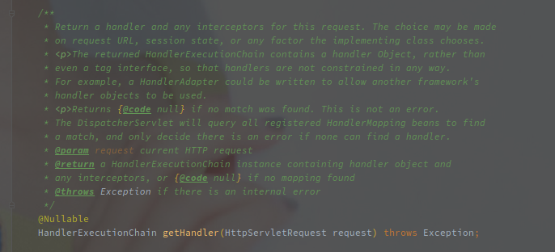
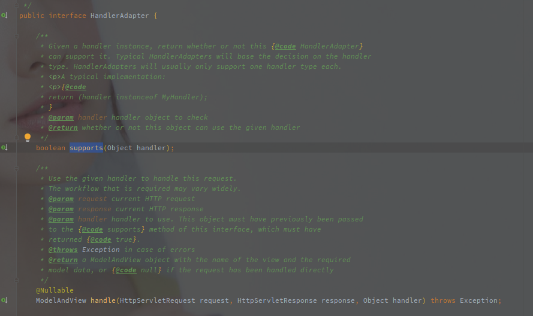

# Spring MVC

---

[TOC]

## Spring MVC 组件

### DispatcherServlet 

Spring MVC 是基于 Servelt 实现的服务端框架。

DispatcherServlet 就是前端的处理，由他负责调度到真实的业务方法。

### HandlerMapping 

HandlerMapping 就是 Handler（处理器）的映射类，定义的接口中只有一个方法，通过 Request 参数获取 HandlerExecutionChain（处理器执行链）。

### HandlerAdapter

处理器执行器。

各类的执行器会组成类似责任链模式的逻辑，遍历判断是否可以处理 Handler（supports 方法），可以的话进一步处理（handler 方法）。

## Spring MVC 的处理流程

