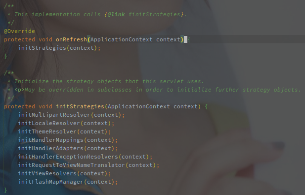
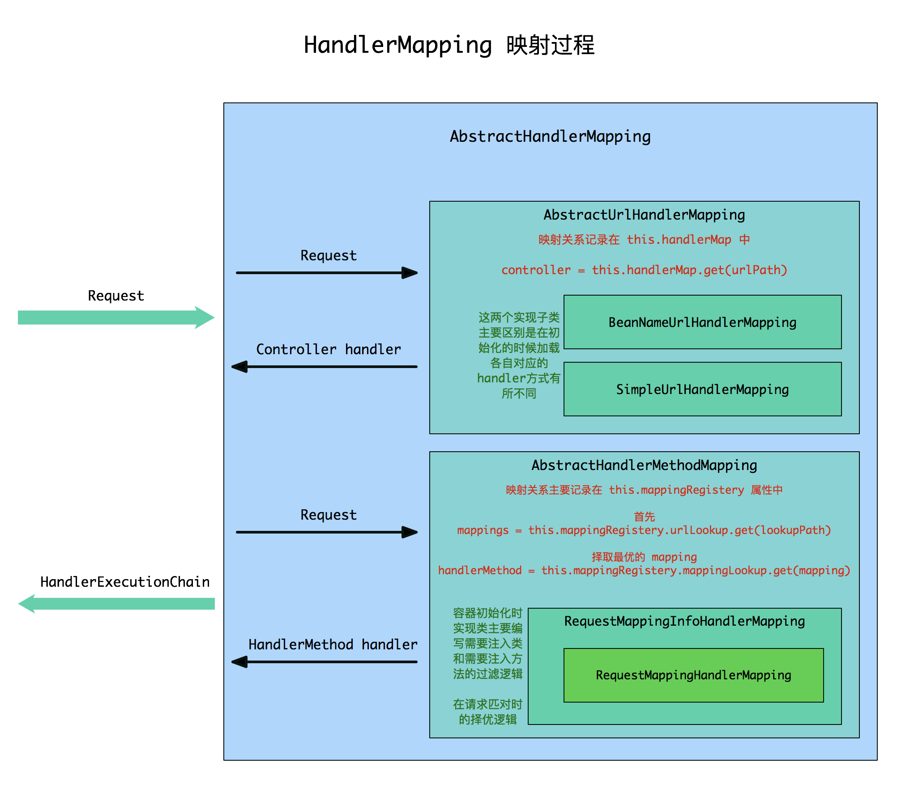

# Spring MVC


---

[TOC]


## Spring MVC 组件

### DispatcherServlet 

Spring MVC 是基于 Servelt 实现的服务端框架，DispatcherServlet 就是前端的处理器，由它负责调度到真实的业务方法。

<br>

另外 DispatcherServlet 也是各个组件的初始化和串联工具，初始化流程如下：



（Spring MVC 包含哪些组件从上面就能看出来了，HHH。

<br> 

### HandlerMapping 

HandlerMapping 就是 Handler（处理器）的映射类，定义的接口中只有一个方法，通过 Request 参数获取 HandlerExecutionChain（处理器执行链）。


**HandlerMapping 根据请求找到具体的 Handler，并且和所有匹配的 HandlerInterceptor 串联，组成 HandlerExecutionChain。**

不同的实现类有不同的匹配方式，常见的实现有 RequestMappingHandlerMapping 以及 SimpleUrlHandlerMapping。



[图片来源文章](https://www.jianshu.com/p/f04816ee2495)

HandlerMapping 在 DispatcherServlet 中初始化，从入参的 ApplicationContext 中获取所有的 HandlerMapping 类型的 Bean 对象。

<br>


AbstractHandlerMapping 是 HandlerMapping 最直接的实现，实现了基本的 HandlerExecutionChain 封装逻辑。

```java
public final HandlerExecutionChain getHandler(HttpServletRequest request) throws Exception {
    // 子类实现具体的获取方法
    Object handler = getHandlerInternal(request);
    // 获取默认的 Handler
    if (handler == null) {
        handler = getDefaultHandler();
    }
    // 没有就退出
    if (handler == null) {
        return null;
    }
    // Bean name or resolved handler?
    // 返回的是 Bean 名称
    if (handler instanceof String) {
        String handlerName = (String) handler;
        handler = obtainApplicationContext().getBean(handlerName);
    }
    // 封装为 HandlerExecutionChain，该过程中会尝试匹配所有的 HandlerInterceptor
    HandlerExecutionChain executionChain = getHandlerExecutionChain(handler, request);
    // 处理跨域等问题
    if (hasCorsConfigurationSource(handler) || CorsUtils.isPreFlightRequest(request)) {
        CorsConfiguration config = (this.corsConfigurationSource != null ? this.corsConfigurationSource.getCorsConfiguration(request) : null);
        CorsConfiguration handlerConfig = getCorsConfiguration(handler, request);
        config = (config != null ? config.combine(handlerConfig) : handlerConfig);
        executionChain = getCorsHandlerExecutionChain(request, executionChain, config);
    }
    return executionChain;
}
```

AbstractUrlHandlerMapping 是根据 UrlPath 搜索 Handler 的实现。


### HandlerAdapter

处理器执行器。

各类的执行器会组成类似责任链模式的逻辑，遍历判断是否可以处理 Handler（supports 方法），可以的话进一步处理（handler 方法）。


## HandlerInterceptor

处理器的拦截器接口，包含了如下三个方法：

| 方法签名        | 调用时机                                  | 备注                                           |
| --------------- | ----------------------------------------- | ---------------------------------------------- |
| preHandle       | 前置处理器，在调用真实的 Handler 之前执行 |                                                |
| postHandle      | 在 Handler 执行完毕，并且渲染之前执行     | 入惨包含 ModelAndView 可以对视图进行修改       |
| afterCompletion | 渲染完成之后执行                          | 异常未被处理时该方法入参携带异常（处理了就没了 |

在 DispactherServlet 的中调用实现逻辑如下：


（后面三个都是对 AfterCompletion 的调用。

常用的基础实现有 MappedInterceptor，提供了对于路径 Include 以及 Exclude 的功能。


## Spring MVC 的处理流程


