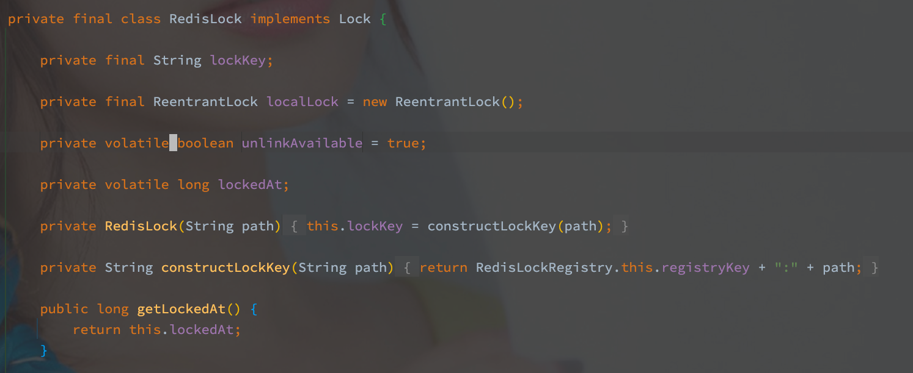
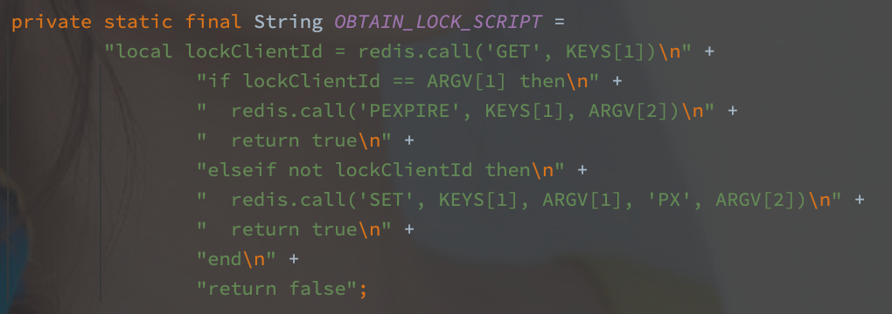

# Spring Integration redis lock

> 基于 spring-integration-redis 实现的 Redis 分布式锁，主要的功能类为 RedisLockRegistry。

---

[TOC]

---


## 概述

Redis 是常见的分布式锁实现的媒介，单线程保证了上锁的并发安全，并且性能也十分的优秀。

> Redis 在主从切换的时候也可能出现锁丢失的情况，比如上锁之后主节点在没扩散命令之前奔溃了，此时的从节点就不带锁。

简单来说，Redis 的上锁就是 `SET NX EX`的原子命令，原子命令的单线程执行保证了锁争用的安全性，但是仍然有一个主要问题，**上锁的时间问题**，时间短了如何补，时间长了如何在宕机情况下撤锁


## Spring 的实现机制

RedisLockRegistry 就是 RedisLock 的工厂实现，通过 obtain 方法获取到特定的 RedisLock 对象。

Spring 的实现中对于不同的 Path 的 RedisLock 会产生不同的对象，并且使用 Map 结构保存。

```java
private final Map<String, RedisLock> locks = new ConcurrentHashMap<>();

@Override
public Lock obtain(Object lockKey) {
  // 接口定义的 Object，而 RedisLock 必须以 String 作为 Key
  Assert.isInstanceOf(String.class, lockKey);
  String path = (String) lockKey;
  // 通过 ConcurrentHashMap 保证并发安全，如果不存在直接新建 
  return this.locks.computeIfAbsent(path, RedisLock::new);
}
```


RedisLock 的实现直接继承于 Lock。



成员变量中的作用如下：

| 变量名          | 变量作用                       |
| --------------- | ------------------------------ |
| lockKey         | 上锁的 Key（SET 命令的参数之一 |
| localLock       | 本地锁（单机锁                 |
| unlinkAvailable | 是否可以执行 unlink            |
| lockedAt        | 最后一次的上锁时间             |

另外就是 RedisLock 的上锁流程：

```java
@Override
public void lock() {
  // 本地的 ReentrantLock 上锁先
  this.localLock.lock();
  while (true) {
    try {
      // 循环户
      while (!obtainLock()) {
        Thread.sleep(100); //NOSONAR
      }
      break;
    }
    catch (InterruptedException e) {
     // 忽略中断异常，此方法不可中断
    }
    catch (Exception e) {
      this.localLock.unlock();
      rethrowAsLockException(e);
    }
  }
}
```

在获取 Redis 的锁之前，所有本地的竞争者会使用本地的 ReentrantLock 先竞争到本地锁，借此也可以减少部分无谓的 Redis 请求，还能接 ReentrantLock 实现本地的阻塞。

之后就是无限循环的获取 Redis 锁，**借由以上两种机制，Spring 的 Redis 锁实现保证了在一个服务实例中最多只有一个线程在循环获取锁，其他线程均阻塞。**

间隔 100ms，避免过分自旋吧。

> 总得来说 Spring 的实现流程并不复杂。

接下来可以看看 Redis 锁的获取实现：

```java
private boolean obtainLock() {
  // 直接调用的 Redis Template 的方法执行 Lua 脚本，并判断结果
  Boolean success =
    RedisLockRegistry.this.redisTemplate.execute(RedisLockRegistry.this.obtainLockScript,
                                                 Collections.singletonList(this.lockKey), RedisLockRegistry.this.clientId,
                                                 String.valueOf(RedisLockRegistry.this.expireAfter));

  boolean result = Boolean.TRUE.equals(success);

  if (result) {
    this.lockedAt = System.currentTimeMillis();
  }
  return result;
}
```

参数一是上锁的的 Key 值，而**参数二则是当前 RedisLockRegistry 实例的 Id，简单由 UUID 实现，解锁时防止非持有者解锁。**

Lua 脚本实现如下：



emm。。。不多解释了。


## 待改进的地方

结合我司的使用场景其实会觉得，单个 Path 对映一个 RedisLock 的实现可能太过浪费，存在大内存消耗的风险。

具体的实现中，在保证安全的前提下，上锁的粒度肯定是越小越好，例如为了保证对一个资源的修改不会并发可能简单的对资源 Id 上锁，因此不同的资源就存在不同的锁，如果不清楚 10w 个资源就会在内存中留下 10w 个 RedisLock 对象。

不过 RedisLockRegistry 中有清除过期数据的方法 - expireUnusedOlderThan：

```java
@Override
public void expireUnusedOlderThan(long age) {
  Iterator<Map.Entry<String, RedisLock>> iterator = this.locks.entrySet().iterator();
  long now = System.currentTimeMillis();
  while (iterator.hasNext()) {
    Map.Entry<String, RedisLock> entry = iterator.next();
    RedisLock lock = entry.getValue();
    // 比较的是最后一次上锁的时间
    if (now - lock.getLockedAt() > age && !lock.isAcquiredInThisProcess()) {
      iterator.remove();
    }
  }
}
```

