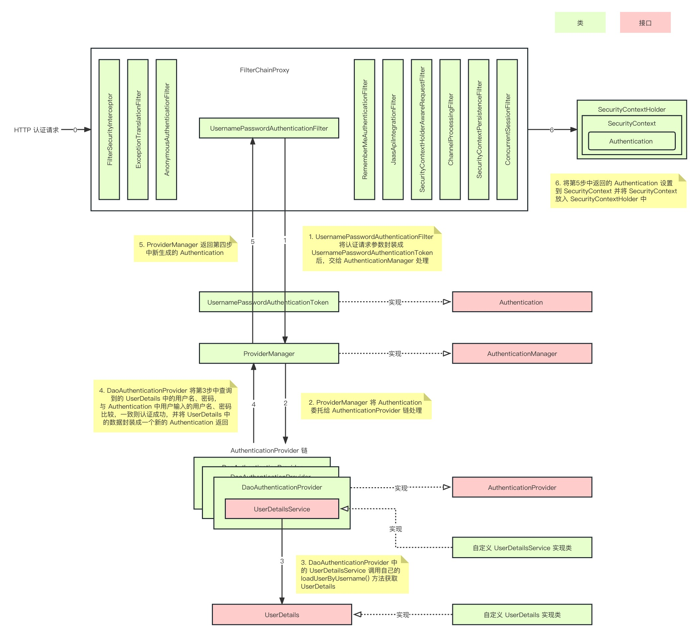
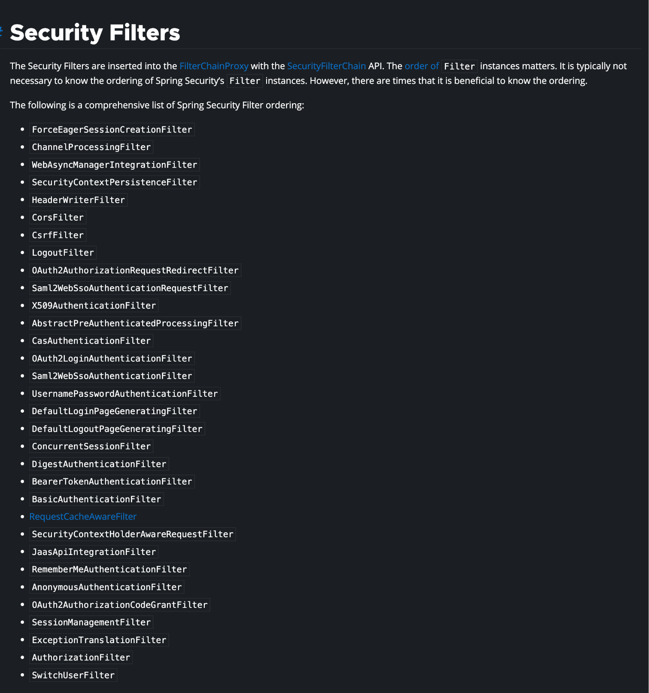

# Spring Security

> 主要还是看基于 Servlet 框架的实现。

Security 整体是基于 Filter 实现的。

Servlet 框架定义的 FilterChain，Spring 通过 DelegatingFilterProxy 实现将容器中的 Bean 对象代理执行。

（通过代理执行还能有效控制过滤器的执行逻辑。

FiterChainProxy 通过 WebSecurity 创建，参数中已经持有了相关的所有 SecurityFilterChain。

SecurityFilterChain 是 Spring Security 定义的 Filter 的集合，并且配有 matchs 方法，表示适配当前请求。

FiterChainProxy 遍历持有的 SecurityFilterChain 直到找到第一个适配的，然后将其和当前请求打包为 VirtualFilterChain。

VirtualFilterChain 执行了具体的遍历执行逻辑。

Sss

