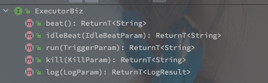

# XXL-Job


## 概述

XXL-JOB 是一款开源的分布式调度平台。

分布式调度平台的作用就是方便管理多节点执行的任务，包括任务下发、执行状态监控以及执行日志的收集等功能。

<br>

XXL-JOB 整个系统可以分为两个部分，**Executor（执行器） 和 Scheduler（调度中心）。**

Scheduler（调度中心）就是统一的定时器，调度程序不负责任何的任务逻辑，只负责发起任务执行请求。

Executor（执行器） 持有真实的业务逻辑，负责接收调度请求并执行 JobHandler。


**整体的逻辑就是执行器向调度中心注册，调度中心持有所有的执行器连接之后，由本地的定时器触发任务调度，选择执行器发送任务请求，然后在执行完毕之后收集结果和日志。**


---


##  XXL-JOB 的源码实现

### 相关概念

| 相关接口    | 对应作用                                                     |
| ----------- | ------------------------------------------------------------ |
| IJobHandler | 每个 IJobHandler 对应的一个需要处理的任务，不同类型的任务有不同的实现类，例如 MethodJobHandler |
| JobThread   | 用于处理调度的定时任务，每个 JobThraed 会绑定一个 IJobHandler，是执行器里的线程模型。 |


### Executor - 执行器 

执行器是在 XXL-JOB 中具体的执行某个定时任务的角色，所以它持有所需要的任务，接受调度器的调度请求，并执行对应任务。

执行器的实现重点就是关注如何响应调度请求并且执行各类任务。

<br>

#### 一、开启本地服务

XXL-JOB 的执行器通过 Netty 框架启动本地  HTTP 服务（EmbedServer），来接收对应的调度请求。

如下的 EmbedServer 源码中可以看到：

```java
// EmbedServer#start
public void start(final String address, final int port, final String appname, final String accessToken) {
  executorBiz = new ExecutorBizImpl();
  thread = new Thread(new Runnable() {
    @Override
    public void run() {
      // param，使用默认的线程组策略
      EventLoopGroup bossGroup = new NioEventLoopGroup();
      EventLoopGroup workerGroup = new NioEventLoopGroup();
      // 定义业务线程池，线程数最大为 200
      ThreadPoolExecutor bizThreadPool = new ThreadPoolExecutor(
        0,
        200,
        60L,
        TimeUnit.SECONDS,
        new LinkedBlockingQueue<Runnable>(2000),
        new ThreadFactory() {
           // 直接创建新线程
        },
        // 直接拒绝的策略，如果任务过多则直接抛出异常
        new RejectedExecutionHandler() {
          @Override
          public void rejectedExecution(Runnable r, ThreadPoolExecutor executor) {
            throw new RuntimeException("xxl-job, EmbedServer bizThreadPool is EXHAUSTED!");
          }
        });
      try {
        // .... 忽略 HTTP 和心跳相关的 Handelr
        				// 添加实际的业务处理器
                .addLast(new EmbedHttpServerHandler(executorBiz, accessToken, bizThreadPool));
            }
          })
          .childOption(ChannelOption.SO_KEEPALIVE, true);

        // 绑定端口并且开启服务
        ChannelFuture future = bootstrap.bind(port).sync();
        // start registry
        // 1. 向调度中心注册自身
        startRegistry(appname, address);
        // 启动
        // wait util stop
        future.channel().closeFuture().sync();
    // ....
    }
  });
  // 守护线程
  thread.setDaemon(true);    // daemon, service jvm, user thread leave >>> daemon leave >>> jvm leave
  // 开启 HTTP 服务也是异步的，并不卡着主线程
  thread.start();
}
```


基于 Netty 实现的服务，所以对于请求的处理可以直接关注到 EmbedHttpServerHandler 类，另外在启动完成之后，会调用 startRegistry 方法发起注册流程（注册就是向调度中心注册自身。


<br>

#### 二、执行器注册


```java
// EmbedSever#startRegistry
public void startRegistry(final String appname, final String address) {
  // start registry
  // 看这意思是开启一个新的线程专门用于注册
  ExecutorRegistryThread.getInstance().start(appname, address);
}
```

<br>

**ExecutorRegistryThread** 就是注册线程，单个线程专门用于向调度中心注册（这种单个线程专注于一件事情的设计在后面会非常常见。

其源码如下：

```java
public void start(final String appname, final String address){
  registryThread = new Thread(new Runnable() {
    @Override
    public void run() {
      // registry
      // 使用的类变量来保存当前服务是否关闭
      while (!toStop) {
          // 构造注册参数
          RegistryParam registryParam = new RegistryParam(RegistryConfig.RegistType.EXECUTOR.name(), appname, address);
          // 获取所有的注册中心列表，遍历注册
          for (AdminBiz adminBiz: XxlJobExecutor.getAdminBizList()) {
              ReturnT<String> registryResult = adminBiz.registry(registryParam);
              // 有一个注册成功就算成功（注册可能是入库的过程，所以单点注册成功就好
              if (registryResult!=null && ReturnT.SUCCESS_CODE == registryResult.getCode()) {
                registryResult = ReturnT.SUCCESS;
                break;
              }
          }
       // ... catch
          if (!toStop) {
            // 停顿心跳间隔
            TimeUnit.SECONDS.sleep(RegistryConfig.BEAT_TIMEOUT);
          }
        }
      // 在 toStop 被修改之后退出循环并且取消注册s
      // ... catch
      // registry remove
        // 向注册中心取消注册
        RegistryParam registryParam = new RegistryParam(RegistryConfig.RegistType.EXECUTOR.name(), appname, address);
        for (AdminBiz adminBiz: XxlJobExecutor.getAdminBizList()) {
          ReturnT<String> registryResult = adminBiz.registryRemove(registryParam);
          if (registryResult!=null && ReturnT.SUCCESS_CODE == registryResult.getCode()) {
            registryResult = ReturnT.SUCCESS;
            break;
          }
          // ... catch
        }
    }
  });
  registryThread.setDaemon(true);
  registryThread.setName("xxl-job, executor ExecutorRegistryThread");
  registryThread.start();
}
```

<br>

**注册线程的任务就是轮询向调度中心注册自身（同时充当 Client 侧的心跳包），并且在本地服务关闭后向调度中心移除自身**（此处就直接忽略了 RPC 的封装逻辑了（其实也是通过 HTTP 请求删除的注册信息。

<br>

另外执行器像调度器注册的时候只传递了**本地应用名称和地址，并不包含当前节点可以执行的任务列表。**

<br>

再向调度中心注册完成之后，就是等待调度中心的调度请求了，HTTP 请求拆装都由 Netty 完成，直接跳转到 EmbedHttpServerHandler 的任务处理阶段。

（EmbedHttpServerHandler 继承了 Netty 的 ChannelHandler 是主要业务逻辑的实现。

<br>

#### 三、调度请求响应

EmbedHttpServerHandler#channelRead0 包含了所有的执行请求处理逻辑：

```java
@Override
protected void channelRead0(final ChannelHandlerContext ctx, FullHttpRequest msg) throws Exception {
	// 获取请求参数
  String requestData = msg.content().toString(CharsetUtil.UTF_8);
  // 获取请求地址
  String uri = msg.uri();
  // 获取请求方式
  HttpMethod httpMethod = msg.method();
  // 为什么要判断是否保活
  boolean keepAlive = HttpUtil.isKeepAlive(msg);
  // 从请求头获取 Token
  // XXL-JOB 根据 Header 中的 AccessToken 来鉴权
  String accessTokenReq = msg.headers().get(XxlJobRemotingUtil.XXL_JOB_ACCESS_TOKEN);
  // 通过线程池异步执行调度任务
  bizThreadPool.execute(new Runnable() {
    @Override
    public void run() {
      // 具体执行
      Object responseObj = process(httpMethod, uri, requestData, accessTokenReq);
      String responseJson = GsonTool.toJson(responseObj);
      // 回写响应
      writeResponse(ctx, keepAlive, responseJson);
    }
  });
}
```

<br>

调度器和执行器之间使用请求头中携带的 ACCESS_TOKEN 来完成鉴权（通过下文可知就是直接对比。

并且通过 bizThreadPool 线程池添加调度任务异步执行（这个时候请求成功就不等于执行成功了，任务执行的情况需要后续的查询或者上报来实现。

<br>

```java
// EmbedServer$EmbedHttpServerHandler#process
private Object process(HttpMethod httpMethod, String uri, String requestData, String accessTokenReq) {
  // valid
  // 只支持 POST 请求 
  if (HttpMethod.POST != httpMethod) {
    return new ReturnT<String>(ReturnT.FAIL_CODE, "invalid request, HttpMethod not support.");
  }
  // xxl 会根据 URI 做任务调度，所以会检查 uri 不允许为空
  if (uri==null || uri.trim().length()==0) {
    return new ReturnT<String>(ReturnT.FAIL_CODE, "invalid request, uri-mapping empty.");
  }
  // 检查 accessToken，这里的就是直接对比
  if (accessToken!=null && accessToken.trim().length()>0 && !accessToken.equals(accessTokenReq)) {
    return new ReturnT<String>(ReturnT.FAIL_CODE, "The access token is wrong.");
  }
  // services mapping
  // 检测消息类型，根据请求的 uri 匹配执行
  // http:{ip:port}/beat 执行的就是心跳检测
  try {
    // 心跳发送
    if ("/beat".equals(uri)) {
      return executorBiz.beat();
      // 检查是否空闲
    } else if ("/idleBeat".equals(uri)) {
      IdleBeatParam idleBeatParam = GsonTool.fromJson(requestData, IdleBeatParam.class);
      return executorBiz.idleBeat(idleBeatParam);
      // 任务调度
    } else if ("/run".equals(uri)) {
      TriggerParam triggerParam = GsonTool.fromJson(requestData, TriggerParam.class);
      return executorBiz.run(triggerParam);
      // 任务终止
    } else if ("/kill".equals(uri)) {
      KillParam killParam = GsonTool.fromJson(requestData, KillParam.class);
      return executorBiz.kill(killParam);
      // 日志拉取
    } else if ("/log".equals(uri)) {
      LogParam logParam = GsonTool.fromJson(requestData, LogParam.class);
      return executorBiz.log(logParam);
    } else {
      return new ReturnT<String>(ReturnT.FAIL_CODE, "invalid request, uri-mapping("+ uri +") not found.");
    }
  } catch (Exception e) {
  	// 异常处理
  }
}
```

<br>

ExecutorBiz 就是执行器的所有业务处理，**不同的 uri 对应的就是不同的 ExcutorBiz 的方法（调度请求的 uri 决定了请求的类型。**





（感觉这个调度逻辑可以收到 ExecutorBiz 里面，可能代码会更加清爽一点。

所以调度中心到执行器的请求类型可以分为以下五种，在 ExecutorBizImpl 中各有实现：

| uri      | 具体功能 | 对应方法                |
| -------- | -------- | ----------------------- |
| beat     | 心跳检查 | beat()                  |
| idleBeat | 空闲检查 | idleBeat(IdleBeatParam) |
| run      | 任务执行 | run(TriggerParam)       |
| Kill     | 任务中断 | kill(KillParam)         |
| Log      | 拉取日志 | log(LogParam)           |


<br>

##### run() - 执行任务调度流程

```java
@Override
public ReturnT<String> run(TriggerParam triggerParam) {
    // load old：jobHandler + jobThread
    // 获取执行线程，根据 jobId
    // XxlJobExeutor 中保存了 JobThreadRepository(JobId -> JobThread 的映射)，表明当前任务是否在执行
    JobThread jobThread = XxlJobExecutor.loadJobThread(triggerParam.getJobId());
    // 获取线程绑定的执行器 JobHandler
    IJobHandler jobHandler = jobThread!=null?jobThread.getHandler():null;
    String removeOldReason = null;
    // valid：jobHandler + jobThread
    // 任务类型
    GlueTypeEnum glueTypeEnum = GlueTypeEnum.match(triggerParam.getGlueType());
    // Bean 形式执行的任务类型
    if (GlueTypeEnum.BEAN == glueTypeEnum) {
        // 获取新的 JobHandler
        IJobHandler newJobHandler = XxlJobExecutor.loadJobHandler(triggerParam.getExecutorHandler());
				// 相同的 JobId 对应的 Handler？
      	if (jobThread!=null && jobHandler != newJobHandler) {
            // change handler, need kill old thread
            removeOldReason = "change jobhandler or glue type, and terminate the old job thread.";
            jobThread = null;
            jobHandler = null;
        }
      	// jobHandler 为空则赋值
        // 此时就是确定了需要执行的 Handler
        if (jobHandler == null) {
            jobHandler = newJobHandler;
            // 未获取到则返回异常，调度失败
            if (jobHandler == null) {
                return new ReturnT<String>(ReturnT.FAIL_CODE, "job handler [" + triggerParam.getExecutorHandler() + "] not found.");
            }
        }
    } else if (GlueTypeEnum.GLUE_GROOVY == glueTypeEnum) {
 				// 暂时忽略
    } else if (glueTypeEnum!=null && glueTypeEnum.isScript()) {
       	// 暂时忽略
    } else {
        return new ReturnT<String>(ReturnT.FAIL_CODE, "glueType[" + triggerParam.getGlueType() + "] is not valid.");
    }
  
    // 执行阻塞策略
    if (jobThread != null) {
        ExecutorBlockStrategyEnum blockStrategy = ExecutorBlockStrategyEnum.match(triggerParam.getExecutorBlockStrategy(), null);
      		// 丢弃最晚的任务
        if (ExecutorBlockStrategyEnum.DISCARD_LATER == blockStrategy) {
            // discard when running
            if (jobThread.isRunningOrHasQueue()) {
                return new ReturnT<String>(ReturnT.FAIL_CODE, "block strategy effect："+ExecutorBlockStrategyEnum.DISCARD_LATER.getTitle());
            }
          // 覆盖以前的任务
        } else if (ExecutorBlockStrategyEnum.COVER_EARLY == blockStrategy) {
            // kill running jobThread
            if (jobThread.isRunningOrHasQueue()) {
                removeOldReason = "block strategy effect：" + ExecutorBlockStrategyEnum.COVER_EARLY.getTitle();
							  // 直接就是将 jobThread 置空，后续会新建任务。
                jobThread = null;
            }
          // 继续添加任务
        } else {
            // just queue trigger
        }
    }
    // replace thread (new or exists invalid)
    // 注册 Job 的处理线程，如果存在旧线程则先中断旧线程
    if (jobThread == null) {
        jobThread = XxlJobExecutor.registJobThread(triggerParam.getJobId(), jobHandler, removeOldReason);
    }
    // push data to queue
    // 将需要执行的任务推到待触发的队列
    return jobThread.pushTriggerQueue(triggerParam);
}
```

<br>

整个任务的触发流程可以分为以下内容：

1. 根据 JobId 获取当前正在执行的任务线程 JobThread（JobId 和 JobThread 是 1:1 的关系
2. 根据 glueType（任务类型）以及执行器名称（ executorHandler）获取需要执行的任务 IJobHandler
3. 如果当前正在处理任务则需要处理阻塞逻辑
   - **丢弃最晚的任务 - 直接返回执行失败，当前正在调度就是最晚的任务**
   - **覆盖之前的任务 - 中断正在执行的线程（Java 线程中断逻辑其实就是修改终端标志位），并新建线程处理当前任务**
   - **排队执行 - 直接添加到任务队列**
4. 注册 JobThread
5. 添加本次执行任务到 JobThread

<br>

从执行流程的初始流程可知，每个 JobId 对应了一个 JobThread，而一个 TriggerParam#executorHandler 对应了一个 IJobHandler。

IJobHandler 就是本地具体执行任务，在本地扫描之后会向 XxlJobExecutor 注册。

JobThread 则是具体的任务执行线程，也是使用 XxlJobExecutor 保存，如果存在表示当前已经有任务在执行。

（JobId 是如何确定的，这个可能需要联系调度中心的逻辑理解？

<br>

并且 JobThread 中保存有任务队列，在阻塞的时候也可以排队执行（任务处理的形式就需要由 JobThread 中的执行逻辑和阻塞队列来决定了。

<br>

<br>

##### 执行线程注册

```java
// XxlJobExecutor#registJobThread
public static JobThread registJobThread(int jobId, IJobHandler handler, String removeOldReason){
  // 开启新线程
  JobThread newJobThread = new JobThread(jobId, handler);
  newJobThread.start();

  // 注册线程，如果存在就有线程会返回
  JobThread oldJobThread = jobThreadRepository.put(jobId, newJobThread);	
  if (oldJobThread != null) {
    // 中断旧线程
    oldJobThread.toStop(removeOldReason);
    oldJobThread.interrupt();
  }

  return newJobThread;
}
```

<br>

可以发现任务的注册的阻塞逻辑，如果需要覆盖之前任务的时候会直接发起中断。

**所以真实的业务逻辑里面也需要考虑到任务阻塞的场景，如果使用覆盖执行则在处理逻辑中需要添加对中断逻辑的响应。**

（个人使用 XXL-JOB 实现过定时消息的发送，在遍历会话发送的 for 循环判断中会添加线程是否中断的判断，并进行后续的处理。

<br>

#### 四、本地任务的执行流程

上述调度请求的响应流程，最终的逻辑就是将响应参数添加到对应 JobThread 的任务队列里面中，因此任务的具体执行还得继续追踪到 JobThread。

以下是 JobThread 的执行流程：

```java
@Override
public void run() {
  // 先有的一个初始化逻辑，每个 IJobHandler 都可以指定初始化和销毁的方法
  // 省略了 try-catch 的逻辑
  handler.init();

  // execute
  // 带状态标识的自旋
  while(!toStop){
    running = false;
    idleTimes++;

    TriggerParam triggerParam = null;
    try {
      // 使用带超时时间的获取，不能使用 take() 因为还要检查 toStop 的标识
      triggerParam = triggerQueue.poll(3L, TimeUnit.SECONDS);
      if (triggerParam!=null) {
        running = true;
        idleTimes = 0;
        // 日志的Id是添加到队列的时候加进入的
        triggerLogIdSet.remove(triggerParam.getLogId());
        // 生成对应的日志名称 like "logPath/yyyy-MM-dd/9999.log"
        String logFileName = XxlJobFileAppender.makeLogFileName(new Date(triggerParam.getLogDateTime()), triggerParam.getLogId());
        // 执行的上下文对象，保存执行所需要的内容
        // BroadcastIndex 和 BroadcastTotal 就是分片广播的两个参数
        XxlJobContext xxlJobContext = new XxlJobContext(
          triggerParam.getJobId(),
          triggerParam.getExecutorParams(),
          logFileName,
          triggerParam.getBroadcastIndex(),	// XxlJobContext 携带了分片信息
          triggerParam.getBroadcastTotal());

        // 通过一个 InheritableThreadLocal 来保存上下文
        XxlJobContext.setXxlJobContext(xxlJobContext);
				// 添加日志
        XxlJobHelper.log("...");
				// 有执行时间要求的，使用 FutureTask 完成带超时时间的执行
        if (triggerParam.getExecutorTimeout() > 0) {
          Thread futureThread = null;
          try {
            // 使用 FutureTask
            FutureTask<Boolean> futureTask = new FutureTask<Boolean>(new Callable<Boolean>() {
              @Override
              public Boolean call() throws Exception {
								// 重新设置上下文
                // ？？？不是可继承的 ThreadLocal 吗，为啥还需要设置一遍
                XxlJobContext.setXxlJobContext(xxlJobContext);
								// 执行方法
                handler.execute();
                // 直接返回 true 也是粗暴
                return true;
              }
            });
            // 直接新建一个线程执行任务，更加粗暴了
            futureThread = new Thread(futureTask);
            futureThread.start();
						// 使用超时时间作为参数执行请求
            Boolean tempResult = futureTask.get(triggerParam.getExecutorTimeout(), TimeUnit.SECONDS);
          } catch (TimeoutException e) {
            // 处理超时日志
            XxlJobHelper.log("<br>----------- xxl-job job execute timeout");
            XxlJobHelper.log(e);
						// 处理超时结果，这里就是添加一下超时间日志
            XxlJobHelper.handleTimeout("job execute timeout ");
          } finally {
            // 还要中断掉线程
            futureThread.interrupt();
          }
        } else {
					// ExecutorTimeout <= 0 表示没有超时时间，所以当前线程一直执行就好
          // 所以单个任务是会出现卡死线程的情况的
          // 所以不带超时时间的执行配合等待的忙碌策略会出现卡得死死的情况·
          handler.execute();
        }

				// 验证处理结果,handleCode 表示最后的执行结果 默认200表示执行成功
        if (XxlJobContext.getXxlJobContext().getHandleCode() <= 0) {
          XxlJobHelper.handleFail("job handle result lost.");
        } else {
          String tempHandleMsg = XxlJobContext.getXxlJobContext().getHandleMsg();
          tempHandleMsg = (tempHandleMsg!=null&&tempHandleMsg.length()>50000)
            ?tempHandleMsg.substring(0, 50000).concat("...")
            :tempHandleMsg;
          XxlJobContext.getXxlJobContext().setHandleMsg(tempHandleMsg);
        }
        XxlJobHelper.log("...");
      } else {
        // 如果空转30次没有获取到任务，也就是 30 * 3s 没有获取到任务
        // 就删除当前的线程
        if (idleTimes > 30) {
          if(triggerQueue.size() == 0) {	// avoid concurrent trigger causes jobId-lost
            XxlJobExecutor.removeJobThread(jobId, "excutor idel times over limit.");
          }
        }
      }
    } catch (Throwable e) {
     // 日志处理
    } finally {
      if(triggerParam != null) {
        // 处理回调方法（异步执行的任务还是需要回调来通知调度中心的
        if (!toStop) {
          TriggerCallbackThread.pushCallBack(new HandleCallbackParam(
            triggerParam.getLogId(),
            triggerParam.getLogDateTime(),
            XxlJobContext.getXxlJobContext().getHandleCode(),
            XxlJobContext.getXxlJobContext().getHandleMsg()));
        } else {
          // is killed
          TriggerCallbackThread.pushCallBack(new HandleCallbackParam(
            triggerParam.getLogId(),
            triggerParam.getLogDateTime(),
            XxlJobContext.HANDLE_CODE_FAIL,
            stopReason + " [job running, killed]" ));
        }
      }
    }
  }

  // callback trigger request in queue
  while(triggerQueue !=null && triggerQueue.size()>0){
    TriggerParam triggerParam = triggerQueue.poll();
    if (triggerParam!=null) {
      // is killed
      TriggerCallbackThread.pushCallBack(new HandleCallbackParam(
        triggerParam.getLogId(),
        triggerParam.getLogDateTime(),
        XxlJobContext.HANDLE_CODE_FAIL,
        stopReason + " [job not executed, in the job queue, killed.]")
                                        );
    }
  }

  // 所有任务执行完毕之后执行销毁方法
  try {
    handler.destroy();
  } catch (Throwable e) {
    logger.error(e.getMessage(), e);
  }
}
```


实际的任务执行会绑定单个工作线程，线程中包含对应的任务队列，并且在启动后轮询并执行其中任务。

因为任务还带有超时时间，**在任务执行时，XXL-JOB 使用 FutureTask + new Thread 的形式完成超时时间的设定。**

使用 XxlJobContext 来传递执行的上下文，包括获取分片信息（分片号和总分片数，和调度参数。

在完成任务之后会进行回调，因为任务是异步执行的。

<br>

#### 五、执行器的本地扫描

在调度过程中，执行器需要根据调度参数获取 IJobHandler（XxlJobExecutor 中保存了本地的所有的 IJobHandler。

```java
// 根据调度参数 executorHandler 获取对应的 IJobHandler 实现
IJobHandler newJobHandler = XxlJobExecutor.loadJobHandler(triggerParam.getExecutorHandler());
```

<br>

SpringBoot 中通过 **@XxlJob** 声明执行器，包含执行器的名称，初始化方法以及销毁方法。

执行器通过 **XxlJobSpringExecutor** 扫描（该类继承了 **SmartInitializingSingleton#afterSingletonsInstantiated**。

（实际上，本地服务和向调度中心的注册都是通过该类触发的。

**XxlJobSpringExecutor** 的初始化方法里获取容器中的所有 Bean 对象，并扫描 Bean 中标注了 **@XxlJob** 的方法，**针对单个执行器方法包装并注册对应类型的 IJobHandler**。


```java
private void initJobHandlerMethodRepository(ApplicationContext applicationContext) {
  if (applicationContext == null) {
    return;
  }
  // 获取所有的 Bean 对象
  String[] beanDefinitionNames = applicationContext.getBeanNamesForType(Object.class, false, true);
  for (String beanDefinitionName : beanDefinitionNames) {
    // 获取该对象
    Object bean = applicationContext.getBean(beanDefinitionName);
    Map<Method, XxlJob> annotatedMethods = null;   // referred to ：org.springframework.context.event.EventListenerMethodProcessor.processBean
    try {
      // 找到被 XxlJob 标注的，返回的对象是 Method - Annotation 的映射
      annotatedMethods = MethodIntrospector.selectMethods(bean.getClass(),
                                                          new MethodIntrospector.MetadataLookup<XxlJob>() {
                                                            @Override
                                                            public XxlJob inspect(Method method) {
                                                              return AnnotatedElementUtils.findMergedAnnotation(method, XxlJob.class);
                                                            }
                                                          });
    } catch (Throwable ex) {}
    if (annotatedMethods==null || annotatedMethods.isEmpty()) {
      continue;
    }
		// 处理单个类中多个方法的
    for (Map.Entry<Method, XxlJob> methodXxlJobEntry : annotatedMethods.entrySet()) {
      // 获取对应方法
      Method executeMethod = methodXxlJobEntry.getKey();
      // 获取对应的注解信息
      XxlJob xxlJob = methodXxlJobEntry.getValue();
      // 实际注册
      registJobHandler(xxlJob, bean, executeMethod);
    }
  }
}
```

（扫描所有类的所有方法是否效率过低？可以使用 Type 范围的注解声明必要参数吧

实际的注册流程就是将 XxlJob#value - Method 的 Entry 保存到 XxlJobExecutor，

```java
protected void registJobHandler(XxlJob xxlJob, Object bean, Method executeMethod){
  if (xxlJob == null) {
    return;
  }
	// 获取执行器的名称，并且检查名称是否为空和重复
  String name = xxlJob.value();
  Class<?> clazz = bean.getClass();
  String methodName = executeMethod.getName();
  if (name.trim().length() == 0) {
    throw new RuntimeException("xxl-job method-jobhandler name invalid, for[" + clazz + "#" + methodName + "] .");
  }
  if (loadJobHandler(name) != null) {
    throw new RuntimeException("xxl-job jobhandler[" + name + "] naming conflicts.");
  }
	// 执行器的具体方法
  executeMethod.setAccessible(true);
	// 获取初始和销毁的方法
  Method initMethod = null;
  Method destroyMethod = null;
  // 获取初始放啊
  if (xxlJob.init().trim().length() > 0) {
    try {
      initMethod = clazz.getDeclaredMethod(xxlJob.init());
      initMethod.setAccessible(true);
    } catch (NoSuchMethodException e) {
      throw new RuntimeException("xxl-job method-jobhandler initMethod invalid, for[" + clazz + "#" + methodName + "] .");
    }
  }
  // 获取销毁方法
  if (xxlJob.destroy().trim().length() > 0) {
    try {
      destroyMethod = clazz.getDeclaredMethod(xxlJob.destroy());
      destroyMethod.setAccessible(true);
    } catch (NoSuchMethodException e) {
      throw new RuntimeException("xxl-job method-jobhandler destroyMethod invalid, for[" + clazz + "#" + methodName + "] .");
    }
  }

  // 包装为 MethodJobHandler 注册
  // 包含了 执行方法，初始化方法和注销方法
  registJobHandler(name, new MethodJobHandler(bean, executeMethod, initMethod, destroyMethod));
}
```


最终以 XxlJob 实现的执行器定义被注册为 MethodJobHandler。

**IJobHandler** 的类型有许多种，每种都有不同的执行方式，MethodJobHandler 的执行就是**反射调用方法**（另外还有 GlueJobHandler。


```java
@Override
public void execute() throws Exception {
  Class<?>[] paramTypes = method.getParameterTypes();
  if (paramTypes.length > 0) {
    method.invoke(target, new Object[paramTypes.length]);       // method-param can not be primitive-types
  } else {
    method.invoke(target);
  }
}
```


**（因此，调度的时候也无法传入任何参数，类似分片信息都需要通过另外的方式获取。**


### 执行器部分

XXL-JOB 的实现中最大的特点就是各类异步化操作，并且使用特定的线程去进行对应的操作。

执行器中使用 HTTP 接收调度请求，完成简单的认证之后根据 JobId 定位当前任务线程，进一步判断是否有正在执行的任务（细点说是 JobThread#running 状态 ），然后根据当前的忙碌策略决定后续逻辑：

- 抛弃最晚的任务 - 此时最晚的任务就是正在调度的任务，所以判断正在执行的情况下就直接退出了
- 覆盖之前的任务 - 对当前 JobThread 进行中断，然后会添加新的线程（因为当前线程会被中断，所以任务中也需要注意中断状态的处理
- 等待执行 - 直接添加到 JobThread 的任务队列中

JonThread 中使用循环轮询任务队列，取出任务并执行，任务如果带有超时属性则会使用 FutureTask 来实现，另外的调度的相关参数都会使用 XxlJobContext（继承自  InherentThreadLocal）保存。


// TODO 目前没有完整看日志处理的部分，两边的交互都是 HTTP，调度中心如何从执行器拉取日志的呢。


### Scheduler - 调度器

在 XXL-JOB 中调度器的职责就是维护一个定时任务队列（或者时间轮，在定时任务到期的时候触发执行。

（JDK 的延时队列和时间轮的区别: 延时队列使用简单的二叉搜索树维护任务的有序性，每次等待根节点的任务到期，而时间轮则是使用轮次+槽（链表）的概念，令起线程轮询对应槽的任务并执行。

<br>

在 XXL-Job 的实现中，调度器中线程的作用区分的更加清楚一点，包括如下几种：

1. 调度线程（Schedule Thread） -   负责发起调度执行请求
2. 定时线程（Ring Thread） -  负责轮询定时任务

<br>

#### scheduleThread - 调度线程

```java
scheduleThread = new Thread(new Runnable() {
  @Override
  public void run() {
    // 间隔5s执行一次（并且首次就会停顿
    TimeUnit.MILLISECONDS.sleep(5000 - System.currentTimeMillis()%1000 );
    // pre-read count: treadpool-size * trigger-qps (each trigger cost 50ms, qps = 1000/50 = 20)
    // 每次读去的数量
    int preReadCount = (XxlJobAdminConfig.getAdminConfig().getTriggerPoolFastMax() + XxlJobAdminConfig.getAdminConfig().getTriggerPoolSlowMax()) * 20;
    while (!scheduleThreadToStop) {
      // Scan Job
      long start = System.currentTimeMillis();
      Connection conn = null;
      Boolean connAutoCommit = null;
      PreparedStatement preparedStatement = null;
      boolean preReadSuc = true;
      try {
        // 获取数据库连接
        conn = XxlJobAdminConfig.getAdminConfig().getDataSource().getConnection();
        connAutoCommit = conn.getAutoCommit();
        conn.setAutoCommit(false);
        // for update 作为分布式锁
        // lock_name （可以属于唯一键约束，单次任务上锁
        preparedStatement = conn.prepareStatement(  "select * from xxl_job_lock where lock_name = 'schedule_lock' for update" );
        // 获取锁资源
        preparedStatement.execute();
        // tx start
        // 1、pre read
        long nowTime = System.currentTimeMillis();
        // 查询当前需要执行的 Job
        List<XxlJobInfo> scheduleList = XxlJobAdminConfig.getAdminConfig().getXxlJobInfoDao().scheduleJobQuery(nowTime + PRE_READ_MS, preReadCount);
        if (scheduleList!=null && scheduleList.size()>0) {
          // 2、push time-ring
          for (XxlJobInfo jobInfo: scheduleList) {
            // time-ring jump
            // 当前时间已经大于执行时间五分钟
            if (nowTime > jobInfo.getTriggerNextTime() + PRE_READ_MS) {
              // 2.1、trigger-expire > 5s：pass && make next-trigger-time
              // 1、misfire match
              // 获取在错过调度之后的处理策略
              // 目前支持的两种策略是什么都不做和直接执行一次
              MisfireStrategyEnum misfireStrategyEnum = MisfireStrategyEnum.match(jobInfo.getMisfireStrategy(), MisfireStrategyEnum.DO_NOTHING);
              // 立马执行一次任务调度
              if (MisfireStrategyEnum.FIRE_ONCE_NOW == misfireStrategyEnum) {
                // FIRE_ONCE_NOW > trigger
                // 触法任务执行，此时带着 JobId 的
                JobTriggerPoolHelper.trigger(jobInfo.getId(), TriggerTypeEnum.MISFIRE, -1, null, null, null);
              }
              // 2、fresh next
              // 刷新下次的调度时间
              refreshNextValidTime(jobInfo, new Date());
              // 已经过期的任务，但是并咩有超过5s
            } else if (nowTime > jobInfo.getTriggerNextTime()) {
              // 2.2、trigger-expire < 5s：direct-trigger && make next-trigger-time
              // 直接调度一次
              // 1、trigger
              JobTriggerPoolHelper.trigger(jobInfo.getId(), TriggerTypeEnum.CRON, -1, null, null, null);
              // 2、fresh next
              // 更新下一次调度时间
              refreshNextValidTime(jobInfo, new Date());
              // next-trigger-time in 5s, pre-read again
              // 下次调度在5s钟之内，直接进调度队列
              if (jobInfo.getTriggerStatus()==1 && nowTime + PRE_READ_MS > jobInfo.getTriggerNextTime()) {
                // 1、make ring second
                int ringSecond = (int)((jobInfo.getTriggerNextTime()/1000)%60);
                // 2、push time ring
                pushTimeRing(ringSecond, jobInfo.getId());
                // 3、fresh next
                refreshNextValidTime(jobInfo, new Date(jobInfo.getTriggerNextTime()));
              }
            } else {
              // 2.3、trigger-pre-read：time-ring trigger && make next-trigger-time
              // 刚刚好调度，直接扔到 ringThraed 里面去
              // 1、make ring second
              int ringSecond = (int)((jobInfo.getTriggerNextTime()/1000)%60);
              // 2、push time ring
              pushTimeRing(ringSecond, jobInfo.getId());
              // 3、fresh next
              refreshNextValidTime(jobInfo, new Date(jobInfo.getTriggerNextTime()));
            }
          }
          // 3、update trigger info
          // 更新调度任务 ->   ??? 为什么不批量更新呢
          for (XxlJobInfo jobInfo: scheduleList) {XxlJobAdminConfig.getAdminConfig().getXxlJobInfoDao().scheduleUpdate(jobInfo);
          }
        } else {
          preReadSuc = false;
        }
        // tx stop
      } catch (Exception e) {
        // IGNORE EXCEPTION
      } finally {
        // IGNORE FINALLY
        // 关闭连接，提交事务，释放 for update 的锁
        long cost = System.currentTimeMillis() - start;
        // Wait seconds, align second
        if (cost < 1000) {  // scan-overtime, not wait
          try {
            // pre-read period: success > scan each second; fail > skip this period;
            // 1s执行一次
            TimeUnit.MILLISECONDS.sleep((preReadSuc ? 1000 : PRE_READ_MS) - System.currentTimeMillis() % 1000);
          } catch (InterruptedException e) {
            if (!scheduleThreadToStop) {
              logger.error(e.getMessage(), e);
            }
          }
        }
      }
    });
```

**scheduleThread 的主要作用是将数据库中的任务读取出来并添加到 ringData 中。**

线程每5秒执行一次调度任务，调度流程如下：

1. 获取数据库中当前时间 +5s 之内的所有任务，并且遍历调度
2. 如果任务过期，并且超过5s，根据过期策略执行后续流程，调度完成后修改下次执行时间
   - DO_NOTHING - 直接跳过此次调度
   - FIRE_ONCE_NOW - 立马触发一次任务
3. 如果任务过期时间在5s之内，直接调度一次，并修改下次时间，下次时间仍然在本次调度范围，直接添加到 ringData
4. 任务没有过期，直接添加到 ringThread


##### 添加到 ringData

XXL-Job 的调度模块非常简单，并不是和 Netty 的时间轮一样使用的环形数组之类的，而是直接用 Map 保存，**Key 就是执行的时间在当前分钟内的秒**。

比如执行的时间是 11:30:12，那么 Key 就是12。

<br>

```java
// XXL-Job 的时间轮实现
// 使用的 ConcurrentHashMap，在 scheduleThread 和 ringThread 之间保证线程安全
private volatile static Map<Integer, List<Integer>> ringData = new ConcurrentHashMap<>();

// 计算任务执行时间，获取秒数并对60取余
int ringSecond = (int) ((jobInfo.getTriggerNextTime() / 1000) % 60);

// 添加到时间轮，ringSecond 就是上述公式计算出来的值
// 方法只是简单的添加到 Map。
private void pushTimeRing(int ringSecond, int jobId) {
    // push async ring
    List<Integer> ringItemData = ringData.get(ringSecond);
    if (ringItemData == null) {
        ringItemData = new ArrayList<Integer>();
        ringData.put(ringSecond, ringItemData);
    }
    ringItemData.add(jobId);
}
```


#### ringThread - 时间轮处理流程

```java
// ring thread
ringThread = new Thread(new Runnable() {
  @Override
  public void run() {
    while (!ringThreadToStop) {
      // 1s 钟执行一次
      TimeUnit.MILLISECONDS.sleep(1000 - System.currentTimeMillis() % 1000);
      try {
        // second data
        List<Integer> ringItemData = new ArrayList<>();
        // 取出当前时间秒数
        // 这个是当前分钟内的秒数！！！
        int nowSecond = Calendar.getInstance().get(Calendar.SECOND);   // 避免处理耗时太长，跨过刻度，向前校验一个刻度；
        for (int i = 0; i < 2; i++) {
          // 获取当前分钟内的前一秒和当前秒
          List<Integer> tmpData = ringData.remove((nowSecond + 60 - i) % 60);
          if (tmpData != null) {
            ringItemData.addAll(tmpData);
          }
        }
        // 遍历触发
        if (ringItemData.size() > 0) {
          for (int jobId : ringItemData) {
            // 触法任务
            JobTriggerPoolHelper.trigger(jobId, TriggerTypeEnum.CRON, -1, null, null, null);
          }
          // clear
          ringItemData.clear();
        }
    }
  }
});
```

ringThread 负责调度到期的任务，从 ringData 中读取调度的任务使用调度线程池异步调度任务。

ringThread 的轮询机制有点粗暴，但是对于调度时间不是很精细的任务来说，完全可以接受，整体实现如下：

> 整个 ConcurrntHashMap 保存的时间范围是1min 也就是 60s，但是时间轮相关的调度线程（ScheduleThread）只会将5s内的任务添加到 Map。
>
> 因此 ringThread 只需要每秒中轮询当前秒数的任务并且调度。


#### TriggerPool - 调度线程池

在上文中 ringThrea 通过 `JobTriggerPoolHelper.trigger` 直接出发的任务，该方法实际实现如下：

```java
// jobId - 任务的 Id
// triggerType - 触法类型（到期触发，手动触发，重拾触发，父子任务触发，通过 API 触发，以及过期触法
// failRetryCount - 重试次数
// executorShardingParam - 分片参数
// executorParam - 执行参数
// addressList - 需要调度的地址
public static void trigger(int jobId, TriggerTypeEnum triggerType, int failRetryCount, String executorShardingParam, 
                           String executorParam, String addressList) {
  helper.addTrigger(jobId, triggerType, failRetryCount, executorShardingParam, executorParam, addressList);
}

```

以一个静态方法包装对变量的调用，这操作好像也挺骚（有带来什么优化吗，以下就是实际的调度流程：

```java
// JobTriggerPoolHelper#addTrigger 方法源码：
public void addTrigger(final int jobId,
                       final TriggerTypeEnum triggerType,
                       final int failRetryCount,
                       final String executorShardingParam,
                       final String executorParam,
                       final String addressList) {
  // choose thread pool
  // 选择用来触发的线程池
  ThreadPoolExecutor triggerPool_ = fastTriggerPool;
  // 如果调度超时的次数超过10次，进入slowTriggerPool
  AtomicInteger jobTimeoutCount = jobTimeoutCountMap.get(jobId);
  if (jobTimeoutCount!=null && jobTimeoutCount.get() > 10) {      // job-timeout 10 times in 1 min
    triggerPool_ = slowTriggerPool;
  }

  // trigger
  // 触发任务
  triggerPool_.execute(new Runnable() {
    @Override
    public void run() {
      long start = System.currentTimeMillis();
      try {
        // do trigger
        // 真实调度，最下层还是封装的HTTP请求
        XxlJobTrigger.trigger(jobId, triggerType, failRetryCount, executorShardingParam, executorParam, addressList);
      } catch (Exception e) {
        logger.error(e.getMessage(), e);
      } finally {
        // check timeout-count-map
        // 是否调度超时
        long minTim_now = System.currentTimeMillis()/60000;
        if (minTim != minTim_now) {
          minTim = minTim_now;
          jobTimeoutCountMap.clear();
        }
        // incr timeout-count-map
        long cost = System.currentTimeMillis()-start;
        if (cost > 500) {       // ob-timeout threshold 500ms
          // 使用一个 Map 等级超时次数
          AtomicInteger timeoutCount = jobTimeoutCountMap.putIfAbsent(jobId, new AtomicInteger(1));
          if (timeoutCount != null) {
            timeoutCount.incrementAndGet();
          }
        }
      }
    }
  });
}

```

使用了两个线程池来保证任务的触发 **fastTriggerPool** 和 **slowTriggerPool**，规则是：

- 默认使用 fastTriggerPool 调度，但如果存在过多的超时（超过10次），则使用 slowTriggerPool 进行调度。

这样分配的目的应该是防止部分响应慢的任务（因为执行器比较慢）拖慢了整体的掉絮效率，这个设计感觉蛮好的（考虑的真细啊。

（接下来就是实际上的任务执行请求的发送。

请求的发送过程并没有什么好解析的，异步的 HTTP 请求流程，但是 XXL-Job 在请求前会进行请求的路由，选择部分执行器来执行任务。

所有的路由方法保存在在 ExecutorRouteStrategyEnum 中，有如下的几种方式：

| 路由类型                     | 路由执行类                  | 路由作用                                                     |
| ---------------------------- | --------------------------- | ------------------------------------------------------------ |
| jobconf_route_first          | ExecutorRouteFirst          | 当前第一个注册的执行器执行任务。                             |
| jobconf_route_last           | ExecutorRouteLast           | 当前最后一个注册的执行器执行任务。                           |
| jobconf_route_round          | ExecutorRouteRound          | 轮询选择每一个执行器执行任务（但并不是很严谨的轮询，保证尽量均匀 |
| jobconf_route_random         | ExecutorRouteRandom         | 随机选择一个执行器执行任务                                   |
| jobconf_route_consistenthash | ExecutorRouteConsistentHash | 一致性 Hash 的实现方式                                       |
| jobconf_route_lfu            | ExecutorRouteLFU            | LFU 的形式每次选择调用频率最小的执行器                       |
| jobconf_route_lru            | ExecutorRouteLRU            | LRU 的形式每次选择                                           |
| jobconf_route_failover       | ExecutorRouteFailover       |                                                              |
| jobconf_route_busyover       | ExecutorRouteBusyover       |                                                              |


```java
public enum ExecutorRouteStrategyEnum {
		// 首
    FIRST(I18nUtil.getString("jobconf_route_first"), new ExecutorRouteFirst()),
    LAST(I18nUtil.getString("jobconf_route_last"), new ExecutorRouteLast()),
    ROUND(I18nUtil.getString("jobconf_route_round"), new ExecutorRouteRound()),
    RANDOM(I18nUtil.getString("jobconf_route_random"), new ExecutorRouteRandom()),
    CONSISTENT_HASH(I18nUtil.getString("jobconf_route_consistenthash"), new ExecutorRouteConsistentHash()),
    LEAST_FREQUENTLY_USED(I18nUtil.getString("jobconf_route_lfu"), new ExecutorRouteLFU()),
    LEAST_RECENTLY_USED(I18nUtil.getString("jobconf_route_lru"), new ExecutorRouteLRU()),
    FAILOVER(I18nUtil.getString("jobconf_route_failover"), new ExecutorRouteFailover()),
    BUSYOVER(I18nUtil.getString("jobconf_route_busyover"), new ExecutorRouteBusyover()),
    SHARDING_BROADCAST(I18nUtil.getString("jobconf_route_shard"), null);

```


#### MisfireStrategy - 错误调度之后的任务处理

```java
public enum MisfireStrategyEnum {

    /**
     * 摆烂了，错过就错过了
     */
    DO_NOTHING(I18nUtil.getString("misfire_strategy_do_nothing")),

    /**
     * 立马执行一次
     */
    FIRE_ONCE_NOW(I18nUtil.getString("misfire_strategy_fire_once_now"));
```


## 总结


### 分布式策略

XXL-Job 的任务状态全部保存在数据库中，任务的执行也会使用相关表进行上锁，所以调度中心是可以集群部署的。

（调度中心的集群不会分配任务调度，**调度的会是同一批任务**，但是可以互为备份在出现单点故障的情况下补充作为调度器。

其中集群的分布式锁使用的是 SQL 中的 `for update` 语句

```mysql
select * from xxl_job_lock where lock_name = 'schedule_lock' for update
```

使用 MySQL 的分布式锁的好处就是不需要考虑上锁时间，如果出现宕机的情况，事务会随着 TCP 连接的断开而回滚，锁也会释放。


### 相关线程角色

| 线程名称               | 作用                                                         |
| ---------------------- | ------------------------------------------------------------ |
| ExecutorRegistryThread | 在执行器端，用于在本地服务启动后向调度器端注册自身，并维持心跳 |
| JobThread              | 具体任务的执行线程，根据 JobId 绑定                          |
| ScheduleThread         | 负责从数据库获取获取任务，并将任务添加到时间轮中（应该可以称之为时间轮吧 |
| RingThread             | 负责调度已经到期的任务                                       |
| fastTriggerPool        | 默认的调度线程池                                             |
| slowTriggerPool        | 在任务超时次数超过阈值之后选择该线程池                       |


### XXL-Job 执行器的超时控制

将任务包装为 FutureTask，并且带超时时间的获取。


### XXL-Job 忙碌策略：

XXL-Job 的忙碌策略包含以下三种：

1. 覆盖前面的任务 - 将之前任务线程丢弃，新建新的任务线程
2. 抛弃最晚的任务 - 忽略当前正在调度的任务
3. 忽略并排队等待执行 - 接扔到任务队列中 


### XXL-Job 的时间轮实现

XXL-Job 中定义的时间轮采用的 Map 实现，Key 表示需要执行的时间（秒）而 Value 表示需要执行的任务。

额外定义了调度（scheduleThread）和触发（ringThread）两个线程。

scheduleThread 每隔5s中上锁并执行查询 SQL，从数据库中捞出后5s之前的所有任务，如果时间正确则加入 Map 结构为主的时间轮。

ringThread 每秒执行一次，根据当前秒数获取任务并调度。

<br>

（其中 Map 可以使用 数组重新实现，反正是固定的60个


## TODO

1. 对于日志的处理（收集，上传
2. 对于管理后台的实现（基本的CRUD之外
3. 对于除了方法之外的任务类型的实现
