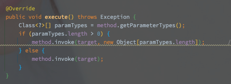
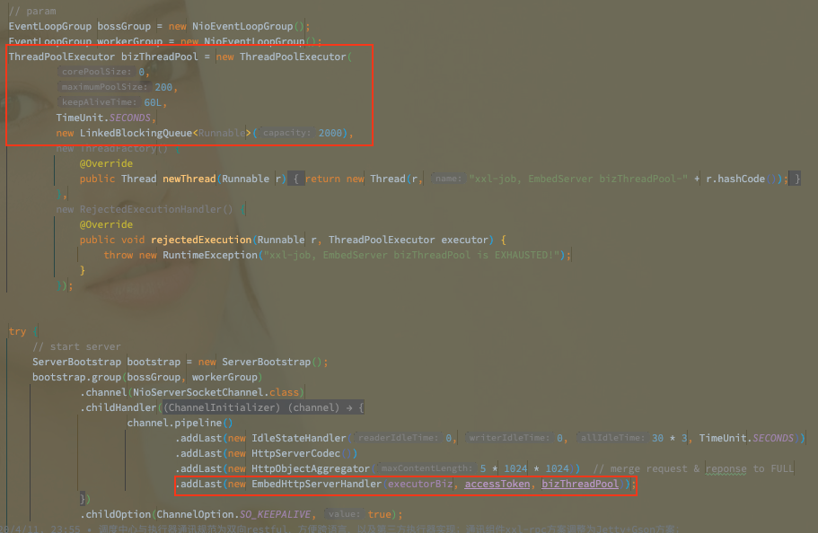

# XXL-Job


## 概述

XXL - JOB 属于分布式调度平台。

整个系统可以分为两个部分，Executor（执行器） 和 Scheduler（调度程序）。

调度程序就是统一的定时器，任务注册之后由调度程序进行统一的定时调度，由 Scheduler 指定 Executor 执行，并拉取执行的日志。

## 相关配置属性

### XXL-Job 的忙碌策略

XXL-Job 


## XXL-Job 相关概念


### IJobHandler

每个 IJobHandler 对应的一个需要处理的任务，不同类型的任务有不同的实现类。

| 实现类名称       | 任务类型                                                     |
| ---------------- | ------------------------------------------------------------ |
| MethodJobHandler | 用于执行 Bean 类型的任务，包含对象（Object）和方法（Method） |
| GlueJobHandler   |                                                              |
| ScriptJobHandler |                                                              |


### JobThread 

用于处理调度的定时任务，每个 JobThraed 会绑定一个 IJobHandler。

客户端执行的线程模型。

执行参数包含如下内容：

1. JobId - JobId 和具体执行的线程绑定（JobThread），JobThread 中还包含正在执行的 IJobHandler
2. 


## XXL-Job Executor - 执行器的执行流程 

> 以 Spring 的客户端，MethodJobHandler 为例。


### 执行器的扫描和注册

SpringBoot 中通过 @XxlJob 指定执行器，包含执行器的名称，初始化方法以及销毁方法。

执行器通过 XxlJobSpringExecutor 扫描（该类继承了 SmartInitializingSingleton#afterSingletonsInstantiated。

该类的初始化方法里获取容器中的所有 Bean 对象，并扫描 Bean 中标注了 @XxlJob 的方法，**针对单个执行器方法包装并注册 IJobHandler**（例如对于方法的执行器就是 MtehodJobHandler，**另外就是要求必须声明为 Bean 对象，才能被扫描到**。

> 扫描所有类的所有方法是否效率过低？

MethodJobHandler 的执行就是**反射调用方法**。



（因此，调度的时候也无法传入任何参数，类似分片信息都需要通过另外的方式获取。


### 启动本地服务

**Xxl-Job 是通过本地 Http 服务端接收命令的执行请求的，**因此在客户端启动时还会开启一个 Http 服务（EmbedServer，默认绑定最大200个线程的线程池执行调度任务。




在 EmbedHttpServerHandler 中响应 Scheduler 的任务调度。

> 额外说一句，Executor 似乎并不需要和很多个 Scheduler 连接，为什么采用 NIO 呢？
>
> NIO 在极少量连接的情况下性能也超过 BIO 吗？


### 本地任务响应

XXL-JOB 使用 Netty 建立的 Http 的服务端，所以请求处理也在 ChannelHandler 里，**XXL-JOB 客户端只响应 POST 请求，并根据请求的 URI 做调度。**

```java
// EmbedServer$EmbedHttpServerHandler#process
private Object process(HttpMethod httpMethod, String uri, String requestData, String accessTokenReq) {

  // valid
  // 只支持 POST 请求 
  if (HttpMethod.POST != httpMethod) {
    return new ReturnT<String>(ReturnT.FAIL_CODE, "invalid request, HttpMethod not support.");
  }
  // xxl 会根据 URI 做任务调度
  if (uri==null || uri.trim().length()==0) {
    return new ReturnT<String>(ReturnT.FAIL_CODE, "invalid request, uri-mapping empty.");
  }
  // 检查 accessToken
  if (accessToken!=null
      && accessToken.trim().length()>0
      && !accessToken.equals(accessTokenReq)) {
    return new ReturnT<String>(ReturnT.FAIL_CODE, "The access token is wrong.");
  }

  // services mapping
  try {
    // 心跳发送
    if ("/beat".equals(uri)) {
      return executorBiz.beat();
    // 检查是否空闲
    } else if ("/idleBeat".equals(uri)) {
      IdleBeatParam idleBeatParam = GsonTool.fromJson(requestData, IdleBeatParam.class);
      return executorBiz.idleBeat(idleBeatParam);
    // 任务调度
    } else if ("/run".equals(uri)) {
      TriggerParam triggerParam = GsonTool.fromJson(requestData, TriggerParam.class);
      return executorBiz.run(triggerParam);
    // 任务终止
    } else if ("/kill".equals(uri)) {
      KillParam killParam = GsonTool.fromJson(requestData, KillParam.class);
      return executorBiz.kill(killParam);
    // 日志拉取
    } else if ("/log".equals(uri)) {
      LogParam logParam = GsonTool.fromJson(requestData, LogParam.class);
      return executorBiz.log(logParam);
    } else {
      return new ReturnT<String>(ReturnT.FAIL_CODE, "invalid request, uri-mapping("+ uri +") not found.");
    }
  } catch (Exception e) {
    logger.error(e.getMessage(), e);
    return new ReturnT<String>(ReturnT.FAIL_CODE, "request error:" + ThrowableUtil.toString(e));
  }
}
```

类似 Netty 的 ChannelHandler，XXL-JOB 也有自己的业务处理接口 ExecutorBiz，客户端的具体实现就是 ExecutorBizImpl。


接口中包含了所有的业务逻辑方法，先来看执行方法 run()：

```java
@Override
public ReturnT<String> run(TriggerParam triggerParam) {
    // load old：jobHandler + jobThread
    // 获取执行线程，根据 jobId
    JobThread jobThread = XxlJobExecutor.loadJobThread(triggerParam.getJobId());
    // 获取线程绑定的执行器 JobHandler
    IJobHandler jobHandler = jobThread!=null?jobThread.getHandler():null;
    String removeOldReason = null;

    // valid：jobHandler + jobThread
    GlueTypeEnum glueTypeEnum = GlueTypeEnum.match(triggerParam.getGlueType());
    if (GlueTypeEnum.BEAN == glueTypeEnum) {

        // new jobhandler
        IJobHandler newJobHandler = XxlJobExecutor.loadJobHandler(triggerParam.getExecutorHandler());

        // valid old jobThread
        if (jobThread!=null && jobHandler != newJobHandler) {
            // change handler, need kill old thread
            removeOldReason = "change jobhandler or glue type, and terminate the old job thread.";

            jobThread = null;
            jobHandler = null;
        }

        // valid handler
        if (jobHandler == null) {
            jobHandler = newJobHandler;
            if (jobHandler == null) {
                return new ReturnT<String>(ReturnT.FAIL_CODE, "job handler [" + triggerParam.getExecutorHandler() + "] not found.");
            }
        }

    } else if (GlueTypeEnum.GLUE_GROOVY == glueTypeEnum) {

        // valid old jobThread
        if (jobThread != null &&
                !(jobThread.getHandler() instanceof GlueJobHandler
                    && ((GlueJobHandler) jobThread.getHandler()).getGlueUpdatetime()==triggerParam.getGlueUpdatetime() )) {
            // change handler or gluesource updated, need kill old thread
            removeOldReason = "change job source or glue type, and terminate the old job thread.";

            jobThread = null;
            jobHandler = null;
        }

        // valid handler
        if (jobHandler == null) {
            try {
                IJobHandler originJobHandler = GlueFactory.getInstance().loadNewInstance(triggerParam.getGlueSource());
                jobHandler = new GlueJobHandler(originJobHandler, triggerParam.getGlueUpdatetime());
            } catch (Exception e) {
                logger.error(e.getMessage(), e);
                return new ReturnT<String>(ReturnT.FAIL_CODE, e.getMessage());
            }
        }
    } else if (glueTypeEnum!=null && glueTypeEnum.isScript()) {

        // valid old jobThread
        if (jobThread != null &&
                !(jobThread.getHandler() instanceof ScriptJobHandler
                        && ((ScriptJobHandler) jobThread.getHandler()).getGlueUpdatetime()==triggerParam.getGlueUpdatetime() )) {
            // change script or gluesource updated, need kill old thread
            removeOldReason = "change job source or glue type, and terminate the old job thread.";

            jobThread = null;
            jobHandler = null;
        }

        // valid handler
        if (jobHandler == null) {
            jobHandler = new ScriptJobHandler(triggerParam.getJobId(), triggerParam.getGlueUpdatetime(), triggerParam.getGlueSource(), GlueTypeEnum.match(triggerParam.getGlueType()));
        }
    } else {
        return new ReturnT<String>(ReturnT.FAIL_CODE, "glueType[" + triggerParam.getGlueType() + "] is not valid.");
    }

    // executor block strategy
    // 执行阻塞策略
    if (jobThread != null) {
        ExecutorBlockStrategyEnum blockStrategy = ExecutorBlockStrategyEnum.match(triggerParam.getExecutorBlockStrategy(), null);
      // 丢弃最晚的任务
        if (ExecutorBlockStrategyEnum.DISCARD_LATER == blockStrategy) {
            // discard when running
            if (jobThread.isRunningOrHasQueue()) {
                return new ReturnT<String>(ReturnT.FAIL_CODE, "block strategy effect："+ExecutorBlockStrategyEnum.DISCARD_LATER.getTitle());
            }
          // 覆盖以前的任务
        } else if (ExecutorBlockStrategyEnum.COVER_EARLY == blockStrategy) {
            // kill running jobThread
            if (jobThread.isRunningOrHasQueue()) {
                removeOldReason = "block strategy effect：" + ExecutorBlockStrategyEnum.COVER_EARLY.getTitle();
							  // 直接就是将 jobThread 置空，后续会新建任务。
                jobThread = null;
            }
          // 继续添加任务
        } else {
            // just queue trigger
        }
    }

    // replace thread (new or exists invalid)
    // 注册 Job 的处理线程，如果存在旧线程则先中断旧线程
    if (jobThread == null) {
        jobThread = XxlJobExecutor.registJobThread(triggerParam.getJobId(), jobHandler, removeOldReason);
    }

    // push data to queue
    // 将需要执行的任务推到待触发的队列
    return jobThread.pushTriggerQueue(triggerParam);
}
```


## XXL-Job Scheduler - 调度器的调度流程

> 具体的流程在 JobScheduleHelper 中，其中包括了 scheduleThread 和 ringThraed。


### scheduleThread - 调度线程

```java
scheduleThread = new Thread(new Runnable() {
            @Override
            public void run() {
								// 停顿五秒
                try {
                    TimeUnit.MILLISECONDS.sleep(5000 - System.currentTimeMillis()%1000 );
                } catch (InterruptedException e) {
                    if (!scheduleThreadToStop) {
                        logger.error(e.getMessage(), e);
                    }
                }
                logger.info(">>>>>>>>> init xxl-job admin scheduler success.");

                // pre-read count: treadpool-size * trigger-qps (each trigger cost 50ms, qps = 1000/50 = 20)
              // 每次读去的数量
                int preReadCount = (XxlJobAdminConfig.getAdminConfig().getTriggerPoolFastMax() + XxlJobAdminConfig.getAdminConfig().getTriggerPoolSlowMax()) * 20;

                while (!scheduleThreadToStop) {

                    // Scan Job
                    long start = System.currentTimeMillis();

                    Connection conn = null;
                    Boolean connAutoCommit = null;
                    PreparedStatement preparedStatement = null;

                    boolean preReadSuc = true;
                    try {

                        conn = XxlJobAdminConfig.getAdminConfig().getDataSource().getConnection();
                        connAutoCommit = conn.getAutoCommit();
                        conn.setAutoCommit(false);
												// for update 作为分布式锁
                        preparedStatement = conn.prepareStatement(  "select * from xxl_job_lock where lock_name = 'schedule_lock' for update" );
                        preparedStatement.execute();

                        // tx start

                        // 1、pre read
                        long nowTime = System.currentTimeMillis();
                      // 查询当前需要执行的 Job
                        List<XxlJobInfo> scheduleList = XxlJobAdminConfig.getAdminConfig().getXxlJobInfoDao().scheduleJobQuery(nowTime + PRE_READ_MS, preReadCount);
                        if (scheduleList!=null && scheduleList.size()>0) {
                            // 2、push time-ring
                            for (XxlJobInfo jobInfo: scheduleList) {

                                // time-ring jump
                              // 已经过期，并且过期时间大于5s
                                if (nowTime > jobInfo.getTriggerNextTime() + PRE_READ_MS) {
                                    // 2.1、trigger-expire > 5s：pass && make next-trigger-time
                                    logger.warn(">>>>>>>>>>> xxl-job, schedule misfire, jobId = " + jobInfo.getId());

                                    // 1、misfire match
                                  // 获取在错过调度之后的处理策略
                                    MisfireStrategyEnum misfireStrategyEnum = MisfireStrategyEnum.match(jobInfo.getMisfireStrategy(), MisfireStrategyEnum.DO_NOTHING);
                                  // 立马执行一次任务调度
                                    if (MisfireStrategyEnum.FIRE_ONCE_NOW == misfireStrategyEnum) {
                                        // FIRE_ONCE_NOW 》 trigger
                                        JobTriggerPoolHelper.trigger(jobInfo.getId(), TriggerTypeEnum.MISFIRE, -1, null, null, null);
                                        logger.debug(">>>>>>>>>>> xxl-job, schedule push trigger : jobId = " + jobInfo.getId() );
                                    }

                                    // 2、fresh next
                                     // 刷新下次的调度时间
                                    refreshNextValidTime(jobInfo, new Date());
																// 已经过期的任务，但是并咩有超过5s
                                } else if (nowTime > jobInfo.getTriggerNextTime()) {
                                    // 2.2、trigger-expire < 5s：direct-trigger && make next-trigger-time
																	  // 直接调度一次
                                    // 1、trigger
                                    JobTriggerPoolHelper.trigger(jobInfo.getId(), TriggerTypeEnum.CRON, -1, null, null, null);
                                    logger.debug(">>>>>>>>>>> xxl-job, schedule push trigger : jobId = " + jobInfo.getId() );

                                    // 2、fresh next
                                    // 更新下一次调度时间
                                    refreshNextValidTime(jobInfo, new Date());

                                    // next-trigger-time in 5s, pre-read again
                                    // 下次调度在5s钟之内，直接进调度队列
                                    if (jobInfo.getTriggerStatus()==1 && nowTime + PRE_READ_MS > jobInfo.getTriggerNextTime()) {

                                        // 1、make ring second
                                        int ringSecond = (int)((jobInfo.getTriggerNextTime()/1000)%60);

                                        // 2、push time ring
                                        pushTimeRing(ringSecond, jobInfo.getId());

                                        // 3、fresh next
                                        refreshNextValidTime(jobInfo, new Date(jobInfo.getTriggerNextTime()));

                                    }

                                } else {
                                    // 2.3、trigger-pre-read：time-ring trigger && make next-trigger-time
 																		// 刚刚好调度，直接扔到 ringThraed 里面去
                                    // 1、make ring second
                                    int ringSecond = (int)((jobInfo.getTriggerNextTime()/1000)%60);

                                    // 2、push time ring
                                    pushTimeRing(ringSecond, jobInfo.getId());

                                    // 3、fresh next
                                    refreshNextValidTime(jobInfo, new Date(jobInfo.getTriggerNextTime()));
                                }

                            }

                            // 3、update trigger info
                            // 更新调度任务 ->   ??? 为什么不批量更新呢
                            for (XxlJobInfo jobInfo: scheduleList) {
                                XxlJobAdminConfig.getAdminConfig().getXxlJobInfoDao().scheduleUpdate(jobInfo);
                            }
                        } else {
                            preReadSuc = false;
                        }
                        // tx stop

                    } catch (Exception e) {
                       // IGNORE EXCEPTION
                    } finally {
                       // IGNORE FINALLY
                			 // 关闭连接，提交事务，释放 for update 的锁
                       long cost = System.currentTimeMillis() - start;
                      // Wait seconds, align second
                      if (cost < 1000) {  // scan-overtime, not wait
                        try {
                          // pre-read period: success > scan each second; fail > skip this period;
                          // 1s执行一次
                          TimeUnit.MILLISECONDS.sleep((preReadSuc ? 1000 : PRE_READ_MS) - System.currentTimeMillis() % 1000);
                        } catch (InterruptedException e) {
                          if (!scheduleThreadToStop) {
                            logger.error(e.getMessage(), e);
                          }
                        }
                      }
                    }
        });
```

**scheduleThread 的主要作用是将数据库中的任务读取出来并添加到 ringThread 中。**

线程每秒执行一次调度任务，调度流程如下：

1. 获取数据库中当前时间 +5s 之前的所有任务，并且遍历调度
2. 如果任务过期，并且超过5s，根据过期的策略执行后续流程，调度完成后修改下次执行时间
   - DO_NOTHING - 直接跳过此次调度
   - FIRE_ONCE_NOW - 立马触发一次任务
3. 如果任务过期时间在5s之内，直接调度一次，并修改下次时间，下次时间仍然在本次调度范围，直接添加到 ringThread
4. 任务没有过期，直接添加到 ringThread


### 添加到 ringData

XXL-Job 的调度模块非常简单，并不是和 Netty 的时间轮一样使用的环形数组之类的，而是直接用 Map 保存，**Key 就是执行的时间在当前分钟内的秒**。

比如执行的时间是 11:30:12，那么 Key 就是12。

<br>

```
// 计算任务执行时间
int ringSecond = (int) ((jobInfo.getTriggerNextTime() / 1000) % 60);

// 添加到时间轮，ringSecond 就是上述公式计算出来的值
// 方啊只是简单的添加到 Map。
private void pushTimeRing(int ringSecond, int jobId) {
    // push async ring
    List<Integer> ringItemData = ringData.get(ringSecond);
    if (ringItemData == null) {
        ringItemData = new ArrayList<Integer>();
        ringData.put(ringSecond, ringItemData);
    }
    ringItemData.add(jobId);
}
```


### ringThread - 时间轮处理流程

```java
// ring thread
ringThread = new Thread(new Runnable() {
  @Override
  public void run() {
    while (!ringThreadToStop) {
      // align second
      // 1s 钟执行一次
      try {
        TimeUnit.MILLISECONDS.sleep(1000 - System.currentTimeMillis() % 1000);
      } catch (InterruptedException e) {
        // IGNORE EXCEPTION
      }
      try {
        // second data
        List<Integer> ringItemData = new ArrayList<>();
        // 取出当前时间秒数
        // 这个是当前分钟内的秒数！！！
        int nowSecond = Calendar.getInstance().get(Calendar.SECOND);   // 避免处理耗时太长，跨过刻度，向前校验一个刻度；
        for (int i = 0; i < 2; i++) {
          // 获取当前分钟内的前一秒和当前秒
          List<Integer> tmpData = ringData.remove((nowSecond + 60 - i) % 60);
          if (tmpData != null) {
            ringItemData.addAll(tmpData);
          }
        }

        // ring trigger
        logger.debug(">>>>>>>>>>> xxl-job, time-ring beat : " + nowSecond + " = " + Arrays.asList(ringItemData));
        // 遍历触发
        if (ringItemData.size() > 0) {
          // do trigger
          for (int jobId : ringItemData) {
            JobTriggerPoolHelper.trigger(jobId, TriggerTypeEnum.CRON, -1, null, null, null);
          }
          // clear
          ringItemData.clear();
        }
      } catch (Exception e) {
        	// IGNORE EXCEPTION
      }
    }
    logger.info(">>>>>>>>>>> xxl-job, JobScheduleHelper#ringThread stop");
  }
});
```

时间轮的处理就是获取当前秒数的任务并且调度。

> XXL 的时间轮实现非常简单。
>
> 整个 Map 保存的时间范围是1min，但是时间轮自己的调度线程（ScheduleThread）只会将5s内的任务添加到 Map。
>
> 因此 ringThread 只需要每秒中轮询当前秒数的任务并且调度。


### 时间轮任务触发流程


```java
// JobTriggerPoolHelper#addTrigger 方法源码：
public void addTrigger(final int jobId,
                       final TriggerTypeEnum triggerType,
                       final int failRetryCount,
                       final String executorShardingParam,
                       final String executorParam,
                       final String addressList) {
  // choose thread pool
  // 选择用来触发的线程池
  ThreadPoolExecutor triggerPool_ = fastTriggerPool;
  // 如果调度超时的次数超过10次，进入slowTriggerPool
  AtomicInteger jobTimeoutCount = jobTimeoutCountMap.get(jobId);
  if (jobTimeoutCount!=null && jobTimeoutCount.get() > 10) {      // job-timeout 10 times in 1 min
    triggerPool_ = slowTriggerPool;
  }

  // trigger
  // 触发任务
  triggerPool_.execute(new Runnable() {
    @Override
    public void run() {

      long start = System.currentTimeMillis();

      try {
        // do trigger
        // 真实调度
        XxlJobTrigger.trigger(jobId, triggerType, failRetryCount, executorShardingParam, executorParam, addressList);
      } catch (Exception e) {
        logger.error(e.getMessage(), e);
      } finally {

        // check timeout-count-map
        // 是否调度超时
        long minTim_now = System.currentTimeMillis()/60000;
        if (minTim != minTim_now) {
          minTim = minTim_now;
          jobTimeoutCountMap.clear();
        }

        // incr timeout-count-map
        long cost = System.currentTimeMillis()-start;
        if (cost > 500) {       // ob-timeout threshold 500ms
          AtomicInteger timeoutCount = jobTimeoutCountMap.putIfAbsent(jobId, new AtomicInteger(1));
          if (timeoutCount != null) {
            timeoutCount.incrementAndGet();
          }
        }

      }
    }
  });
}

```

XXl-Job 中使用两个线程池来实现任务的触发，fastTriggerPool 和 slowTriggerPool，默认使用 fastTriggerPool 触发，但如果存在过多的超时（超过10次），则使用 slowTriggerPool 进行触发。


### MisfireStrategy - 错误调度之后的任务处理

```java
public enum MisfireStrategyEnum {

    /**
     * 摆烂了，错过就错过了
     */
    DO_NOTHING(I18nUtil.getString("misfire_strategy_do_nothing")),

    /**
     * 立马执行一次
     */
    FIRE_ONCE_NOW(I18nUtil.getString("misfire_strategy_fire_once_now"));
```


## 整理


> XXL-Job 执行器的超时控制

将任务包装为 FutureTask，并且带超时时间的获取。


> XXL-Job 忙碌策略：

XXL-Job 的忙碌策略包含以下三种：

1. 覆盖前面的任务 - 将之前任务线程丢弃，新建新的任务线程
2. 抛弃最晚的任务 - 忽略当前正在调度的任务
3. 忽略并排队等待执行 - 接扔到任务队列中 


##

