# Disruptor

> 以下源码基于 3.4.4 版本。

---

[TOC]

---

## 总体介绍

以下是 Disruptor 官网的介绍图：


（Disruptor 最开始听说的是一个高性能无锁队列，但是实际上它不仅仅是队列。

Disruptor 更像是一套本地的 MQ 系统（Message Queue，消息队列），作为中间组件**保存消息，并协调生产者和消费者**。

<br>

**其中 RingBuffer 就是最重要的组件，等同于中间队列，保存待消费事件以及协调生产者和消费者之间的依赖关系。**

Sequence 表示的就是各类进度包括生产者和消费者的序号（或者说偏移量？），而 Sequencer 是上层的包装控制类，封装了各种对于 Sequence 的操作。

**生产者的 Sequence 由 RingBuffer 统一管理**，Disruptor 支持**单生产者和多生产者两种模式**，在多生产者模式下就需要注册 Sequence 的并发安全。

**消费者则由各个消费者各自管理**（因此各个消费者会分别消费事件，不会互相影响，类似 Kafka 的消费者组，所以消息会被每个消费者都处理一次。


> 某些层面上 Disruptor 和 Guava 的 EventBus 有点像（后续可以对比一下两者的实现。
>
> EventBus 是监听器模型，而 Disruptor 则是生产者/消费者模型，相对来说 Disruptor 的实现更加复杂也更加灵活高效。

## Disruptor 

Disruptor 是整个框架的核心，**负责协调生产者和队列、队列和消费者之间的关系，并对外提供基础 API。**

Disruptor 主要持有 RingBuffer 的对象引用，以及所有的消费者信息（生产者的信息并不需要保存，谁持有该对象都可以成为生产者。

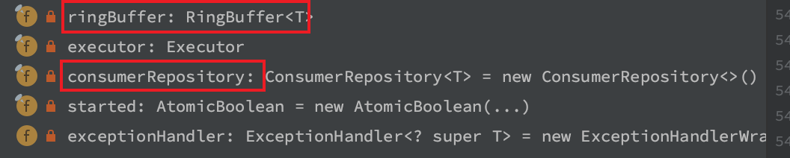


### 创建流程

（先通过创建过程来了解 Disruptor 整个对象的构造。

Disruptor 的创建方法如下：

```java
public Disruptor(
  final EventFactory<T> eventFactory,
  final int ringBufferSize,
  final ThreadFactory threadFactory,
  final ProducerType producerType,
  final WaitStrategy waitStrategy)
{
  this(
    RingBuffer.create(producerType, eventFactory, ringBufferSize, waitStrategy),
    new BasicExecutor(threadFactory));
}

/**
     * Private constructor helper
     */
private Disruptor(final RingBuffer<T> ringBuffer, final Executor executor)
{
  this.ringBuffer = ringBuffer;
  this.executor = executor;
}
```

**Disruptor 的创建流程主要就是创建了对应的 RingBuffer 对象，并且指定消费者所用的线程。**

<br>

整体的参数含义如下：

| 参数名称       | 含义                                                         |
| -------------- | ------------------------------------------------------------ |
| eventFactory   | 事件工厂（RingBuffer 会调用该接口方法，创建 RingBufferSize 个对象重复使用 |
| ringBufferSize | RingBuffer 的大小，必须为2次幂                               |
| threadFactory  | 线程工厂（用于创建消费者所需要的线程，也可以指定线程池       |
| producerType   | 生产者类型（根据单生产者还是多生产者会使用不同的并发策略     |
| waitStrategy   | 等待策略（生产者的等待策略，而消费者的等待策略在指定消费者的时候决定 |

（以上参数基本就是 Disruptor 的所有控制参数了，接下来在看 RingBuffer 的创建流程。

<br>

<br>

### RingBuffer 创建流程

以下是 3.4.4 版本中 RingBuffer 的定义注释以及继承图：

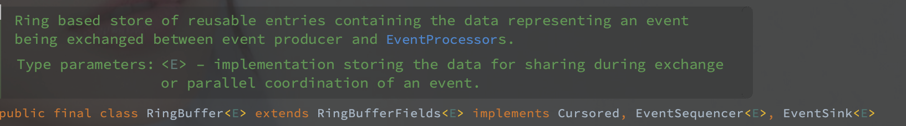

（基于环形数组实现的可重复使用实例对象的存储组件，保存的数据的在事件发生器和事件处理器之间交换。

<br>

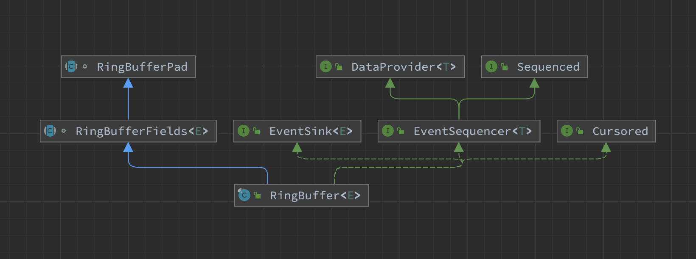


RingBufferFields 、RingBufferPad 是 RingBuffer 做数据填充，避免缓存行的伪共享的实现。

EventSink 和 DataProvider 是 RingBuffer 的两个角色，对于生产者来说是事件的接受者，对于消费者来说又是数据的提供者。

Sequenced 等接口表示这 RingBuffer 对 Sequence 的操作角色。

<br>

RingBuffer 对外提供的创建方法如下：

```java
public static <E> RingBuffer<E> create(
  ProducerType producerType,	// 生产者类型
  EventFactory<E> factory,		// 事件工厂
  int bufferSize,							// Buffer 的大小
  WaitStrategy waitStrategy)	// 生产者的等待策略
{
  // 根据生产类型调用不同的创建方法
  // （其实最终创建的都是 RingBuffer，但是创建的生产者 Sequencer 不同
  switch (producerType)
  {
    case SINGLE:
      // 对应创建的是 SingleProducerSequencer
      return createSingleProducer(factory, bufferSize, waitStrategy);
    case MULTI:
      // 对应创建的是 MultiProducerSequencer
      return createMultiProducer(factory, bufferSize, waitStrategy);
    default:
      throw new IllegalStateException(producerType.toString());
  }
}
```

RingBuffer 的大小是固定的，并且创建的时候就需要传入 EventFactory，Buffer 中所有的事件对象都是通过该工厂创建的。

<br>

另外为了更好地做并发控制， **RingBuffer 也区分了生产者类型**，以 SINGLE 生产者类型为例：

```java
public static <E> RingBuffer<E> createMultiProducer(EventFactory<E> factory, int bufferSize){
  // 默认等待策略为阻塞等待 BlockingWaitStrategy
  return createMultiProducer(factory, bufferSize, new BlockingWaitStrategy());
}

public static <E> RingBuffer<E> createSingleProducer( EventFactory<E> factory,int bufferSize, WaitStrategy waitStrategy){
  // 对应 SingleProducerSequencer
  SingleProducerSequencer sequencer = new SingleProducerSequencer(bufferSize, waitStrategy);
  return new RingBuffer<E>(factory, sequencer);
}
```

SINGLE 对应的 Sequencer 类型为 SingleProducerSequencer，而 MULTI 对应的则是 MultiProducerSequencer。

（两种 Sequencer 的并发控制是完全不一样的，毕竟单一生产者咩有并发

<br>

最后就是 RingBuffer 的构造函数的调用:

```java
RingBufferFields(EventFactory<E> eventFactory,Sequencer sequencer){
  this.sequencer = sequencer;
  this.bufferSize = sequencer.getBufferSize();
  // 参数检查
  // 大小不能小于1
  if (bufferSize < 1){
    throw new IllegalArgumentException("bufferSize must not be less than 1");
  }
  // 大小必须要2次幂
  if (Integer.bitCount(bufferSize) != 1){
    throw new IllegalArgumentException("bufferSize must be a power of 2");
  }
  // indexMask 用于 & 求对应下标
  this.indexMask = bufferSize - 1;
  // 创建对应数组（数组需要加上对齐填充
  this.entries = new Object[sequencer.getBufferSize() + 2 * BUFFER_PAD];
  // 使用工厂方法填充数组
  fill(eventFactory);
}

private void fill(EventFactory<E> eventFactory){
  // 只填充有效个数
  for (int i = 0; i < bufferSize; i++){
    entries[BUFFER_PAD + i] = eventFactory.newInstance();
  }
}
```

需要注意的就是以下几个点：

- RingBuffer 在创建的过程中间就会调用 EventFactory#newInstance 方法创建所需要的所有对象，为了后续的重复使用。

- RingBuffer 的大小必须为2次幂，为了使用 k & (n-1) 求对应数组下标。

- RingBuffer 中为了避免伪共享，做了很多的填充，例如整个的数组会多创建一些填充对象。


总结来说，**RingBuffer 的创建流程主要完成以下几件事情：**

1. **创建环形数组并且创建所有 Event 对象**
2. **根据生产者类型创建对应的 Sequencer**


<br>

## 消费者

Disruptor 在启动前就需要指定消费者，同时也可以指定各消费者之间的依赖关系（也就是层级消费。

消费者的依赖关系也就是层级消费，以 EventHandlerGroup 作为基本单位进行依赖关系的编排，GroupA 可以根据 GroupB 的消费进度进行事件消费。

<br>

### 注册和启动流程

Disruptor 中的消费者需要提前注册，然后随着框架的启动而开始执行。

<br>

Disruptor 提供了多种方式来进行注册：（消费者是向 Disruptor 对象注册的

1. EventHandler（最终会被包装为 EventProcessor 进行注册，当前 Disruptor 所持有的 RingBuffer 会作为 DataProvider 传入。
2. EventProcessorFactory（会使用工厂类直接创建 EventProcessor 进行消费者的注册
3. EventProcessor（继承了 Runnable，在启动时执行
4. WorkHandler

<br>

以下是通过 EventHandler 创建消费者的过程：

```java
// Disruptor#handleEventsWith
public final EventHandlerGroup<T> handleEventsWith(final EventHandler<? super T>... handlers){
  // 直接创建 EventProcessor
  // 初始化一个空的 Sequence 表示当前的消费者无依赖关系（除了生产者依赖
  return createEventProcessors(new Sequence[0], handlers);
}

// Disruptor#createEventProcessors
// 创建消费者实例
// 参数包含 barrierSequence，是他依赖的上层消费者，当前消费者只能消费上层已经全部消费过的数据
// 例如，当前依赖的三个上层消费者的 offset [1,10,10]，那么此时只能消费 1 的数据
EventHandlerGroup<T> createEventProcessors(final Sequence[] barrierSequences,final EventHandler<? super T>[] eventHandlers){
  // 只能在未开始的时候添加消费者
  checkNotStarted();
  // 注册的消费者的 Sequence
  final Sequence[] processorSequences = new Sequence[eventHandlers.length];
  // 创建 Barrier（是当前消费者依赖的 Barrier，由 RingBuffer 创建
  // ！！！消费者对于生产者的依赖是此时创建的，在后续创建 BatchEventProcessor 的时候添加进消费者
  // 此时创建的对象是 ProcessingSequenceBarrier，包含了依赖的 Sequence 和 RingBuffer 的 Sequence
  final SequenceBarrier barrier = ringBuffer.newBarrier(barrierSequences);
	// 遍历创建 BatchEventProcessor
  for (int i = 0, eventHandlersLength = eventHandlers.length; i < eventHandlersLength; i++){
    final EventHandler<? super T> eventHandler = eventHandlers[i];
    // ！！important  创建的最终消费实例是 BatchEventProcessor 添加了依赖的 barrier
    final BatchEventProcessor<T> batchEventProcessor = new BatchEventProcessor<>(ringBuffer, barrier, eventHandler);
    // 异常处理，这个是 Disruptor 确定的
    if (exceptionHandler != null){
      batchEventProcessor.setExceptionHandler(exceptionHandler);
    }
    // 消费者注册中心？
    consumerRepository.add(batchEventProcessor, eventHandler, barrier);
    // 消费者的 Processor
    processorSequences[i] = batchEventProcessor.getSequence();
  }
  // 更新 Disruptor 的 GatingSequences
  // barrierSequences 是指定当前消费者的依赖对象
  updateGatingSequencesForNextInChain(barrierSequences, processorSequences);
  // 返回一个 EventhandlerGroup，调用当前方法的所有 EventHandler 会被包含在一个 Group 里面
  // 通过 EvntHandlerGroup 可以进一步编排后续处理逻辑
  return new EventHandlerGroup<>(this, consumerRepository, processorSequences);
}

// Disruptor#updateGatingSequencesForNextInChain
// 更新 GatingSequences
private void updateGatingSequencesForNextInChain(final Sequence[] barrierSequences, final Sequence[] processorSequences){
  if (processorSequences.length > 0){
    // 将消费者的 Sequences 添加到 ringBuffer
    ringBuffer.addGatingSequences(processorSequences);
    // 因为当前消费者消费的都是 barrierSequences 中消费过的数据，所以当前消费者肯定是最低的 offset
    // 因此依赖的 barrier 就没必要保存了
    for (final Sequence barrierSequence : barrierSequences){
      ringBuffer.removeGatingSequence(barrierSequence);
    }
    // barrierSequences 代表的的是当前消费者集的依赖，需要取消 endOfChain 的标记,因为他的下层还有当前的消费者
    consumerRepository.unMarkEventProcessorsAsEndOfChain(barrierSequences);
  }
}
```


注册消费主要流程如下：

1. 检查 Disruptor 是否已经开启
2. 创建对应的 EventProcessor （具体对象为 BatchEventProcessor，包含了ExceptionHandler 和 RingBuffer。
3. 向 ConsumerRepository 注册当前的消费者信息（消费者并未启动，所以此时需要集中管理
4. 处理 Sequence（非常重要，依赖关系都靠这个协调
   - 向 RingBuffer 添加当前的消费者的 Sequence（**保证生产者的 Sequence 不超过消费者**
   - 处理具有依赖关系的消费者之间的 Sequence（**当前消费者的依赖，当前消费者不能超过依赖**
   - 移除 RingBuffer 中当前消费者依赖的 Sequence（当前消费者的序号肯定小于依赖，所以直接移除
5. 返回 EventHandlerGroup（EventHandlerGroup 对象包含 after 等方法可以作为顺序处理逻辑的编排方法

**消费者最终的实例对象为 BatchEventProcessor（后续的消费逻辑，通过 RingBuffer 获取事件以及调用对应处理方法的逻辑都在该类中实现。**

EventProcessor 继承了 Runnable 所以可以被 Executor 直接执行。

很关键的是，Disruptor 不允许在运行过程中添加消费者，所以在  `Disruptor#start()` 前就需要注册全部的消费者。

<br>

对于 Sequence 到依赖关系，此处涉及到三种角色类型：当前【Current（当前消费者）】、【Dependent（被依赖者）】、【RingBuffer（生产者】。

三者的 Sequence 关系如下：


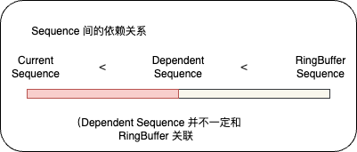


<b>

#### 启动流程

启动流程对应的是 `Disruptor#start` 方法，在启动之前所有的消费者都以 EventProcessor 的形式保存在 ConsumerRepository 中。

方法的源码如下：

```java
public RingBuffer<T> start(){
  // 只能启动一次
  checkOnlyStartedOnce();
  // 遍历所有注册的消费者并启动
  for (final ConsumerInfo consumerInfo : consumerRepository){
    consumerInfo.start(executor);
  }
	// 返回 RingBuffer
  return ringBuffer;
}
```

启动的过程就是创建并启动所有消费者对象的过程，EventProcessor 继承了 Runnable 方法可以直接使用线程池执行该类。

在 Disruotor 创建的时候传入的 ThreadFactory 参数会被包装为 Executor，此时就用到了。

> Disruptor 的启动流程主要就是启动所有的消费者。
>
> （消费者的执行线程由传入的线程池控制，一般情况下创建一个固定大小的线程池数量较为合适。


### 消费流程

#### 主体逻辑

启动过程中 EvnetProcessor 就作为 Runnable 被放入线程池执行，所以消费的主题流程也实现在继承的 run() 方法中。

（以下的实现 BatchEventProcessor 为主，WorkProcessor 还没看呢

<br>

以下是 BatchEventProcessor 的处理逻辑：

```java
@Override
public void run(){
	// 更新当前的状态，启动处理器
  // 状态是从 IDLE 到 RUNNING
  if (running.compareAndSet(IDLE, RUNNING)){
    // 清除警告
    sequenceBarrier.clearAlert();
    // 如果继承了 LifecycleAware，则执行 onStart 方法
    // onStart 方法是每次从 IDLE 转变到 RUNNING 状态的时候都会执行的，而不是创建的时候一次
    notifyStart();
    try{
      // 在判断一次是否启动成功
      if (running.get() == RUNNING){
        // 实际的处理逻辑
        processEvents();
      }
    }finally{
      // 如果继承了 LifecycleAware，则执行 onShutdown 方法
      notifyShutdown();
      // 正常退出,标记处理器为空闲状态
      running.set(IDLE);
    }
  }else{
		// 可能是已经启动（那本次就是重复启动
    if (running.get() == RUNNING){
      throw new IllegalStateException("Thread is already running");
    }else{
			// 未启动成功并且当前状态部位 RUNNING
      // 可能是当前处于 HALTED 状态
      // 该方法就是执行一遍 onStart 和 onShutdown
      earlyExit();
    }
  }
}
```


在消费者启动和关闭的时候都有对应的回调方法（notifyStart / notifyStart），对应的就是  **LifecycleAware** 接口：

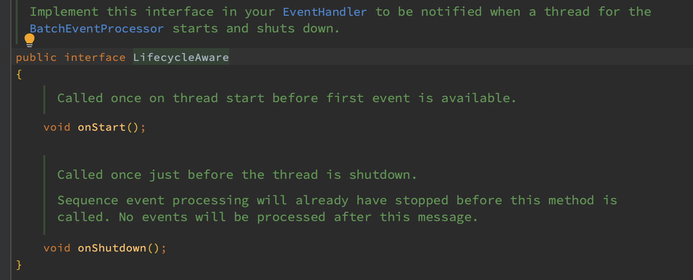

> EventHandler 可以通过继承该接口实现前后的回调，在整个生命周期各执行一次。

消费的正常逻辑就是以下几步：

1. CAS 修改状态（IDLE -> RUNNING
2. 前置回调（LifecycleAware#onStart
3. 事件处理（processEvents
4. 后置回调（LifecycleAware#onShutdown
5. 状态修改 （任何状态 -> IDLE


#### 事件轮询和阻塞逻辑

以下是 processEvents 的处理逻辑：

```java
private void processEvents(){
  T event = null;
  long nextSequence = sequence.get() + 1L;
  // 死循环了,没有break别想走
  while (true){
    try{
      // 等待下一个可用序号（waitFor 里面就包含了消费者和生产者之间通过序号协调的逻辑
      // 返回最大可用序号
      final long availableSequence = sequenceBarrier.waitFor(nextSequence);
      // 在事件的批量处理之前,会有一个前置方法
      if (batchStartAware != null){
        // 当前批次的大小
        batchStartAware.onBatchStart(availableSequence - nextSequence + 1);
      }
      // 循环遍历所有可用序号
      while (nextSequence <= availableSequence){
        // 获取对应序号下的事件
        event = dataProvider.get(nextSequence);
        // 调用实际方法处理获取的事件
        eventHandler.onEvent(event, nextSequence, nextSequence == availableSequence);
        nextSequence++;
      }
      sequence.set(availableSequence);
    }catch (final TimeoutException e){
      // 处理超时异常
      notifyTimeout(sequence.get());
    }catch (final AlertException ex){
      // AlertException 应该是状态变更的时候爆的
      // 如果不是运行中状态就退出
      if (running.get() != RUNNING){
        break;
      }
    }catch (final Throwable ex){
      // 处理异常
      handleEventException(ex, nextSequence, event);
      // 记录处理的序号（nextSequence 就是处理失败的序号
      sequence.set(nextSequence);
      // 接下来的序号（直接忽略了出现异常的这次事件处理
      nextSequence++;
    }
  }
}
```


事件的轮训通过一个死循环包括，**不是 AlertEcveption 就无法退出**。

> 一个消费者是一个无限执行的任务，所以最好不要用线程池去执行消费的 Runnable，或者说线程数最好是 1:1

BatchEventProcessor 并不会直接访问 RingBuffer 获取可用，而是通过 SequenceBarrier 实现（此前是通过 RingBuffer#newBarrier 创建的。

在获取到可用序号后，会先执行批量处理的前置回调 BatchStartAware#onBatchStart。

> BatchStartAware 也是通过 EventHandler 实现的。
>
> （Disruptor 这个实现我喜欢，**所有的 Aware 都需要富集到 EventHandler 中统一注册。**

完成回调之后，遍历可用序号逐个从 RingBuffer 中获取事件（DataProvider 就是 RingBuffer。

然后调用 EventHandler#onEvent 完成实际的事件处理。

<br>

对于执行过程中的 TimeoutException（等待的超时，处理过程中的超时），都会触发 TimeoutHandler#onTimeout。

对于 AlterException 则会判断状态，在非运行中状态时跳出循环。

对于其他未知异常则会调用 ExceptionHandler#handleEventException 方法处理。


#### 阻塞逻辑

> 在消费速度大于生产速度的时候，就需要消费者阻塞等待生产。

消费者并不会直接访问 RingBuffer，而是通过 SequenceBarrier，以下是对应的 waitFor 方法：

```java
@Override
public long waitFor(final long sequence) 
  		throws AlertException, InterruptedException, TimeoutException{
  // 检查报警（如果 Disruptor 状态改变会传递到 SequenceBarrier
  checkAlert();
  // 等待可用序号（具体的等待逻辑被延迟到了 waitStrategy 实现
  long availableSequence = waitStrategy .waitFor(sequence, cursorSequence, dependentSequence, this);
  if (availableSequence < sequence){
    return availableSequence;
  }
  return sequencer.getHighestPublishedSequence(sequence, availableSequence);
}
```


而 SequenceBarrier 也是通过 WaitStrategy 抽象出等待逻辑，在 Disruptor 官方实现中提供了以下几种：

| 实现类                          | 作用                                                    |
| ------------------------------- | ------------------------------------------------------- |
| BlockingWaitStrategy            | 使用 ReentrantLock$Condition#await 实现的阻塞等待       |
| BusySpinWaitStrategy            | 调用 Thread#onSpinWait 实现等待（可能没有，那就是空轮训 |
| LiteBlockingWaitStrategy        |                                                         |
| LiteTimeoutBlockingWaitStrategy |                                                         |
| PhasedBackoffWaitStrategy       |                                                         |
| SleepingWaitStrategy            |                                                         |
| TimeoutBlockingWaitStrategy     |                                                         |
| YieldingWaitStrategy            |                                                         |

（懒得看了，有空再写作用。


#### 状态流转

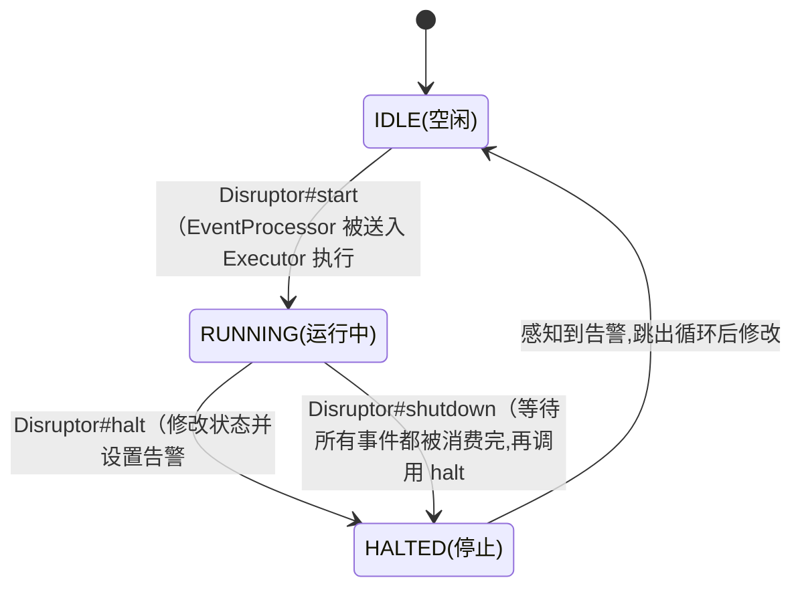


Disruptor#halt 方法除了修改当前 **EventProcessor** 的状态，还会在依赖的 **SequenceBarrier** 中记录一个告警状态，并且唤醒所有等待中消费者。

重新执行的过程中感知到告警状态就会抛出 AlertException，从而跳出整个 BatchEventProcessor#processEvents 的处理循环，而后在外层 BatchEventProcessor#run 中修改为 IDLE 状态。


### 总结

整体流程如下：

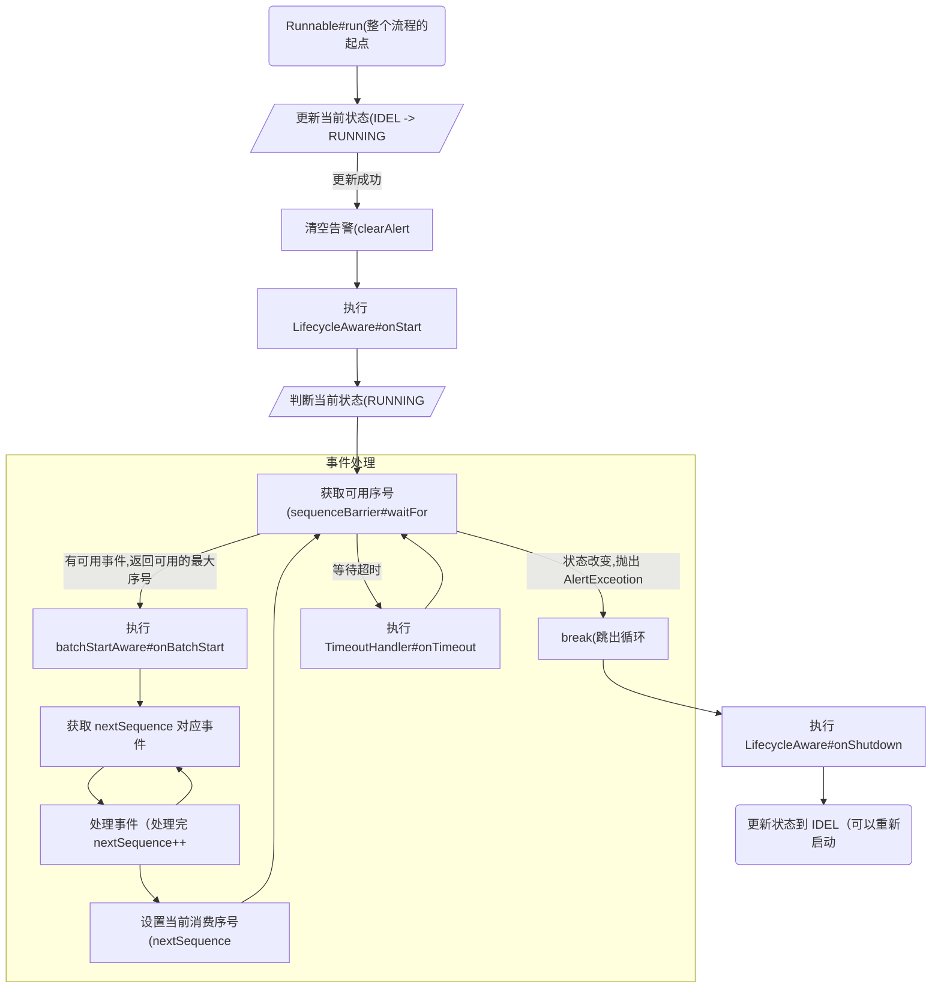

（在 Disruptor#shutdown 之后，是可以重新直接 Disruptor#start 的，生产者/消费者的序号没有清空。


### 消费者的线程模型


Disruptor 的构造函数中已经表明，作者不建议使用 Evecutor 来执行消费者的任务。

因为从上文可知，消费者的线程需要循环去获取事件，Runnable 主流程在 Disruptor 关闭前就不会退出，也就是说他会独占一个线程。

另外在生产者端，发布事件的时候，生产速度是受限于所有消费者组中的最慢消费速度的。

因此在使用 Disruptor 的实现，都需要尽可能使用单个线程处理消费者逻辑。


例如在一个【用户注册】的场景，需要在注册后进行【发送欢迎短信】、【赠送注册积分】等逻辑，就可以由单个线程去接收用户注册事件，然后外接线程池去完成对应业务。


## 生产者

生产者不在 Disruptor 的控制范围之内，任何持有 Disruptor 对象的都可以作为生产者，调用 Disruptor#pushlishEvent 发布事件。

生产的形式可以分为以下几种（Disruptor 的方法声明：

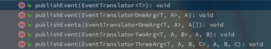

最终都是调用 RingBuffer 的对应方法，以第一个 EventTranslator 为例，其接口声明如下：

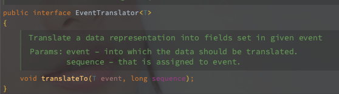

该类主要的功能就是往参数传递的 event 中塞入新数据并完成发布，具体的使用场景（RingBuffer 的具体发布流程）如下：

```java
public void publishEvent(EventTranslator<E> translator){
  // 获取下次发布的事件序号
  final long sequence = sequencer.next();
  // 转换并发布事件
  translateAndPublish(translator, sequence);
}

private void translateAndPublish(EventTranslator<E> translator, long sequence){
  try{
    // get 方法就是获取 RingBuffer 中对应位置的事件对象
    // 使用传入的 lambda，修改了对应对象的属性（其实怎么改都随你,不改都行
    translator.translateTo(get(sequence), sequence);
  }finally{
    // 对序号进行一个发布
    sequencer.publish(sequence);
  }
}
```

生产者本身不保存任何 Sequence，而是由 RingBuffer 统一持有，根据生产者数目的不同又分为 SingleProducerSequencer 和 MultiProducerSequencer（包括获取可用序号和发布对应序号。

事件的发布过程不需要创建新的事件对象，而是先获取环形队列中的对象然后赋值。


发布的流程简述如下：

1. 先获取目前哪个序号的事件可以发布（环形数组中哪个位置的事件对象可用，已经被消费或未发布
2. 获取该序号的对象，并进行修改
3. 发布该序号下的事件

（区分单生产者和多生产者，第1、3流程的分别实现逻辑。


对于单生产者模式，不需要对生产的序号作并发控制，但是需要与消费者的序号协调：

**生产者的序号不能超过消费者的序号。**

> 因为是环形队列，所以生产的速度不能赶上消费者的速度（覆盖了未消费的事件。
>
> 在序号中的表示就是：生产者的序号不能超过消费者的最低序号。


以下是单生产者的下个可用序号获取流程：（感觉整个脑回路有点怪

```java
public long next(int n){
  // 获取的序号必须大于1（n表示希望获取几个序号
  if (n < 1){
    throw new IllegalArgumentException("n must be > 0");
  }
  // 下一个值（初始为-1
  long nextValue = this.nextValue;
  // 加上希望获取的个数（此时相加可能会超过环形数组大小
  long nextSequence = nextValue + n;
  // 减去环形数组大小（如果下标越界，此时就是正常的，否则为0
  long wrapPoint = nextSequence - bufferSize;
	// 缓存的最小依赖值（初始为-1
  long cachedGatingSequence = this.cachedValue;
	// 这里应该是代表生产的速度已经超过消费的速度了
  if (wrapPoint > cachedGatingSequence || cachedGatingSequence > nextValue){
    // cursor 又是啥东西？？？
    cursor.setVolatile(nextValue);  // StoreLoad fence
    // 这里应该是循环等消费进度,等待消费进度赶上生产速度
    long minSequence;
    while (wrapPoint > (minSequence = Util.getMinimumSequence(gatingSequences, nextValue))){
      LockSupport.parkNanos(1L); // TODO: Use waitStrategy to spin?
    }
    this.cachedValue = minSequence;
  }
  this.nextValue = nextSequence;
  return nextSequence;
}
```


gatingSequences 就是各个消费者的序号，在注册消费者的时候添加（通过 AtomicReferenceFieldUpdater 添加的。

（我一直以为是没有更新的空数组，日。


如果希望生产的速度不要超过消费的速度，那么生产者的下一个序号(nextValue)一定要小于


## 


## 事件生产流程

RingBuffer 回预先创建所有的事件对象，所以后续的发布流程就是获取指定对象，填充属性并且发布。

过程中主要控制生产者的生产速度，不能把没消费完的事件覆盖了。


### 获取可写入位置

RingBuffer 是一个环形数组，所以就需要读写两个指针表示进度（emm，因为先学的 InnoDb 的 Redo Log 所以感觉 write point 和 checkpoint 两个还挺好理解的。

**因为是个一对多或者多对多的场景，并且消费者各自保存自己的消费进度，所以写入的场景都需要考虑多个消费者的最低消费速度，而写入的速度保存在 RingBuffer**

RingBuffer 中使用 Sequencer#next 确定下一个写入的位置，Sequencer  都继承了 AbstractSequencer，因此也保存了以下几个变量：

```java
protected final int bufferSize;		// 	RingBuffer 的大小
protected final WaitStrategy waitStrategy;    // 等待策略
protected final Sequence cursor = new Sequence(Sequencer.INITIAL_CURSOR_VALUE);   // 当前写入的位置
protected volatile Sequence[] gatingSequences = new Sequence[0];		// gatingSequences 就是所有消费者的 Sequence
// 在注册流程中会将消费者的 Sequence 全部添加进来
```

<br>

根据消费者的个数可以分为 SingleProducerSequencer 以及 MultiProducerSequencer。

（SingleProduceSequencer 中不存在争用，所以实现相对简单。

<br>

**SingleProducerSequencer** 

```java
@Override
public long next(int n)
{
  if (n < 1){
    throw new IllegalArgumentException("n must be > 0");
  }

  // 下次的可用槽位
  long nextValue = this.nextValue;
	// 一共需要n个槽位
  long nextSequence = nextValue + n;
  // 可能会超过，一般情况下都是负数，超过表示需要重头开始填充
  // 比如当前 bufferSize = 16，但是 nextSequence = 19，wrapPoint = 3 表示已经过了一轮了
  long wrapPoint = nextSequence - bufferSize;
  // cacheValue 是所有消费者的最小的下标（最慢的速度
  long cachedGatingSequence = this.cachedValue;

  // 主要是 cacheValue = 5，但是 wrapPoint = 6 的时候，此时说明生产的速度已经要大于消费的速度了
  // 所以需要进循环等待
  if (wrapPoint > cachedGatingSequence || cachedGatingSequence > nextValue) {
    cursor.setVolatile(nextValue);  // StoreLoad fence
    long minSequence;
    // 等待直到消费赶上
    while (wrapPoint > (minSequence = Util.getMinimumSequence(gatingSequences, nextValue))){
      LockSupport.parkNanos(1L); // TODO: Use waitStrategy to spin?
    }
	  // 重新设置最小消费槽位
    this.cachedValue = minSequence;
  }
	// 下次的消费槽位
  this.nextValue = nextSequence;
  return nextSequence;
}
```

单线程并没有并发和伪共享问题，所以直接使用的一个 long 类型的 nextValue 保存写指针（读指针保存在各个消费者那，会在 gatingSequences 中保存。

**MultiProducerSequencer**

MultiProducerSequencer 表示多个生产者，所以会存在写入位置并发写入的问题，该类中使用 CAS 实现并发更新的安全性。

```java
// MultiProducerSequencer#next
public long next(int n){
  if (n < 1){
    throw new IllegalArgumentException("n must be > 0");
  }
  long current;
  long next;
  do{
    // cursor 是 Sequence 实现
    // 不再和 Single 一样单纯的 long 了
    current = cursor.get();
    // 后续的判断都差不多
    next = current + n;
    long wrapPoint = next - bufferSize;
    long cachedGatingSequence = gatingSequenceCache.get();
    if (wrapPoint > cachedGatingSequence || cachedGatingSequence > current){
      long gatingSequence = Util.getMinimumSequence(gatingSequences, current);
      if (wrapPoint > gatingSequence){
        LockSupport.parkNanos(1); // TODO, should we spin based on the wait strategy?
        continue;
      }
      gatingSequenceCache.set(gatingSequence);
      // 更新的时候使用的 CSA，外层套了个自旋
    }else if (cursor.compareAndSet(current, next))]{
      break;
    }
  }
  while (true);
  return next;
}
```


如果是一个无限长的序列，可写入的位置必须小于多生产者的最小为止，因为是环形数组所以需要额外判断超出的情况。

ProducerSequencer 中保存了所有消费者的 Sequence，每次都会获取最小的消费下标，写入不能超过这个下标，在 Sequencer 中另外有缓存避免每次遍历消费者（感觉多此一举，消费者能有多少。

### 获取指定下标对象

```java
// RingBuffer#get
public E get(long sequence){
  return elementAt(sequence);
}

// RingBufferFields#elementAt
protected final E elementAt(long sequence){
  return (E) UNSAFE.getObject(entries, REF_ARRAY_BASE + ((sequence & indexMask) << REF_ELEMENT_SHIFT));
}
```

通过 Unsafe 获取数组对象对象指定下标的值。

因为 indexMask 是2此幂，所以 sequence & indexMask 相当于是 sequence % indexMask 了（真就大量优化。


### 发布事件

发布事件修改的是生产者的写入指针，对于 SingleProducerSequencer 来说就是简单的修改 cursor。

```java
// SingleProducerSequencer#pushlish
public void publish(long sequence){
  // 修改 cursor
  cursor.set(sequence);
  // 唤醒所有阻塞的消费者
  waitStrategy.signalAllWhenBlocking();
}
```

主要是多线程生产的时候，因为整个发布顺序是先获取可写位置，赋值，发布，所以后获取的位置（比较靠后）可能先发布，直接替换就不成立了。

MultiProducerSequencer 使用的 availableBuffer 表示每个槽位是否可读。

```java
// 长度和 RingBuffer 相同，表示每个位置的版本号，每次修改某个位置，该位置的 flag + 1
private final int[] availableBuffer;
// availableBuffer 保存的都是每个 sequence >>> indexShift
private final int indexShift;
```

MultiProducerSequencer 的发布就是修改每个位置上的 flag:

```java
// MultiProducerSequencer#publish
public void publish(final long sequence){
  setAvailable(sequence);
  waitStrategy.signalAllWhenBlocking();
}
// MultiProducerSequencer#setAvailable
private void setAvailable(final long sequence){
  setAvailableBufferValue(calculateIndex(sequence), calculateAvailabilityFlag(sequence));
}

// MultiProducerSequencer#setAvailableBufferValue
private void setAvailableBufferValue(int index, int flag){
  long bufferAddress = (index * SCALE) + BASE;
  UNSAFE.putOrderedInt(availableBuffer, bufferAddress, flag);
}

// MultiProducerSequencer#calculateIndex
// indexMask 可以参考 HashMap，以 & 来实现取余
private int calculateIndex(final long sequence){
  return ((int) sequence) & indexMask;
}

// MultiProducerSequencer#calculateAvailabilityFlag
// 根据 sequence 确定 flag，sequence 增加 bufferSize 的时候 flag 才会+1
// bufferSize = 16 的时候，indexShift = 4，懂？
private int calculateAvailabilityFlag(final long sequence){
  return (int) (sequence >>> indexShift);
}
```

简单的可以理解为 avaliableBuffer 中保存的是每个位置的版本号（从0开始的，因此可以根据 Flag 判断是否可读。

flag 也不需要单独保存，可以根据 sequence 计算。


```java
public interface WaitStrategy
{
    /**
     * Wait for the given sequence to be available.  It is possible for this method to return a value
     * less than the sequence number supplied depending on the implementation of the WaitStrategy.  A common
     * use for this is to signal a timeout.  Any EventProcessor that is using a WaitStrategy to get notifications
     * about message becoming available should remember to handle this case.  The {@link BatchEventProcessor} explicitly
     * handles this case and will signal a timeout if required.
     *
     * @param sequence          to be waited on.
     * @param cursor            the main sequence from ringbuffer. Wait/notify strategies will
     *                          need this as it's the only sequence that is also notified upon update.
     * @param dependentSequence on which to wait.
     * @param barrier           the processor is waiting on.
     * @return the sequence that is available which may be greater than the requested sequence.
     * @throws AlertException       if the status of the Disruptor has changed.
     * @throws InterruptedException if the thread is interrupted.
     * @throws TimeoutException if a timeout occurs before waiting completes (not used by some strategies)
     * 等待直到可以消费
     */
    long waitFor(long sequence, Sequence cursor, Sequence dependentSequence, SequenceBarrier barrier)
        throws AlertException, InterruptedException, TimeoutException;

    /**
     * Implementations should signal the waiting {@link EventProcessor}s that the cursor has advanced.
     * 唤醒所有等待的线程
     */
    void signalAllWhenBlocking();
}

```

对应的子类实现有如下几种：

| 实现类                          | 作用                                                    |
| ------------------------------- | ------------------------------------------------------- |
| BlockingWaitStrategy            | 使用 ReentrantLock$Condition#await 实现的阻塞等待       |
| BusySpinWaitStrategy            | 调用 Thread#onSpinWait 实现等待（可能没有，那就是空轮训 |
| LiteBlockingWaitStrategy        |                                                         |
| LiteTimeoutBlockingWaitStrategy |                                                         |
| PhasedBackoffWaitStrategy       |                                                         |
| SleepingWaitStrategy            |                                                         |
| TimeoutBlockingWaitStrategy     |                                                         |
| YieldingWaitStrategy            |                                                         |

（懒得看了，有空再写作用。


### 层级消费实现

如果消费者存在依赖关系，例如A只能消费B消费过的数据，这种时候需要做的就是 A 等待 B 的消费，A甚至不再需要等待生产者（不再直接等待。

类似的依赖关系是通过 SequenceBarrier 来实现的，Barrier 中保存了依赖的消费者的 Sequence，通过对 Sequence 的比较来判断自己的消费下标。

（最上层的消费者根据的是生产者的 Sequence 来判断自己的消费进度，如果存在依赖关系之后，下级的消费者只需要关注上级消费者的 Sequence 就好。


ProcessingSequenceBarrier 中保存了 WaitStrategy 和依赖的所有消费者的 Sequence。

```java
// ProcessingSequenceBarrier 构造函数
ProcessingSequenceBarrier(
  final Sequencer sequencer,
  final WaitStrategy waitStrategy,
  final Sequence cursorSequence,
  final Sequence[] dependentSequences){			// 依赖的所有 Sequence
  this.sequencer = sequencer;
  this.waitStrategy = waitStrategy;
  this.cursorSequence = cursorSequence;
  if (0 == dependentSequences.length){
    dependentSequence = cursorSequence;
  } else{
    // 如果是多个会被包装成 Sequence
    dependentSequence = new FixedSequenceGroup(dependentSequences);
  }
}
```

之后看如何实现的依赖关系：

```java
// ProcessingSequenceBarrier#waitFor
// 传入的参数是下次希望消费的位置
// 返回的是可以消费的位置，可能比传入的大
public long waitFor(final long sequence)
  throws AlertException, InterruptedException, TimeoutException{
  checkAlert();
  long availableSequence = waitStrategy.waitFor(sequence, cursorSequence, dependentSequence, this);
  if (availableSequence < sequence){
    return availableSequence;
  }
  return sequencer.getHighestPublishedSequence(sequence, availableSequence);
}
```


#### Sequence 

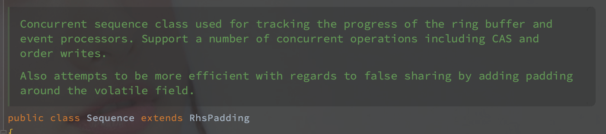

（同步序列类用于追踪 RingBuffer 和事件处理器的进程，支持多种形式的同步操作，包括 CAS 以及顺序写，另外也尝试使用更加有效率的方式消除伪共享，比如在属性前后增加填充。


对于生产者来说，Sequence 保存了写入的位置，保存在 RingBuffer。

对于消费者来说，Sequence 保存在自身的读取的位置，多个消费者不共享。

Sequence 本身使用 Padding 的方式来避免缓存行的伪共享问题（在 JDK1.8之后应该也可以用 @Contended 来实现的。


##### Sequencer

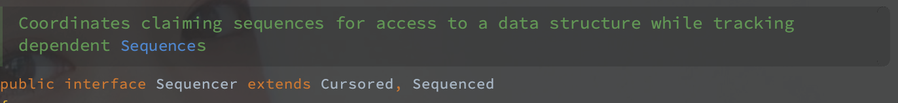

Sequence 的管理者，包含了生产者和消费者的相关 Sequence（就是持有了生产者的写入指针和消费者的读取指针。

根据生产者的个数分为 SingleProducerSequencer 和 MutilProducerSequencer。

如果消费者有多个，Single 就是保存单生产者和消费者的关系，而 Mutil 保证的就是多生产者和消费者的关系，以及多生产者之间的并发安全。


## 总结

> Disruptor 实现高性能的基础。

1. RingBuffer 对于对象的复用

RingBuffer 就是 Disruptor 实现的对象池。

复用的对象数组可以降低了 GC 频率，提高 CPU 的利用率，相对于 ArrayBlockedQueue 来说，RingBuffer 创建的事件对象数目是固定的。

2. 避免了伪共享（缓存行

（伪共享的影响可以参考 Java 中横向和纵向访问二维数组的时间消耗，存在几倍的延迟。

Sequence 中通过填充 long 对象的形式来避免伪共享。

3. 无锁化实现

在 RingBuffer 生产者的实现中，区分了单生产者和多生产者，多生产者以及消费者层面都是通过 CAS 来保证并发安全。
