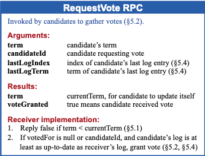

## Raft 的论文

Raft 的选举存在分票的情况，而解决的办法就是随机超时时间。

> 分票是指**多个节点同时开始请求选票，导致集群内选票被瓜分，而没有一个节点可以成为 Leader。**

超时时间是指心跳的超时，Leader 节点需要定时发送心跳给 Follower，保证 Follower 的状态。

> Raft 的论文中心跳和日志复制在同一个请求中。

 

Raft 中无法对之前 term 的日志进行提交，对前 Leader 得日志进行提交容易导致后续的不一致的回滚。

> 提交包含对应用，例如 Redis 的日志复制，获取到日志之后是否要应用到当前节点，改变内存数据。

可以选择将日志先扩散，然后在新的日志应用的时候顺带的就应用了之前的日志。

 

请求投票的 RPC 中，请求者需要带上当前最后一条日志的 Term 和 Index，被请求者需要比较自身当前的对应参数，需要大于等于才可投票。

另外的还需要比较请求者当前的 term，优先选择 term 较大的。

 

## Raft 的不足

如果单个节点出现分区，那么会因为心跳超时快速递增 currentTerm，在分区恢复之后会强制触发一次重新选举。

> etcd 中采用预分配的方式优化该不足，只有选举成功之后才会增加 currentTerm。

在 Follower 的日志不匹配时，需要往前追溯直到第一个匹配的日志。