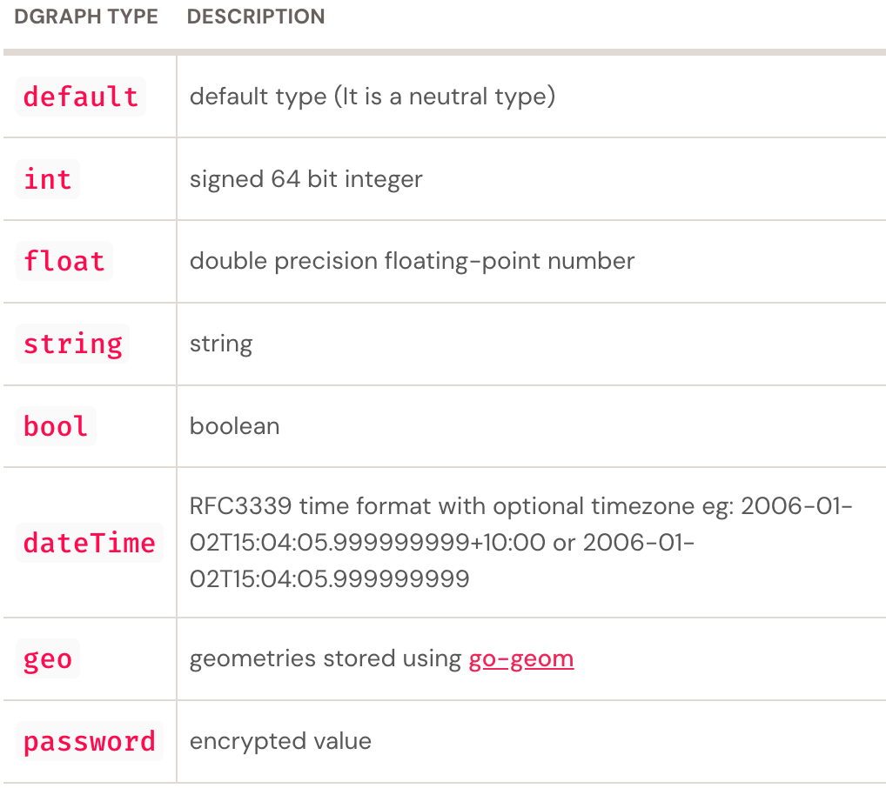
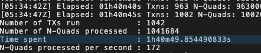

# Let's Take a Tour of Dgraph

> 后面切换到 GraphQL 的语法了。
>
> DGraph 构建的是一张带权（Facet）有向（Direction）有环的稠密图。

[reference](https://dgraph.io/tour)


## DQL Introduction

A graph database is a database optimized for storing and quering graphs. When it comes to relationships, graph databases are musc faster than SQL database.

### Run Dgraph

以下是 docker-compose.yml，直接使用 `docker-compose up -d` 就可以启动。

```yaml
version: "3.2"
services:
  zero:
    image: dgraph/dgraph:latest
    volumes:
      - type: volume
        source: dgraph
        target: /dgraph
        volume:
          nocopy: true
    ports:
      - 5080:5080
      - 6080:6080
    restart: on-failure
    command: dgraph zero --my=zero:5080
  server:
    image: dgraph/dgraph:latest
    volumes:
      - type: volume
        source: dgraph
        target: /dgraph
        volume:
          nocopy: true
    ports:
      - 8080:8080
      - 9080:9080
    restart: on-failure
    command: dgraph alpha --security "whitelist=0.0.0.0/0"  --my=server:7080 --zero=zero:5080
  ratel:
    image: dgraph/ratel:latest
    volumes:
      - type: volume
        source: dgraph
        target: /dgraph
        volume:
          nocopy: true
    ports:
      - 8000:8000
    command: dgraph-ratel

volumes:
        dgraph:
```


启动完毕之后，chrome 输入 `ip:8000` 就可以进入 Ratel 的控制台。

> ratel 是 Dgraph 官方推出的UI操作界面。


### Load Schema

Schema 类似于表结构的定义，定义 type 和 predicate。

```
## Schema 定义
# Define Types

type Person {
    name
    age
    friend
    owns_pet
}

type Animal {
    name
}

# Define Directives and index

name: string @index(term) @lang .
age: int @index(int) .
friend: [uid] @count .
owns_pet: [uid] .

```

### Load Data

```
# 数据加载脚本 
# Mutate 执行，以 RDF 形式新增数据
{
  set {
    _:michael <name> "Michael" .
    _:michael <dgraph.type> "Person" .
    _:michael <age> "39" .
    _:michael <friend> _:amit .
    _:michael <friend> _:sarah .
    _:michael <friend> _:sang .
    _:michael <friend> _:catalina .
    _:michael <friend> _:artyom .
    _:michael <owns_pet> _:rammy .

    _:amit <name> "अमित"@hi .
    _:amit <name> "অমিত"@bn .
    _:amit <name> "Amit"@en .
    _:amit <dgraph.type> "Person" .
    _:amit <age> "35" .
    _:amit <friend> _:michael .
    _:amit <friend> _:sang .
    _:amit <friend> _:artyom .

    _:luke <name> "Luke"@en .
    _:luke <dgraph.type> "Person" .
    _:luke <name> "Łukasz"@pl .
    _:luke <age> "77" .

    _:artyom <name> "Артём"@ru .
    _:artyom <name> "Artyom"@en .
    _:artyom <dgraph.type> "Person" .
    _:artyom <age> "35" .

    _:sarah <name> "Sarah" .
    _:sarah <dgraph.type> "Person" .
    _:sarah <age> "55" .

    _:sang <name> "상현"@ko .
    _:sang <name> "Sang Hyun"@en .
    _:sang <dgraph.type> "Person" .
    _:sang <age> "24" .
    _:sang <friend> _:amit .
    _:sang <friend> _:catalina .
    _:sang <friend> _:hyung .
    _:sang <owns_pet> _:goldie .

    _:hyung <name> "형신"@ko .
    _:hyung <name> "Hyung Sin"@en .
    _:hyung <dgraph.type> "Person" .
    _:hyung <friend> _:sang .

    _:catalina <name> "Catalina" .
    _:catalina <dgraph.type> "Person" .
    _:catalina <age> "19" .
    _:catalina <friend> _:sang .
    _:catalina <owns_pet> _:perro .

    _:rammy <name> "Rammy the sheep" .
    _:rammy <dgraph.type> "Animal" .

    _:goldie <name> "Goldie" .
    _:goldie <dgraph.type> "Animal" .

    _:perro <name> "Perro" .
    _:perro <dgraph.type> "Animal" .
  }
}

```


### Mutation Introduction

Adding or removing data in Dgraph is called a mutation. 

（还搞个专有名词。

We have two types of standard formats for mutations: RDF (Resource Description Framework) N-Quad and JSON (JavaScript Object Notation). RDF is a widely used standard in Graph or Ontology systems

（mutations 可以使用 RDF N-Quad 的格式和 JSON 格式设置，RDF 广泛的被使用在图相关系统。


In Dgraph the mutation operations consist of two patterns: blank UID reference or explicit UID reference.

（mutation 操作包含两种模式，隐式 UID 或者显式的 UID 调用。


In a mutation, any definition that doesn’t match the UID explicit reference format can be considered blank UID reference, also known as a blank node. The structure of a blank node consists of:

underscore + a colon + unique name (identifier) - 示例  `<_:michael>`


## DQL Basic Features


There are ewo kinds of **nodes** in a graph,let's call them nodes and values(or literals).

A value can't have any edges coming out of it.




0xfffd 8d67 d85e ab81

0xfffd8d67d85eab7a

### Language Support

Queries can search over text in the tagged languages by specifying which language to search and which languages to return.

（可以指定搜索和返回的语言

 The syntax `@lang1:...:langN` specifies the preference order for returned languages with the following rules:

（返回的语言可以指定多个

- at most one result will be returned

（最多返回一个

- if results exists in the preferred languages, the left most (in the preference list) of these is returned

（如果存在按照从左往右匹配

- if no result exists in the preferred languages no result is returned unless the preference list is terminated with `.`, in which case the value without a specified language is returned, or if there is no value without language, a value in “some” language is returned.

（如果加了`:.`  表示至少返回一个。

```
{
  language_support(func: allofterms(name@hi, "अमित")) {
    name@bn:hi:en
    age
    friend {
      name@ko:ru
      age
    }
  }
}
```


### Queries describe graphs


```
{
  michael_friends_and_pet(func: eq(name@., "Michael")) {
    name
    age
    friend {
      name@.
    }
    owns_pet {
      name
    }
  }
}
```


### Functions and filtering

> 功能函数和过滤。

```
{
  michaels_friends_filter(func: allofterms(name@., "Michael")) {
    name
    age
    friend @filter(ge(age, 27)) {  # @filter 用于在所有的 friend 边中筛选
      name@.
      age
    }
  }
}
```


There are many functions for filtering, some of them are

- `allOfTerms(edge_name, "term1 ... termN")`: matches nodes with an outgoing `string` edge `edge_name` where the string contains all listed terms.

（需要全部匹配，

- `anyOfTerms(edge_name, "term1 ... termN")`: As with `allOfTerms`, but matches at least one term.

（任一匹配，类似于 in 查询 findAny(func:anyOfTerms(name,"))

- The equalities and inequalities can be applied to edges of types: `int`, `float`, `string` and `date`
  - `eq(edge_name, value)`: equal to
  - `ge(edge_name, value)`: greater than or equal to
  - `le(edge_name, value)`: less than or equal to
  - `gt(edge_name, value)`: greater than
  - `lt(edge_name, value)`: less than


### AND, OR and NOT

> @filter 的逻辑组合

```
{
  michael_friends_and(func: allofterms(name@., "Michael")) {
    name
    age
    friend @filter(ge(age, 27) AND le(age, 48)) {
      name@.
      age
    }
  }
}
```


`@filter(ge(age,27) AND le(age,48))` 表示年龄区间在 27 到 48 之间的 friend 边。


### Sorting (orderasc or orderdesc)

> 查询结果的排序

The visualization will look the same as without the sorting, but the JSON result is ordered.

（在可视化界面中看到的东西是一样的，但是在 JSON 返回的结果中不同。

```
{
  michael_friends_sorted(func: allofterms(name@., "Michael")) {
    name
    age
    friend (orderdesc: age) {
      name@.
      age
    }
  }
}
```


### Pagination (first, offset and after)

> 数据分页。


In DQL this is done with `first`, `offset` and `after` in combination with ordering.

- `first: N` Return only the first `N` results
- `offset: N` Skip the first `N` results
- `after: uid` Return the results after `uid`

```
{
  michael_friends_first(func: allofterms(name@., "Michael")) {
    name
    age
    friend (orderasc: name@., offset: 1, first: 2) {
      name@.
    }
  }
}
```


### Count 

> 返回数据计数

计数统计的是出边的数目。

```
{
  michael_number_friends(func: allofterms(name@., "Michael")) {
    name
    age
    count(friend)
  }
}
```


### How Dgraph Search Works

> Dgraph 是如何进行搜索的。


At root, we use `func:` and a function to find an initial set of nodes

（使用 func 筛选出初始的节点列表。

Dgraph needs to build an index on values that are to be searched in this way

（Dgraph 需要在【value】上建立索引。

From the set of nodes matched in the root filter, Dgraph then follows edges to satisfy the remainder of the query. The filters on blocks inside the root are only applied to the nodes reached by following listed edges to them.

（在此基础上使用 @filter，保留满足条件的边，层级使用 @filter 仅仅会作用在当前层。

The root `func:` only accepts a single function and doesn’t accept `AND`, `OR` and `NOT` connectives as in filters. So the syntax `query_name(func: foo(...)) @filter(... AND ...) {...}` is required when further filtering on the elements returned by the root function is required.

（func: 只支持单个功能搜索，不支持 AND、OR、NOT 等，使用  `query_name(func: foo(...)) @filter(... AND ...) {...}` 在 func: 的基础上进一步筛选。


### Has

The function `has(edge_name)` returns nodes that have an outgoing edge of the given name.

（筛选拥有某个边的节点

```
{
  have_friends(func: has(friend)) {
    name@.
    age
    number_of_friends : count(friend)
  }
}
```


### Alias

The output graph can set names for edges in the output with aliasing.

（可以为输出的边定义别名`alias_name : edge_name`

```
{
  michael_number_friends(func: allofterms(name@., "Michael")) {
    persons_name : name
    age
    number_of_friends : count(friend)
  }
}
```


### Cascade

The `@cascade` directive removes any nodes that don’t have all matching edges in the query.

（@cascade 可以直接删除输出中不包含所有需求边的节点

Another use is to remove nodes where a filter inside a block returns no results.

（用于清除在 @filter 中筛选结果为空的结果

用于规范输出。

```
{
# 如果节点没有 name 和 age,friend 都会被删除
# 内层的 friend 中没有name和owns_pet的也会被删除
  michael_friends_with_pets(func: allofterms(name@., "Michael")) @cascade {
    name
    age
    friend {
      name@.
      owns_pet
    }
  }
}
```


### Normalize

The `@normalize` directive

- returns only edges listed with an alias, and

（仅仅返回具有别名的边

- flattens the result to remove nesting

（摊平返回结果，删除嵌套


```
{
  michael_and_pet_name(func: allofterms(name@., "Michael")) @normalize {
    name : name
    age			 age 就不会返回
    owns_pet {
      pet: name
    }
  }
}
```


### Comments

> 注释

Anything after `#` on a line is a comment and ignored for query processing.


### Facets : Edge attributes

> [ docs ](https://dgraph.io/docs/query-language/facets/)

Dgraph supports facets — **key value pairs on edges**.That is, facets add properties to edges, rather than to nodes. 

（facets 是一个边上的键值对，相当于给边增加属性，不能给点增加属性。

Facet keys are strings and values can be `string`,`bool`,`int`,`float` and `dateTime`。

```
{
  set {

    # -- Facets on scalar predicates
    _:alice <name> "Alice" .
    _:alice <dgraph.type> "Person" .
    _:alice <mobile> "040123456" (since=2006-01-02T15:04:05) .
    _:alice <car> "MA0123" (since=2006-02-02T13:01:09, first=true) .

    _:bob <name> "Bob" .
    _:bob <dgraph.type> "Person" .
    _:bob <car> "MA0134" (since=2006-02-02T13:01:09) .

    _:charlie <name> "Charlie" .
    _:charlie <dgraph.type> "Person" .
    _:dave <name> "Dave" .
    _:dave <dgraph.type> "Person" .


    # -- Facets on UID predicates
    _:alice <friend> _:bob (close=true, relative=false) .
    _:alice <friend> _:charlie (close=false, relative=true) .
    _:alice <friend> _:dave (close=true, relative=true) .


    # -- Facets for variable propagation
    _:movie1 <name> "Movie 1" .
    _:movie1 <dgraph.type> "Movie" .
    _:movie2 <name> "Movie 2" .
    _:movie2 <dgraph.type> "Movie" .
    _:movie3 <name> "Movie 3" .
    _:movie3 <dgraph.type> "Movie" .

    _:alice <rated> _:movie1 (rating=3) .
    _:alice <rated> _:movie2 (rating=2) .
    _:alice <rated> _:movie3 (rating=5) .

    _:bob <rated> _:movie1 (rating=5) .
    _:bob <rated> _:movie2 (rating=5) .
    _:bob <rated> _:movie3 (rating=5) .

    _:charlie <rated> _:movie1 (rating=2) .
    _:charlie <rated> _:movie2 (rating=5) .
    _:charlie <rated> _:movie3 (rating=1) .
  }
}
```


Facets on UID edges work similarly to facets on value edges.

```
{
   data(func: eq(name, "Alice")) {
     name
     friend @facets(close) {  ## 展示在关系的边上
       name
     }
   }
}
```


The syntax `@facets(facet-name)` is used to query facet.

完整的语法

```
@facets(<i18n> alias_name: facets_name)
```


## DQL Schema

### Adding schema - mutating schema

When we want to add new data to an existing schema, we can just add it. But if we want to add new data in a new schema we have two choices

- Add the data and let Dgraph work out the schema, or

（Dgraph 可以根据你的写入推测出 schema

- Specify a schema and then add the data

Functions at query root can only be applied to indexed predicates and for that we need to specify the schema. 

（func:has(param) 中间的参数，都需要定义为索引

Comparison functions at the query root level (aka `func:`) can only be applied on indexed predicates, which are added by annotating the predicate definition on the schema.


（type 是 Predicates 的类型

```
# Define Types

type Person {		## 指定一个类型
    name		## 一个 type 包含多个基本的 predicate，需要额外声明
    boss_of
    works_for
}
type Company {
    name
    industry
    work_here #this is an alias
}

# Define Directives and index

// <name>: basic type @index(使用的索引类型)
industry: string @index(term) .
boss_of: [uid] .
name: string @index(exact, term) .
works_for: [uid] .
work_here: [uid] .

```


### Adding Data - mutating data

Making changes to the graph stored in Dgraph is called mutating the data.

```
{
  set {
   ## _:company1 是临时唯一标识 + predicate name + value
   ## _:company1 后面会被替换为 uid
    _:company1 <name> "CompanyABC" .
    _:company1 <dgraph.type> "Company" .	## dgraph.type 表示复合的谓词类型
    _:company2 <name> "The other company" .
    _:company2 <dgraph.type> "Company" .

    _:company1 <industry> "Machinery" .

    _:company2 <industry> "High Tech" .

    _:jack <works_for> _:company1 .
    _:jack <dgraph.type> "Person" .

    _:ivy <works_for> _:company1 .
    _:ivy <dgraph.type> "Person" .

    _:zoe <works_for> _:company1 .
    _:zoe <dgraph.type> "Person" .

    _:jack <name> "Jack" .
    _:ivy <name> "Ivy" .
    _:zoe <name> "Zoe" .
    _:jose <name> "Jose" .
    _:alexei <name> "Alexei" .

    _:jose <works_for> _:company2 .
    _:jose <dgraph.type> "Person" .
    _:alexei <works_for> _:company2 .
    _:alexei <dgraph.type> "Person" .

    _:ivy <boss_of> _:jack .

    _:alexei <boss_of> _:jose .
  }
}
```


### External Identifiers


### Language Support

```
_:myID <an_edge> "something"@en .		@en 指定边的名称
_:myID <an_edge> "某物"@zh-Hans .	// 中文名称
```


### Reverse edges

Edges are directional. A query can’t traverse an edge in reverse.

（边是有向的，一个查询无法反向遍历一条边。

There are two choices to query in both directions

（两个方法可以同时查询正反向的边

- Add the reverse edge to the schema and add all the reverse edge data.
- Tell Dgraph to always store the reverse edge using the `@reverse` keyword in the schema.

```
boss_of: [uid] @reverse .		# @reverse 会在boss_of定义的时候直接新增正反两条边
works_for: [uid] @reverse .
```


Run the schema mutation and Dgraph will compute all the reverse edges. The reverse edge of `an_edge` is `~an_edge`.


### Reverse edges Query

The reverse edge of `anEdge` is `~anEdge`.

```
{
  q(func: eq(name, "CompanyABC")) {
    name
    work_here : ~works_for {		## 查询为当前公司工作的人, works_for 是边的名称,work_here 是别名
        uid
        name
    }
  }
}
```


### Exercise : Integrating existing data（整合已有数据


### Deleting Data

There are three deletion options inside a delete mutation.

- `<uid> <edge> <uid>/"value" .` Delete a single triple
- `<uid> <edge> * .` Delete all triples for a given edge
- `<uid> * * .` Delete all triples for a given node


### Expand Predicate

`expand(...predicates...)`  is used to query for all given predicates, rather than listing them in the query. Querying

```
expand(_all_)
```

queries returns all edges out of every node matched at that level in the query. Expand can be nested to then expand all predicates at the next level.


## DQL Data and More Data

（导数据的流程，全部导入之后是104w+的数据。



导入之后的 Schema：

```
<actor.film>: [uid] @count .
<dgraph.drop.op>: string .
<dgraph.graphql.p_query>: string @index(sha256) .
<dgraph.graphql.schema>: string .
<dgraph.graphql.xid>: string @index(exact) @upsert .
<director.film>: [uid] @reverse .
<genre>: [uid] @reverse .
<initial_release_date>: datetime @index(year) .
<name>: string @index(exact, term) @lang .
<performance.actor>: [uid] .
<performance.character>: [uid] .
<performance.character_note>: string .
<performance.film>: [uid] .
<performance.special_performance_type>: [uid] .
<starring>: [uid] .
<type>: [uid] .
type <Genre> {
	name
}
type <Movie> {
	name
	initial_release_date
	genre
	starring
}
type <Performance> {
	performance.film
	performance.character
	performance.actor
}
type <Person> {
	name
	director.film
	actor.film
}
type <dgraph.graphql> {
	dgraph.graphql.schema
	dgraph.graphql.xid
}
type <dgraph.graphql.persisted_query> {
	dgraph.graphql.p_query
}
```


### GraphQL Search

Queries can be issued as multiples.

For queries labeled `q1, ..., qn` issued as a multiple query block, the JSON result will contain labeled answer blocks `q1, ..., qn` for each query.

```
{
  caro(func: allofterms(name@en, "Marc Caro")) {
    name@en
    director.film {
      name@en
    }
  }
  jeunet(func: allofterms(name@en, "Jean-Pierre Jeunet")) {
    name@en
    director.film {
      name@en
    }
  }
}
```

If a block is labeled with `var`, no results are returned for that query.

Queries issued in this way are independent.


### Query Variables 

Results can be stored in variables and used elsewhere in the query.

Variables are declared by

```
var_name as some_block { ... }
```

where `var_name` is any distinct variable name and `some_block` is either a whole query or an internal block of a query matching on an edge.

（var_name 是一个唯一的变量名，some_block 可以是查询或者内部的查询块。

Query variables are used by `uid(<variable-name>)`. Variables evaluate to all `uid`’s matched in the query by the block they are defined against. In particular, note that, variables are `uid` lists, not the graph matched by the block, and that the variable evaluates to all `uid`’s the block matches for the whole query, not the `uid`’s matched by any one branch.

（查询变量的使用通过 `uid(<variable-name>)`

（查询变量保存的是所有匹配的 UID。


### Query Variables in a child block

Query variables in a child block allow the query to carry answers matched at one level down to the children to filter against.


For example, take of the set of actors in all Jane Campion films; our challenge is to find which pairs in that set have acted together on a film not directed by Jane Campion.

（找出 Jane Campion 导演的电影的演员中，在非 Jane Campion 导演的电影中合作的演员。

```
{
  coactors(func:allofterms(name@en, "Jane Campion")) @cascade {		## 查询名称为 Jane Campion 的节点
    JC_films as director.film {     ## JC_films 表示 Jane Campion 导演的所有电影
      starting_movie: name@en				## 电影名称别名为 starting_movie
      starring {										## 查找主演阵容 
        JC_actors as performance.actor {      # JC_actors表示在 Jane Campion 电影中的演员
          actor : name@en			## 展示演员名称
          actor.film {				## 演员的电影
            performance.film @filter(not uid(JC_films)) {	## 过滤 Jane Campion 没有参演的电影
              film_together : name@en			## 一起拍摄的电影名称
              starring {
                # find a coactor who has been in some JC film
                performance.actor @filter(uid(JC_actors)) {			## 在 Jane Campion 参演的电影中，去除
                  coactor_name: name@en
                }
              }
            }
          }
        }
      }
    }
  }
}
```


### Query Variables in another query block I

That’s the key to using Dgraph’s variables correctly: understand that they are global in the sense that they evaluate to all nodes that could match that edge in the query, not local in the sense that would evaluate to different results for each Jane Campion film.

```
{
  ## normalize 会摊平折叠
  ## @cascade 会筛选掉没有导演过电影的人
  PJ as var(func:allofterms(name@en, "Peter Jackson")) @normalize @cascade {		## PJ 表示整个经过筛选后的 UID 列表
    F as director.film				## F 定义了 Peter Jackson 导演的电影
  }

  peterJ(func: uid(PJ)) @normalize @cascade {
    name : name@en
    actor.film {
      performance.film @filter(uid(F)) {
        film_name: name@en
      }
      performance.character {
        character: name@en
      }
    }
  }
}
```


### Query Variables in another query block II

```
{
  var(func: allofterms(name@en, "Taraji Henson")) {
    actor.film {			## 所有 Taraji Henson 参演的电影
      F as performance.film {		## 定义 Taraji Henson 参演的电影名称
        G as genre							## 定义 Taraji Henson 参演的流派类型
      }
    }
  }

  Taraji_films_by_genre(func: uid(G)) {		## 筛选出 Taraji Henson 参演过的电影流派
    genre_name : name@en		## 输出流派名称
    films : ~genre @filter(uid(F)) {  ## 筛选出包含 Taraji Henson 的电影
      film_name : name@en			## 输出电影名称
    }
  }
}
```

通过 `var(func:XXX)` 定义出来的变量可以在同个请求的其他查询中使用。


### Exercise: Query Variables linking queries

```
{
  var(func: allofterms(name@en, "Peter Jackson")) {
    F_PJ as director.film {		##  找到 Peter Jackson 导演的所有电影
      starring{
        A_PJ as performance.actor  ## 电影参演的所有演员
      }
    }
  }

   var(func: allofterms(name@en, "Martin Scorsese")) {
    F_MS as director.film { 	##  找到 Martin Scorsese 导演的所有电影
      starring{
        A_MS as performance.actor
      }
    }
  }

  actors(func: uid(A_PJ)) @filter(uid(A_MS)) @cascade {
    actor: name@en
    actor.film {
      performance.film @filter (uid(F_PJ, F_MS)) {		## 表示由 Peter Jackson 或者 Martin Scorsese 的电影
      	name@en
      }
    }
  }
}
```


### Value variables - min and max

 Value variables store the values against which they match.

（值变量保存他们匹配的值

Value variables work differently to query variables. Value variables are context dependent - in fact, they are a map from UID to value and we can exploit this when reading and filtering value variables. The value from a value variable is extracted with `val(<variable-name>)`.

（值变量和查询变量不同，他有上下文依赖。实际上它保存了 <uid - value> 的映射关系，我们可以在读取或者过滤的时候使用这个特点。

（使用 `val(<variable-name>)` 提取出值的内容

At the point of definition, because the context is within the appropriate UID, value variables act like the corresponding value. In the enclosing block, value variables are the UID to value map and must be aggregated.

（在定义值变量的上下文中， UID 本身就是固定的，所以值变量表现为对应的值。

（在整个封闭块中，值变量就是 UID 到 Value 的映射，必须被聚合。

Aggregations over value variables aren’t dependent on an index - there’s no need for indexing, the values have already been found in the query.

（内容聚合的过程不依赖于索引，数据已经被查出来了。

```
{
  q(func: allofterms(name@en, "Ang Lee")) {
    director.film {
      uid
      name@en

      # Count the number of starring edges for each film
      num_actors as count(starring) # 保留参演的演员数量

      # In this block, num_actors is the value calculated for this film.
      # The film with uid and name
      ## 在 director.film 的块中，num_actors 就是演员的数量
    }

    # Here num_actors is a map of film uid to value for all
    # of Ang Lee's films
    # 在整个外部的 block 中，num_actors 表现为 <uid - 演员数量> 的映射，所以必须被聚合
    #
    # It can't be used directly, but aggregations like min and max
    # work over all the values in the map

    most_actors : max(val(num_actors))  # 最多数量的员工
  }

  # to use num_actors in another query, make sure it's done in a context
  # where the film uid to value map makes sense.
}
```

（上述查询语句，查询名称为 Ang Lee 的导演导的所有电影，输出电影的 uid、名称、参演演员数量，并最后输出最大的员工数量


`min` and `max` can be applied to `int`, `float`, `string`, `bool`, and `date` types.

（min 和 max 的使用类型范围。


### Exercise : Value variables - sum and avg

Summation `sum` and average `avg` can only be applied to value variables that contain `int` and `float` data.

（sum 和 avg 只能用在 int 和 float 类型的数据上。

```
{
  ID as var(func: allofterms(name@en, "Steven Spielberg")) { # ID 表示 Steven Spielberg 这个 Person
    director.film {
      num_actors as count(starring)			## num_actors 表示这个电影的数量
    }
    average as avg(val(num_actors))			## 取的演员的平均数并赋值给 average
  }

  avs(func: uid(ID)) @normalize {	
    name : name@en
    average_actors : val(average)		## 找到平均数
    num_films : count(director.film)	## 统计数目
  }
}
```


### Value variables: filtering and ordering


# Dgraph Docs


## Dgraph Overview


图数据库中关注的就是点和边，边就是两个点之间的关系，谓词（Predicate）就是一个属性，绑定在一个点或边上的 \<名称 - 值\> 

值 如果是 [uid]，这个谓词就是边。

边也可以有属性叫做面（Facet），比如权重之类的属性。

整个的 Dgraph 可以看作是点的集合，每个点都有一个 UID，然后点延伸出去之后还有属性和关系，属性的对端是值，关系的对端是另外一个点。

Type 由一组 Predicate 组成，表示一类有相同属性集合的点，一个点可以归于多个 Type。

Predicate 和 Type 组成了 Dgraph 基础的 Scheme（另外还包含了内置的 Predicate。


### The Graph Model - Nodes, Relationships and Values

> Dgraph is fundamentally a [**property-graph database**](https://www.dataversity.net/what-is-a-property-graph/) because it stores nodes, relations among those nodes, and associated properties for any relation.

Dgraph 从根本上看是一个属性图数据库，因为它保存了节点，节点间的关系，以及任何关系的关联属性。

（relation 包括点和点之间的以及点和值之间的。

> Dgraph relationships are directed links between nodes, allowing optimized traversal from node to node. Dgraph allows a bidirectional relation via directed relationships in both directions if desired.

Dgraph 使用的单向边，并且可以通过两个单向边组成一个双向边。


### Dgraph Architecture

>Dgraph scales to larger data sizes than other graph databases because it is designed from the ground up to be distributed. Therefore Dgraph runs as a cluster of server nodes which communicate to form a single logical data store. There are two main types of processes (nodes) running: Zeros and Alphas.
>
>- **Dgraph Zero** server nodes hold metadata for the Dgraph cluster, coordinate distributed transactions, and re-balance data among server groups.
>- **Dgraph Alpha** server nodes store the graph data and indices. Unlike non-distributed graph databases, Dgraph alphas store and index “predicates” which represent the relations among data elements. This unique indexing approach allows Dgraph to perform a database query with depth N in only N network hops, making it faster and more scalable for distributed (sharded) data sets.


Dgraph 设计支持就支持分布式结构，所以它比其他数据库更加适应于大数据量的场景。

Dgraph 氛围 Zero 和 Alpha 两种节点：

Zero 负责保存集群的元数据，协调分布式事务以及在多个节点间重平衡数据。

Alpha 保存实际的数据和缩影，区别于非分布式的图数据库，alpha 节点使用谓词（Predicates）作为管理和分片的基础，相同谓词的属性会保存在同一个节点上。

（对单个谓词的查询会非常快速，但是对于整个节点的 expend(\_all_\) 在N个节点的网络中就需要大约 N 次网络请求。


### Scale, replication and sharding

> Every cluster will have at least one Dgraph Zero node and one Dgraph Alpha node. Then databases are expanded in two ways.
>
> - **High Availability Replication**: For high-availability, Dgraph runs with three zeros and three alphas instead of one of each. This configuration is recommended for the scale and reliability required by most production applications. Having three servers both triples the capacity of the overall cluster, and also provides redundancy.
> - **Sharding**: When data sizes approach or exceed 1 TB, Dgraph databases are typically sharded so that full data replicas are not kept on any single alpha node. With sharding, data is distributed across many nodes (or node groups) to achieve higher scale. Sharding and high-availability combine when desired to provide massive scale and ideal reliability.
> - **Self-healing**: In Dgraph’s cloud offering, Kubernetes is used to automatically detect, restart and heal any cluster (HA, sharded, both or neither) to keep things running smoothly and at full capacity.


每个集群最少有一个 Zero 节点和一个 Alpha 接待你。


## DQL（Dgraph Query Language

### Dgraph types schema

The schema contains information about [predicate types](https://dgraph.io/docs/dql/dql-schema/#predicate-types) and [node types](https://dgraph.io/docs/dql/dql-schema/#node-types).

A [predicate](https://dgraph.io/docs/dgraph-glossary/#Predicate) is the smallest piece of information about an object. A predicate can hold a literal value or a relation to another entity 

| 语法    | 作用                                                     | 示例                                                         |
| ------- | -------------------------------------------------------- | ------------------------------------------------------------ |
| @lang   | 需要在该 Predicate 中使用 `@zh` ，`@en` 等语言指定       | <name>: string @index(fulltext) @lang .<br />  q(func: alloftext(<name>@zh, "")) {} |
| @upsert | 使用 upsert 语法（先查询是否存在后插入），增加唯一性约束 | email: string @index(exact) @upsert .                        |
|         |                                                          |                                                              |


`strict` 表示在 mutation 之前必须指定对应的 Predicate，`flexible` 会根据第一条 mutation 语句创建对应的 Predicate。

通过 `alter` 可以手动新增 Predicate。

#### Predicate Types

#### Scalar Types

基础的谓词类型和 Go 原生类型的对应关系：

| Dgraph Type | Go type                                                      |
| :---------- | :----------------------------------------------------------- |
| `default`   | string                                                       |
| `int`       | int64                                                        |
| `float`     | float                                                        |
| `string`    | string                                                       |
| `bool`      | bool                                                         |
| `dateTime`  | time.Time (RFC3339 format [Optional timezone] eg: 2006-01-02T15:04:05.999999999+10:00 or 2006-01-02T15:04:05.999999999) |
| `geo`       | [go-geom](https://github.com/twpayne/go-geom)                |
| `password`  | string (encrypted)                                           |

#### 内置类型

**UID**

eg:  `knows: [uid] .`

The `uid` type denotes a relationship。

**password**

eg: `pass: paasword .`

A password for an entity is set with setting the schema for the attribute to be of type `password`. Passwords cannot be queried directly, only checked for a match using the `checkpwd` function. The passwords are encrypted using [bcrypt](https://en.wikipedia.org/wiki/Bcrypt).

##### Predicate types from RDF Types

mutation 可以指定对应的 Dgrapg type，以下是基于 RDF 格式的 mutation:

`  _:a <age> "15"^^\<xs:int\> .`

##### Predicate indexing

需要使用 `@filter` 的谓词都需要添加索引。

`email: string @index(exact) ` 表示对字符串做精确匹配。

（所以新增查询前还要确定一下是否支持。

#### Node types

Node types are declared along with [predicate types](https://dgraph.io/docs/dql/dql-schema/#predicate-types) in the Dgraph types schema.

```
name: string @index(term) .
dob: datetime .
home_address: string .
friends: [uid] .

// 所有在节点类型中用到的 Predicate 都需要在 schema 中声明
type Student {
  name
  dob
  home_address
  friends
}
```

##### Reverse predicates

```
children: [uid] @reverse .
name: string @index(term) .
type Parent {
  name
  children
}
type Child {
  name
  <~children>
}

```


> Tip Predicates with special caracter are enclosed with angle brackets `<>`


#### Node type attribution

A node is given a type by setting the `dgraph.type` predicate value to the type name.

A node may be given many types, `dgraph.type` is an array of strings.

```
{
  set {
    _:a <name> "Garfield" .
    _:a <dgraph.type> "Pet" .			
    _:a <dgraph.type> "Animal" .
    // 即是宠物又是动物
  }
}
```


声明了 `dgraph.type` 的谓词才可以在查询的时候使用 `type()`。

`delete { <uid> * * . }` will only delete the predicates declared in the type. 


## Predicate Indexes

Filtering on a predicate by applying a [function](https://dgraph.io/docs/query-language/functions/) requires an index.

（在 function 中使用的 Predicate 都需要添加索引。

Types `int`, `float`, `bool` and `geo` have only a default index each: with tokenizers named `int`, `float`, `bool` and `geo`.

（这些类型是默认的，不需要指定，意思是这些类型的谓词不需要特地声明也可以在 fucntion 中使用。

### String Indices

The indices available for strings are as follows.

| Dgraph function            | Required index / tokenizer             | Notes                                                        |
| :------------------------- | :------------------------------------- | :----------------------------------------------------------- |
| `eq`                       | `hash`, `exact`, `term`, or `fulltext` | The most performant index for `eq` is `hash`. Only use `term` or `fulltext` if you also require term or full-text search. If you’re already using `term`, there is no need to use `hash` or `exact` as well. |
| `le`, `ge`, `lt`, `gt`     | `exact`                                | Allows faster sorting.                                       |
| `allofterms`, `anyofterms` | `term`                                 | Allows searching by a term in a sentence.                    |
| `alloftext`, `anyoftext`   | `fulltext`                             | Matching with language specific stemming and stopwords.      |
| `regexp`                   | `trigram`                              | Regular expression matching. Can also be used for equality checking. |

Warning Incorrect index choice can impose performance penalties and an increased transaction conflict rate. Use only the minimum number of and simplest indexes that your application needs.


## DateTime Indices

The indices available for `dateTime` are as follows.

| Index name / Tokenizer | Part of date indexed               |
| :--------------------- | :--------------------------------- |
| `year`                 | index on year (default)            |
| `month`                | index on year and month            |
| `day`                  | index on year, month and day       |
| `hour`                 | index on year, month, day and hour |


## Sortable Indices

Not all the indices establish a total order among the values that they index. Sortable indices allow inequality functions and sorting.

- Indexes `int` and `float` are sortable.

- `string` index `exact` is sortable.（需要根据字符串排序的时候需要制定字符串的索引类型为 `exact`

- All `dateTime` indices are sortable.

  

## Count index

For predicates with the `@count` Dgraph indexes the number of edges out of each node. This enables fast queries of the form:

（@count 会保存每个节点的边数？

```
{
  q(func: gt(count(pred), threshold)) {
    ...
  }
}
```


# Glossary

（名次解释

## Edge

In the mental picture of a graph: bubbles connected by lines ; the bubbles are nodes, the lines are edges. In Dgraph terminology edges are [relationships](https://dgraph.io/docs/dgraph-glossary#relationship) i.e an information about the relation between two nodes.

（在 Dgraph 的术语钟 Edge 就是 Relationship。


## Facet

A facet represents a property of a [relationship](https://dgraph.io/docs/dgraph-glossary#relationship).

（Facet 就是 Relationship 的属性，类比于 Spring 的 Property，是一个 K/V 键值对（Key 只能是 String，Value 可以为其他类型。


## Mutation

A mutation is a request to modify the database. Mutations include insert, update, or delete operations. A Mutation can be combined with a query to form an [Upsert](https://dgraph.io/docs/dgraph-glossary#upsert).

（Mutaion 就是 Dgraph 中的 DML，但是 Mutaion 可以和查询语句结合使用。


## Node

Conceptually, a node is “a thing” or an object of the business domain. For every node, Dgraph stores and maintains a universal identifier [UID](https://dgraph.io/docs/dgraph-glossary#uid), a list of properties, and the [relationships](https://dgraph.io/docs/dgraph-glossary#relationship) the node has with other nodes.

（Node 在 Dgraph 中会有一个唯一的 UID，以及一个属性列表和关系列表。

（这里的属性应该是指 Predicate。


## Predicate

In [RDF](https://dgraph.io/docs/dgraph-glossary#RDF) terminology, **a predicate is the smallest piece of information about an object**. A predicate can hold a literal value or can describe a relation to another entity :

- when we store that an entity name is “Alice”. The predicate is `name` and predicate value is the string “Alice”. It becomes a node property.

- when we store that Alice knows Bob, we may use a predicate `knows` with the node representing Alice. The value of this predicate would be the [uid](https://dgraph.io/docs/dgraph-glossary#uid) of the node representing Bob. In that case, `knows` is a [relationship](https://dgraph.io/docs/dgraph-glossary#relationship).

（Predicate 可以是属性也可以是关系，当 Predicate 指向一个 Value 的时候就是属性 Property，如果指向的是 UID 则表示关系。


## RDF

RDF 1.1 is a Semantic Web Standard for data interchange. It allows us to make statements about resources. The format of these statements is simple and in the form of `<subject>> <predicate> <object>`. Dgraph supports the RDF format to create, import and export data.

（RDF 是一个互联网上的语义标准用，标准格式就是 <主体><谓语><对象>

 Note that Dgraph also supports the JSON format.


## Relationship

A relationship is a named, directed link relating one [node](https://dgraph.io/docs/dgraph-glossary#node) to another. 

（Relationship 是两个节点之间带名称的定向连接。

**It is the Dgraph term similar to [edge](https://dgraph.io/docs/dgraph-glossary#edge) and [predicate](https://dgraph.io/docs/dgraph-glossary#predicate).** In Dgraph a relationship may itself have properties representing information about the relation, such as weight, cost, timeframe, or type.

 In Dgraph the properties of a relationship are called [facets](https://dgraph.io/docs/dgraph-glossary#facet).


## UID

A UID is the Universal Identifier of a node. `uid` is a reserved property holding the UID value for every node. UIDs can either be generated by Dgraph when creating nodes, or can be set explicitly.


```
{
	queryName(func:...,orderasc/orderdesc:...) @filter(...) @normalize @cascade (first:N,offset:M,after:uid)(
}
```


# 野博客


Dgraph 钟数据的最小单位就是一个三元组，三元组可以表示一个属性(subject-predicate-value)，也可以表示一条边(subject-predicate-object)。Dgraph 为每个对象分配一个全局唯一的 id，称为 uid。Uid 是一个 64 位无符号整数，从 1 开始单调递增。

Dgraph 基于 predicate 进行数据分片，即所有相同 predicate 的三元组形成一个分片，在分片内部，根据 subject-predicate 将三元组进一步分组，每一组数据压缩成一个 key-value 对。其中 key 是 <subject, predicate>，value 是一个称为 posting list 的数据结构。

> 所以对于 Dgraph 来说，数据是很容易倾斜的。


Dgraph 中实现模糊搜索需要设置为 trigram 索引，然后使用 `match(predicate,search string,distance)`


## Reference


[Dgraph 入门](http://note.iawen.com/note/graph/dgraph_base)