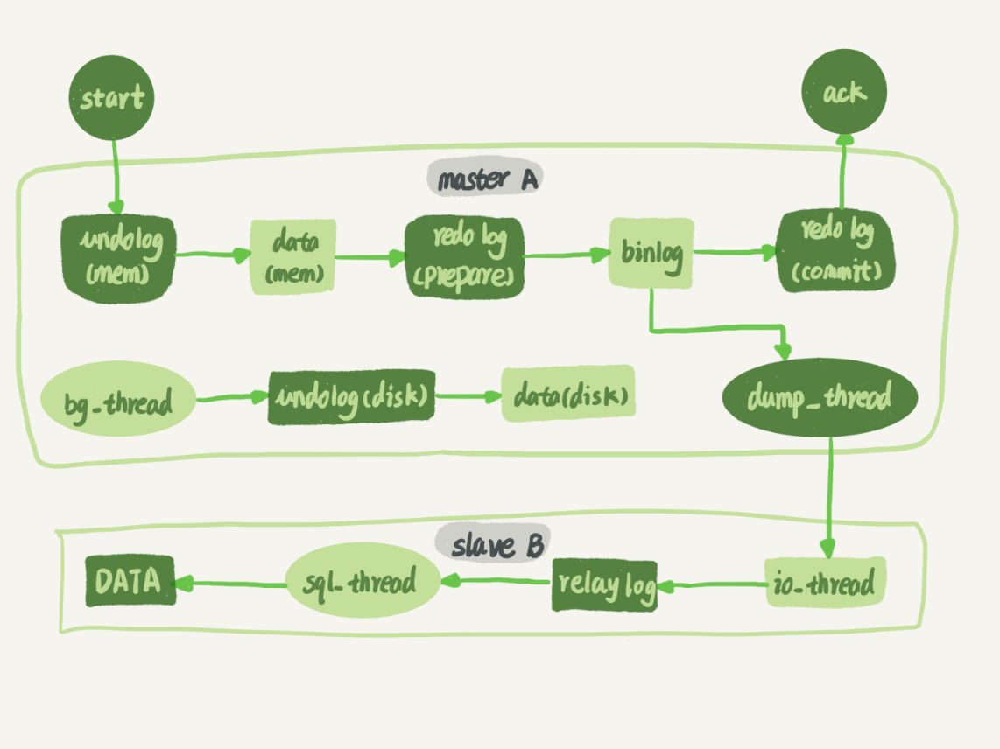

# MySQL

## MySQL 的整体架构

 

从上到下分别是：

### 连接器

连接器就是负责管理连接的，包括权限验证等等流程，因为连接是 TCP 的可能还包括连接状态的维护。

### 分析器

分析器的作用是对 SQL 进行词法分析，语法分析，抽出 BST，并交给后续的组件

### 优化器

**优化器就是 MySQL 中对 SQL 语法的分析器以及索引的选择器，会根据解析出进来的 SQL 语句结合索引以及取样数据选择索引。**

因为其中还包含数据的影响，所以无法100%的确定是否真的会走索引。

例如，如果优化器根据数据推测全表扫描的速度大于走索引再回表的速度，那么就会直接放弃索引。

### 执行器

执行器就相当于是一个调度器，会根据表选择的存储引擎调用不同的存储引擎的接口。

执行器对于上层的优化器屏蔽了底层不同存储引擎带来的查询语法上的差异性。

MySQL 的存储引擎是可插拔式的，在创建表的时候就可以使用不同的存储引擎。

 

早期的 MySQL 还会有查询缓存层，但是在4.x版本中就已经被删除了。

> Q: 为什么要删除查询缓存？

查询缓存是以查询语句为 Key，作为命中的要求，所以命中率并不会高，而且大量的缓存在业务逻辑层实现灵活性更高，更加可控，也就实在没必要在数据库中增加缓存机制。

## 排序相关

MySQL 中的排序算法包括三种：

1. 全字段排序

全字段排序就是将全部需要的字段放入 sort_buffer 统一排序后返回。

2. rowId 排序

在排序内容较多的时候，可能仅使用 rowId + 排序字段进行排序，然后回表查询另外的内容。

此时的效率可能非常低，因为先根据筛选字段查询 rowId 以及 排序字段（此时可能已经经过一次回表，而排序结束之后可能再次使用 rowId 进行二次回表。

3. 索引树排序

MySQL 索引本身就是有序的，因此如果排序条件满足索引（最左匹配原则，则可以直接使用索引中的顺序。

 

explain 的 Extra 字段中可能出现 filesort 标记，表示出现额外排序（并不一定是磁盘排序。

相关的还有分页问题，大数据量分页的时候可能会非常的慢，因为例如 limit 1000000,1000002; 此时会将 1000002 的数据全部先排序然后在选去后两条。

此时的优化应该减少待排序内容，使用索引或者子查询。

## 联表查询

联表查询包含如下几种形式：

1. 全连接/内连接查询

全链接查询最后的数据集只会保存驱动和被驱动表都匹配的数据。

例如 select * from a,b where a.id = b.id。

此时 a 和 b 的 id 在对方表中无匹配项的就不会被返回。

2. 左连接查询

3. 右连接查询

> 普通的 A join B，会是 MySQL 自行选择驱动表，而使用 A straight_join B，会固定 A 为驱动表。
>
> 驱动表可以简单理解为先查询的数据表，会根据驱动表的数据去匹配被驱动表。

**联表查询的时候应该是小表作为驱动，小表的判断依据是单个表执行完 WHERE 语句之后剩余的数据集。**

Index Nested-Loop Join

Simple  Nested-Loop Join

Block Nested-Loop Join

## Master-Slave 主从复制

