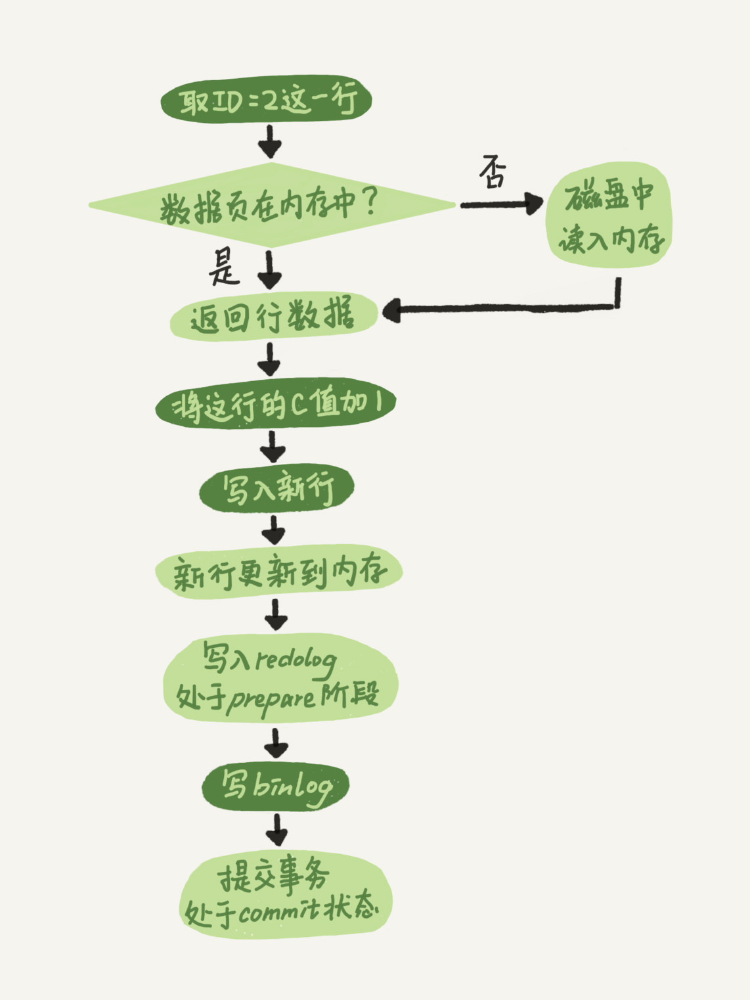

# 日志相关

MySQL 中存在多种日志，比如 binlog ，redo log 以及 undo log。

## binlog（归档日志

 binlog 属于归档日志，在 MySQL 中属于 Server 层日志， MySQL 中所有的存储引擎都会记录该日志。

binlog  记录了所有的**数据库变更操作**，包括 UPDATE，INSERT，DELETE，也包括表结构的修改 ALTER TABLE 等。

 

**binlog 的主要作用是 1. 主从复制  2. 数据归档（奔溃后的适度恢复）。**

但是 binlog 并不能提供 crash-safe 的保证。

 

### binlog 的相关配置

再说两个 binlog 相关的主要配置：

1. binlog_cache_size

该值表示在 MySQL 中 binlog 缓冲区的大小，用于缓存事务产生的 binlog。

**binlog cache 是线程私有的，不同线程之间不共享缓冲区。**

因为一个事务中可能涉及多个更新语句，并且多个更新语句不能拆分写入，因此需要一个缓冲区。

在缓冲区不足的时候 MySQL 也会进行强制的刷盘。

（刷盘就是指调用 fsync，将内存缓冲区的数据实际写入磁盘。

2. sync_binlog 

binlog 的 fsync 刷盘策略，有如下几种配置形式：

- 0 - 系统自由决定何时刷盘，所有 binlog 只做 write
- 1 - 每次都需要刷盘
- n - 每次提交事务都会 write，但是n次的操作之后才会进行刷盘

为0时性能最好，但是如果系统宕机，会丢失未落盘的内容。

 

 

### binlog 的日志格式

**binlog 有如下三种格式：**

1. statement

statement 完整的保存执行的语句，但是因为 now() 等即时函数的存在复制的异常，所以用于复制的情况下会出现异常。

2. row

**row 记录的是表中数据 完整的变更，比如 now() 就会直接记录当前时间，数据较为准确。**

但是相对的日志文件会比较大，因为 statement 一个删除语句，row 会保存所有的行记录。

3. mixed

mixed 基本上就是混合两种的情况。

 

## redo log（重做日志

redo log 是 InnoDB 的专有日志，其他的存储引擎，例如 MyISAM 都不具有。

redo log 是 InnoDB 中最重要的日志，是持久性实现的基石，也是所谓的 WAL 机制的实现。

> WAL 就是预写日志技术，在 InnoDB 中所有的修改都需要写日志，再做修改。
>
> WAL 一方面保证了数据的持久性，即使宕机导致数据并未落盘，但是日志此时都是完整的，可以借此恢复。
>
> 另外 InnoDB 的 redo log 实现的 WAL，进一步优化了写入的性能。

redo log 可以单独提供 crash-safe 的保证。

之所以要和 binlog 组成二阶段提交的原因是因为 binlog 需要做复制，在复制完成之后需要确保数据不能被回滚。

 

### redo log 的缓冲区

InnoDB 中的 redo log 有一个固定的大小的缓冲区，并且首尾相连组成一个环。

环上有两个主要的指针: check_point 和 write_pos。

 

在 write_pos 和 check_point 之间的就是日志的可写范围，如果刷盘不及时导致 write_pos 追上了 check_point，就会开启强制的刷盘。

### redo log 的配置

redo log 的刷盘策略也有参数控制 - **innodb_fluish_log_at_trx_commit**。

1. innodb_fluish_log_at_trx_commit

该参数为1时，每次的 redo log 都会调用 fsync，真正落盘持久化保存。

## binlog 和 redo log 的二阶段提交

图中忽略了 Change Buffer 的机制。

binlog 和 redo log 同时保存才能保证事务的正常，如果

## undo log（回滚日志

undo log 是 InnoDB MVCC 特性的重要组成部分，也可以说是基石。

undo log 在 5.6 之后记录在单独的表空间，并且使用回滚段作为组织的形式。

> 所以 undo log 并算不上 InnoDB WAL 机制的实现，因为 undo log 自身的持久化都要基于redo log。

undo log 会在事务提交的时候被删除，在正常查询时，如果当前的数据经过了几次修改，undo log 会变成类似链表的结构，查询需要沿着 undo log 逐步复原。

> 之前好像听过这个bug，就是一个长事务导致的巨长的 undo log，拖慢了整个表的查询速度。

undo log 简单理解就是相反操作，比如用户表中的插入，那么这里就记录删除。

## group commit（组提交策略