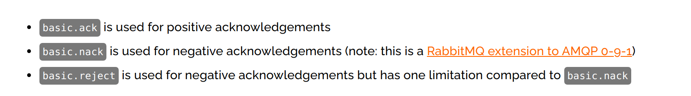
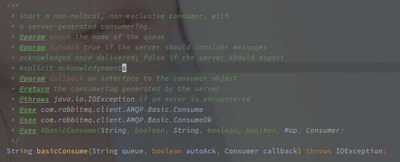
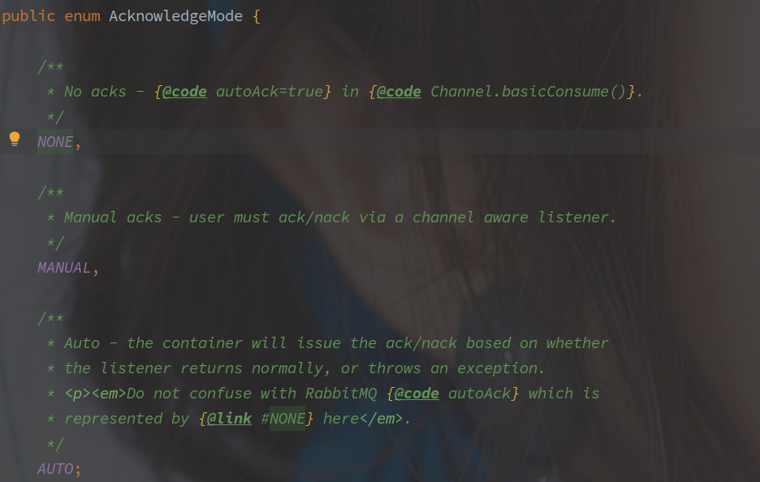

# RabbitMQ

---

[TOC]


---


## 概述

## 相关概念

> 交换机（Exchange）

> 队列（Queue）

> 路由键（Routing Key）和绑定键（Binding）

> 虚拟主机（Virtual Host）


## 交换机类型


## 消息 ACK 机制

<br>

### RabbitMQ 原生 ack 模式

RabbitMQ 的消费者端提供了**自动和手动两种 ack 方式**。

[Consumer Acknowledgement Modes and Data Safety Considerations](https://www.rabbitmq.com/confirms.html#acknowledgement-modes)

**在自动确认的模式下，消息被认为在发送之后就算成功处理，因此很容易造成消息丢失，但是自动确认在很大程度上提高了吞吐量。**

> Consumer 是直接和 Queue 接触的，一个 Queue 可以由多个 Consumer 共同消费，如果一个 Consumer 断线，那么该 **Consumer 上 unack 的消息会被 Queue 转发到其他的 Consumer 上，**此时又会存在重复消费的问题。

**对于手动确认**，RabbitMQ 定义了以下三种形式：

<br>

basic.ack 就是确认消费成功，Broker 在接收到该条 ack 之后会尝试删除对应的消息。

basic.reject 和 basic.nack 的作用是一样的，区别就在于语义上，作用都是拒绝消息，并且可以通过参数确定消息是否需要重新入队列。

<br>

> **消费者连接的时候就需要指定 ack 的模式。**
>
> RabbitMQ 提供了两大类 ack 模式：手动和自动
>
> 1. 自动 ack 会在消息到达消费者之后直接删除队列中的消息
> 2. 手动 ack 分为 ack / nack / reject 三种。

<br>

<br>

### Java 原生客户端 ack 实现

在创建 Consumer 的时候就需要指定 ack 的形式:



上图中的方法参数 autoAck 就表示是否开启**自动 ack**。

对于三种手动确认的方法也分别提供了方法。

```java
void basicAck(long deliveryTag, boolean multiple) throws IOException;
    
void basicNack(long deliveryTag, boolean multiple, boolean requeue)
            throws IOException;

void basicReject(long deliveryTag, boolean requeue) throws IOException;
```

deliveryTag 可以简单理解为消息的 id。

multiple 参数的含义是是否为批量操作，例如 basicAck 方法，如果为批量操作，会将 deliveryTag 之前的消息都 ack。

**requeue 参数表示是否需要重回队列，如果为 false，那么在方法调用后消息就会被丢弃或者转发到死信队列，如果为 true，消息就会重新进入队列，重新下发到消费者。**

<br>

### SpringBoot 中的 ack 实现

SpringBoot 根据以上的 ack 方法抽象提供了三种 AcknowledgeMode，具体如下：



None 对应的就是 RabbitMQ 的 自动 ack，在消息被下发后就认为是消费成功，Broker 可以删除该消息。

> 实际开发中慎用该配置！
>
> 但是如果处理失败就无法对该条消息进行重试，因为已经从队列中删除。
>
> 自动 ack 能稍微提高消息速度，ack 之后 Broken 会立马补消息到 prefetch 个。

MANUAL 需要用户在 listener 中手动调用 ack / nack / reject 方法。

**AUTO 是由 SpringBoot 控制的 ack 模式，如果 listener 返回正常，则调用 ack，如果抛异常则调用 nack。**

> 是在 RabbitMQ 官方提供了客户端实现的基础上封装的记住。

另外的还有 default-requeue-rejected 配置，表示在消息处理失败之后是否需要重回队列。

> **SpringBoot 的客户端默认是会重回队列的，所以如果 Listener 抛异常而不进一步处理，消息会进入死循环。**


<br>

## 死信交换机

死信交换机就是正常的交换机，但是可以通过 `x-dead-letter-exchange` 配置为另外一个队列的死信交换机。

队列中的消息在以下三种情况会被转发到死信交换机：

1. 消费者 reject 和 nack 并且 requeue = false 的消息
2. TTL 过期的消息
3. 队列过长的消息

<br>

死信交换机还可以使用 `x-dead-letter-routing-key` 指定附带的 RoutingKey， 便于交换机转发消息。

> **死信交换机一般来说可以直接绑定 FANOUT 的队列，避免消息因为 RoutingKey 匹配失败而丢失。**
>
> 也有通过 RoutingKey，绑定同一个交换机转发到不同的队列的情况。


## 备份交换机

类似于死信交换机，使用 ` alternate-exchange` 绑定到别的交换机，在没有找到匹配的队列时，消息会被转发到备份交换机。

> 基于备份交换机可以实现类似 Mandatory 参数的功能。


## 消费者端流控