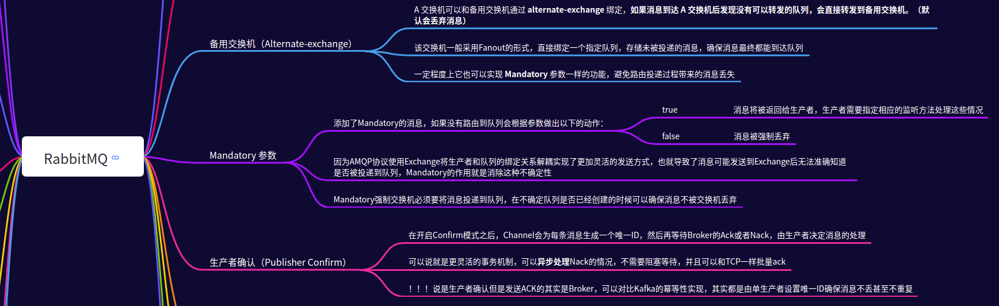
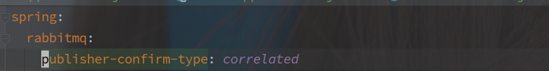

# RabbitMQ 如何保证消息不丢失?

---

## 脑图

## 概述

RabbitMQ 可以分为 Producer（生产者），Consumer（消费者），Exchange（交换机），Queue（队列）四个角色。

消息的流经过程就是 Producer -> Exchange -> Queue -> Consumer。

> 和 Kafka 不同，RabbitMQ 不会直接和 Queue（Topic） 打交道，而是通过 Exchange，生产者甚至不知道消息最终去了哪里。

 

所以要保证消息不丢就必须保证以下流程：

1. Producer 到 Exchange 的过程，确保 Exchange 接收到消息
2. Exchange 到 Queue 的过程，确保消息被正确的投递
3. Queue 到 Consumer 的过程，确保消息被正常的消费和 ack

还有就是，消息在 Exchange 和 Queue 的持久性，不能因为 Broker 的宕机导致消息的丢失，所以 Exchange ，Queue 和消息都需要持久化。

> 持久化对性能有损，使用时谨慎判断是否必要。

 

 

## Producer 到 Exchange 的过程

该过程可以通过[生产者确认（Publisher Confirm）](https://www.rabbitmq.com/tutorials/tutorial-seven-java.html) 来保证。

**Confirm 机制开启之后，会为生产者的每条消息添加从1开始递增的唯一  id，如果 Broker 确定接收到消息，则返回一个 confirm。**

Confirm 机制只负责到消息是否到达 Exchange，不负责后续的消息投递等流程，另外 RabbitMQ 也提供了事务的情况，事务的作用就是确保消息一定能够全部到达 Broker。

 

Springboot 的 RabbitMQ 实现中，可以对 RabbitTemplate 添加 RabbitTemplate.ConfirmCallback 回调函数，该回调需要额外配置以下内容

**confirm 的回调方法在消息投递出去之后触发，不论成功还是失败都会。**

以回执的方式明确消息是否真正到达 Broker，如果未到达则可以做下一步的处理，重发或者入库等等，方法相关入参如下：

 

 

## Exchange 到 Queue 的过程

**该过程可以通过 RabbitMQ 提供的 mandatory 参数设置。**

mandatory 参数的作用就是确保消息被正确的投递到具体的队列，如果在 Broker 中无法匹配到具体队列，那么也会触发回调。

 

Springboot 的客户端封装也提供了 RabbitTemplate.ReturnCallback 回调方法，用来监听消息的状态。

想要该参数生效，以下两个配置必须同时配置。

方法相关入参如下：

 

回调并没有办法直接解决消息的投递失败问题，对失败投递进行报警，然后人工排查情况才是关键。

> mandatory 的回调只有消息投递失败的时候才会触发，正常投递不会触发。
>
> 这和 publish confirm 不同，publish confirm 是不管失败还是成功都会触发回调的。

 

### 备份交换机

**RabbitMQ 中还存在一个备份交换机（alternate-exchange）的概念，如果消息在正常的交换机无法匹配到队列的时候，消息会被转发到该交换机，由该交换机进一步投递。**

**所以就可以使用备份交换机收集无法匹配到 Queue 的消息。**

一般该交换机被设置为 FANOUT 模式，确保消息可以被直接投递。

 

 

## Queue 到 Consumer 的过程

RabbitMQ 中保存的消息，只有在被 ack 之后才会主动删除，所以在 ack 消息之前必须要确保消息的正常消费。

> 这个也是 RabbitMQ 和 Kafka 不同的点。
>
> Kafka 在消费者 ack 之后并不会删除消息，只有消息累积到一定阈值（时间或者大小）之后才会删除，甚至可以不删除，因此 Kafka 即使作为存储服务也没啥问题。

[RabbitMQ 的 ACK 机制](./RabbitMQ.md#消息 ACK 机制)

 

## 阅读

[Consumer Acknowledgements and Publisher Confirms](https://www.rabbitmq.com/confirms.html#publisher-confirms)