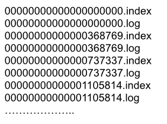
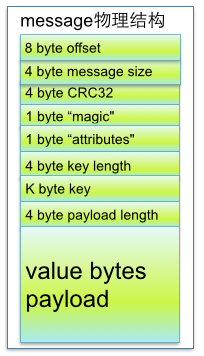

# Kafka

## Introduction

Apache Kafka 是一款开源的消息引擎系统（消息中间件，MQ）， **同时支持 P2P（点对点）和发布/订阅模型两种消息投递形式**

**MQ 的常规作用就是削峰填谷。**

以下是 Kafka 中常规的术语：

| 术语           | 含义                                                         |
| -------------- | ------------------------------------------------------------ |
| Broker（节点） |                                                              |
| Topic（主题）  | Topic 是抽象形式上的队列，在 Kafka 中 Topic 会被分为不同的 Partitioning。 |
| Partitiion     |                                                              |

## Kafka 的 Producer 结构

生产者的消息经过发送方法后，会经由以下几个组件发送：

1. 拦截器 
2. 序列化器
3. 分区器
4. 累加器

累加器的作用就是尽量累计合适量的消息，组成 BatchMessage 并发送已节省网络贷款。

因为累加器的关系，所以**消息发送是异步的**，调用 send 方法可能会立即返回，但是不意味着消息已经发送成功。

## Kafka 的

## Kafka 中的 Election（选举

Kafka 中的选举有如下几种：

1. Controller 的选举
2. Leader Partition 的选举

> Leader Election算法非常多，比如Zookeeper的[Zab](http://web.stanford.edu/class/cs347/reading/zab.pdf), [Raft](https://ramcloud.stanford.edu/wiki/download/attachments/11370504/raft.pdf)和[Viewstamped Replication](http://pmg.csail.mit.edu/papers/vr-revisited.pdf)。而Kafka所使用的 Leader Election 算法更像微软的[PacificA](http://research.microsoft.com/apps/pubs/default.aspx?id=66814)算法。

## Kafka 的语义保证

- At Least Once（最少消费一次）
- At Most Once（最多消息的一次）
- Exactly Once（精确消费一次）

 

不论是以上的任何语义保证，**都需要做到 Producer 到 Broker 之间消息的确保送达，以及 Broker 不丢失消息。**

 

生产者确保消息发送成功：

1. 使用带有 callback 的发送方式，确定消息发送成功
2. retries > 0，重发偶尔失败的消息

Broker 不丢失消息：

1. Producer 的 acks = all，需要全部的副本都接收到消息，即使发生 Leader 的重新选举也不会丢失消息
2. unclean.leader.election.enable = false，不允许非 ISR 节点（存在消息缺漏的节点）参与选举
3. replication.facto > 2，消息做适当冗余
4. min.insync.replicas > 1，确保 ISR 存在多个节点

 

作为 Producer 和 Broker 的配置，基本上可以保证 At Least Once 了，At Most Once 的语义强度更弱，随便怎么搞都行。

 

在强化语义到 Exactly Once 另外在 Consumer 端，需要确保先消费后修改位移，并且做好消息的幂等性。

## Idempotence（幂等性保证

幂等性保证是指一条消息多次发送在 Partition 中只保存一条，从而在 Broker 端保证消息不会重复。

另外借由幂等性，**也能进一步保证消息的有序性**，虽然消息在 Partition 中本身就是有序的。

开启幂等性之后，Producer 发出的消息会**带有 PID（Producer ID）和 Seq（Sequence Number）两个属性**，保证在单个生产者一条消息多次发送的幂等性。

> **通过 enable.idempotence = true 开启幂等性保证。**
>
> PID 和 Seq 都由 Kafka 客户端提供，对用户完全透明。

如果中间出现缺漏，则直接抛出异常。

> 该种实现可以参考 TCP，首先生成 ISN，在后续发送过程中递增，再根据端口来区分报文归属，以窗口的形式保证消息的有序并且不重复。

幂等性保证只针对于单个 Partition 和单个会话。

## Transaction（事务性保证

Kafka 的事务性保证，保证的最终目标是**多个读写操作的原子性**。

Kafka Client 引入了一个 Transaction Id，在 Client 启动时由用户指定。

Kafka Broker 引入了一个 Transaction Coordinator （TC）端，负责维护整个集群的 Transaction Log，该 Log 就近保存在 Topic 中，借由 Topic 实现日志的持久性。

另外，Kafka 的事务需要开启幂等性做前提。

相关流程如下：

1. 找到 Transaction Coordinator，通过向集群中的任意节点发送 FindCoordinate 请求。
2. 获取 PID，通过向 TC 发送 InitPidRequest 的请求，TC 同时保存了 Transaction ID 和 PID 的对应关系，并且对应的 epoch 增加，如果有还会继续之前未完成的操作。

> epoch 的作用是 PID 的有效性，Broker 收到 PID 相同但是 epoch 不同的消息时，会直接丢弃掉较小的。

### 相关参考

[Kafka 设计解析（八）：Kafka 事务机制与 Exactly Once 语义实现原理](https://www.infoq.cn/article/kafka-analysis-part-8)

## Kafka Comsumer Group（消费者组

## Kafka 的文件存储机制

Kafka 中每个 Topic 被分为多个 Partitiion（Partition 会尽量分配在集群中的不同节点。

Kafka 会以 Topic + Partitiion 序号作为消息日志的存放目录，所以单个 Partition 也可以比做是一个巨大的日志集合。

单个 Partition 目录中，又可以被分为多个 Segment File 集合，每个集合由以下两大部分组成：

-  data file - 数据文件，以 log 为后缀
- index file - 索引文件，以 index 为后缀

具体形式如下，名称为从0开始的偏移量，文件名就是当前文件中最早的偏移量：

data file 中是按照消息的时间顺序记录消息日志，单个消息结构如下：

offset 就是消息的偏移量，在一个 Partition 内单调递增，一个 offset 可以唯一确定一条消息。

而 index 文件则是对 log 文件的稀疏索引，会间隔一定的消息量记录 offset，具体对应关系如下：

可以按照跳表的逻辑来记忆该类的索引形式，index 文件就是 log 的耳机索引，索引间隔固定并且只有二级索引。

总的来说，Kafka 的消息查询是依据二分查找来实现的，时间复杂度为 O(LogN)。

简单描述其搜索过程为：

1. 根据消息的偏移量二分确定 index 文件（文件名就是最小偏移量，下个文件名就算是最大偏移量
2. 在 index 文件中查找到最后一个比偏移量小的记录，获取对应的在 log 文件中的物理偏移地址
3. 从文件偏移开地址始顺序查找 log 文件

（Kafka 的查找可以类比于跳表的查询，总共分为三层索引，最外层的文件名为第一层索引，index 文件内为第二层索引。

 

[Kafka文件存储机制那些事 - 美团](https://tech.meituan.com/2015/01/13/kafka-fs-design-theory.html)

[Kafka 的消息存储结构：索引文件与数据文件](https://shuyi.tech/archives/kafka-message-storage)

## 相关问题

