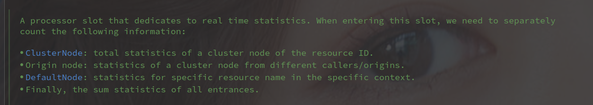

# ProcessorSlot 相关

---

[TOC]

---

##  概述

Sentinel 实现了

## ProcessorSlotChain

处理槽执行链，Pro

## NodeSelectorSlot 

## ClusterBuilderSlot

该槽位保存了资源（resource）的运行统计信息，包括：

- 响应时间（response time ）
- QPS
- 线程数
- 异常
- 由 ContextUtil#enter 标记的调用方列表

每个资源共用一个全局的 Cluster Node。

## StatisticSlot 

用于实时统计的处理器槽位，

## AuthoritySlot

校验权限的处理槽位，通过 AuthorityRule 来检查权限。

通过 AuthorityRuleManager 获取所有需要检查的 AuthorityRule。

## SystemSlot

通过 SystemRule 来检查相关内容。

## FlowSlot

流量控制相关，相关作用如下：

- Traffic Shapping
- Warmup
- Immediately reject
- Uniform Rate Limiting

## DegradeSlot 

请求降级相关处理槽位。

## 参考

- [Sentinel 官方文档](https://github.com/alibaba/Sentinel/wiki/Sentinel%E5%B7%A5%E4%BD%9C%E4%B8%BB%E6%B5%81%E7%A8%8B)