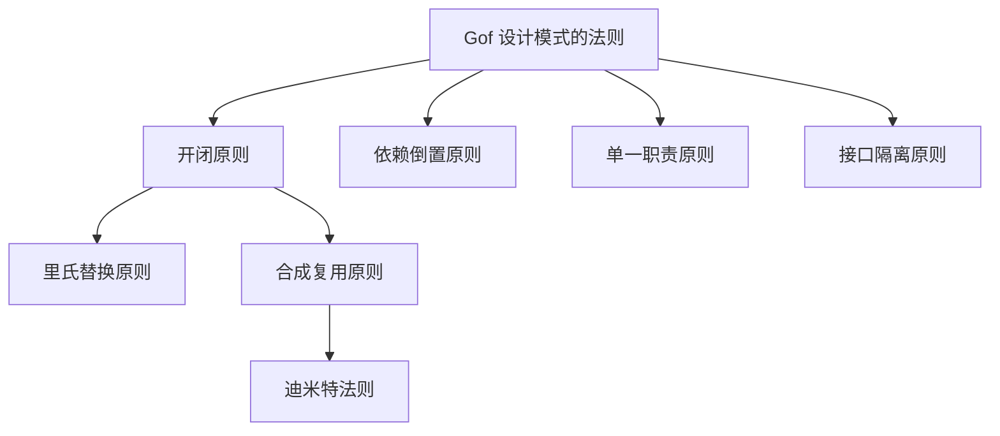
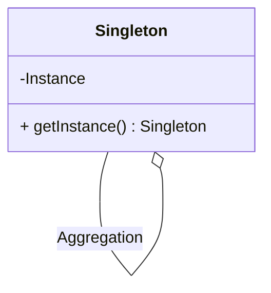
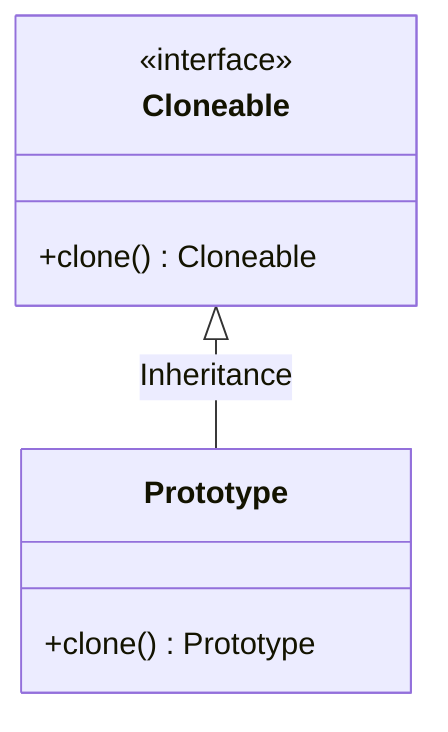
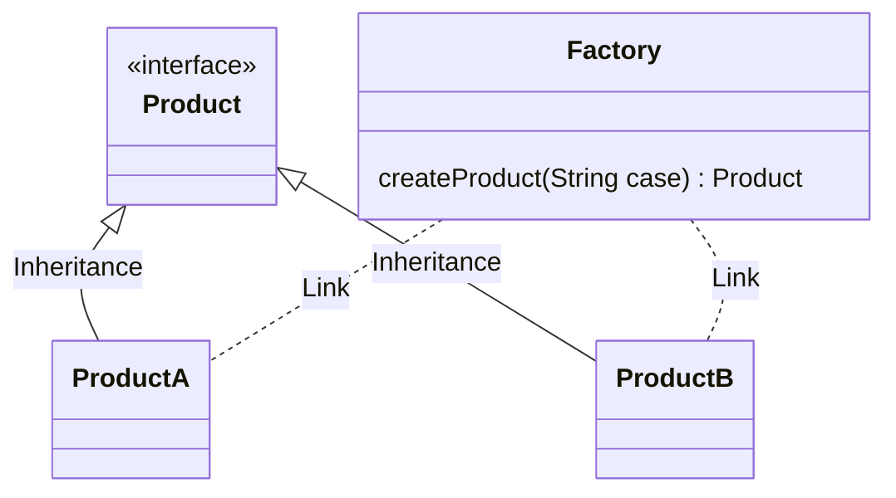
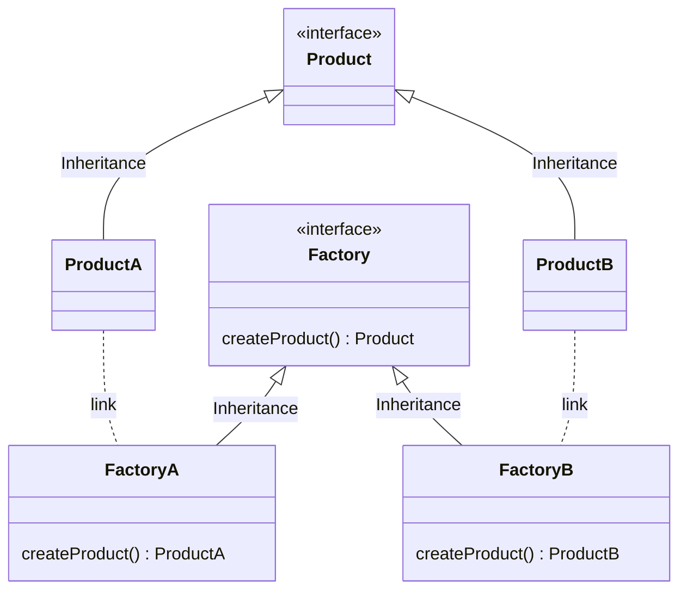
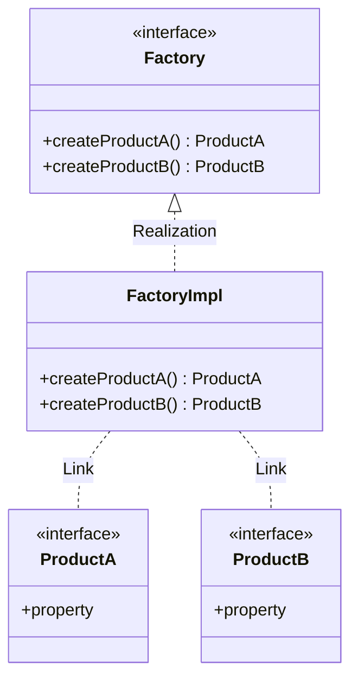
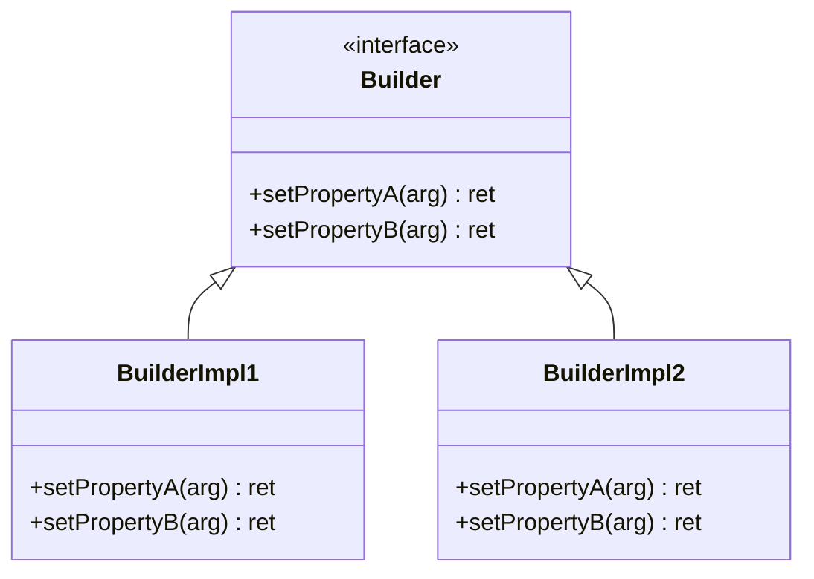
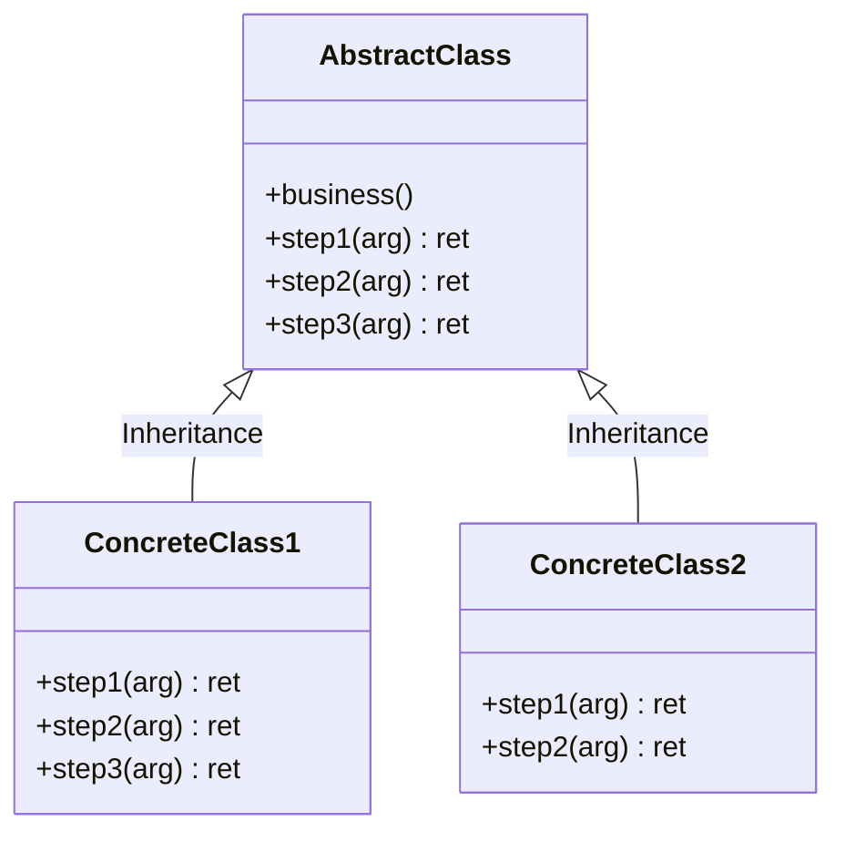
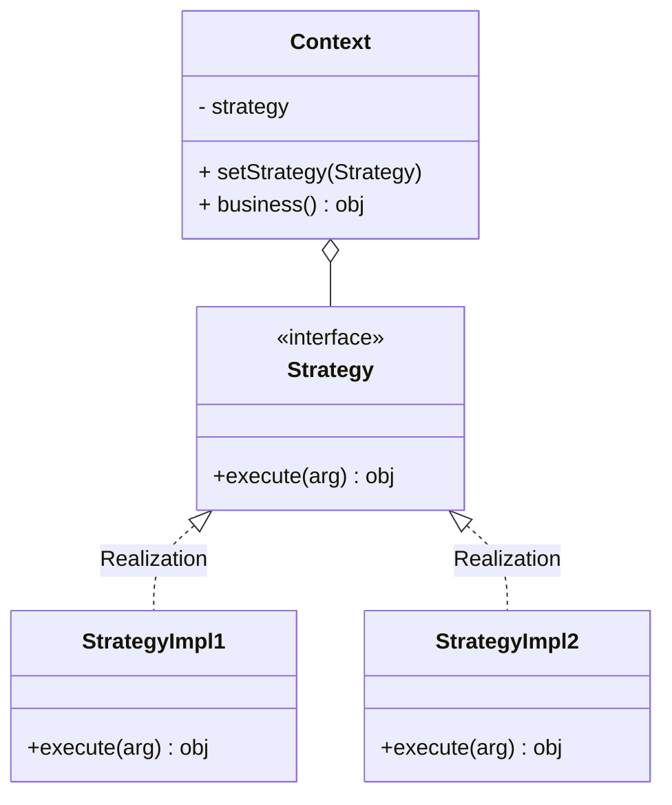

# 设计模式的简单整理

> Gof 的23种设计模式，个人理解偏多。


---


## 设计模式的七大法则

> 说是法则，但是有些不必完全遵守。




以上我理解中的七大法则之间的关系。

设计模式的最终目的：低耦合性，易于扩展，高复用且高稳定性。

<br>

### **开闭原则**

**对扩展开放，对修改关闭。**

**类应该要易于扩展，功能变更的时候不应该修改原方法逻辑，而是应该通过扩展的形式来完成。**

扩展的形式包括组合或者继承，例如代理模式，装饰器模式或者模板模式都很好的符合了开闭原则。

！！大部分情况下，开闭原则都应该被遵守。

<br>

### **里氏替换原则**

**替换就是指在所有使用父类的地方，可以用子类代替，因此也要求子类不该修改父类的逻辑。**

我理解中是对开闭原则的进一步补充，规范继承的形式准则。

如果实际情况违背了里氏替换原则，则表明抽象不合理，父类并不能代表全部的子类，例如对动物类统一了吼叫的逻辑，但动物不可能只有一种叫声。

<br>

### **合成复用原则**

**该原则规定，除非共性固定且突出，否则都应该要尽量使用聚合等关联关系来代替继承关系来实现类之间的关联。**

继承就表示子类和父类之间的高耦合度，父类的任何改动都会影响到子类，且对子类会产生一些约束和限制，不利于扩展。

同理，也可以理解为对开闭原则中组合的规范。

> 如果是高度同质性的，继承还是合理的，并不是完全否定继承的作用。

<br>

### **迪米特法则**

**该法则规定如果两个类没有直接关系，那么就不应该产生直接的相互调用，可以通过第三方转发该调用。**

**该法则提高了类之间的独立性，降低了耦合度，是对合成复用原则的约束和补充。**

**SpringBoot 中对 BeanFactoryPostProcessor 的调用可能就是这个法则，**使用 Delegate 类间接调用。

<br>

### **依赖倒置原则**

**类之间的依赖需要按照一定的规则顺序，高层抽象类不能依赖底层的具体实现。**

**违背依赖倒置原则会大大增加类间的耦合性不利于代码维护。**

<br>

### **单一职责原则**

**简单理解就是希望类的功能尽量单一，一个类不应该承载太多的职责。**

**降低类的复杂度，减小类的实现粒度，都有利于减小类之间的耦合性，方便重用和后期维护。**

不仅仅是针对类，针对类中的方法应该也需要向改原则靠拢，简单清晰的方法更容易维护和重用。

<br>

### **接口隔离原则**

**和单一职责原则很相似，在我理解可能就是规定的对象不同，接口隔离就是特指接口。**

**简单理解该原则，可能就是规定接口的粒度需要尽量的小。**

**比如 Java 中的 Closeable 之类的接口，或者 Spring 中的各类顶级接口。**

<br>


<br>

## 设计模式的分类

根据目的来分设计模式可以分为创建型，结构型和行为型。

**创建型模式主要着力于对象的创建过程，将创建和使用过程分离。**

**结构型模式主要着力于对象的继承和实现，如何通过一些基本接口和对象组装成一个更大的结构。**

**行为型模式主要描述类之间的调用关系，规范化方法和方法的职责，用于描述类或对象之间协作的过程。**

> 个人理解，创建型的模式属于行为模式的一种，因为规范的就是创建的行为。
>
> 

<br>

---

## 创建型模式

创建型模式主要关注对象的创建过程。


### 单例模式（Singleton）



<br>

单例模式必须保证类的实例对象在系统中的唯一性。

**类似一些重量级对象都可以使用单例模式实现，提供一个全局的访问点，保证全局的访问安全，也减少内存的浪费。**

**单例模式主要有以下几个核心：**

1. **构造函数私有化，阻止类外部的初始化**
2. **类内部持有自身唯一实例的引用**
3. **提供一个对外的获取接口**

单例模式的持有和创建都在类内部，基本的单例模式如下，首先是**饿汉模式**：

```java
public class HungrySingle{
    	// 内部持有实例引用
    	private static final HungrySingle INSTANCE = new HungrySingle();
    	
    	// 私有化构造函数
    	private HungrySingle(){
            	// 私有化之后，JVM也不会自动生成一个public的无参构造
        }
    
    	// 提供统一的话获取方法
    	public static HungrySingle getInstance(){
            	return INSTANCE;
        }
}
```

**饿汉模式的特点就是在类加载时候就会实例化对象，通过 JVM 的类加载机制保证实例的唯一性。**

而另外一种**懒汉模式**，则是在此基础上增加了**懒加载**的特性，只有在需要的时候才会初始化。

```java
public class LazySingle{
    	private static final LazySingle INSTANCE;
    
    	private LazySingle(){}
    
    	public static LazySingle getInstance(){
            	if(INSTANCE == null){
                    	INSTANCE = new LazySingle();
                } 
            	return INSTANCE;
        }
}
```

但以上代码并非是线程安全的，多线程环境下可能仍然会创建多个实例对象。

<br>

为了保证懒汉模式的线程安全性，确保实例对象的唯一性，所以又有了**静态内部类，枚举以及双重检查锁模式**。

以下是**双重检查锁**的 `getInstance` 方法：

```java
public class LazySingle{
    	// INSTANCE 实例必须使用 volatile 标识
    	private volatile static final LazySingle INSTANCE;
    
    	private LazySingle(){}

        public static LazySingle getInstance(){
            if(INSTANCE == null){
                    synchronized(LazySingle.class){
                            if(INSTANCE == null){
                                	INSTANCE = new LazySingle();
                            }
                    }
            }

            return INSTANCE;
        }
}
```

**使用了 synchronized 来保证创建过程的线程安全，用 volatile 保证 INSTANCE 的可见性，和创建过程的有序性**

>  在外先判断是否为空是必然的，而第二次加锁则是为了避免多个线程同时等待锁释放后的再一次初始化。

<br>

**静态内部类**的实现方式如下：

```java
public class LazySingle{
    
    	private LazySingle(){}
    
    	// 由静态内部类持有单例对象的引用。
    	private static class InstanceHolder{
            	private static final LazySingle INSTANCE = new LazySingle();
        }
    	
    	public static getLazySingle(){
            	return InstanceHolder.INSTANCE;
        }
}
```

**唯一实例是由静态内部类持有的。**

在加载外部类 LazySingle 的时候并不会直接加载内部类 InstanceHolder，只有在使用到内部类的相关属性的时候才会去进一步加载，也就是在调用 getLazySingle 时才会初始化。

<br>

另外就是 effective java 作者也强烈推荐的**枚举类实现**方式：

```java
public class LazySingle{
    	private LazySingle(){}
    
    	private enum  InstanceHolder{
            	INSTANCE;
            	
            	private final LazySingle single;
            
            	InstanceHolder(){
                    	single = new LazySingle();
                }
            
            	private LazySingle getSingle(){
                    	return single;
                }
        }
    	
    	public static getLazySingle(){
            	return InstanceHolder.INSTANCE.getSingle();
        }
}
```

该种实现方式充分利用了枚举类型的特性，保证了加载的线程安全性和实例对象的唯一性。

而且是所有单利模式中唯一一种免疫序列化，反射破坏形式的实现。

<br>

再来说说反射对单例模式的破坏。

单例模式为了防止对象的再次创建，会将构造函数设置为私有的，但是反射是可以绕过这种权限控制的。

```java
public class Solution {
    static class Single {
        static int cnt = 0;

        private Single() {
            cnt++;
        }

        public void single() {
            System.out.println(cnt);
        }
    }
    public static void main(String[] args) throws NoSuchMethodException, InvocationTargetException, InstantiationException, IllegalAccessException {
        final Class<Single> singleClass = Single.class;
        // 获取构造函数
        final Constructor<Single> declaredConstructor = singleClass.getDeclaredConstructor();
        // 修改访问权限
        declaredConstructor.setAccessible(true);
        for (int i = 0; i < 10; i++) {
            final Single single = declaredConstructor.newInstance();
            single.single();
        }
    }
}
```

> 反射在提供了更大的便利的同时，好像也出现了一些安全问题啊。

<br>

单例模式的使用实例：

- Spring Bean

以 Java 为主语言的应该都知道 Spring 中的 Bean 默认是以单例模式创建的，并且用了锁来保证线程安全性，以 Map 的形式保存了创建的 Bean。

> 待补充，感觉单例模式的例子应该还是很多的。

<br>

最后来总结一下单例模式的优点：

1. **单例模式保证了一个类仅有唯一的实例，并提供一个全局访问点。**
2. **另外由于控制类的数量也可以有效的节省资源。**

<br>

<br>

### 原型模式（Prototype）



<br>

这个可能是设计模式中简单程度仅次于单例模式的一种了，甚至于 Java 中它比单例更简单。

原型模式用来创建重复的对象，不同于一般的 new，原型模式的对象创建用克隆来完成，对于 Java 来说就是 Cloneable 接口，clone 方法会带上原类型的所有属性，所有也免去了属性配置的问题。

<br>

**Java 中的 Object 类就提供了 clone 方法，所以 Java 中每个类都可以使用原型模式。**

而且要注意的是 **Java 中的 clone 方法，会跳过构造函数的执行**，**所以使用克隆方法的优势就是性能好**，起码优于逐个 new 对象。

在任何创建大量重复对象的场景下，都可以尝试用原型模式替换。

```java
public class Prototype implements Cloneable{
		// 原型类只需要提供一个克隆的方法
        @Override
        protected Object clone() throws CloneNotSupportedException {
            return super.clone();
        }
}

```

<br>

原型模式需要注意的点有：

1. 克隆会直接跳过构造函数
2. 克隆还需要注意深浅的区别

<br>

**Spring 中 IOC 容器提供的两种基础的创建模式就是单例和原型。**

<br>

<br>

### 简单工厂模式

工厂模式的思路很简单，**就是完全将创建过程剥离，对象的创建交由工厂类完成，使用者并不需要知道如何创建的的对象。**

> 这里的**工厂**这个概念，就非常适合使用**单例模式**实现。

<br>

！！简单工厂模式并不属于 GoF 设计模式。

**简单工厂模式就是将一个或者多个对象的创建交由单个工厂类完成，工厂对外提供一个创建方法，包含对象的完整创建逻辑。**

很多情况下可以再创建方法中使用 case 判断区分创建不同种类的产品。

类图如下：



Java 中简单工厂模式简单来说可以有如下的实现：

```java
// 工厂类
public class SimpleFactory {
    public Product createProduct(String productName){
        if(productName.equals("A")){
            return new ProductA();
        }
        if(productName.equals("B")){
            return new ProductB();
        }
        return null;
    }
}

// 产品类接口
interface Product{
    String getName();
}

// 产品A
class ProductA implements Product{
    @Override
    public String getName() {
        return "A";
    }
}

// 产品B
class ProductB implements Product{
    @Override
    public String getName() {
        return "B";
    }
}

```

可以看到这种实现虽然也剥离了创建对象的逻辑，但是它**严重违反了开闭原则**，如果引入一个新产品，就需要新增一个创建方法，或者修改原有的创建方法，除此之外几乎就别无他法。

而且**一定程度上的违反了单一职责原则**，一个工厂负责所有类的创建，太过繁杂。

<br>

实现的实例：

- Spring 的 BeanFactory

简单工厂模式中产品的创建过程和工厂耦合过于严重，任何对创建过程或者产品的修改都需要直接修改原逻辑，严重违反了开闭原则。

但是在 Spring 中，对象的创建被进一步的拆分为，实例化，属性填充，初始化等步骤，并且都设了合理的钩子函数，以及使用一定形式 XML 或者注解的形式去声明一个对象的属性等，进一步优化的简单工厂模式带来的难以扩展的缺点。

并且利用工厂管理的依赖的形式，几乎完美的解耦了类之间的依赖关系，可以更好的关注于业务。

<br>

<br>

### 工厂方法模式

咳咳咳。。所以基于扩展性考虑引申出了工厂方法模式，工厂方法模式可以算是简单工厂模式的进一步抽象。



**将工厂的创建方法抽象到工厂接口中，具体的创建逻辑延迟到具体的子类中。**

往往一个产品会对应一个工厂子类，以增加实现类的形式完成对不同产品的需求扩展。

以 java 的 Reader 为例，就可以使用以下的方法：

```java
interface FactoryMethodInterface {
    	Reader create(File file) throws FileNotFoundException;
}

class BufferReaderFactory implements FactoryMethodInterface {
        @Override
        public BufferedReader create(File file) throws FileNotFoundException {
                final FileInputStream in = new FileInputStream(file);
                final InputStreamReader in1 = new InputStreamReader(in);
                return new BufferedReader(in1);
        }
}

class FileReaderFactory implements FactoryMethodInterface {
        @Override
        public Reader create(File file) throws FileNotFoundException {
            	return new FileReader(file);
        }
}
```

<br>

相比于简单工厂模式来说，**工厂方法模式不再局限于单一的工厂类**，更有利于代码解耦和扩展。

但如果在使用工厂方法模式的时候，抽象接口也只有单一继承，那么也就和简单工厂模式没啥区别了。

总得来说工厂方法模式中，**一个工厂类仍局限于单个的产品类，并且增加产品类就需要创建新的工厂实现类的设定，很大程度上增加了编码的复杂性。**

<br>

具体的使用实例：

- Spring 中的 FactoryBean 类

FactoryBean 接口中定义了 getObject 方法，是最简单的工厂方法模式的实现，使用 FactoryBean ，用户可以绕开 Spring 的 Bean 创建体系，个性化创建一系列对象。

<br>

<br>

### 抽象工厂模式

如果说从简单工厂模式到工厂方法模式是提取了公用的方法接口，进一步抽象了工厂类。

**那么抽象工厂接口就是进一步抽象了产品类，产品也不仅仅局限于一种，对应的产品类的扩展，工厂创建类的创建方法数也增加了。**

类图如下：



继续拿 Reader 举例，此时如果需要添加一个 Writer 类，假设不同的 Reader 和 Writer 是一种对应关系，此时就的工厂方法模式可能就有点顶不住了。

根据抽象方法模式实现之后如下：

```java
class BufferReaderFactory implements AbstractFactoryInterface {
    @Override
    public BufferedReader createReader(File file) throws FileNotFoundException {
        final FileInputStream in = new FileInputStream(file);
        final InputStreamReader in1 = new InputStreamReader(in);
        return new BufferedReader(in1);
    }

    @Override
    public Writer createWriter(File file) throws FileNotFoundException {
        final FileOutputStream out = new FileOutputStream(file);
        final OutputStreamWriter outputStreamWriter = new OutputStreamWriter(out);
        return new BufferedWriter(outputStreamWriter);
    }
}

class FileReaderFactory implements AbstractFactoryInterface {
    @Override
    public Reader createReader(File file) throws FileNotFoundException {
        return new FileReader(file);
    }

    @Override
    public Writer createWriter(File file) throws IOException {
        return new FileWriter(file);
    }
}
//  抽象工厂接口
interface AbstractFactoryInterface {
    Reader createReader(File file) throws FileNotFoundException;

    Writer createWriter(File file) throws IOException;
}
```

<br>

抽象工厂模式的接口中存在不止一种产品的创建方法，并没有硬性要求。

<br>

### 工厂模式总结

理论上说简单工厂模式已经拥有了工厂模式的核心，**以工厂的概念抽离出对象创建的逻辑，实现对象创建和使用的解耦。**

但是简单工厂模式有以下几个缺点：

1. 不符合开闭原则，难以扩展。
2. 单工厂的逻辑过重，承载了太多的创建逻辑。

单工厂的逻辑过重的问题会随着需要负责的类的增多而凸显，增加维护难度，很大程度上违背了单一职责，接口隔离原则。

针对以上问题，就有了工厂方法模式，**工厂方法模式在简单工厂模式的基础上，抽象出创建方法，利用不同的子类实现来分散单工厂的逻辑，方便维护。**

工厂方法模式可以说已经不错了，抽象程度也基本足够，但是在一个工厂类一个创建方法的形式下，**很难描述具有关联关系的不同的产品类。**

**所以在工厂方法模式的基础上，抽象工厂模式中抽象出了不同的创建方法，应对多个关联产品的创建。**

个人感觉，**这个关联关系很重要**，如果用一个抽象工厂模式实现两个完全不搭边的产品的创建，那就又回到了简单工厂模式，以新增方法的形式去兼容新产品的加入。

类似于 Reader 和 Writer 的实现，FileReader 同一个工厂创建的应该就是 FileWriter。

<br>

<br>

<br>

### 建造者模式

建造者模式也是一种创建型模式，不同于工厂模式完全分离对象创建和使用的逻辑。

**建造者模式拆分了对象的创建过程，对创建的流程进行抽象，使创建过程可以分步骤或者分模块进行，使对象创建的范围更加可控。**

类图如下：




我们可以用电脑组装的过程为例子来理解：

```java
class Director{
    private Builder interBuilder = new InterBuilder();
    private Builder amdBuilder = new AMDBuilder();

    public Computer builder(){
        final Computer computer = new Computer();
        computer.cpu = interBuilder.cpu();
        computer.memory = amdBuilder.memory();
        return computer;
    }

}

class Computer{
    private String cpu;
    private String memory;
}

interface Builder{
    String cpu();
    String memory();
}

class InterBuilder implements Builder{
    @Override
    public String cpu() {
        return "Inter CPU";
    }
    @Override
    public String memory() {
        return "Inter Memory";
    }
}

class AMDBuilder implements Builder{
    @Over建造者模式关注的是对象的创建过程或者说步骤。ride
        public String cpu() {
        return "AMD CPU";
    }
    @Override
    public String memory() {
        return "AMD Memory";
    }
}

```

建造者模式中存在四种对象：

1. Product  产品：指代最终要生成的对象，例子中的Computer
2. Builder  建造者接口/基类： 抽象出创建的流程或者组成部分，供子类实现。
3. Concrete Builder 实际建造者： 实现建造者接口/基类，完成具体的建造逻辑
4. Director 组装类 : 封装一个具体的组装逻辑，负责调度不同的建造者生成对应的产品

<br>

使用实例：

- Lombok @Builder 注解

Lombok 中就有一个 @Builder 的注解，该注解以 Setter 方法返回当前实例的形式来实现建造者模式，可以分别对单个成员变量进行配置。

<br>

### 工厂模式和建造者模式的比较

首先两个模式的目的和作用就不一样。

工厂模式**的目的调用和创建两个操作之间的解耦**，对调用者来说屏蔽了创建的过程，工厂类也不关心具体的创建。

但建造者模式却不同，**它关注的是对象的创建过程，通过拆分可一个完整的创建过程的方式让创建过程更加清晰。**

按照步骤或者成分的拆分，会使创建过程更加有条理，易于把握对象的整个创建过程。

所以很大程度上工厂模式和建造者模式可以互补。


## 创建型模式总结

首先明确一点，上文也说过，创建型模式的重点都在创建中，该类型模式不关注调用或者继承关系，他关注的就是对象的创建。

**单例模式旨在过各种手段保证对象的创建过程只执行一次，顺带保证了对象的唯一性。**

**原型模式则是通过拷贝的方式，加速对象的创建过程(拷贝会跳过构造函数的执行)，或者因为都是相同的源对象而具有相同的属性。**

工厂模式则是更加纯粹的创建型模式，它的关注点在于对创建这个过程的解耦，调用者不需要关心创建的逻辑，例如你买车总不会需要知道整辆车的原理吧。

**简单工厂模式就可以完成对该过程的解耦，将创建的逻辑集中在一个工厂类，并提供一个对外的生产方法，调用者直接调用该方法获得自己想要的对象。**

**工厂方法模式是对工厂类的进一步抽象，提取出公共方法后分子类实现各产品族自己的逻辑，避免单工厂类单来的强依赖**，这里并不是说简单工厂模式就没有上层接口，工厂方法模式在只有一个工厂类的时候，也就是简单工厂模式。

抽象工厂模式则是对产品族的扩展，对于两个无任何关系的产品，简单工厂和工厂方法模式都可以支持，简单工厂模式可以增加一个创建方法或者在唯一创建方法中增加该类创建判断，工厂方法模式可以创建对应的实现子类。

但是对于有关联性的产品，上述两个模式处理起来其实和无关联的产品没啥区别。

**抽象工厂模式在上层接口中就定义了产品族中不同产品的创建方法，以此来确定关联性。**

关于抽象工厂方法，可能是我个人理解偏多，因为对产品族和工厂类的扩展工厂方法模式其实已经能满足大部分需求了。

建造者模式和工厂模式的区别就是它的关注点在创建的流程，工厂模式是将创建当做一个整体来看的，并不限制或者说不关心创建的流程。

**建造者模式则是对创建的流程进行抽象拆分，细化创建的步骤或者模块，更加适用于复杂对象的创建。**


> 单例模式关注对象创建的次数。
>
> (?) 原型模式关注对象创建时的属性迁移。
>
> 工厂方法模式抽象创建过程，减少调用方和对象的耦合关系。
>
> 抽象工厂模式进一步抽象需要创建的对象。
>
> 建造者模式与上述解耦创建过程的模式不同，极度的细化创建的流程，使对象创建更加清晰。


## 结构型模式

结构型模式主要关注类和类之间的关系，主要是有聚合和继承。

根据类之间的关系可以分为：

1. 类结构型模型 - 继承
2. 对象结构型模型 - 聚合

**继承一般意义上都具有强关联型，或者说强侵入性，子类必须继承父类的一系列特性，那么父类的修改必定会影响到子类，子类也会有所束缚。**

相比之下，聚合就显得更加了灵活。


### 代理模式

 代理模式从结构上并不难理解，就像投资一样，找基金经理就是找代理，你的动作都是一样的花钱投资，他帮你去操作真实的投资。

在这里基金经理就是代理对象，理财投资就是主题。

这就是代理模式的核心内容：**通过中间的代理对象间接调用真实主题，降低了系统的耦合性，而且代理对象更易于扩展扩展，而不需要改动真实主题，这也起到了保护真实主题的作用。**

其中的几个对象：

1. 代理对象 - 封装真正的调用逻辑
2. 抽象主题 - 对真实调用的抽象
3. 真实主题 - 真实的业务逻辑

类图如下：

 

Java 中的简单实现如下:

```java
   interface FinancialManagement {
        void investmentFund(float money);
    }

    class RealFinancialManagement implements FinancialManagement {
        @Override
        public void investmentFund(float money) {
            System.out.println("亏不死你!");
        }
    }

    class Proxy implements FinancialManagement {

        RealFinancialManagement realFinancialManagement = new RealFinancialManagement();

        @Override
        public void investmentFund(float money) {
            realFinancialManagement.investmentFund(money);
        }
    }
```

**重点就在透过代理去调用方法，而不是直接调用真实方法。**

除了上面的静态代理，也就是手动编码实现一个代理方式之外，还有一种更加通用的动态代理模式。


JDK 中就提供了动态代理的 API，demo如下：

```java
interface Subject{
    	void doSomething();
}

class RealSubject implements Subject{
        @Override
        public void doSomething() {
            	System.out.println("// realSubject do something");
        }
}

class MyProxy implements InvocationHandler{
        Subject subject;
        public MyProxy(Subject subject) {
            	this.subject = subject;
        }
        void before(){
            	System.out.println("// ====== before");
        }
        void after(){
            	System.out.println("// ====== after");
        }
        @Override
        public Object invoke(Object proxy, Method method, Object[] args) throws Throwable {
                before();
                method.invoke(subject,args);
                after();
                return null;
        }
}

public class Main {
        public static void main(String[] args) throws IllegalAccessException, InstantiationException, NoSuchMethodException, InvocationTargetException {
                // 获取代理类
                // JDK动态代理只能代理接口
                final Class<?> proxyClass = Proxy.getProxyClass(Subject.class.getClassLoader(), Subject.class);
                // 获取构造函数
                final Constructor<?> constructor = proxyClass.getConstructor(InvocationHandler.class);
                // 创建具体的代理对象
                final Subject subject = (Subject) constructor.newInstance(new MyProxy(new RealSubject()));
                subject.doSomething();
                // 另外一种创建形式
        //        final Subject subject1 = (Subject) Proxy.newProxyInstance(Subject.class.getClassLoader(), new Class[]{Subject.class}, new MyProxy(new RealSubject()));
        }
}

```

JDK 动态代理可以在运行时使用反射动态的创建一个代理类。

**JDK 动态代理只能代理接口，原因其实很简单，因为使用 Proxy.getProxyClass() 创建的类对象是默认继承 Proxy 对象，在单继承的 Java 中，也就不能指定另外一个类继承了。**

**JDK 动态代理的实现会使用根据接口创建一个实现了接口并且继承了 Proxy 的代理类，在调用接口方法的时候根据动态单分配原则会直接选择到代理类中实现的该方法。**

除了 JDK 的动态代理，Spring 的 AOP 还有另外一种实现动态代理的机制，就是 CGLIB 的字节码增强技术，是一种直接修改字节码的技术。


### 适配器模式

**适配器模式主要用来作异构接口的适配，简单来说就是将一个类的方法转化为调用者希望的另外一种接口。**

说到这个常常使用电压来比喻，比如国内电脑一般都是 220V 电压下运行，所以出国之后需要**一个适配器将电压调整到合适的大小**。

适配器模式的角色如下：

1. Target 目标角色，通过适配器希望得到的接口形式
2. Adaptee 当前角色，待适配的角色
3. Adapter 适配器，就是将Adaptee转化为Target的工具。

类图如下：

 

类图也蛮简单的，适配器直接持有待适配角色的实例引用，并继承实现目标角色。

简单的Demo如下：

```java
    /**
     * 就是将乘2的方法变成乘4的过程
     */
    interface Target {
            int multiply4(int i);
    }
    class Adaptee {
            int multiply2(int i) {
                	return i * 2;
            }
    }
    class Adapter implements Target {
            Adaptee adaptee = new Adaptee();
            @Override
            public int multiply4(int i) {
                return adaptee.multiply2(i) * 2;
            }
    }
```

Target 就是目标对象是系统希望的调用，但是目前仅有 Adaptee 适配对象，系统显然无法直接调用适配对象，方法名也不一样，实现也完全不一样。

所以 Adapter 适配器对象继承了目标对象，提供统一的方法签名方便调用，并持有适配对象的引用，对适配器对象的调用方法进行逻辑包装，使其符合想要的方法实现。


该模式也可以用来作调用方和被动用方的解耦，哪怕被调用方方法完全不一样都不要紧，只需要修改适配器就好了，完全不影响以前的逻辑。

但也有一个很突出的缺点，就是这个适配器可能仅仅只能作用于一个待适配对象，这样的话不同的待适配对象就需要不同的适配器，增加的类的数目和编码的复杂度。

另外适配器模式也不能盲目的用，如果适配器的逻辑非常复杂，复杂到超过修改原有逻辑的程度，那就要考虑是不是代码设计就有问题了。


### 桥接模式

桥接模式可能并不是一个常用的设计模式，但它确实非常有用。

桥接模式的核心思想就是：**将抽象部分与实现部分分离，使它们都可以独立地变化。**

分离之后的类就可以在**多个维度上面保持良好的扩展性。**

例如一般情况下我们使用继承的关系来扩展，但一个东西如果有多个属性维度的变化都由继承来扩展的话，那扩展所需要的类是倍数增加的。

拿电脑举例，CPU 可以使用 Inter，也可以使用 AMD 的，这就是两种实现，但如果在加个内存呢，内存我们按大小来8，16，32就又多了三种实现，排列组合就形成了6种子类，如果再多几种属性怕是没法玩了。


桥接模式类图如下：

 


简单示例如下：

```java
  interface Memory{
        void store();
    }
    class SamsungMemory implements Memory{
        @Override
        public void store() {
            System.out.println("三星的内存");
        }
    }
    class ToshibaMemory implements Memory{
        @Override
        public void store() {
            System.out.println("东芝的内存");
        }
    }
    static abstract class Computer{
        Memory memory;
        public Computer(Memory memory) {
            this.memory = memory;
        }
        abstract void doSomething();
    }
    class MyComputer extends Computer {
        public MyComputer(Memory memory) {
            super(memory);
        }
       @Override
        public void doSomething() {
            super.memory.store();
        }
    }
```

上述代码的功能通过继承也能实现，但是如果在内存之外在加属性，也通过继承来实现，那么一个类中就必须同时实现两个接口，且无法单独变化。


### 装饰模式（Decorator）

装饰模式的作用就是**在不改变当前功能的情况下，动态的增加一些功能，也可以说是对当前类的增强。**

一般的情况下，扩展是用继承来实现的，但是这就有一个问题，随着扩展次数的增多，类会越来越臃肿，层次混乱。

所以装饰模式采用的是聚合的方法，持有待装饰对象的引用，并扩展其方法，因为仅仅是调用，所以也不会对原来功能造成影响。

类图如下：

 

简单来说也是具体的装饰器类持有原实现类的引用，通过在调用前后加功能模块的形式对原类作增强。

Java中的InputStream就是装饰模式的最好实践，以下是JDK中FilterInputStream的成员图：

 

可以看到该类继承了InputStream，又持有一个InputStream的对象引用，并且构造函数中必须传入一个InputStream。

其中InputStream就是类图中的Component，FilterInputStream就是Decorator。


### 外观模式

外观模式又可以称为门面模式，**该模式旨在为不同的子系统提供一个一致的访问入口，从而屏蔽调用和实现的复杂性。**

外观模式的类图应该是23种模式中最简单的了。

类图如下：

 

网上的博客好像都是通过开灯的例子来介绍的，对外提供的方法连着调用灯的开启方法打开所有的灯。

但我感觉这个例子可能会有点奇怪，对外提供的统一接口不应该是粗暴的遍历子系统调用，而是有自己的路由转发逻辑。

类似于SpringMVC中的DispatchServlet，是一个路由中转乃至网关的角色。

原本调用者如果需要调用过各个子系统就需要持有各个子系统的引用，而且还需要知道具体的调用逻辑，但是通过门面模式，所有对子系统的调用都可以转到Facade类中，这是从调用者方面，对调用关系的完全解耦。


### 享元模式

享元模式旨在通过共享对象的方式，来减少资源的消耗。

对于一个业务对象将其分为以下两部分状态：

1. 内部状态，对象的内部状态，不会随着环境的变化和变化，也就是无关环境的状态，不需要额外配置。
2. 外部状态，就是指的随着环境的变化而变化，不可共享的状态。

类图如下：

 

其中的四种对象角色分别是：

1. Flyweight，共享的对象
2. SharedFlyweight，表示内部状态
3. UNSharedFlyweight，表示外部状态，不可共享
4. FlyweightFactory，代表该类的工厂，提供一个公共统一的获取入口

享元模式最典型的实现就是各类的池化技术。

例如 JDBC 的连接池，每个连接就是Flyweight，每个连接的目标数据库都是一样的，但是每个连接的操作都不一样。

另外 JDK 中的Long等包装类型也使用了享元模式，或者说它们才是最正宗的实现。

例如Integer类，在使用 Integer.valueOf 方法时，-128~127 便是 SharedFlyweight 对象，其他都属于 UnSharedFlyweight

不过他的工厂直接就是自己本身。


### 组合模式(-)

组合模式是用一个树状结构，来描述一种**部分-整体关系**的模式，是单个对象和整体都具有一致的访问性。

组合模式的使用并不多，我了解有限，所以先在这里贴一下类图：

 

叶子节点和非叶子节点都继承顶级接口，所以对外可以提供一致性的访问形式。

以上是安全性的组合模式，另外还有透明性的，类图如下：

 

区别就在于Leaf节点是否具有操作节点的方法，原先可以根据是否具有这些方法来判断是否是叶子节点，而现在需要根据getChilds()的返回值确定是否是叶子节点。

对于部分-整体的结构，或者说树状结构，一般情况下都可以使用该模式。


## 结构型模式总结

上文有说到，结构型模式关注的是类和类之间的结构关系，其实更准确来说是被调用者或者说服务提供者的实现结构。

代理模式是通过代理类对外提供访问入口，在隐藏真实实现的同时，也可以在代理类中完成扩展。

适配器模式是通过适配器类对真实的被调用接口做一层适配，一般情况下都是调用方式的转变，所以一定程度上可以看做是特殊的代理模式。

桥接模式则是提供了一种多继承形式的代替方式，使用聚合进行代替，在多维度的属性中，采用多继承的形式势必会导致子类的暴增，使用桥接模式则可以将原来的乘法变为加法，大大增强类的扩展性。

**装饰模式则是侧重在不改变当前实现的基础上，完成了对原始类的增强。**

外观模式则是通过**提供一个统一的对外调用方法的形式**，调用者在调用时也就不需要直到各个子系统的调用逻辑。

到了享元模式，则完全是内部的实现逻辑了，**对一个对象的细粒度拆分，进一步对其内部状态进行整理，使部分对象可共享**，JDK的Integer类我觉得是这个模式的完美实现也容易理解，但作用最大的应该还是各种池化技术。

组合模式其实我是刚看，也没啥理解，**个人感觉是对一类具有层次结构的对象的组合形式，继承实现统一接口，对外展示为相同的调用形式。**


> 适配器模式


## 行为型模式

行为型模式关注的就不是类之间的结构关系了，它关注的是类和类之间的调用关系，多个类如何协调完成一个功能。

行为型模式分为**类行为模式**和**对象行为模式**，前者采用继承机制来在类间分派行为，后者采用组合或聚合在对象间分配行为。

由于组合关系或聚合关系比继承关系耦合度低，满足“合成复用原则”，所以相对来说，对象行为模式比类行为模式具有更大的灵活性。

<br>

### 模板方法模式

**模板方法模式旨在抽取出一个统一的算法骨架模板作为超类，而将一些特定的操作延迟到子类中实现。**

该模式的类图如下：




<br>

其中角色分为以下两部分：

1. 超类，类中已经给出了业务逻辑的基本骨架，并且提供了几个钩子方法供子类实现
2. 具体实现子类，补充实现抽象类中的钩子方法或者抽象方法，对整个算法框架做一个补充扩展。

调用者直接调用不同的实现子类，就可以使用不同算法，一定情况下也可以只实现部分方法。

<br>

使用示例如下：

- JDK 的 HashMap 和 LinkedHashMap 

LinkedHashMap 继承了 HashMap，并且实现了 afterNodeAccess 和 afterNodeInsertion 等钩子方法，在原增删方法的逻辑后面增加了链表的相关操作。

- Netty 的 EventLoopGroup 相关类

Netty 中的 EventLoopGroup 相当于是一个 EventLoop 的集合，但 EventLoop 的实现确实不同的，比如 NioEventLoop，EpollEventLoop 等。

所以 EventLoopGroup 将创建不同的 EventLoop 的逻辑抽象成了一个 newChild 方法，在 NioEventLoopGroup 中创建的就是 NioEventLoop。

- 个人使用经历

该模式我在具体的生产代码中用来改写过一个合同模块，就是一个添加参数调用三方合同接口的功能。

其中不同的场景就有不同的参数，都是从  UserInfo  中抽取的一个 Map 对象，并且三方的调用接口逻辑相同。

所以就可以使用模板方法模式，将接口调用逻辑作为公共算法骨架，而参数获取的流程作为抽象方法。

刚开始感觉实现还不错，但到后来因为合同的越来越多，缺点也就显示出来了，不同的实现对应不同的子类，导致我一个合同实现子类就有接近20个类。

<br>

直观上感觉，模板方法模式抽象出来的超类减少了大量的代码重用问题，并且提供的钩子或者说模板方法，使扩展也变得更加容易。

另外就是 Hash 和 EventLoopGroup 实现中的一点不同，HashMap 并不依赖模板方法执行，即使不实现模板方法，HashMap 也能使用，但是 EventLoopGroup 对于 newChild 却是强依赖关系的。

<br><br>


### 策略模式

**策略模式是通过抽象一个顶级接口的形式抽象算法，并通过继承实现不同的算法逻辑，使不同的算法逻辑之间可以相互替换。**

类图如下：




<br>

基本角色如下：

1. Context，环境上下文类，简单来说就是执行具体的算法逻辑的地方
2. Strategy，算法的抽象接口，在定义接口的时候算法相关的入参和出参基本就是确定的
3. Concrete Strategy，真实的算法实现类，可以有多种不同的实现

<br>

策略模式的使用实例如下：

- JDK 的 ThreadPoolExecutor 

ThreadPoolExecutor 中对于等待队列（BlockingQueue）以及拒绝策略（RejectedExecutionHandler）等相关组件实现都是通过策略模式实现的，不同的等待队列，不同的拒绝策略就会使 ThreadPoolExecutor 有不同的逻辑表现。

以 ThreadLocalExecutor 为例，整个 ThreadLocalPool 就是上下文类，它包含了完整的业务逻辑，RejectedExecutionHandler 就是算法的接口类，它抽象出了拒绝溢出任务的这部分逻辑，供子类实现。

- Ribbon 的 负载均衡策略

抽象了 ILoadBalancer 作为顶级的算法接口，声明了包含添加和选择在内的一系列方法签名。

- Netty  ChannelHandler 实现

Netty 中定义了 ChannelOutboundHandler 和 ChannelInboundHandler 两种顶级接口，分别代表了出站和入站消息的处理逻辑。

ChannelPipeline 中就是对各种 ChannelHandler 的排列组合，以此完成不同的业务逻辑。

<br>

<br>

另外，在 Java 中策略模式可以使用枚举类来完成，示例代码如下：

```java
public enum Strategy {
    ADD {
        @Override
        public int calculate(int a, int b) {
            return a + b;
        }
    },
    REDUCE {
        @Override
        public int calculate(int a, int b) {
            return a - b;
        }
    };

    public abstract int calculate(int a, int b);
}
```

<br>

策略模式降低了具体算法和上下文之间的耦合性，完美的符合开闭原则。

<br>

### 策略模式和方法模式的比较

策略模式和模板方法模式都是对一个完整的业务逻辑中，某段算法逻辑的抽象表示。

但**模板方法模式的实现是通过继承**，抽象的方法并没有独立为一个接口，而是在环境类内部作为一个抽象方法，而**策略模式将该段算法逻辑独立为一个接口，然后以组合的使用使用该算法**，更好的降低了环境和算法实现之间的耦合性。

策略模式的实现上可能会表现的更加独立，例如对于 ThreadPoolExecutor 中的阻塞队列（BlockingQueue）的实现，而模板方法模式可能还需要依赖环境上下文来执行，例如 LinkedHashMap 的实现。

并且 LinkedHashMap 是一个相对固定的实现，并没有过多的策略选择。

<br>

### 命令模式


### 责任链模式

### 状态模式

### 观察者模式

观察者模式的实现的要点就是被观察者持有观察者的引用。

### 中介者模式

### 迭代器模式

### 访问者模式

### 备忘录模式

### 解释器模式


