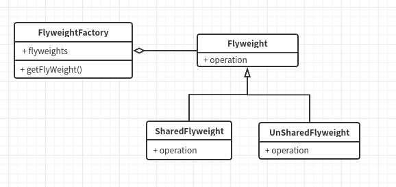

# 设计模式的简单整理

> 2020/06/08
> 半个月没看技术相关的了，希望通过对设计模式的重新整理找回学习的状态吧。

Gof的23种设计模式。


---


## 设计模式的七大法则

### **开闭原则**

**对扩展开放，对修改关闭。**

**对扩展开放的意思，在我理解中就是类应该要易于扩展，有什么功能变更的或者添加的时候不应该直接去改主逻辑，而是通过扩展的形式。**


### **里氏替换原则**

**替换就是指在所有使用父类的地方，可以用子类代替。**

**也就是说子类必须扩展父类的原有功能，但不能修改原有的功能。**

**里氏替换原则可以说是开闭原则的具体实现或者说进一步补充。**


### **依赖倒置原则**

**类之间的依赖需要按照一定的规则顺序，高层抽象类不能依赖底层的具体实现。**

**违背依赖倒置原则会大大增加类间的耦合性不利于代码维护。**


### **单一职责原则**

**简单理解就是希望类的功能尽量单一，一个类不应该承载太多的职责。**

**降低类的复杂度，减小类的实现粒度，都有利于减小类之间的耦合性，方便后期维护。**


### **接口隔离原则**

**和单一职责原则很相似，在我理解可能就是规定的对象不同，接口隔离就是特指接口。**

**面向接口编程，一个接口不应该承载太多的特性。**

**简单理解该原则，可能就是规定接口的粒度需要尽量的小。**

**比如Java中的Closeable之类的接口？或者Spring中的各类顶级接口。**


### **合成复用原则**

**该原则规定，要尽量使用组合或者聚合等关联关系来代替继承关系来实现类之间的关联。**

**继承就表示子类和父类之间的高耦合度，父类的任何改动都会影响到子类，且对子类会产生一些约束和限制，不利于扩展。**


### **迪米特法则**

**该法则规定如果两个类没有直接关系，那么就不应该产生直接的相互调用，可以通过第三方转发该调用。**

**该法则提高了类之间的独立性，降低了耦合度。**

**SpringBoot中对BeanFactoryPostProcessor的调用可能就是这个法则吧。**


## 设计模式的分类

根据目的来分设计模式可以分为创建型，结构型和行为型。

**创建型模式主要着力于对象的创建过程，将创建和使用过程分离。**

**结构型模式主要着力于对象的继承和实现，如果通过一些基本接口和对象组成一个更大的结构，和期间应该注意的点。**

**行为型模式主要描述类之间的调用关系，规范化方法和方法的职责，用于描述类或对象之间协作的过程。**


---

## 创建型模式

创建型模式主要关注对象的创建过程。


### 单例模式（Singleton）

单例模式必须保证类的实例对象在系统中的唯一性。

**类似一些重量级对象都可以使用单例模式实现，提供一个全局的访问点，保证全局的访问安全，也减少内存的浪费。**

**单例模式主要有以下几个核心：**

1. **构造函数私有化，阻止类外部的初始化**
2. **类内部持有自身实例引用**
3. **提供一个对外的获取接口**

类图如下：

 

单例模式的持有和创建都在类内部，基本的单例模式如下，首先是**饿汉模式**：

```java
public class HungrySingle{
    	// 内部持有实例引用
    	private static final HungrySingle INSTANCE = new HungrySingle();
    	
    	// 私有化构造函数
    	private HungrySingle(){
            	// 私有化之后，JVM也不会自动生成一个public的无参构造
        }
    
    	// 提供统一的话获取方法
    	public static HungrySingle getInstance(){
            	return INSTANCE;
        }
}
```

饿汉模式的特点就是在类加载时候就会实例化对象，通过 JVM 的类加载机制保证实例的唯一性。

而另外一种懒汉模式，则是在此基础上增加了懒加载的特性只有在需要的时候才会调用。

```java
public class LazySingle{
    	private static final LazySingle INSTANCE;
    
    	private LazySingle(){}
    
    	public static LazySingle getInstance(){
            	if(INSTANCE == null){
                    	INSTANCE = new LazySingle();
                } 
            	return INSTANCE;
        }
}
```

如上，实例对象只有在第一次调用 getInstance 方法的时候才会初始化。

但以上代码并非是线程安全的，多线程环境下可能仍然会创建多个实例对象。

为了保证懒汉模式的线程安全性，确保实例对象的唯一性，所以又有了静态内部类，枚举以及耳熟能详的双重检查锁模式。

以下是双重检查锁的getInstance方法：

```java
public class LazySingle{
    	private volatile static final LazySingle INSTANCE;
    
    	private LazySingle(){}

        public static LazySingle getInstance(){
            if(INSTANCE == null){
                    synchronized(LazySingle.class){
                            if(INSTANCE == null){
                                	INSTANCE = new LazySingle();
                            }
                    }
            }

            return INSTANCE;
        }
}
```

使用了synchronized来保证创建过程的线程安全，用volatile保证INSTANCE的可见性。

在外先判断是否为空是必然的，而第二次加锁则是为了避免多个线程同时等待锁释放后的再一次初始化。

另外，因为在Java中`INSTANCE = new LazySingle()`并不是原子操作，是先创建对象实例，然后将INSTANCE引用指向创建的实例的联合操作，所以也需要volatile关键字保证INSTANCE在多线程环境下的可见性。

静态内部类的实现方式如下：

```java
public class LazySingle{
    
    	private LazySingle(){}
    	// 静态内部类持有单例对象的引用。
    	private static class InstanceHolder{
            	private static final LazySingle INSTANCE = new LazySingle();
        }
    	
    	public static getLazySingle(){
            	return InstanceHolder.INSTANCE;
        }
}
```

可以看到唯一实例其实是内部类持有的。

在加载外部类的时候并不会直接加载内部类，只有在使用到内部类的相关属性的时候才会去进一步加载

也就是说只有在调用getLazySingle方法的时候，因为使用了InstanceHolder类才会去加载内部类，而静态变量也会在类加载的过程中完成初始化。

另外就是effective java作者也强烈推荐的枚举类实现方式：

```java
public class LazySingle{
    	private LazySingle(){}
    
    	private enum  InstanceHolder{
            	INSTANCE;
            	
            	private final LazySingle single;
            
            	InstanceHolder(){
                    	single = new LazySingle();
                }
            
            	private LazySingle getSingle(){
                    	return single;
                }
        }
    	
    	public static getLazySingle(){
            	return InstanceHolder.INSTANCE.getSingle();
        }
}
```

该种实现方式充分利用了枚举类型的特性，保证了加载的线程安全性和实例对象的唯一性。

而且是所有单利模式中唯一一种免疫序列化，反射和克隆三种破坏形式的实现。

这几种破坏方式我也没有仔细去看过，恩，单例就这样吧。


最后来总结一下单例模式的优点：

1. **单例模式保证了一个类仅有唯一的实例，并提供一个全局访问点。**
2. **另外由于控制类的数量也可以有效的节省资源。**


### 原型模式（Prototype）

这个可能是设计模式中简单程度仅次于单例模式的一种了，甚至于Java中它比单例更简单。

原型模式用来创建重复的对象，不同于一般的New，原型模式的对象创建用克隆来完成，对于Java来说就是Cloneable接口。

Java中的Object类就提供了clone方法，所以Java中每个类都可以使用原型模式。

而且要注意的是Java中的clone方法，会跳过构造函数的执行，**所以使用克隆方法的优势就是性能好**，起码优于逐个New对象。

在任何创建大量重复对象的场景下，都可以尝试用原型模式替换。

 

```java
public class Prototype implements Cloneable{
		// 原型类只需要提供一个克隆的方法
        @Override
        protected Object clone() throws CloneNotSupportedException {
            return super.clone();
        }
}

```

原型模式需要注意的点有：

1. 克隆会直接跳过构造函数
2. 克隆还需要注意深浅的区别


**Spring中IOC容器提供的两种基础的创建模式就是单例和原型。**


### 工厂方法模式

其实工厂模式一共有三种，除了工厂方法模式和接下去的抽象工厂模式，还有一种最基础的简单工厂模式。

工厂模式的思路很简单，**就是完全将创建和使用剥离，对象的创建交由工厂类完成，使用者并不需要知道如何创建的的对象。**

在工厂方法模式之前这个简单工厂模式也可以讲一讲。

**简单工厂模式就是将一个或者多个对象的创建交由单个工厂类完成，工厂对外提供一个创建方法包含内部的创建逻辑。**

很多情况下可以再创建方法中使用case判断区分创建不同种类的产品。

类图如下：

 

Java中简单工厂模式简单来说可以有如下的实现：

```java
// 工厂类
public class SimpleFactory {
    public Product createProduct(String productName){
            if(productName.equals("A")){
                	return new ProductA();
            }
            if(productName.equals("B")){
                	return new ProductB();
            }
       		return null;
    }
}

// 产品类接口
interface Product{
    String getName();
}

// 产品A
class ProductA implements Product{
    @Override
    public String getName() {
        return "A";
    }
}

// 产品B
class ProductB implements Product{
    @Override
    public String getName() {
        return "B";
    }
}

```

可以看到这种实现虽然也剥离了创建对象的逻辑，但是他违反了开闭原则，如果引入一个新产品，就需要新增一个创建方法，或者修改原有的创建方法，好像除了修改工厂类就别无他法。

而且一定程度上的违反了单一职责原则，一个工厂负责所有类的创建，太过繁杂。

或许对于Java来说也有以下实现：

```java
public class SimpleFactory {
        public Object createProductByClass(Class tClass) throws IllegalAccessException, InstantiationException {
            	return tClass.newInstance();
        }
}
```

额。。我也不知道该怎么说，应该说这里就完全封闭了创建的过程吧，无法插手创建的流程，所以用处有限。

比如一个BufferReader的创建过程，原有代码是这样的：

```java
final FileInputStream in = new FileInputStream("/home/chen/xx");
final InputStreamReader in1 = new InputStreamReader(in);
BufferedReader bufferedReader = new BufferedReader(in1);
```

就算你把它合成一行，代码量也不少，如果多处调用代码就会显得很繁杂。

而单从模型上考虑，使用的类的只是想要这个对象，并不需要知道对象的完整创建过程，像你开车需要知道车的原理吗？

所以我们可以将其提取到一个工厂模式的工厂类中：

```java
public class ReaderFactory {
        public static Reader getReader(File file) throws FileNotFoundException {
                final FileInputStream in = new FileInputStream(file);
                final InputStreamReader in1 = new InputStreamReader(in);
                BufferedReader bufferedReader = new BufferedReader(in1);
                return bufferedReader;
        }
}
```

抽取了公共的逻辑出来之后，到处使用直接调用方法就好了，代码都少写很多。

但问题也明显，就比如我现在需要一个FileReader，那么就只能增加一个方法或者修改原有方法，这就和上面说的一样，它违反了开闭原则。


咳咳咳。。所以基于扩展性考虑引申除了工厂方法模式。

类图如下：

 

工厂方法模式可以算是简单工厂模式的进一步抽象。

**将工厂的创建方法抽象到工厂接口中，具体的创建逻辑延迟到具体的子类中。**

往往一个产品会对应一个工厂子类，以增加实现类的形式完成对不同产品的需求扩展。

恩。。。耦合性更低了，但是更加麻烦了，需要不同的子类。

对于上述的Reader的例子，就可以使用以下的方法：

```java
class BufferReaderFactory implements FactoryMethodInterface {
        @Override
        public BufferedReader create(File file) throws FileNotFoundException {
                final FileInputStream in = new FileInputStream(file);
                final InputStreamReader in1 = new InputStreamReader(in);
                return new BufferedReader(in1);
        }
}

class FileReaderFactory implements FactoryMethodInterface {
        @Override
        public Reader create(File file) throws FileNotFoundException {
            	return new FileReader(file);
        }
}

interface FactoryMethodInterface {
    	Reader create(File file) throws FileNotFoundException;
}
```

**Spring中FactoryBean对象就是对工厂方法模式的最好实践。**


相比于简单工厂模式来说，**工厂方法模式不再局限于单一的工厂类**，更有利于代码解耦和扩展。

但在使用工厂方法模式的时候，如果抽象接口也只有单一继承，那么也就和简单工厂模式没啥区别了。

但总得来说工厂方法模式中，**一个工厂类仍局限于单个的产品类，并且增加产品类就需要创建新的工厂实现类的设定，很大程度上增加了编码的复杂性。**


### 抽象工厂模式

如果说从简单工厂模式到工厂方法模式是提取了公用的方法接口，进一步抽象了工厂类。

**那么抽象工厂接口就是进一步抽象了产品类，产品也不仅仅局限于一种。**

对应的产品类的扩展，工厂创建类的创建方法数也增加了。

类图如下：


继续拿Reader举例，此时如果需要添加一个Writer类，假设不同的Reader和Writer是一种对应关系，此时就的工厂方法模式可能就有点顶不住了。

根据抽象方法模式实现之后如下：

```java
    class BufferReaderFactory implements AbstractFactoryInterface {
            @Override
            public BufferedReader createReader(File file) throws FileNotFoundException {
                    final FileInputStream in = new FileInputStream(file);
                    final InputStreamReader in1 = new InputStreamReader(in);
                    return new BufferedReader(in1);
            }

            @Override
            public Writer createWriter(File file) throws FileNotFoundException {
                    final FileOutputStream out = new FileOutputStream(file);
                    final OutputStreamWriter outputStreamWriter = new OutputStreamWriter(out);
                    return new BufferedWriter(outputStreamWriter);
            }
    }

    class FileReaderFactory implements AbstractFactoryInterface {
            @Override
            public Reader createReader(File file) throws FileNotFoundException {
                	return new FileReader(file);
            }

            @Override
            public Writer createWriter(File file) throws IOException {
                	return new FileWriter(file);
            }
    }
	//  抽象工厂接口
    interface AbstractFactoryInterface {
        Reader createReader(File file) throws FileNotFoundException;

        Writer createWriter(File file) throws IOException;
    }
```


### 工厂模式总结

理论上说简单工厂模式已经拥有了工厂模式的核心，**以工厂的概念抽离出对象创建的逻辑，实现对象创建和使用的解耦。**

但是简单工厂模式有以下几个缺点：

1. 不符合开闭原则，难以扩展。
2. 单工厂的逻辑过重，承载了太多的创建逻辑。

产品族单一的问题，在我看来在Java中可能并没有那么大影响，以Object类作为返回值就能支持不同的产品。

但单工厂的逻辑过重的问题会随着需要负责的类的增多而凸显，减慢创建过程，也一定程度上违背了单一职责，接口隔离原则。

针对以上问题，就有了工厂方法模式，工厂方法模式在简单工厂模式的基础上，利用不同的子类实现来分散单工厂的逻辑，并且利用继承统一接口的形式提高扩展性。

工厂方法模式可以说已经不错了，抽象程度也基本足够，但是在一个工厂类一个创建方法的形式下，**很难描述具有关联关系的不同的产品类。**

**所以在工厂方法模式的基础上，工厂接口中新增了不同的创建方法，应对多个关联产品的创建。**

个人感觉，**这个关联关系很重要**，如果用一个抽象工厂模式实现两个完全不搭边的产品的创建，那就又回到了简单工厂模式，以新增方法的形式去兼容新产品的加入。


### 建造者模式

建造者模式也是一种创建型模式，不同于工厂模式完全分离对象创建和使用的逻辑。

**建造者模式拆分了对象的创建过成，对创建的流程进行抽象。**

类图如下：

   

其中产品类的接口定义了产品的一些基本属性，创建者接口定义了对这些基本属性构建方法，而指挥者类则是调用实际的创建者方法，最终生成一个产品。

我们可以用电脑组装的过程为例子来理解：

```java
 class Director{
            private Builder interBuilder = new InterBuilder();
            private Builder amdBuilder = new AMDBuilder();

            public Computer builder(){
                    final Computer computer = new Computer();
                    computer.cpu = interBuilder.cpu();
                    computer.memory = amdBuilder.memory();
                    return computer;
            }

    }

    class Computer{
        private String cpu;
        private String memory;
    }

    interface Builder{
            String cpu();
            String memory();
    }

    class InterBuilder implements Builder{
            @Override
            public String cpu() {
                    return "Inter CPU";
            }
            @Override
            public String memory() {
                	return "Inter Memory";
            }
    }

    class AMDBuilder implements Builder{
            @Over建造者模式关注的是对象的创建过程或者说步骤。ride
            public String cpu() {
                	return "AMD CPU";
            }
            @Override
            public String memory() {
                	return "AMD Memory";
            }
    }

```

建造者模式中存在四种对象：

1. Product 产品：指代最终要生成的对象，例子中的Computer
2. Builder 建造者接口/基类： 抽象出创建的流程或者组成部分，供子类实现。
3. Concrete Builder 实际建造者： 实现建造者接口/基类，完成具体的建造逻辑
4. Director 组装类 : 封装一个具体的组装逻辑，负责调度不同的建造者生成对应的产品


Lombok中就有一个@Builder的注解，该注解以Setter方法返回当前实例的形式来实现建造者模式，可以分别对单个成员变量进行配置。


### 工厂模式和建造者模式的比较

首先两个模式的目的和作用就不一样。

工厂模式**的目的调用和创建两个操作之间的解耦**，对调用者来说屏蔽了创建的过程，工厂类也不关心具体的创建。

但建造者模式却不同，它关注的是对象的创建过程，通过拆分可一个完整的创建过程的方式让创建过程更加清晰。

按照步骤或者成分的拆分，会使创建过程更加有条理性，易于把握对象的整个创建过程。

所以很大程度上工厂模式和建造者模式可以互补。


## 创建型模式总结

首先明确一点，上文也说过，创建型模式的重点都在创建中，该类型模式不关注调用或者继承关系，他关注的就是对象的创建。

**单例模式旨在过各种手段保证对象的创建过程只执行一次，也就保证了对象的唯一性。**

**原型模式则是通过拷贝的方式，加速对象的创建过程(拷贝会跳过构造函数的执行)，或者因为都是相同的源对象而具有相同的属性。**

工厂模式则是更加纯粹的创建型模式，它的关注点在于对创建这个过程的解耦，调用者不需要关心创建的逻辑，例如你买车总不会需要知道整辆车的原理吧。

**简单工厂模式就可以完成对该过程的解耦，将创建的逻辑集中在一个工厂类，并提供一个对外的生产方法，调用者直接调用该方法获得自己想要的对象。**

**工厂方法模式是对工厂类的进一步抽象，提取出公共方法后分子类实现各产品族自己的逻辑，避免单工厂类单来的强依赖**，这里并不是说简单工厂模式就没有上层接口，工厂方法模式在只有一个工厂类的时候，也就是简单工厂模式。

抽象工厂模式则是对产品族的扩展，对于两个无任何关系的产品，简单工厂和工厂方法模式都可以支持，简单工厂模式可以增加一个创建方法或者在唯一创建方法中增加该类创建判断，工厂方法模式可以创建对应的实现子类。

但是对于有关联性的产品，上述两个模式处理起来其实和无关联的产品没啥区别。

**抽象工厂模式在上层接口中就定义了产品族中不同产品的创建方法，以此来确定关联性。**

关于抽象工厂方法，可能是我个人理解偏多，因为对产品族和工厂类的扩展工厂方法模式其实已经能满足大部分需求了。

建造者模式和工厂模式的区别就是它的关注点在创建的流程，工厂模式是将创建当做一个整体来看的，并不限制或者说不关心创建的流程。

**建造者模式则是对创建的流程进行抽象拆分，细化创建的步骤或者模块，更加适用于复杂对象的创建。**


## 结构型模式

结构型模式主要关注类和类之间的关系，主要是有聚合和继承。

根据类之间的关系可以分为：

1. 类结构型模型 - 继承
2. 对象结构型模型 - 聚合

继承一般意义上都具有强关联型，或者说强侵入性，子类必须继承父类的一系列特性，那么父类的修改必定会影响到子类，子类也会有所束缚。

相比之下，聚合就显得更加了灵活。


### 代理模式

 代理模式从结构上并不难理解，就像投资一样，找基金经理就是找代理，你的动作都是一样的花钱投资，他帮你去操作真实的投资。

在这里基金经理就是代理对象，理财投资就是主题。

这就是代理模式的核心内容：**通过中间的代理对象间接调用真实主题，降低了系统的耦合性，而且代理对象更易于扩展扩展，而不需要改动真实主题，这也起到了保护真实主题的作用。**

其中的几个对象：

1. 代理对象 - 封装真正的调用逻辑
2. 抽象主题 - 对真实调用的抽象
3. 真实主题 - 真实的业务逻辑

类图如下：

 

Java中的简单实现如下:

```java
   interface FinancialManagement {
        void investmentFund(float money);
    }

    class RealFinancialManagement implements FinancialManagement {
        @Override
        public void investmentFund(float money) {
            System.out.println("亏不死你!");
        }
    }

    class Proxy implements FinancialManagement {

        RealFinancialManagement realFinancialManagement = new RealFinancialManagement();

        @Override
        public void investmentFund(float money) {
            realFinancialManagement.investmentFund(money);
        }
    }
```

重点就在透过代理去调用方法，而不是直接调用真实方法。

除了上面的静态代理，也就是手动编码实现一个代理方式之外，还有一种更加通用的动态代理模式。

JDK中也提供了动态代理的API，demo如下：

```java
interface Subject{
    	void doSomething();
}

class RealSubject implements Subject{
        @Override
        public void doSomething() {
            	System.out.println("// realSubject do something");
        }
}

class MyProxy implements InvocationHandler{
        Subject subject;
        public MyProxy(Subject subject) {
            	this.subject = subject;
        }
        void before(){
            	System.out.println("// ====== before");
        }
        void after(){
            	System.out.println("// ====== after");
        }
        @Override
        public Object invoke(Object proxy, Method method, Object[] args) throws Throwable {
                before();
                method.invoke(subject,args);
                after();
                return null;
        }
}

public class Main {
        public static void main(String[] args) throws IllegalAccessException, InstantiationException, NoSuchMethodException, InvocationTargetException {
                // 获取代理类
                // JDK动态代理只能代理接口
                final Class<?> proxyClass = Proxy.getProxyClass(Subject.class.getClassLoader(), Subject.class);
                // 获取构造函数
                final Constructor<?> constructor = proxyClass.getConstructor(InvocationHandler.class);
                // 创建具体的代理对象
                final Subject subject = (Subject) constructor.newInstance(new MyProxy(new RealSubject()));
                subject.doSomething();
                // 另外一种创建形式
        //        final Subject subject1 = (Subject) Proxy.newProxyInstance(Subject.class.getClassLoader(), new Class[]{Subject.class}, new MyProxy(new RealSubject()));
        }
}

```

JDK动态代理可以在运行时使用反射动态的创建一个代理类。

但它只能代理一个接口，而不能代理类。

原因其实很简单，因为使用Proxy.getProxyClass()创建的类对象是默认继承Proxy对象，在单继承的Java中，也就不能指定另外一个类继承了。

除了JDK的动态代理，Spring的AOP还有另外一种实现动态代理的机制，就是CGLIB的字节码增强技术。

因为字节码增强技术是一种比较重的实现，所以在Spring中如果实现了接口就会优先以该接口为抽象主题生成代理对象。


### 适配器模式

适配器模式主要用来作异构接口的适配，简单来说就是将一个类的方法转化为调用者希望的另外一种接口。

说到这个常常使用电压来比喻，比如国内电脑一般都是220V电压下运行，所以出国之后需要一个适配器将电压调整到合适的大小。

适配器模式的角色如下：

1. Target 目标角色，通过适配器希望得到的接口形式
2. Adaptee 当前角色，待适配的角色
3. Adapter 适配器，就是将Adaptee转化为Target的工具。

类图如下：

 

类图也蛮简单的，适配器直接持有待适配角色的实例引用，并继承实现目标角色。

简单的Demo如下：

```java
    /**
     * 就是将乘2的方法变成乘4的过程
     */
    interface Target {
            int multiply4(int i);
    }
    class Adaptee {
            int multiply2(int i) {
                	return i * 2;
            }
    }
    class Adapter implements Target {
            Adaptee adaptee = new Adaptee();
            @Override
            public int multiply4(int i) {
                return adaptee.multiply2(i) * 2;
            }
    }
```

该模式也可以用来作调用方和被动用方的解耦，哪怕被调用方方法完全不一样都不要紧，只需要修改适配器就好了，完全不影响以前的逻辑。

但也有一个很突出的缺点，就是这个适配器可能仅仅只能作用于一个待适配对象，这样的话不同的待适配对象就需要不同的适配器，增加的类的数目和编码的复杂度。

另外适配器模式也不能盲目的用，如果适配器的逻辑非常复杂，复杂到超过修改原有逻辑的程度，那就要考虑一样了。


### 桥接模式

桥接模式可能并不是一个常用的设计模式，但它确实非常有用。

桥接模式的核心思想就是：**将抽象部分与实现部分分离，使它们都可以独立地变化。**

分离之后的类就可以在**多个维度上面保持良好的扩展性。**

例如一般情况下我们使用继承的关系来扩展，但一个东西如果有多个属性维度的变化都由继承来扩展的话，那扩展所需要的类是倍数增加的。

拿电脑举例，CPU可以使用Inter，也可以使用AMD的，这就是两种实现，但如果在加个内存呢，内存我们按大小来8，16，32就又多了三种实现，排列组合就形成了6种子类，如果再多几种属性怕是没法玩了。

桥接模式类图如下：

 


简单示例如下：

```java
  interface Memory{
        void store();
    }
    class SamsungMemory implements Memory{
        @Override
        public void store() {
            System.out.println("三星的内存");
        }
    }
    class ToshibaMemory implements Memory{
        @Override
        public void store() {
            System.out.println("东芝的内存");
        }
    }
    static abstract class Computer{
        Memory memory;
        public Computer(Memory memory) {
            this.memory = memory;
        }
        abstract void doSomething();
    }
    class MyComputer extends Computer {
        public MyComputer(Memory memory) {
            super(memory);
        }
       @Override
        public void doSomething() {
            super.memory.store();
        }
    }
```

上述代码的功能通过继承也能实现，但是如果在内存之外在加属性，也通过继承来实现，那么一个类中就必须同时实现两个接口，且无法单独变化。

不知道怎么的感觉它和建造者模式很相似，拆分实现/创建过程。


### 装饰模式（Decorator）

装饰模式的作用就是**在不改变当前功能的情况下，动态的增加一些功能，也可以说是对当前类的增强。**

一般的情况下，扩展是用继承来实现的，但是这就有一个问题，随着扩展次数的增多，类会越来越臃肿，层次混乱。

所以装饰模式采用的是聚合的方法，持有待装饰对象的引用，并扩展其方法，因为仅仅是调用，所以也不会对原来功能造成影响。

类图如下：

 

简单来说也是具体的装饰器类持有原实现类的引用，通过在调用前后加功能模块的形式对原类作增强。

Java中的InputStream就是装饰模式的最好实践，以下是JDK中FilterInputStream的成员图：

 

可以看到该类继承了InputStream，又持有一个InputStream的对象引用，并且构造函数中必须传入一个InputStream。

其中InputStream就是类图中的Component，FilterInputStream就是Decorator。


### 外观模式

外观模式又可以称为门面模式，**该模式旨在为不同的子系统提供一个一致的访问入口，从而屏蔽调用和实现的复杂性。**

外观模式的类图应该是23种模式中最简单的了。

类图如下：

 

网上的博客好像都是通过开灯的例子来介绍的，对外提供的方法连着调用灯的开启方法打开所有的灯。

但我感觉这个例子可能会有点奇怪，对外提供的统一接口不应该是粗暴的遍历子系统调用，而是有自己的路由转发逻辑。

类似于SpringMVC中的DispatchServlet，是一个路由中转乃至网关的角色。

原本调用者如果需要调用过各个子系统就需要持有各个子系统的引用，而且还需要知道具体的调用逻辑，但是通过门面模式，所有对子系统的调用都可以转到Facade类中，这是从调用者方面，对调用关系的完全解耦。


### 享元模式

享元模式旨在通过共享对象的方式，来减少资源的消耗。

对于一个业务对象将其分为以下两部分状态：

1. 内部状态，对象的内部状态，不会随着环境的变化和变化，也就是无关环境的状态，不需要额外配置。
2. 外部状态，就是指的随着环境的变化而变化，不可共享的状态。

类图如下：

 

其中的四种对象角色分别是：

1. Flyweight，共享的对象
2. SharedFlyweight，表示内部状态
3. UNSharedFlyweight，表示外部状态，不可共享
4. FlyweightFactory，代表该类的工厂，提供一个公共统一的获取入口

享元模式最典型的实现就是各类的池化技术。

例如JDBC的连接池，每个连接就是Flyweight，每个连接的目标数据库都是一样的，但是每个连接的操作都不一样。

另外JDK中的Long等包装类型也使用了享元模式，或者说它们才是最正宗的实现。

例如Integer类，在使用Integer.valueOf方法时，-128~127便是SharedFlyweight对象，其他都属于UnSharedFlyweight

不过他的工厂直接就是自己本身。


### 组合模式(-)

组合模式是用一个树状结构，来描述一种**部分-整体关系**的模式，是单个对象和整体都具有一致的访问性。

组合模式的使用并不多，我了解有限，所以先在这里贴一下类图：

 

叶子节点和非叶子节点都继承顶级接口，所以对外可以提供一致性的访问形式。

以上是安全性的组合模式，另外还有透明性的，类图如下：

 

区别就在于Leaf节点是否具有操作节点的方法，原先可以根据是否具有这些方法来判断是否是叶子节点，而现在需要根据getChilds()的返回值确定是否是叶子节点。

对于部分-整体的结构，或者说树状结构，一般情况下都可以使用该模式。


## 结构型模式总结

上文有说到，结构型模式关注的是类和类之间的结构关系，其实更准确来说是被调用者或者说服务提供者的实现结构。

代理模式是通过代理类对外提供访问入口，在隐藏真实实现的同时，也可以在代理类中完成扩展。

适配器模式是通过适配器类对真实的被调用接口做一层适配，一般情况下都是调用方式的转变，所以一定程度上可以看做是特殊的代理模式。

桥接模式则是提供了一种多继承形式的代替方式，使用聚合进行代替，在多维度的属性中，采用多继承的形式势必会导致子类的暴增，使用桥接模式则可以将原来的乘法变为加法，大大增强类的扩展性。

**装饰模式则是侧重在不改变当前实现的基础上，完成了对原始类的增强。**

外观模式则是通过**提供一个统一的对外调用方法的形式**，调用者在调用时也就不需要直到各个子系统的调用逻辑。

到了享元模式，则完全是内部的实现逻辑了，**对一个对象的细粒度拆分，进一步对其内部状态进行整理，使部分对象可共享**，JDK的Integer类我觉得是这个模式的完美实现也容易理解，但作用最大的应该还是各种池化技术。

组合模式其实我是刚看，也没啥理解，**个人感觉是对一类具有层次结构的对象的组合形式，继承实现统一接口，对外展示为相同的调用形式。**


## 行为型模式

行为型模式关注的就不是类之间的结构关系了，他关注的是类和类之间的调用关系，多个类如何协调完成一个功能。

行为型模式分为类行为模式和对象行为模式，前者采用继承机制来在类间分派行为，后者采用组合或聚合在对象间分配行为。

由于组合关系或聚合关系比继承关系耦合度低，满足“合成复用原则”，所以对象行为模式比类行为模式具有更大的灵活性。


### 模板方法模式

**模板方法模式旨在抽取出一个统一的算法骨架模板，而将一些特定的操作延迟到子类中实现。**

抽取出来公共的算法骨架可以一定程度上的增加代码的重用，限制对基础逻辑的修改，而声明的模板方法则方便了类的扩展，完美符合开闭原则。

该模式的类图如下：

 

其中角色分为以下两部分：

1. 抽象类，类中已经给出了一个算法的基本骨架，包括模板方法，以及供子类实现的钩子方法或者抽象方法
2. 具体实现子类，补充实现抽象类中的钩子方法或者抽象方法，对整个算法框架做一个补充扩展。

调用者直接调用不同的实现子类，就可以使用不同算法。

该模式我在具体的生产代码中用来改写过一个模块，所以感觉理解还是比较好的。

我改的是合同模块，就是一个添加参数调用三方合同接口的模块，其中不同的场景就有不同的参数，都是从UserInfo中抽取的一个Map对象，而三方的调用接口逻辑相同。

所以我就用了模板方法模式，将接口调用逻辑作为公共算法骨架，而参数获取的流程作为抽象方法。

刚开始感觉实现还不错，但到后来因为合同的越来越多，缺点也就显示出来了，不同的实现对应不同的子类，导致我一个合同实现子类就有接近30个类。

但应该一个合同类对应一个合同的逻辑，让我很方便的在合同内容修改时及时，准确的做出调整，所以最后也没有改。

另外的JDK中也有很多模板方法模式的实现，例如HashMap

 

上图算是HashMap的一张方法列表图，图中的`afterNodeInsertion`,`afterNodeAccess`,`afterNodeRemoval`都算是钩子方法，也就是需要延迟到子类实现的部分。

具体的实现可以去看LinkedHashMap，它直接继承了HashMap。

另外JDK中的AbstractQueuedSynchronizer类中，也用到了模板方法模式，将具体的获取锁的逻辑抽象成方法并延迟到子类实现。

另外模板方法模式是一种类行为模式，它通过子类继承来完成分派调用。

模板方法模式的优点显而易见，固定了父类的算法框架，开放可扩展方法给子类继承实现，完美符合开闭原则。

缺点好像除了类多点也没啥了。

在大部分能够抽取出公用方法的场景下，模板策略模式都能起到很好的作用。


### 策略模式

策略模式简单来说就是定义一个顶级的接口，子类继承接口并实现各种算法，因为继承自同一个接口所以算法之间可以相互的替换使用。

类图如下，也不难理解：

 

重点感觉就在一个统一接口实现上。

基本角色如下：

1. Context，环境类，也可以称为环境上下文，屏蔽上层调用的复杂性，负责对策略的调度执行。
2. Strategy，算法的抽象接口。
3. Concrete Strategy，真实的算法实现类。

在Java中，策略模式可以使用枚举类来完成，示例代码如下：

```java
public enum Strategy {
        ADD {
                @Override
                public int calculate(int a, int b) {
                    	return a + b;
                }
        },
        REDUCE {
                @Override
                public int calculate(int a, int b) {
                    	return a - b;
                }
        };

        public abstract int calculate(int a, int b);
}
```

在对一个场景存在多种解决方案的时候就可以使用策略模式，比如从杭州到台州，我可以自己开车，可以作动车，也可以作大巴车，每种方式都是一个策略，而我可以根据不同的情况选择不同的策略。

而所谓的环境上下文可能就封装了我的各种策略的判断处理逻辑。

策略模式的优点很多，实现简单，并且易于扩展，易于理解。

但一个策略一个类会让类的数目暴增，而且调用者需要直到所有的策略逻辑。


### 命令模式


### 责任链模式

### 状态模式

### 观察者模式

### 中介者模式

### 迭代器模式

### 访问者模式

### 备忘录模式

### 解释器模式


