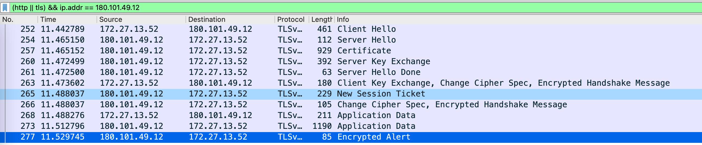
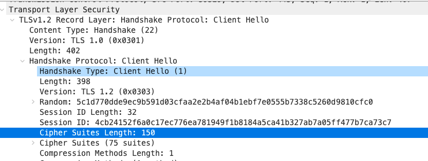
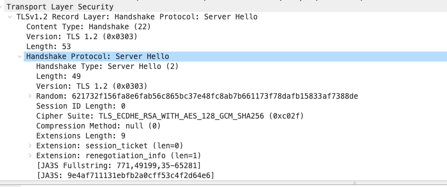
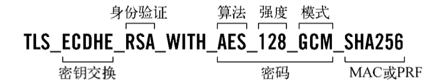
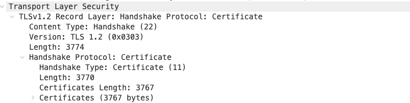
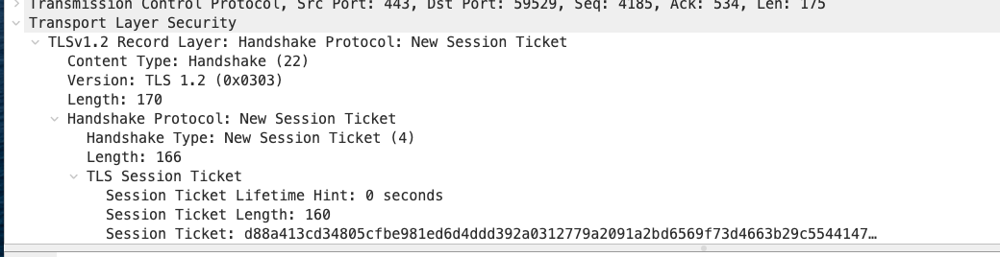

# HTTPS 协议

---

[TOC]

---

## 概述

HTTPS 就是 HTTP 协议加上 TSL 或者 SSL，TSL/SSL 相当于是在 HTTP 协议下新增了一层，专门用户加密。

（相当于一层代理层，对上继续提供 HTTP 格式的报文结构向下提供可以被对端正常解析的密文，HTTP 协议是完全感受不到 TLS/SSL 的存在的。

 

简单来理解 HTTPS 就是通过非对称加密来传输对称加密的密钥，数据传输直接使用之前的协商的对称密钥加密。

> 为什么不能直接使用对称加密？
>
> 因为对称加密性能非常差，动不动就是极大质数，通常的小报文都要这样加解密一边直接不用玩了。

TLS 的 RFC 定义了 4 个核心子协议：

- 握手协议（handshake protocol）
- 密钥规格变更协议（change cipher spec protocol）
- 应用数据协议（application data protocol）
- 警报协议（alert protocol）

## HTTPS 握手协议流程

HTTPS 的握手之前需要先完成 HTTP 连接的建立（大部分情况下都是 TCP 连接的三次握手，然后才开始 HTTPS 的握手。

握手过程中会由通信的双方一起协商确定加解密套件，包含如下三类协议：

1. 非对称加密协议
2. 对称加密协议
3. 信息摘要协议

（使用 openssl ciphers -v 可以查看大概的类型。

 

HTTPS 的握手流程并不是固定不变的，根据选择加解密套件的不同还会存在不同的握手流程，例如 RSA 就不存在 Server Key Exchange 的过程，而 DH 需要，因为 DH 需要客户端和服务端双端参数共同得出最终的密钥，而 RSA 可以直接通过客户端生成密钥。

 

以下是访问某度截取出来的 TLS 协议报文：

可以很明显的看到，握手过程中，某些报文可以直接糅合在一起发送。

### Client Hello

起手式，在完成 TCP 连接的建立之后，客户端发送该报文，其中内容包含本地支持的所有加解密套件。

TLS 的四种协议中，此时使用的是 Handshake Protocol 子协议。

如上图，Hello 报文的具体内容：

1. Version 当前的协议版本
2. Random 随机数用于后续的身份认证，最后四位为 GMT 时间戳，客户端随机数可以记做 Random_C
3. SessionId 会话 Id，首次连接为空，表示新的会话，后续请求可以凭借该字段在服务端找到自身的会话状态
4. Cipher Suites 加密套件，客户端支持的加解密套件列表
5. Compression 压缩算法，客户端支持的压缩算法
6. Extensions 扩展内容

Cipher Suites 就是供服务端选择的列表。

### Server Hello

该报文主要是服务端选择其中的一类加密套件并返回，并附带随机数 Random_S。

如上图中所示某度服务端选择了 TLS_ECDHE_RSA_WITH_AES_128_GCM_SHA256 (0xc02f) 套件，并且不使用压缩算法。

密钥套件的格式如下：

该套件使用 ECHD 作为密钥交换协议。

### Certificate 

Certificate 是证书链的验证阶段，HTTPS 中一般是服务端向客户端发送自己的证书，TLS 允许双端验证（客户端和服务端都需要向对发送自己的证书）

图中 Certificates 就是证书链字段。 

### Server Key Exchange 

服务端发送 master secret 相关参数，该类报文根据选择的密钥套件决定，如果使用 RSA 作为密钥交换协议就不需要该报文。

Client Key Exchange 同理。

### Server Hello Done

服务端已经结束握手过程的消息发送，Client Hello Done 同理。

### Change Cipher Spec

表示本端已经根据握手信息生成 master secret，接下来将切换到加密模式。

### Client Exchange

客户端生成预主密钥，通过证书中的公钥加密并发送服务端。

### New Session Ticket

Session Ticket 是使用服务端密钥加密的会话信息，最终保持在客户端，客户端换如果在 Client Hello 报文中携带上该字段（SessionId 如果服务端可以成功解密就可以完成快速握手。

## 数字证书

证书是经过 CA 私钥签名并下发的包含某个服务器公钥的密文。

证书中包含如下内容：

1. 证书的颁发机构（Issuer）
2. 证书的有效期（Valid From，Valid To）
3. 服务器自身的公钥（Public Key）
4. 证书的持有者（Subject）
5. 签名算法（Signature algorithm）
6. 指纹（Thumbprint）
7. 指纹算法（Thumbprint algorithm）

 

系统中会内置信任一些主要的 CA 机构，并且游览器中可以选择信任某个 CA 机构，那经过该 CA 下发的证书都会被认为有效，链接也会被认为是安全的。

## Q & A 总结

> CA 的作用？

CA（认证中心）会向服务器颁发数字证书，数字证书中主要就包含了服务器的公钥。

在建立连接的时候，服务器并不是直接发送自己的公钥，因为可能被中间人拦截并代替为自己的公钥，而是直接下发的自己的证书，证书是使用 CA 的私钥进行签名的，客户端会持有自己信任的 CA 的公钥，接到证书之后解签以检查服务端的身份，并获得里面的公钥。

> 为什么在非对称加密的基础上又要使用对称加密？

1. 服务端的公钥是公开的，所以经过私钥加密的内容可以被任何人解析。
2. 非对称加密的效率很低

> RSA 加密算法的协商过程

RSA 的协商过程包含三个随机数，客户端随机数，服务端随机数以及在证书验证后客户端创建的 Pre-Master 随机数。

## 参考

- [Https 建立安全连接的过程（SSL原理）](https://blog.csdn.net/xiaopang_yan/article/details/78709574)
- [网络协议之 HTTPS](https://juejin.cn/post/6948634510485356557#heading-21)
- [Keyless SSL: The Nitty Gritty Technical Details](https://blog.cloudflare.com/keyless-ssl-the-nitty-gritty-technical-details/)
- [TLS协议](https://zhangbuhuai.com/post/tls.html)
- [RSA 算法原理二](http://www.ruanyifeng.com/blog/2013/07/rsa_algorithm_part_two.html)
- [HTTPS篇之SSL握手过程详解](https://razeencheng.com/posts/ssl-handshake-detail/)